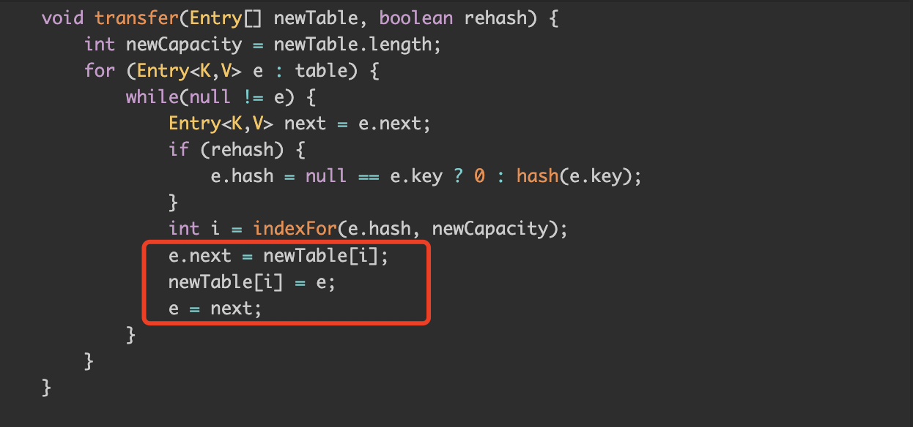

## Java 常见面试题

[1.java集合(老生常谈)](#1-java集合)

### 1.java集合
java的集合类在面试中基本上是必问的问题，为什么大公司会对集合耿耿于怀，我觉得首先得从集合的作用说起。
在平时的java编程中常常需要存放多个数据，当数据过多的时候为了更好的管理这些数据，集合就是个很好的解决问题选择。

当然我们用数组也可以实现，但是集合类相对于数组来说更加灵活，因为数组是final的所以长度是不可变的，
当数据超过数组长度时数组就不能很好的解决这个问题，而集合就能在不能预知数据长度的情况下通过各自的扩容机制解决此类问题。
而根据实际情况的不同，集合又出现了很多分支，例如当我们需要执行较多插入删除操作而少查询的时候我们就可以用linkedlist,
而查询多插入删除少的时候就可以用arraylist这是因为linkedlist的底层结构是链表，
所以执行插入删除时只需要改变指针的指向就行而查询的话就得从头节点开始遍历，
而arraylist的底层是数组所以查询可以通过脚标进行精准定位而插入删除操作可能需要调整数组中元素的相对位置。
实际情况中我们很多时候想要精准的从集合中找出某一对象如果是存在list的话就得去一一便利，所以这个时候我们就用到了map，
常用的就是像hashmap这种，我们只需要设置相对应的key,value就能精确的取出来想要的value。hashmap底层采用的是数据加链表加红黑树的结构
，通过计算key的hashcode值能够对应到相应的数组单元，然后将value插入数组，如果当前位置已经有数据的话hashmap会采用尾插的方式形成链表,
jdk7中采用的是头插法来形成链表，但是头插法的话会造成链表循环死循环的问题，主要的原因就是图中红色代码

代码中e代表当前节点，next代表下一节点，e.next指向下一节点。
链表的死循环发生在当两个线程同时发生扩容操作时假设数组某一位置存储了长度为2的链表a->b,此时线程A发生扩容操作，
同时线程B介入也发生扩容首先将a的下一节点置为空并放到新数组的某一位置，此时该位置值存a，
这个时候往下遍历b也要存到该位置根据尾插法图示方法b的指向变成了a，链表变成b->a,这个时候A继续扩容把a放入新数组的该位置，
遍历到a的下一节点b又放入新数组,本来此时往下遍历b原先是指向空的，但是有序线程B先修改了b的指向为b->a,所以线程A继续往下遍历又遍历到了a节点就造成了链表循环。
jdk1.8后采用尾插法才解决了这个问题。jdk8以后hashmap的底层结构变成了数组+链表+红黑树，
当链表长度大于8时数据变为红黑树减少了链表遍历的时间使查询数据更快，为了避免红黑树和链表的频繁转换所以将红黑树长度设置为小于6而不是8时结构重新变成链表。
关于hashmap的扩容，hashmap的扩容倍数是2倍，因为这是为了维持hashmap的容量是2的幂次方，hashmap计算存储位置时的计算方法为(n-1)&hash(key),容量n为2的幂次方时，
n-1的二进制是全为1的，所以在为运算时可以充分散列，hash冲突的情况少。

