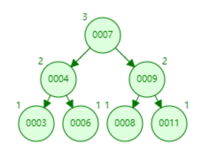
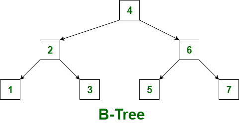

# Java面试题总结


## 基础篇

#### 1.**== 和 equals 的区别**

- == 用于基本数据类型时，是比较两个变量的值是否相等；如果用于比较对象，则是比较对象变量在堆内存中引用地址是否相等。当用于比较由一个基本数据类型自动装箱后的两个对象时，要看这个值是否在-128到127区间内（包含），如果在区间内，==此时比较的是两个指向同一个对象地址的引用，所以为true；如果不在区间内，自动装箱时是通过new Integer()、new Long()来实现的（可以看valueOf方法），此时==比较的是两个指向不同内存地址的引用，所以为false。
- equals()方法默认比较两个对象内存地址是否相等，如果用于比较基本数据类型的包装类，由于包装类重写了equals方法，所以比较的是intvalue longValue之类的大小是否相等。如果用于比较String类，由于String类重写了equals方法，所以比较的是对象内容是否相等。

#### 2.**String str = new String("abc");创建了几个对象**

单纯从题面上来说事创建了两个对象，一个是new String("abc"),一个是在字符串常量池内的“abc”；如果在new 之前使用过abc，则只会创建一个

#### 3.**下面的代码的结果是什么**

```java
Integer b1 = 19;
Integer a1= 19;
System.out.println(a1==b1); //true

Integer c1 = 129;
Integer d1= 129;
System.out.println(c1==d1);//false
```

解析：Integer -128到127 已经被缓存

```java
private static class IntegerCache {}
```

#### 4.**HashSet 保存的元素为什么是不可重复的**

HashSet 底层是通过HashMap实现的，所以才可以实现元素是不可重复的

```java
public class HashSet<E>
    extends AbstractSet<E>
    implements Set<E>, Cloneable, java.io.Serializable
{
    @java.io.Serial
    static final long serialVersionUID = -5024744406713321676L;

    private transient HashMap<E,Object> map;
.......

    public boolean add(E e) {
        return map.put(e, PRESENT)==null;
    }
```


----

## 集合篇

### List 篇

#### 1.**ArrayList是线程安全的吗**

肯定不是呀，想都不想想，不要犹豫

#### 2.**你用过哪些线程安全的List，为什么他们是线程安全的**

- Vector 在JDK 1.0时就有了，在关键的方法上都有synchronized的修饰，这是个方法锁

- CopyOnWriteArrayList/CopyOnWriteArraySet，在关键的方法上都有synchronized的修饰，这是一个同步对象锁实现

- 源码解析

  > **Vector** 
  >
  > ```java
  >  public synchronized boolean add(E e) {
  >      modCount++;
  >      add(e, elementData, elementCount);
  >      return true;
  >  }
  > ```
  >
  > **CopyOnWriteArrayList**
  >
  > ```java
  >  public boolean add(E e) {
  >      synchronized (lock) {
  >          Object[] es = getArray();
  >          int len = es.length;
  >          es = Arrays.copyOf(es, len + 1);
  >          es[len] = e;
  >          setArray(es);
  >          return true;
  >      }
  >  }
  > ```
  >
  > 

#### 3.**List的特点**

底层技术数组实现，所以空间连续，查询速度快，但是新增、删除会比较慢，其原因是可能会导致对数组重新进行分配。

#### 4.**ArrayList 与 LinkedList**

- 数据量大时ArrayList 查询速度快于LinkedList，主要原因是LinkedList不支持随机访问
- LinkedList的新增和删除的速度要远高于ArrayList,LinkedList底层是双向链表(队列)，只需要重新构建指针链接即可，但是ArrayList是数组实现，会导致对数组重新进行分配，前者的时间复杂度是O(1),后者是O(n)

---

### Map篇

#### 1.new HashMap(15) , new HashMap(16) , new HashMap(17) 他们的初始化容量是多少

- new HashMap(15) 初始化容量为 16
- new HashMap(16) 初始化容量为 16
- new HashMap(17) 初始化容量为 32

**解析**

>这个问题很简单,但是也有坑，看一下构造函数就可以知道
>
>```java
>public HashMap(int initialCapacity, float loadFactor) {
>   if (initialCapacity < 0)
>       throw new IllegalArgumentException("Illegal initial capacity: " +
>                                          initialCapacity);
>   if (initialCapacity > MAXIMUM_CAPACITY)
>       initialCapacity = MAXIMUM_CAPACITY;
>   if (loadFactor <= 0 || Float.isNaN(loadFactor))
>       throw new IllegalArgumentException("Illegal load factor: " +
>                                          loadFactor);
>   this.loadFactor = loadFactor;
>   this.threshold = tableSizeFor(initialCapacity);
>}
>```
>
>重点在与这句代码 ` this.threshold = tableSizeFor(initialCapacity);`
>
>```java
>static final int tableSizeFor(int cap) {
>   int n = -1 >>> Integer.numberOfLeadingZeros(cap - 1);
>   return (n < 0) ? 1 : (n >= MAXIMUM_CAPACITY) ? MAXIMUM_CAPACITY : n + 1;
>}
>```
>
>对于给定的目标容量，返回两倍大小的幂
>
>如果我们传入参数为 new HashMap(10); this.threshold = tableSizeFor(initialCapacity);为16
>
>当你new HashMap(17); this.threshold = tableSizeFor(initialCapacity);为32

#### 2.**为什么HashMap不是线程安全的，你都知道哪些安全的Map，说明为什么是线程安全的**

- HashMap没有锁自然不安全
- Hashtable 所有的方法都有synchronized修饰
- ConcurrentHashMap 分段锁的机制，效率比HashTable

#### 3.**HashMap底层的数据结构什么**

- HashMap用到数组，链表（单链表），树（红黑树）三种数据结构和哈希算法。

- 当key发生hash冲突时，就需要使用到单链表，当链表达到一定长度时会转为红黑树，来提升查询效率；当红黑树的节点在指定范围时会转为单链表

- 转换的阈值为单链表长度为8，实现反转的主要是源码里的这连个参数

  ```
      static final int TREEIFY_THRESHOLD = 8;
  
      static final int UNTREEIFY_THRESHOLD = 6;
  ```

#### 4.**HashMap 的扩容机制，如new HashMap(8,0.75f),什么时候进行扩容**

> 首先我们要知道什么时候会进行扩容操作,肯定是put的时候，在put的时候有这样两端段代码
>
> ```java
> if ((tab = table) == null || (n = tab.length) == 0)
>  n = (tab = resize()).length;
> 
> if (++size > threshold)
>  resize();
> ```
>
> 第一次put是，会重新计算threshold的值，以本文为例，第一put后 threshold= 6
>
> 当你的put次数等于6时就会触发扩容机制
>
> 关于resize()方法详细的代码可以参看[HashMap 源码重识 这篇博客](https://blog.csdn.net/weixin_38937840/article/details/114107184)

#### 5.**HashMap是如何解决hash冲突的**

首先我们需要知道什么时候会发生冲突，存在相同的hashcode，那么他们确定的索引位置就相同，这时判断他们的key是否相同，如果不相同，这时就是产生了hash冲突。 

Hash冲突后，那么HashMap的单个bucket里存储的不是一个 Entry，而是一个 Entry 链。 

系统只能必须按顺序遍历每个 Entry，直到找到想搜索的 Entry 为止——如果恰好要搜索的 Entry 位于该 Entry 链的最末端（该 Entry 是最早放入该 bucket 中）， 那系统必须循环到最后才能找到该元素。

> 关键部分的源码 在put 方法
>
> ```java
> else {
>  for (int binCount = 0; ; ++binCount) {
>      if ((e = p.next) == null) {
>          // 通过链表解决冲突
>          p.next = newNode(hash, key, value, null);
>          if (binCount >= TREEIFY_THRESHOLD - 1) // -1 for 1st
>              treeifyBin(tab, hash);
>          break;
>      }
>      if (e.hash == hash &&
>          ((k = e.key) == key || (key != null && key.equals(k))))
>          break;
>      p = e;
>  }
> }
> ```

---

### 多线程篇

#### 1.创建线程的几种方式

- 继承Thread
- 实现Runnable
- 实现Callable

#### 2.线程池的参数有哪些

**7大参数如下：**

- corePoolSize：核心线程数

- maximumPoolSize：最小线程数

- keepAliveTime：保持的连接时间

- unit：时间单位

- workQueue：阻塞队列

- threadFactory：创建线程的工厂

- handler：拒绝的策略

  ```
   public ThreadPoolExecutor(int corePoolSize,
                             int maximumPoolSize,
                             long keepAliveTime,
                             TimeUnit unit,
                             BlockingQueue<Runnable> workQueue,
                             ThreadFactory threadFactory,
                             RejectedExecutionHandler handler)
  ```

#### 3.线程池的拒绝策略有哪些

- AbortPolicy ：丢弃任务并抛出RejectedExecutionException异常。
- DiscardPolicy ：丢弃任务，但是不抛出异常。如果线程队列已满，则后续提交的任务都会被丢弃，且是静默丢弃。
- DiscardOldestPolicy ：丢弃队列最前面的任务，然后重新提交被拒绝的任务。
- CallerRunsPolicy ：由调用线程处理该任务。

#### 4.如何设置线程池的核心数

- CPU密集型：**核心线程数 = CPU核数 + 1**
- IO密集型：**核心线程数 = CPU核数 \* 2**

JDK自带了一个计算CPU核数的方法：**Runtime.getRuntime().availableProcessors()**

#### 5.线程池核心数的实际选型

​	1、不同种类的线程池都适用什么场景呢？

​	2、选择的关键点是：1 尽量减少线程切换和管理的开支，2最大化利用cpu

​	3、并发比较高，耗时比较短的任务

- 这种场景适合线程尽量少，因为如果线程太多，任务执行时间段很快就执行完了，有可能出现线程切换和管理多耗费的时间，大于任务执行的时间，这样效率就低了。线程池线程数可以设置为CPU核数+1

  4、并发比较低，耗时比较长的任务

- a) IO密集型：假如是业务时间长集中在IO操作上，也就是IO密集型的任务，因为IO操作并不占用CPU，所以可以加大线程池中的线程数目，这样一个io任务可能会执行很长时间，所以在执行io操作时它的cpu可以让出来去执行别的任务，让CPU处理更多的业务。线程池线程数可以设置为CPU核数*2

- b) 计算密集型: 假如是业务时间长集中在计算操作上，也就是计算密集型任务,这个操作也需要使用cpu的，如果线程太多并且每个任务又特别耗时不但会影响其他业务，严重时还会导致cpu飙升100%，所以线程数不宜太多

  5、并发高，耗时长的任务

- 解决这种类型任务的关键不在于线程池而在于整体架构的设计

- 首先第一步：看看这些业务里面某些数据是否能做缓存

- 第二步：看看能否把这些高并发，耗时长的任务能不能拆分成。高并发，低耗时，或者低并发，高耗时的场景

- 第三步：增加服务器数量，增加计算单元。

---

### 锁

#### 锁类型

- 可重入锁（synchronized和ReentrantLock）：在执行对象中所有同步方法不用再次获得锁
- 可中断锁（synchronized就不是可中断锁，而Lock是可中断锁）：在等待获取锁过程中可中断
- 公平锁（ReentrantLock和ReentrantReadWriteLock）： 按等待获取锁的线程的等待时间进行获取，等待时间长的具有优先获取锁权利
- 读写锁（ReadWriteLock和ReentrantReadWriteLock）：对资源读取和写入的时候拆分为2部分处理，读的时候可以多线程一起读，写的时候必须同步地写

#### 公平锁/非公平锁

- 公平锁是指多个线程按照申请锁的顺序来获取锁。
- 非公平锁是指多个线程获取锁的顺序并不是按照申请锁的顺序，有可能后申请的线程比先申请的线程优先获取锁。有可能，会造成优先级反转或者饥饿现象。
- 对于ReentrantLock而言，通过构造函数指定该锁是否是公平锁，默认是非公平锁。非公平锁的优点在于吞吐量比公平锁大。
- 对于Synchronized而言，也是一种非公平锁。由于其并不像ReentrantLock是通过AQS的来实现线程调度，所以并没有任何办法使其变成公平锁。

#### 可重入锁

- 可重入锁又名递归锁，是指在同一个线程在外层方法获取锁的时候，在进入内层方法会自动获取锁。
- 对于Java ReentrantLock而言, 他的名字就可以看出是一个可重入锁，其名字是ReentrantLock重新进入锁。
- 对于Synchronized而言,也是一个可重入锁。可重入锁的一个好处是可一定程度避免死锁。

#### 独享锁/共享锁

- 独享锁是指该锁一次只能被一个线程所持有。
- 共享锁是指该锁可被多个线程所持有。
- 对于Java ReentrantLock而言，其是独享锁。但是对于Lock的另一个实现类ReadWriteLock，其读锁是共享锁，其写锁是独享锁。
- 读锁的共享锁可保证并发读是非常高效的，读写，写读 ，写写的过程是互斥的。
- 独享锁与共享锁也是通过AQS来实现的，通过实现不同的方法，来实现独享或者共享。
- 对于Synchronized而言，当然是独享锁。

#### 互斥锁/读写锁

- 上面讲的独享锁/共享锁就是一种广义的说法，互斥锁/读写锁就是具体的实现。
- 互斥锁在Java中的具体实现就是ReentrantLock
- 读写锁在Java中的具体实现就是ReadWriteLock

#### 乐观锁/悲观锁

- 乐观锁与悲观锁不是指具体的什么类型的锁，而是指看待并发同步的角度。
- 悲观锁认为对于同一个数据的并发操作，一定是会发生修改的，哪怕没有修改，也会认为修改。因此对于同一个数据的并发操作，悲观锁采取加锁的形式。悲观的认为，不加锁的并发操作一定会出问题。
- 乐观锁则认为对于同一个数据的并发操作，是不会发生修改的。在更新数据的时候，会采用尝试更新，不断重新的方式更新数据。乐观的认为，不加锁的并发操作是没有事情的。
- 从上面的描述我们可以看出，悲观锁适合写操作非常多的场景，乐观锁适合读操作非常多的场景，不加锁会带来大量的性能提升。
- 悲观锁在Java中的使用，就是利用各种锁。
- 乐观锁在Java中的使用，是无锁编程，常常采用的是CAS算法，典型的例子就是原子类，通过CAS自旋实现原子操作的更新。

#### 分段锁

- 分段锁其实是一种锁的设计，并不是具体的一种锁，对于ConcurrentHashMap而言，其并发的实现就是通过分段锁的形式来实现高效的并发操作。
- 我们以ConcurrentHashMap来说一下分段锁的含义以及设计思想，ConcurrentHashMap中的分段锁称为Segment，它即类似于HashMap(JDK7与JDK8中HashMap的实现)的结构，即内部拥有一个Entry数组，数组中的每个元素又是一个链表;同时又是一个ReentrantLock(Segment继承了ReentrantLock)。
- 当需要put元素的时候，并不是对整个hashmap进行加锁，而是先通过hashcode来知道他要放在那一个分段中，然后对这个分段进行加锁，所以当多线程put的时候，只要不是放在一个分段中，就实现了真正的并行的插入。
- 但是，在统计size的时候，可就是获取hashmap全局信息的时候，就需要获取所有的分段锁才能统计。
- 分段锁的设计目的是细化锁的粒度，当操作不需要更新整个数组的时候，就仅仅针对数组中的一项进行加锁操作。

#### 偏向锁/轻量级锁/重量级锁

- 这三种锁是指锁的状态，并且是针对Synchronized。在Java 5通过引入锁升级的机制来实现高效Synchronized。这三种锁的状态是通过对象监视器在对象头中的字段来表明的。
- 偏向锁是指一段同步代码一直被一个线程所访问，那么该线程会自动获取锁。降低获取锁的代价。
- 轻量级锁是指当锁是偏向锁的时候，被另一个线程所访问，偏向锁就会升级为轻量级锁，其他线程会通过自旋的形式尝试获取锁，不会阻塞，提高性能。
- 重量级锁是指当锁为轻量级锁的时候，另一个线程虽然是自旋，但自旋不会一直持续下去，当自旋一定次数的时候，还没有获取到锁，就会进入阻塞，该锁膨胀为重量级锁。重量级锁会让其他申请的线程进入阻塞，性能降低。

#### 自旋锁

- 在Java中，自旋锁是指尝试获取锁的线程不会立即阻塞，而是采用循环的方式去尝试获取锁，这样的好处是减少线程上下文切换的消耗，缺点是循环会消耗CPU。
- 我们知道，java线程其实是映射在内核之上的，线程的挂起和恢复会极大的影响开销. 并且jdk官方人员发现，很多线程在等待锁的时候，在很短的一段时间就获得了锁，所以它们在线程等待的时候，并不需要把线程挂起，而是让他无目的的循环，一般设置10次。 这样就避免了线程切换的开销，极大的提升了性能。
- 而适应性自旋，是赋予了自旋一种学习能力，它并不固定自旋10次一下。他可以根据它前面线程的自旋情况，从而调整它的自旋，甚至是不经过自旋而直接挂起。

#### synchronized和lock的用法区别

synchronized：在需要同步的对象中加入此控制，synchronized可以加在方法上，也可以加在特定代码块中，括号中表示需要锁的对象。

```
synchronized(sender){
	sender.send();
}
```

lock：需要显示指定起始位置和终止位置。一般使用ReentrantLock类做为锁，多个线程中必须要使用一个ReentrantLock类做为对象才能保证锁的生效。且在加锁和解锁处需要通过lock()和unlock()显示指出。所以一般会在finally块中写unlock()以防死锁。

#### synchronized和lock性能区别

synchronized是托管给JVM执行的，而lock是java写的控制锁的代码。在Java1.5中，synchronize是性能低效的。因为这是一个重量级操作，需要调用操作接口，导致有可能加锁消耗的系统时间比加锁以外的操作还多。相比之下使用Java提供的Lock对象，性能更高一些。但是到了Java1.6，发生了变化。synchronize在语义上很清晰，可以进行很多优化，有适应自旋，锁消除，锁粗化，轻量级锁，偏向锁等等。导致在Java1.6上synchronize的性能并不比Lock差。官方也表示，他们也更支持synchronize，在未来的版本中还有优化余地。

说到这里，还是想提一下这2中机制的具体区别。据我所知，synchronized原始采用的是CPU**悲观锁**机制，即线程获得的是独占锁。独占锁意味着其他线程只能依靠阻塞来等待线程释放锁。而在CPU转换线程阻塞时会引起线程上下文切换，当有很多线程竞争锁的时候，会引起CPU频繁的上下文切换导致效率很低。

而Lock用的是**乐观锁**方式。所谓乐观锁就是，每次不加锁而是假设没有冲突而去完成某项操作，如果因为冲突失败就重试，直到成功为止。乐观锁实现的机制就是CAS操作（Compare and Swap）。我们可以进一步研究ReentrantLock的源代码，会发现其中比较重要的获得锁的一个方法是compareAndSetState。这里其实就是调用的CPU提供的特殊指令。

现代的CPU提供了指令，可以自动更新共享数据，而且能够检测到其他线程的干扰，而 compareAndSet() 就用这些代替了锁定。这个算法称作非阻塞算法，意思是一个线程的失败或者挂起不应该影响其他线程的失败或挂起的算法。

#### synchronized和lock用途区别

synchronized原语和ReentrantLock在一般情况下没有什么区别，但是在非常复杂的同步应用中，请考虑使用ReentrantLock，特别是遇到下面2种需求的时候。

1.某个线程在等待一个锁的控制权的这段时间需要中断 2.需要分开处理一些wait-notify，ReentrantLock里面的Condition应用，能够控制notify哪个线程 3.具有公平锁功能，每个到来的线程都将排队等候

下面细细道来……

先说第一种情况，ReentrantLock的lock机制有2种，忽略中断锁和响应中断锁，这给我们带来了很大的灵活性。比如：如果A、B2个线程去竞争锁，A线程得到了锁，B线程等待，但是A线程这个时候实在有太多事情要处理，就是一直不返回，B线程可能就会等不及了，想中断自己，不再等待这个锁了，转而处理其他事情。这个时候ReentrantLock就提供了2种机制，第一，B线程中断自己（或者别的线程中断它），但是ReentrantLock不去响应，继续让B线程等待，你再怎么中断，我全当耳边风（synchronized原语就是如此)

第二，B线程中断自己（或者别的线程中断它），ReentrantLock处理了这个中断，并且不再等待这个锁的到来，完全放弃。

---

### 数据结构

#### 请说出你常用或者熟悉的数据结构及其优缺点

- 数组 ：指定查询的数组很快，下标快速定位,但是需要申请连续的内存空间

  - ```java
     String[] strings = new String[10];
    ```

- 集合 ：基本上和数组一样

  - ```java
    List<String> list = new ArrayList();
    ```

- 链表 ：删除和新增的速度快，无需空间连续

  - ```java
    LinkedList<String> list = new LinkedList<>();
    ```

- 队列 ：先进先出原则（FIFO）

  - ```java
    //jdk中LinkedList实现里了Deque的功能
    LinkedList<String> list = new LinkedList<>();
    ```

- 栈 ：先进后出（LIFO）

- 散列表 : key-value的存储结构

  - ```java
    Map<String,String> map = new HashMap();
    ```

- 树 ：树是一种数据结构，它是由n（n>=1）个有限节点组成一个具有层次关系的集合。把它叫做 “树” 是因为它看起来像一棵倒挂的树，也就是说它是根朝上，而叶朝下的。它具有以下的特点：

  - 每个节点有零个或多个子节点；
  - 没有父节点的节点称为根节点；
  - 每一个非根节点有且只有一个父节点；
  - 除了根节点外，每个子节点可以分为多个不相交的子树；

### 二叉树的几种遍历方式



- 前序遍历 ：7，4，3，6，9，8，11
- 中序遍历 ：3，4，6，7，8，11，9
- 后续遍历 ：3，6，4，8，11，9，7

### BTREE与B+TREE的区别

B树被称为自平衡树，因为其节点按顺序遍历排序。在B树中，一个节点可以有两个以上的子节点。B树的高度为logM N（其中“ M”是树的顺序，N是节点数）。并在每次更新时自动调整高度。在B树中，数据按特定顺序排序，左侧为最小值，右侧为最大值。在B树中插入数据或密钥比二叉树复杂。

B树必须满足一些条件：

- B树的所有叶节点必须处于同一级别。
- 在B树的叶子节点上方，不应有空的子树。
- B树的高度应尽可能低。



B +树通过仅在树的叶节点上存储数据指针，消除了用于索引的B树的缺点。因此，B +树的叶子节点的结构与B树的内部节点的结构完全不同。在这里应该注意，由于数据指针仅存在于叶节点，因此叶节点必须必须将所有键值及其对应的数据指针存储到磁盘文件块，以便访问它们。此外，叶节点链接到提供对记录的有序访问。因此，叶节点形成索引的第一层，而内部节点形成多级索引的其他层。叶子节点的某些关键值也出现在内部节点中，以简单地充当控制记录搜索的媒介。


让我们看一下B树和B +树之间的区别：

| 序号 | B树                                                          | B +树                                              |
| :--- | :----------------------------------------------------------- | :------------------------------------------------- |
| 1。  | 所有内部和叶节点都有数据指针                                 | 只有叶节点具有数据指针                             |
| 2。  | 由于所有关键字都不在叶子上可用，因此搜索通常会花费更多时间。 | 所有键都在叶节点处，因此搜索更快，更准确。         |
| 3。  | 树中没有密钥的重复项。                                       | 密钥重复，并且所有节点都位于叶子上。               |
| 4，  | 插入会花费更多时间，有时无法预测。                           | 插入更容易，结果始终相同。                         |
| 5，  | 内部节点的删除非常复杂，并且树必须进行大量的转换。           | 删除任何节点都很容易，因为所有节点都在叶子上找到。 |
| 6，  | 叶节点不存储为结构链表。                                     | 叶节点存储为结构链接列表。                         |
| 7    | 没有多余的搜索键。                                           | 可能存在冗余搜索键。                               |

