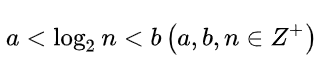

## 二分查找算法

### 介绍

二分查找也称折半查找（Binary Search），它是一种效率较高的查找方法。但是，折半查找要求线性表必须采用顺序存储结构，而且表中元素按关键字有序排列。

### 查找过程

先，假设表中元素是按升序排列，将表中间位置记录的关键字与查找关键字比较，如果两者相等，则查找成功；否则利用中间位置记录将表分成前、后两个子表，如果中间位置记录的关键字大于查找关键字，则进一步查找前一子表，否则进一步查找后一子表。重复以上过程，直到找到满足条件的记录，使查找成功，或直到子表不存在为止，此时查找不成功。

### 算法要求

1.必须采用顺序存储结构。
2.必须按关键字大小有序排列。

### 比较次数

计算公式： 



当顺序表有n个关键字时：
查找失败时，至少比较a次关键字；查找成功时，最多比较关键字次数是b。
注意：a,b,n均为正整数。

其时间复杂度可以表示O(log2n)

### 示例
```java
public class BinarySearch {
    public static void main(String[] args) {
        int[] array = {1, 8, 10, 89, 1000, 1234};
        int i = binarySearch(array, 0, array.length, 1000);
        System.out.printf("array [%d] = %d",i,array[i]);
    }

    /**
     * 二分查找
     *
     * @param array 原数组
     * @param start 开始下标
     * @param end   结束下标
     * @param key   需要查找的数值
     */
    private static int binarySearch(int[] array, int start, int end, int key) {
        // 去一半
        int num = (end + start) / 2;
        // 表示找到
        if (key == array[num]) {
            return num;
        }
        if (start >= end) {
            return -1;
        }
        // 如果要查找的数据 > array[num] , 说明 key 在num的右侧
        // 所以需要将 num + 1 ，而结束位置不动
        else if (key > array[num]) {
            return binarySearch(array, num + 1, end, key);
        }
        // 如果要查找的数据 < array[num] , 说明 key 在num的左侧
        // 所以需要将查找的范围缩小到 num -1 的位置，起始位置不变
        else if (key < array[num]) {
            return binarySearch(array, start, num - 1, key);
        }
        return -1;
    }
}
```
