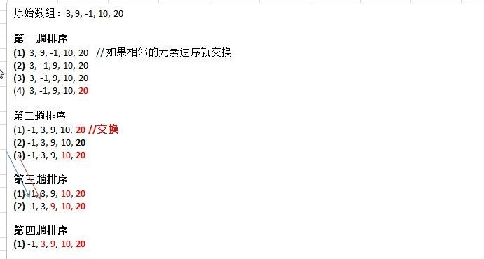

## 冒泡排序

### 介绍

冒泡排序（Bubble Sorting）的基本思想是：通过对待排序序列从前向后（从下标较小的元素开始）,依次比较相邻元素的值，
若发现逆序则交换，使值较大的元素逐渐从前移向后部，就象水底下的气泡一样逐渐向上冒。

优化：
因为排序的过程中，各元素不断接近自己的位置，如果一趟比较下来没有进行过交换，就说明序列有序，因此要在排序过程中设置一个标志 flag 判断元素是否进行过交换。从而减少不必要的比较。(这里说的优化，可以在冒泡排序写好后，在进行)

### 演示冒泡过程的例子(图解)



小结上面的图解过程:
(1)	一共进行 数组的大小-1  次 大的循环
(2)	每一趟排序的次数在逐渐的减少
(3)	如果我们发现在某趟排序中，没有发生一次交换， 可以提前结束冒泡排序。这个就是优化

### 冒泡排序应用实例
我们举一个具体的案例来说明冒泡法。我们将随机生成一个数组  使用冒泡排序法将其排成一个从小到大的有序数列。

```java
public class BubbleSort {

    public static void main(String[] args) {
        //int[] array = {3, 9, -1, 10, -2};
        //System.out.println("排序前的数据: "+Arrays.toString(args));

        //创建要给80000 个的随机数组
        int[] array = new int[800];
        for (int i = 0; i < 800; i++) {
            array[i] = (int) (Math.random()* 8000);
        }

        System.out.println("排序前的数据: "+Arrays.toString(array));
        String before = DateFormatUtils.format(new Date(), "yyyy-MM-dd HH:mm:ss");
        System.out.println("排序前的时间: "+before);

        bubbleSort(array);

        System.out.println("排序后的数据: "+Arrays.toString(array));
        String after = DateFormatUtils.format(new Date(), "yyyy-MM-dd HH:mm:ss");
        System.out.println("排序后的时间: "+after);

    }

    private static void bubbleSort(int[] array) {
        //临时变量
        int temp;
        //  标识变量，表示是否进行过交换
        boolean flag = false;
        for (int i = 0; i < array.length-1; i++) {
            for (int j = 0; j < array.length - 1 -i; j++) {
                if(array[j] > array[j+1]){
                    flag = true;
                    temp = array[j];
                    array[j] = array[j + 1];
                    array[j + 1] = temp;
                }
            }
            // 在一趟排序中，一次交换都没有发生过
            if (!flag) {
                break;
            }
            // 重置 flag!!!, 进行下次判断
            else {
                flag = false;
            }
        }
    }

}
```


