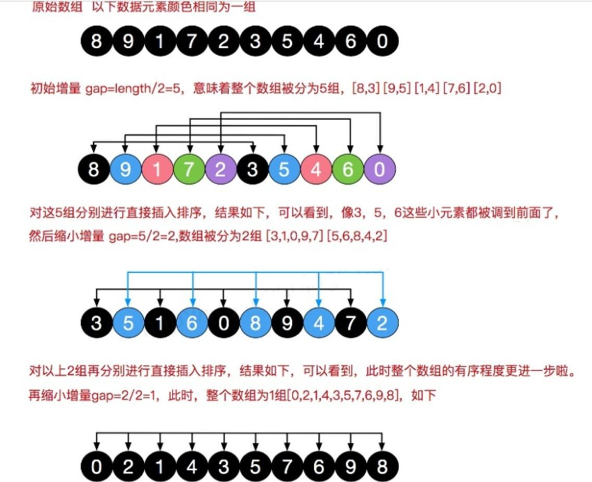

## 希尔排序

### 简单插入排序存在的问题

我们看简单的插入排序可能存在的问题.
数组 arr = {2,3,4,5,6,1}  这时需要插入的数 1(最小),  这样的过程是：
```
{2,3,4,5,6,6}
{2,3,4,5,5,6}
{2,3,4,4,5,6} 
{2,3,3,4,5,6}
{2,2,3,4,5,6}
{1,2,3,4,5,6}
```
结论: 当需要插入的数是较小的数时，后移的次数明显增多，对效率有影响.

###	希尔排序法介绍

希尔排序是希尔（Donald Shell）于 1959 年提出的一种排序算法。希尔排序也是一种插入排序，它是简单插入
 
排序经过改进之后的一个更高效的版本，也称为缩小增量排序。

###	希尔排序法基本思想

希尔排序是把记录按下标的一定增量分组，对每组使用直接插入排序算法排序；随着增量逐渐减少，
每组包含的关键词越来越多，当增量减至 1 时，整个文件恰被分成一组，算法便终止

### 希尔排序法的示意图




### 希尔排序法应用实例:

有一群小牛, 考试成绩分别是 {8,9,1,7,2,3,5,4,6,0} 请从小到大排序. 请分别使用
1)	希尔排序时， 对有序序列在插入时采用交换法, 并测试排序速度.
2)	希尔排序时， 对有序序列在插入时采用移动法, 并测试排序速度
3)	代码实现

```java
public class ShellSort {
    public static void main(String[] args) {
        int[] array = { 8, 9, 1, 7, 2, 3, 5, 4, 6, 0 };
        SortUtils.sysBefore(array);
        shellSort(array);
        SortUtils.sysAfter(array);
    }

    private static void shellSort(int[] array) {
        int temp = 0;
        for (int gap = array.length / 2; gap > 0; gap /= 2) {
            for (int i = gap; i < array.length; i++) {
                // 遍历各组中所有的元素(共 gap 组，每组有个元素),  步长 gap
                for (int j = i - gap; j >= 0; j -= gap) {
                    // 如果当前元素大于加上步长后的那个元素，说明交换
                    if (array[j] > array[j + gap]) {
                        temp = array[j];
                        array[j] = array[j + gap];
                        array[j + gap] = temp;
                    }
                }
            }
        }
    }
}
```


