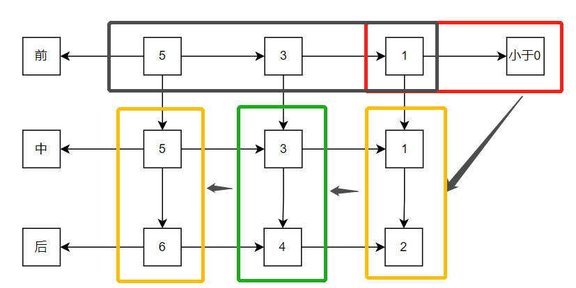

## 递归

简单的说: 递归就是方法自己调用自己,每次调用时传入不同的变量.递归有助于编程者解决复杂的问题,同时可以让代码变得简洁。
这里不禁的让我想起了两部电影 `盗梦空间` `蝴蝶效应`

### 递归能解决什么样的问题

1)	各种数学问题如: 8 皇后问题 ,  汉诺塔,  阶乘问题,  迷宫问题,  球和篮子的问题(google 编程大赛)
2)	各种算法中也会使用到递归，比如快排，归并排序，二分查找，分治算法等.
3)	将用栈解决的问题-->第归代码比较简洁

### 递归需要遵守的重要规则

1)	执行一个方法时，就创建一个新的受保护的独立空间(栈空间)
2)	方法的局部变量是独立的，不会相互影响, 比如 n 变量
3)	如果方法中使用的是引用类型变量(比如数组)，就会共享该引用类型的数据.
4)	递归必须向退出递归的条件逼近，否则就是无限递归,出现 StackOverflowError，死`龟(归)`了:)
5)	当一个方法执行完毕，或者遇到 return，就会返回，遵守谁调用，就将结果返回给谁，同时当方法执行完毕或者返回时，该方法也就执行完毕

在项目中我常用的有可能是循环，偶尔也会用到递归，在其他的算法中也经常有递归算法的出现，比如我关于树的遍历，如果对递归的本质不是很理解就无法真正的掌握其算法的真意。

### 递归算法的推导

> 需求：给定一个数值 num，首先将这个数值 -2 ，在 + 1，当num小于0时结束

如果不考虑递归的出现：有可能的代码如下：

```java
    private static void test(int num) {
        if (num < 0) {
            return;
        } else {
            num -= 2;
            num += 1;
            if (num < 0) {
                return;
            } else {
                num -= 2;
                num += 1;
                //........
            }
        }
    }
```

对于一个简单的需求，我们就要一直这样写下去，但是当你写几次就会发现，这代码的重复率好高呀，刚写完，于是聪明的人的代码就会出现下面的递归代码：

```java
    private static void test2(int num) {
        if (num < 0) {
            return;
        }
        test2(num - 2);
        num += 1;
    }
```

这样的代码是不是很简单，但是原理和执行流程你是否动呢？

### 递归的执行流程

首先我们将上面的代码改造一下，这样可以更好的看出来执行流程

```java
    private static void test2(int num) {
        if (num < 0) {
            return;
        }
        System.out.println("前" + num);//5  3 1
        test2(num - 2);
        System.out.println("-----");
        System.out.println("中" + num);//1 3 5
        num += 1;
        System.out.println("-----");
        System.out.println("后" + num);//2 4 6
    }
```

大家先想想输出的log会是什么样的呢？

```java
//      前5
//      前3
//      前1
//      -----
//      中1
//      -----
//      后2
//      -----
//      中3
//      -----
//      后4
//      -----
//      中5
//      -----
//      后6
```

最终的输出，是不是和你想想的不太一样呢？是什么原因造成了这样的输出呢？

我们画一张图来处理一下其流程：



从图中我们可以看出，其执行的流程也是先将递归前的代码执行完成，然后逐层的执行，及从最后的一层操作操作向前执行，这里也不难看出其递归的执行流程和栈一样的，都是后进先出；

### 递归需要遵守的重要规则

1. 执行一个方法时，就创建一个新的受保护的独立空间(栈空间)
2. 方法的局部变量是独立的，不会相互影响, 比如 n 变量
3. 如果方法中使用的是引用类型变量(比如数组)，就会共享该引用类型的数据.
4. 递归必须向退出递归的条件逼近，否则就是无限递归,出现 StackOverflowError，死`龟(归)`了:)
5. 当一个方法执行完毕，或者遇到 return，就会返回，遵守谁调用，就将结果返回给谁，同时当方法执行完毕或者返回时，该方法也就执行完毕


