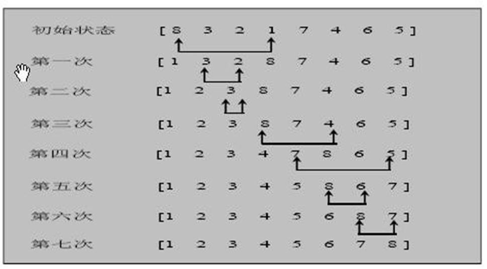
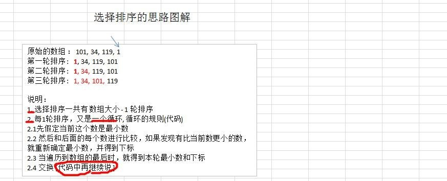

## 选择排序

### 介绍
选择式排序也属于内部排序法，是从欲排序的数据中，按指定的规则选出某一元素，再依规定交换位置后达到排序的目的。

### 选择排序思想

选择排序（select sorting）也是一种简单的排序方法。它的基本思想是：第一次从 arr[0]~arr[n-1]中选取最小值，
 与 arr[0]交换，第二次从 arr[1]~arr[n-1]中选取最小值，与 arr[1]交换，第三次从 arr[2]~arr[n-1]中选取最小值，
 与 arr[2] 交换，…，第 i 次从 arr[i-1]~arr[n-1]中选取最小值，与 arr[i-1]交换，…, 
 第 n-1 次从 arr[n-2]~arr[n-1]中选取最小值， 与 arr[n-2]交换，总共通过 n-1 次，得到一个按排序码从小到大排列的有序序列。
 
###  选择排序思路分析图



	对一个数组的选择排序再进行讲解



### 选择排序应用实例

有一群牛 ,  颜值分别是 101, 34, 119, 1 请使用选择排序从低到高进行排序 [101, 34, 119, 1]
```java
public class SelectSort {
    public static void main(String[] args) {
        int[] array = {101, 34, 119, 1, -1, 90, 123};
        //int[] array = SortUtils.createArray(80000, 8000000);
        SortUtils.sysBefore(array);
        selectSort(array);
        SortUtils.sysAfter(array);
    }

    /**
     * 选择排序
     */
    private static void selectSort(int[] array){
        int length = array.length - 1;
        for (int i = 0; i < length; i++) {
            int minIndex = i;
            int min = array[i];
            for (int j = i +1; j < length; j++) {
                // 说明假定的最小值，并不是最小
                if (min > array[j]) {
                    // 重 置 min
                    min = array[j];
                    // 重 置 minIndex
                    minIndex = j;
                }
            }
            // 将最小值，放在 arr[0],  即交换
            if (minIndex != i) {
                array[minIndex] = array[i];
                array[i] = min;
            }
        }
    }

}
```


