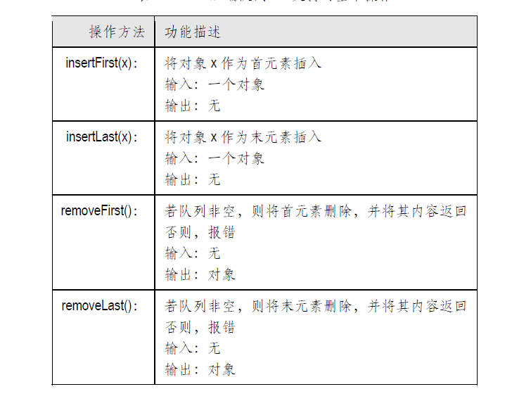
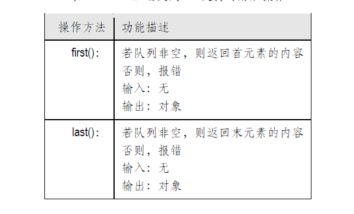
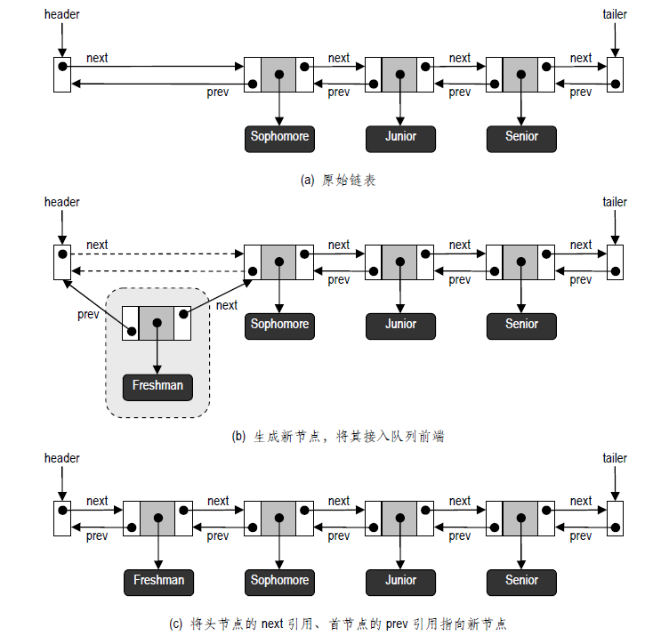

## 数据结构 ☞ 双端队列

本节介绍队列的一种变型⎯⎯双端队列（Double-ended queue），简称为Deque。顾名思义，
也就是前端与后端都支持插入和删除操作的队列。

-[双端队列的ADT](#双端队列的ADT)
-[双端队列的接口](#双端队列的接口)
-[基于双向链表实现的双端队列](#基于双向链表实现的双端队列)
-[Java实现双端队列](#Java实现双端队列)

### 双端队列的ADT
相比于栈和队列，双端队列的抽象数据类型要复杂很多，其中基本的方法如下：



此外，还可能支持以下方法：



给出了从一个空双端队列开始，在依次执行一系列操作的过程中，队列中内容的相应变化。


### 双端队列的接口
双端队列接口如代码所示
```java
public interface Deque<E> {
    /**
     * 返回队列中元素数目
     * @return
     */
    int size();

    /**
     * 判断队列是否为空
     * @return
     */
    boolean isEmpty();

    /**
     * 取首元素（但不删除）
     * @return
     * @throws ExceptionQueueEmpty
     */
    E first() throws ExceptionQueueEmpty;

    /**
     * 取末元素（但不删除）
     * @return
     * @throws ExceptionQueueEmpty
     */
    E last() throws ExceptionQueueEmpty;

    /**
     * 将新元素作为首元素插入
     * @param obj
     */
    void addFirst(E obj);

    /**
     * 将新元素作为末元素插入
     * @param obj
     */
    void aadLast(E obj);

    /**
     * 删除首元素
     * @return
     * @throws ExceptionQueueEmpty
     */
    E removeFirst() throws ExceptionQueueEmpty;

    /**
     * 删除末元素
     * @return
     * @throws ExceptionQueueEmpty
     */
    E removeLast() throws ExceptionQueueEmpty;

    /**
     * 遍历
     */
    void iterator();
}
```

在前面讲过我们需要花费O(n)的时间才能从单链表中删除末节点。因此，若依然采
用单链表来实现双端队列，将不可能同时支持对首、末节点的快速删除。为此，我们需要对单链表
结构进行必要的扩充，以保证无论是哪一端的删除操作，都能够在O(1)的时间内完成。本节将要介
绍的双向链表就能够满足这一要求。顾名思义，这类链表中的每一节点不仅配有next引用，同时还
有一个prev引用，指向其直接前驱节点（没有前驱时为null）。代码 给出了双向链表节点类型的
具体实现：
```java
public class Node<E> implements Position<E> {
    //数据对象
    private E element;
    //指向前驱节点
    private Node<E> prev;
    //指向后继节点
    private Node<E> next;

    public Node() {
        this(null,null,null);
    }

    /**
     *  注意三个参数的次序：数据对象、前驱节点、后继节点
     * @param e 数据对象
     * @param p 前驱节点
     * @param n 后继节点
     */
    public Node(E e, Node<E> p, Node<E> n)
    {
        element = e;
        prev = p;
        next = n;
    }


    @Override
    public E getElem() {
        return element;
    }

    /**
     * 将给定的元素放入该位置，并返回原来的元素
     * @param e 插入元素
     * @return
     */
    @Override
    public E setElem(E e) {
        E oldElem = element;
        element = e;
        return oldElem;
    }

    /**
     * 找到后继位置
     * @return
     */
    public Node<E> getNext()
    { 
        return next; 
    }

    /**
     * 找到前驱位置
     * @return
     */
    public Node<E> getPrev()
    { 
        return prev; 
    }

    /**
     * 修改后继位置
     * @param newNext
     */
    public void setNext(Node<E> newNext)
    { 
        next = newNext; 
    }

    /**
     * 修改前驱位置
     * @param newPrev
     */
    public void setPrev(Node<E> newPrev)
    { 
        prev = newPrev; 
    }
}
```

### 基于双向链表实现的双端队列


在基于Node类实现双向链表的时候，为了使编程更加简洁，通常我们都要在最前端和最后
端各设置一个哑元节点（Dummy node）。这两个节点分别称作头节点（Header node）和尾节点
（Trailer node）㈠，起哨兵（Sentinel）的作用。也就是说，它们并不存储任何实质的数据对象，头
（尾）节点的next（prev）引用指向首（末）节点，而prev（next）引用为空。如此构成的双向链表
结构，如上图所示。
- 首、末节点的插入
对双端队列的插入操作，与单链表类似。图 给出了在链表前端插入节点的过程。


- 首、末节点的删除
更重要的是，我们可以在O(1)时间内删除双向链表任何一端的节点。如图 所示的，就是
删除末节点的过程。首节点的删除过程是对称的，请读者自行给出。

需要特别指出的是，与单链表不同，这里能够在常数时间内删除末节点。之所以能够这样，是
因为可以直接通过末节点的prev 引用找到它的直接前驱（新的末节点），而无需遍历整个链表。

- 一般节点的插入与删除


一般地，若要在相邻的一对节点p 和q 之间插入新元素e，我们只需生成一个新节点t，将e
存放至其中，然后将t 的prev 和next 引用分别指向p 和q，然后让p（q）的next（prev）引用指向t。

反过来。若要删除节点t，我们可以找到其直接前驱节点p 和直接后继节点q，然后将p（q）
的next（prev）引用指向q（p）。对于节点t，我们无需做任何处理⎯⎯既然它不再被引用，就将被
内存回收器回收。请读者自行画出具体过程。

需要特别指出的是，p 和q 都有可能是哨兵节点。请读者自行验证：即使p 或（和）q 是头（尾）
节点，上述操作过程依然正确。

### Java实现双端队列
```java
public class LinkedDeque<E> implements Deque<E>{

    //指向头节点（哨兵）
    protected Node<E> header;
    //指向尾节点（哨兵）
    protected Node<E> trailer;
    //队列中元素的数目
    protected int size;

    public LinkedDeque() {
        header = new Node<E>();
        trailer = new Node<E>();
        header.setNext(trailer);
        trailer.setPrev(header);
        size = 0;
    }

    @Override
    public int size() {
        return size;
    }

    @Override
    public boolean isEmpty() {
        return size == 0;
    }

    @Override
    public E first() throws ExceptionQueueEmpty {
        if (isEmpty()){
            throw new ExceptionQueueEmpty("意外：双端队列为空");
        }
        return header.getNext().getElem();
    }

    @Override
    public E last() throws ExceptionQueueEmpty {
        if (isEmpty()){
            throw new ExceptionQueueEmpty("意外：双端队列为空");
        }
        return trailer.getPrev().getElem();
    }

    @Override
    public void addFirst(E obj) {
        Node<E> second = header.getNext();
        Node<E> first = new Node<>(obj, header, second);
        second.setPrev(first);
        header.setNext(first);
        size++;
    }

    @Override
    public void aadLast(E obj) {
        Node<E> second = trailer.getPrev();
        Node<E> first = new Node<E>(obj, second, trailer);
        second.setNext(first);
        trailer.setPrev(first);
        size++;
    }

    @Override
    public E removeFirst() throws ExceptionQueueEmpty {
        if (isEmpty()) {
            throw new ExceptionQueueEmpty("意外：双端队列为空");
        }
        Node<E> first = header.getNext();
        Node<E> second = first.getNext();
        E obj = first.getElem();
        header.setNext(second);
        second.setPrev(header);
        size--;
        return obj;
    }

    @Override
    public E removeLast() throws ExceptionQueueEmpty {
        if (isEmpty()) {
            throw new ExceptionQueueEmpty("意外：双端队列为空");
        }
        Node<E> first = trailer.getPrev();
        Node<E> second = first.getPrev();
        E obj = first.getElem();
        trailer.setPrev(second);
        second.setNext(trailer);
        size--;
        return obj;
    }

    @Override
    public void iterator() {
        Node<E> p = header.getNext();
        while (p != trailer) {
            System.out.print(p.getElem()+" ");
            p = p.getNext();
        }
        System.out.println();
    }
}
```


