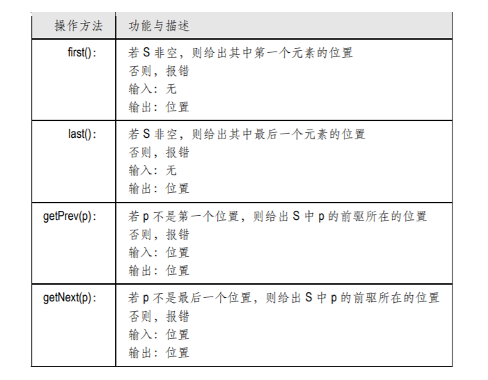
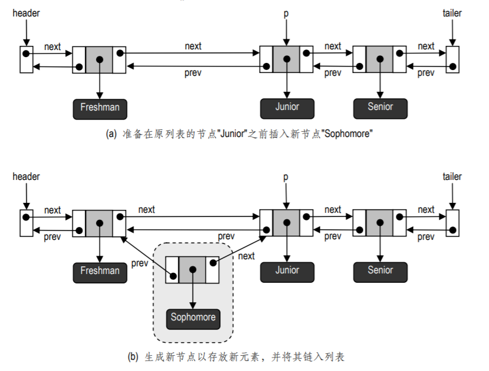
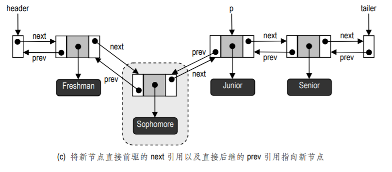
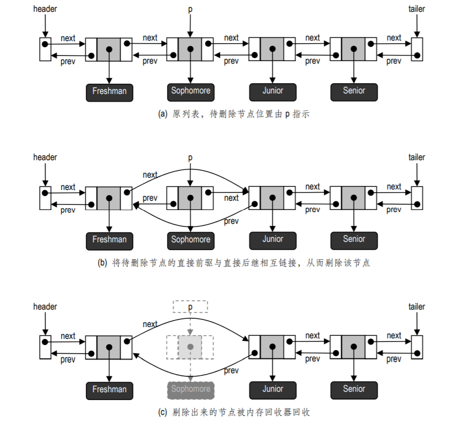

## 数据结构 ☞  列表

- [基于节点的操作](#基于节点的操作)
- [由秩到位置](#由秩到位置)
- [列表ADT](#列表ADT)
- [基于双向链表实现的列表](#基于双向链表实现的列表)

### 基于节点的操作

试考察一个（单向或双向）链表 S。如果直接照搬秩的概念，对链表的访问速度会很慢⎯⎯为
了在链表结构中确定特定元素的秩，我们不得不顺着元素间的 next（或 prev）引用，从前端（双向
链表也可以从后端）开始逐一扫描各个元素，直到发现目标元素。在最坏情况下，这需要线性的时
间。请读者证明：即使考虑所有元素等概率出现的情况，每次操作的平均运行时间也是 O(n)。

实际上，除了通过秩，我们还可以通过其它途径来确定元素在序列中的位置。我们希望能够为
序列扩充若干新的方法，使之能够直接以某些节点做为参数，找到所需的节点并对其实施操作。比
方说，若能够将方法 removeAtRank(r)替换为新方法 removeAtNode(v)，即可直接删除节点 v 所对
应的元素。只要能够以节点做为参数，就可以在 O(1)的时间内直接确定目标节点的存放位置，进而
修改其前驱与后继的 next 和 prev 引用，以完成对该元素的删除。类似地，若能够将 insertAtRank(r,
obj)方法替换为新方法 insertAfterNode(v, obj)，即可将 obj 插入到节点 v 的后继位置。总之，只要能
够像这样地以节点作为参数，就可以在 O(1)时间内确定目标节点的存储位置，进而完成相应的操作。


### 由秩到位置
为了在列表 ADT 中增添上述基于节点的操作，必须首先回答这样一个问题：需要将多少有关列
表具体实现的信息暴露给程序员？自然，最好是既能够利用单链表或双向链表，同时又能够将其中
的细节封装起来。同样地，尽管如此实现的列表的确为程序员提供了直接访问和修改内部数据的可
能（比如 next 和 prev 引用），出于安全性的考虑，我们还是不鼓励他们去使用这些底层的功能。

为此，在下面将要给出的列表ADT中，我们对链表结构做了抽象处理。实际上，我们可以借助
第 §2.4 节介绍的“位置”概念来实现这一抽象。在经过抽象化处理后，在统一的列表ADT下可以
有多种实现形式，而且元素的存储形式也不尽相同，就这个意义而言，位置（Position）的概念就是
对元素的不同形式的抽象和统一，也是对列表元素之间相对“位置”的形式化刻画。正是在这种抽
象的基础上，我们才可以安全地为列表扩充一整套基于节点的操作。按照这一思路，依然可以将列
表看作是存放元素的容器，其中的元素各有自己的存放位置，我们只是将它们的位置组织为一个线性的结构。

### 列表ADT
在引入位置概念对列表“节点”进行封装之后，就可以得到一个新的序列 ADT，称作列表（List）。
该 ADT 支持对列表 S 的以下方法：



通过以上方法，才可以谈论并使用相对于列表前端或末端的位置概念，并且顺次访问列表的各
个元素。尽管这一位置概念可以直观地与列表中的节点对应起来，但一定要注意：这里并没有通过
什么引用直接指向各节点对象。此外，若以位置作为参数传递给某个列表方法，就必须保证该位置
的确属于该列表。

- 修改列表的方法
除了通常都提供的 size()和 isEmpty()以及上面给出的方法，为了对列表做修改与更新，列
表 ADT 还需支持以下方法。这些方法的共同点在于，它们都以位置为参数或（和）返回值。


有了列表ADT，我们就可以从位置的角度来看待一组按序存放的对象，而不必考虑它们的位置的具体表示


有的读者或许已经注意到，在上述列表 ADT 的定义中，有些操作的功能是重复的。比如，
insertBefore(first(), e) 的效果与 insertFirst(e)完全相同，insertAfter(last(), e) 的效果与 insertLast(e)
也完全相同。之所以允许这类功能的冗余，是为了增加代码的可读性。

还需注意的是，当作为参数传递给上述方法的位置不合法时，需要做报错处理。位置 p 非法，有以下可能：
```java 
 null == p
 p 已被删除
 p 是另一列表中的位置
 在调用方法 getPrev(p)时，p 是列表中的第一个位置
 在调用方法 getNext(p)时，p 是列表中的最后一个位置
```
- 意外错

```java
public class ExceptionPositionInvalid extends RuntimeException{
    public ExceptionPositionInvalid(String message) {
        super(message);
    }
}
```

- 列表 ADT 接口

```java
public interface List<E> {
    //查询列表当前的规模
    int size();
    //判断列表是否为空
    boolean isEmpty();
    //返回第一个元素（的位置）
    Position<E> first();
    //返回最后一个元素（的位置）
    Position<E> last();
    //返回紧接给定位置之后的元素（的位置）
    Position<E> getNext(Position<E> p) throws ExceptionPositionInvalid, ExceptionBoundaryViolation;
    //返回紧靠给定位置之前的元素（的位置）
    Position<E> getPrev(Position<E> p) throws ExceptionPositionInvalid, ExceptionBoundaryViolation;
    //将e作为第一个元素插入列表
    Position<E> insertFirst(E e);
    //将e作为最后一个元素插入列表
    Position<E> insertLast(E e);
    //将e插入至紧接给定位置之后的位置
    Position<E> insertAfter(Position<E> p, E e) throws ExceptionPositionInvalid;
    //将e插入至紧靠给定位置之前的位置
    Position<E> insertBefore(Position<E> p, E e) throws ExceptionPositionInvalid;
    //删除给定位置处的元素，并返回之
    E remove(Position<E> p) throws ExceptionPositionInvalid;
    //删除首元素，并返回之
    E removeFirst();
    //删除末元素，并返回之
    E removeLast();
    //将处于给定位置的元素替换为新元素，并返回被替换的元素
    E replace(Position<E> p, E e)  throws ExceptionPositionInvalid;
}
```

###  基于双向链表实现的列表

为了实现双向链表结构，我们曾经基于位置ADT实现了双向链表节点类型
Node。在那里，每一节点对应于一个位置，而getElem()方法只需返回该节点所保
存的元素。也就是说，节点本身就担当了位置的角色：在内部，链表将其视为节点；而从外部看来，
它们都是一般意义上的位置。在内部，每一节点v都拥有prev和next引用，分别指向v的直接前驱与
直接后继（注意：只要在前端、后端分别设置头、尾哨兵节点，它们就必然存在）。不过，同样地按
照封装的思想，那里并没有直接使用变量prev和next，而是通过方法getPrev()、getNext()、setPrev()
和setNext()间接地对它们进行访问或修改。如此实现的位置ADT，不仅完全符合面向对象的规范，
而且时间、空间复杂度均不会增加。

下面，我们将利用 Node 类来实现列表 ADT。给定列表 S 中的任一位置 p，我们只要将 p“展
开”，即可进而取出其对应的节点 v⎯⎯具体来说，就是将 p 强制转换为节点 v。反之亦然，比如，
给定任一节点 v，我们都可以利用 v.getNext()来实现方法 getNext(p)（当然，若 v 恰好是末节点，
则需报错）。

在给出完整的列表 ADT 实现之前，让我们以 insertBefore(p, e)方法和 remove(p)为例，对各方
法的算法实现做一介绍。

- insertBefore( p, e)算法

首先，为了将元素e作为p的直接前驱插入列表，我们可以首先创建一个节点v来存放e，然后将
v插入至要求的位置，最后调整其直接前驱与后继的next和prev引用。具体的过程可以描述为:

```java
算法：insertBefore(p, e)
输入：位置p和元素e
输出：将e插入至p之前后，返回插入的位置
{
创建一个新节点v;
 v.setElement(e);//用v来存放e
 v.setNext(p);//以p为v的直接后继
 v.setPrev(p.getPrev);//以p的直接前驱为v的直接前驱
 (p.getPrev()).setNext(v);//p的直接前驱应该以v为直接后继
 p.setPrev(v);//作为v的直接后继，p应该以v为直接前驱
 return((Position)v);//v作为一个位置被返回
} 
```
则给出了一次insertBefore()操作实例




方法 insertAfter()、insertFirst()和 insertLast()都可以仿照这一算法来实现。

- remove(p) 算法

下面再介绍方法remove(p)的实现。为了删除存放于位置p的元素e，我们可以将p的直接前驱与
直接后继相互链接起来，从而将p剔除出去。一旦p不再被任何引用指向，内存回收器就会自动将其空间回收。

```java
算法：remove(p)
输入：位置p
输出：删除存放于位置p处的元素e，并返回该元素
{
 bak = p.element;//复制待删除的元素
 (p.getNext()).setPrev(p.getPrev);//令p的直接后继以p的直接前驱为直接前驱
 (p.getPrev()).setNext(p.getNext);//令p的直接前驱以p的直接后继为直接后继
 p.setNext(null);//切断p的后继引用
 p.setPrev(null);//切断p的前躯引用
 return bak;//返回先前保留的备份
} 
```

remove()操作的一个实例。



- 代码实现

```java
public class NodeList<E> implements List<E>{
    //列表的实际规模
    protected int numElem;
    //哨兵：首节点+末节点
    protected Node<E> header, trailer;

    public NodeList() {
        //空表
        numElem = 0;
        //首节点
        header = new Node<E>(null, null, null);
        //末节点
        trailer = new Node<E>(null, header, null);
        //首、末节点相互链接
        header.setNext(trailer);
    }

    @Override
    public int size() {
        return numElem;
    }

    @Override
    public boolean isEmpty() {
        return 0 == numElem;
    }

    @Override
    public Position<E> first() {
        isNull();
        return header.getNext();
    }

    @Override
    public Position<E> last() {
        isNull();
        return trailer.getPrev();
    }

    @Override
    public Position<E> getNext(Position<E> p) throws ExceptionPositionInvalid, ExceptionBoundaryViolation {
        Node<E> v = checkPosition(p);
        Node<E> next = v.getNext();
        if (next == trailer){
            throw new ExceptionBoundaryViolation("意外：企图越过列表后端");
        }
        return next;
    }

    @Override
    public Position<E> getPrev(Position<E> p) throws ExceptionPositionInvalid, ExceptionBoundaryViolation {
        Node<E> v = checkPosition(p);
        Node<E> prev = v.getPrev();
        if (prev == header) {
            throw new ExceptionBoundaryViolation("意外：企图越过列表前端");
        }
        return prev;
    }

    @Override
    public Position<E> insertFirst(E e) {
        numElem++;
        Node newNode = new Node(e, header, header.getNext());
        header.getNext().setPrev(newNode);
        header.setNext(newNode);
        return newNode;
    }

    @Override
    public Position<E> insertLast(E e) {
        numElem++;
        Node newNode = new Node(e, trailer.getPrev(), trailer);
        if (null == trailer.getPrev()) {
            System.out.println("Prev of trailer is Null");
        }
        trailer.getPrev().setNext(newNode);
        trailer.setPrev(newNode);
        return newNode;
    }

    @Override
    public Position<E> insertAfter(Position<E> p, E element) throws ExceptionPositionInvalid {
        Node v = checkPosition(p);
        numElem++;
        Node newNode = new Node(element, v, v.getNext());
        v.getNext().setPrev(newNode);
        v.setNext(newNode);
        return newNode;
    }

    @Override
    public Position<E> insertBefore(Position<E> p, E element) throws ExceptionPositionInvalid {
        Node v = checkPosition(p);
        numElem++;
        Node newNode = new Node(element, v.getPrev(), v);
        v.getPrev().setNext(newNode);
        v.setPrev(newNode);
        return newNode;
    }

    @Override
    public E remove(Position<E> p) throws ExceptionPositionInvalid {
        Node v = checkPosition(p);
        numElem--;
        Node vPrev = v.getPrev();
        Node vNext = v.getNext();
        vPrev.setNext(vNext);
        vNext.setPrev(vPrev);
        Object vElem = v.getElem();
        //将该位置（节点）从列表中摘出，以便系统回收其占用的空间
        v.setNext(null);
        v.setPrev(null);
        return (E) vElem;
    }

    @Override
    public E removeFirst() {
        return remove(header.getNext());
    }

    @Override
    public E removeLast() {
        return remove(trailer.getPrev());
    }

    @Override
    public E replace(Position<E> p, E element) throws ExceptionPositionInvalid {
        Node v = checkPosition(p);
        Object oldElem = v.getElem();
        v.setElem(element);
        return (E) oldElem;
    }

    /**
     * 检查给定位置在列表中是否合法，若是，则将其转换为 Node
     * @param p
     * @return
     * @throws ExceptionPositionInvalid
     */
    protected Node<E> checkPosition(Position<E> p) throws ExceptionPositionInvalid {
        if (null == p) {
            throw new ExceptionPositionInvalid("意外：传递给List_DLNode的位置是null");
        }
        if (header == p) {
            throw new ExceptionPositionInvalid("意外：头节点哨兵位置非法");
        }
        if (trailer == p) {
            throw new ExceptionPositionInvalid("意外：尾结点哨兵位置非法");
        }
        Node temp = (Node)p;
        return temp;
    }

    protected void isNull(){
        if (isEmpty()){
            throw new ExceptionListEmpty("意外：列表空");
        }
    }
}
```


