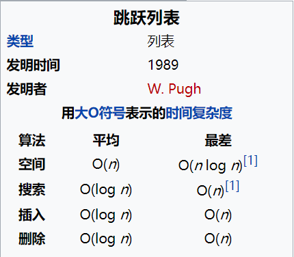
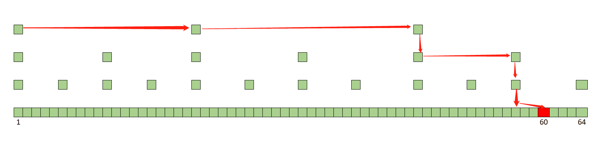

## 数据结构 ☞ 调表

### 概念
在计算机科学中，跳跃列表是一种数据结构。它使得包含n个元素的有序序列的查找和插入操作的平均时间复杂度都是`O(log n)`，优于数组的`O(n)`复杂度。

快速的查询效果是通过维护一个多层次的链表实现的，且与前一层（下面一层）链表元素的数量相比，每一层链表中的元素的数量更少（见示意图）。
一开始时，算法在最稀疏的层次进行搜索，直至需要查找的元素在该层两个相邻的元素中间。这时，算法将跳转到下一个层次，
重复刚才的搜索，直到找到需要查找的元素为止。

### 描述

跳跃列表是按层建造的。底层是一个普通的有序链表。每个更高层都充当下面列表的“快速通道”，这里在第i层中的元素按某个固定的概率 P`(通常为1/2 或1/4)`
出现在第`i+1` 层中。每个元素平均出现在`1/1-p`个列表中，而最高层的元素（通常是在跳跃列表前端的一个特殊的头元素）在`log((1/p)n)`个列表中出现。
在查找目标元素时，从顶层列表、头元素起步。算法沿着每层链表搜索，直至找到一个大于或等于目标的元素，或者到达当前层列表末尾。
如果该元素等于目标元素，则表明该元素已被找到；如果该元素大于目标元素或已到达链表末尾，则退回到当前层的上一个元素，然后转入下一层进行搜索。
每层链表中预期的查找步数最多为`1/p`，而层数为`log((1/p)n)`，所以查找的总体步数为`-log(p)n`，由于p是常数，
查找操作总体的时间复杂度为`O(log n)`。而通过选择不同p值，就可以在查找代价和存储代价之间获取平衡。

跳跃列表不像平衡树等数据结构那样提供对最坏情况的性能保证：由于用来建造跳跃列表采用随机选取元素进入更高层的方法，
在小概率情况下会生成一个不平衡的跳跃列表（最坏情况例如最底层仅有一个元素进入了更高层，此时跳跃列表的查找与普通列表一致）。
但是在实际中它通常工作良好，随机化平衡方案也比平衡二叉查找树等数据结构中使用的确定性平衡方案容易实现。
跳跃列表在并行计算中也很有用：插入可以在跳跃列表不同的部分并行地进行，而不用对数据结构进行全局的重新平衡。

### 图解调表

上图是一个简单的有序的单链表，如果要查找某个数据，只能从头至尾遍历链表，查找到值与给定元素时返回该结点，这样的查询效率很低，时间复杂度是为O(n)。

假如对链表进行改造，先对链表中每两个节点建立第一级索引，再对第一级索引每两个节点建立第二级索引。如下图所示：

对于上图中的带二级索引的链表中，我们查询元素 11，先从第二级索引查询 1 -> 5->10，发现11大于10 ，然后通过 10 的 down 指针找到第一级索引的 11，
发现 11 小于12 ，再通过10 的 down 指针找到链表中的 11，只需要遍历 6 个节点就完成 11 的查找。如果在单链表中直接查找 11 的话，
只能顺序遍历，需要遍历 10 个节点，是不是效率上有所提升呢，由于数据量较小，遍历 10 个节点到遍历 6 个节点你可能觉得没有提升多少性能，那么请看下图：

从图中我们可以看出，原来没有索引的时候，查找 60 需要遍历 60 个结点，现在只需要遍历 10 个结点，速度是不是提高了很多？所以，
当链表的长度 n 比较大时，比如 1000、10000 的时候，在构建索引之后，查找效率的提升就会非常明显。

### 跳表有多快
单链表的查找一个元素的时间复杂度为O(n)，那么跳表的时间复杂度是多少？
假如链表中有 n 个元素，我们每两个节点建立一个索引，那么第 1 级索引的结点个数就是 n/2 ，第二级就是 n/4，第三级就是 n/8, 
依次类推，也就是说第 k 级索引的结点个数是第 k-1 级索引的结点个数的 1/2，那么第k级索引的节点个数为 n 除以 2 的 k 次方，即 n/(2^k)。
假设索引有 h 级，最高级的索引有 2 个结点。通过上面的公式，我们可以得到 n/(2^h) = 2，得到 h=log2n - 1，
包含原始链表这一层的话，跳表的高度就是 log2n，假设每层需要访问 m 个结点，那么总的时间复杂度就是O(m*log2n)。
而每层需要访问的 m 个结点，m 的最大值不超过 3，这里为什么是 3 ，可以自己试着走一个。

- 自定义调表请参考
    - [自定义跳表 SkipList](../../../../../source-code/src/main/java/com/javayh/advanced/java/datastructure/skiplist/SkipList.java)

- JDK 自带跳表
    - ConcurrentSkipListMap
    - ConcurrentSkipListSet

