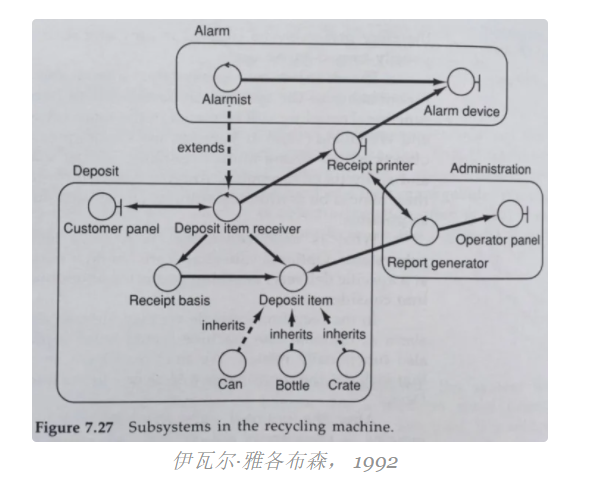
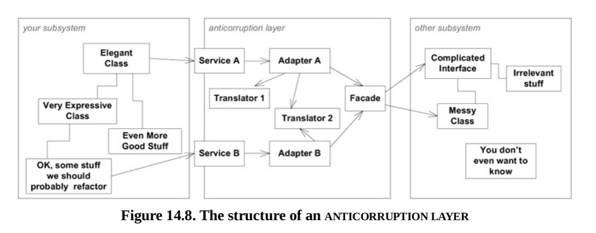

# 什么是领域驱动设计？

构建有效的软件并不困难。

真正困难的是构建持续多年的软件，尽管业务需要，用户需要，新技术需要变化，但该软件仍可以继续工作。构建能够永久准备好进行更改的软件，并永久准确地反映业务...这是棘手的部分。

有许多原则和技术可以帮助实现这一目标，如SOLID，GRASP，STUPID，KISS，Demeter定律等。DDD是一组有助于实现这一目标的模式，原则和实践。

> 领域驱动设计（DDD）是Eric Evans在他的开创性著作《领域驱动设计：解决软件核心的复杂性》（Addison-Wesley Professional，2003）中定义的一种开发理念。DDD是一种软件开发方法，使团队能够有效地管理复杂问题域的软件构建和维护。

在DDD哲学中，软件变得复杂且难以管理的主要原因是领域概念不明确，它们往往会变得混合，不准确，因此会腐烂。它们变成了没有结构化，草率，耦合，不透明，意大利面条的代码(一团乱)，实际上是Brian Foote和Joseph Yoder在他们的论文"Big Ball of Mud"中定义的Big Ball of Mud（BBoM）。

然后，沟通是关键。业务经理和开发人员需要一种通用语言来讨论业务概念。这是创建反映业务意图和业务概念的代码库的关键。在DDD中，这种通用语言被称为**泛在语言（UL）。**当领域专家和开发人员合作构建业务概念模型（领域模型）时，UL 是关键，该模型可以编码并准确反映业务意图。

我无法在博客文章中对DDD进行详尽的评论。与DDD相关的重要概念太多了。幸运的是，这也不是这里的目标。然而，我要做的是列出我发现与我喜欢的组织代码的方式以及我对架构的看法更相关的DDD概念：构成功能开发基础的系统范围概念。

在这篇文章中，我将写以下内容：

- 无处不在的语言
- 层
- 有界上下文
- 防腐层
- 共享内核
- 通用子域

## **无处不在的语言**

软件开发中反复出现的问题围绕着理解代码，它是什么，它做什么，它是如何做的，为什么这样做......如果代码使用的术语与领域专家使用的术语不同，则理解代码甚至会更加复杂，例如，如果领域专家谈论*老年用户*，而代码谈论*主管*，这可能会在讨论应用程序时带来很多混乱。然而，大多数这种歧义可以通过正确命名类和方法来解决，使它们表达对象是什么以及方法在域的上下文中做了什么。

使用泛在语言的主要思想是使应用程序与业务保持一致。这是通过在代码中采用业务和技术之间的通用语言来实现的。该语言的来源是公司的业务方面，他们有需要实现的概念，但术语然后与公司的技术方面**进行谈判**（这意味着业务方面也不总是选择最佳命名），目的是创建**一个可供业务使用的通用术语， 技术和在代码本身没有任何歧义**，一种无处不在的语言。代码、类、方法、属性和模块命名必须与无处不在的语言保持一致。如果需要，值得重构代码！

## **层**

我已经在上一篇文章中讨论过分层，但我发现在这一点上，记住DDD标识的层是重要的：

- #### 用户界面

  负责绘制用户用于与应用程序交互的屏幕，并将用户的输入转换为应用程序命令。重要的是要注意，"用户"可以是人类，但也可以是连接到我们的API的其他应用程序，这完全对应于EBI架构中的边界对象。;

- #### 应用层

  编排域对象以执行用户所需的任务：用例。它不包含业务逻辑。这与EBI 体系结构中的交互器有关，不同之处在于交互器是与 UI 或实体无关的任何对象，在这种情况下，应用程序层仅包含与用例相关的对象。此层是应用程序服务所属的位置，因为它们是使用存储库，域服务，实体，值对象或任何其他域对象进行用例编排的容器;

- #### 域层

  这是包含所有业务逻辑、域服务、实体、事件和包含业务逻辑的任何其他对象类型的层。它显然与 EBI 的实体对象类型有关。这是系统的核心。域服务将包含不太适合实体的域逻辑，通常编排多个实体来完成某些域操作;

- #### 基础设施

  支持上述层的技术功能，即。持久性或消息传递。

  

## **有界上下文**

在企业应用程序中，模型可以增长很多，并且处理代码库的团队的规模也会很大。这给我们带来了两个问题：

1. 开发人员必须使用的代码库越大，认知负载越大，理解代码就越困难，因此在判断中引入错误和错误的可能性就越大;
2. 开发人员在同一代码库上工作的次数越多，就越难协调工作，并对应用程序具有共同的技术和领域愿景。

换句话说，手头的问题变得太大了。

一个大问题的通常解决方案是把它分解成更小的部分，而这正是"*有界上下文*"发挥作用的地方。

> 两个子系统通常服务于非常不同的用户社区
>
> Eric Evans 2014，领域驱动设计参考

有界上下文定义应用模型的隔离部分的上下文。隔离可以通过解耦技术逻辑、代码库隔离、数据库架构隔离以及团队组织来实现。像往常一样，我们隔离有限上下文的程度取决于实际情况：我们拥有的需求和可能性。

有趣的是，这并不是一个全新的概念。伊瓦尔·雅各布森[（Ivar](https://www.amazon.com/Object-Oriented-Software-Engineering-Driven-Approach/dp/0201403471) Jacobson）在1992年的书中写道子系统，比埃里克·埃文斯（Eric Evans）早十一年！

那时，他已经对这个主题提出了一些非常具体的想法：

- *因此，该系统由许多子系统组成，这些子系统可以包含自己的子系统。此类层次结构的底部是分析对象。因此，子系统是构建系统以进行进一步开发和维护的一种方式*
- *子系统的任务是打包对象，以降低复杂性。*
- *与功能的特定部分相关的所有对象都将放置在同一子系统中*
- *其目的是在子系统内具有强功能耦合和子系统之间的弱耦合*（现在称为低耦合和高内聚）
- *因此，[一个子系统]最好只与一个执行组件耦合，因为变化通常是由一个执行组件引起的。*
- *[...]首先将控制对象放在子系统中，然后将强耦合实体对象和接口对象放在同一子系统中*
- 所有具有强相互功能耦合的对象将被放置在同一子系统中 [...]
  - *一个对象的变化会导致另一个对象的变化吗？*（这现在被称为共同闭包原则 - 一起变化的类被打包在一起 - 由罗伯特·C·马丁在1996年的论文"[粒度](http://docs.google.com/a/cleancoder.com/viewer?a=v&pid=explorer&chrome=true&srcid=0BwhCYaYDn8EgOGM2ZGFhNmYtNmE4ZS00OGY5LWFkZTYtMjE0ZGNjODQ0MjEx&hl=en) "中发表，比伊瓦尔·雅各布森的书晚了4年）
  - *他们是否与同一个演员沟通？*
  - *它们是否都依赖于第三个对象，例如接口对象或实体对象？*
  - *一个对象是否对另一个对象执行多个操作？*（这现在被称为通用重用原则 - 一起使用的类被打包在一起 - 由罗伯特·C·马丁在1996年的论文"[粒度](http://docs.google.com/a/cleancoder.com/viewer?a=v&pid=explorer&chrome=true&srcid=0BwhCYaYDn8EgOGM2ZGFhNmYtNmE4ZS00OGY5LWFkZTYtMjE0ZGNjODQ0MjEx&hl=en) "中，在伊瓦尔·雅各布森的书4年后）
- *划分的另一个标准是不同子系统之间的通信应尽可能少*（低耦合）
- 因此，对于大型项目，子系统划分可能有其他标准，例如：
  - *不同的开发小组具有不同的能力或资源，因此可能需要相应地分配开发工作（这些小组也可能在地理上分开）*
  - *在分布式环境中，每个逻辑节点*（SOA、Web 服务和微服务）都可能需要一个子系统
  - *如果现有产品可以在该系统中使用，则可以将其视为子系统*（我们的系统所依赖的库，即ORM）

## **防腐层**

防腐层基本上是两个子系统之间的中间件。它用于隔离两个子系统，使它们依赖于反腐败层，而不是直接相互依赖。这样，如果我们重构或完全替换其中一个子系统，我们只需要更新反腐败层，而另一个子系统保持不变。

当我们有一个需要与遗留系统集成的新系统时，这尤其有用。为了不让旧式结构决定我们如何设计新系统，我们创建了一个反腐败层，该层将使旧子系统的API适应新子系统的需求。

它有3个主要问题：

1. 使子系统API适应客户端子系统的需求;
2. 在子系统之间转换数据和命令;
3. 根据需要在一个或多个方向上建立通信

当我们不控制一个或所有子系统时，使用这种技术更合乎逻辑，但是当我们控制所有涉及的子系统时，使用它也可能是有意义的，即使它们设计得很好，但只是具有非常不同的模型，并且我们希望防止从一个模型泄漏到另一个模型（更改一个子系统以满足另一个子系统的需求）。

## **共享内核**

在某些情况下，尽管我们希望拥有完全隔离和解耦的组件，但某些域代码由多个组件共享是有意义的。

这将允许组件彼此分离，尽管耦合到相同的共享代码，即共享内核。

例如，由一个组件触发并由另一个或多个组件侦听的事件就是这种情况。但是，服务接口甚至实体也可能出现这种情况。

尽管如此，我们应该保持共享内核的小，并且在更改它时要非常小心，这样我们就不会无意中破坏使用它的其他代码。重要的是，在未与使用它的其他开发团队协商的情况下，不会更改共享内核中的代码。

## **通用子域**

子域是域中非常隔离的部分。通用子域是一个子域，它不是特定于我们的应用程序，它可以在任何类似的应用程序中使用。

因此，如果我们有一个应用程序，其中有一部分是关于金融的，也许我们可以在应用程序中使用现有的财务库。但无论哪种方式，即使我们不能使用现有的库并且需要构建自己的库，如果它是一个通用的子域，它就不是我们的核心业务，它应该被认为是必不可少的，但不是至关重要的。它不是我们应用程序中最重要的部分，因此它不是我们最好的专家应该关注的地方，它甚至应该明确地在主源代码之外，可能与依赖关系管理工具一起安装。

### DDD的实践和原则

1. 专注于**核心领域**
2. 通过开发人员和领域专家之间的**协作**进行学习
3. **通过探索和实验创建模型**，以便更好地理解领域并更好地将其反映在代码中
4. 使用**UL**并将其反映在代码中，清晰无误地**进行沟通**
5. **了解模型的适用性**，当新概念出现时，将其隔离在不同的模型（有界上下文）中
6. 随着新见解的出现，不断**改进模型**

### 对DDD的误解

1. "*战术模式是DDD的关键*"
   战术模式（工厂，存储库，实体等设计模式）不是DDD中最重要的概念。DDD不是一种以代码为中心的哲学，它实际上是关于**领域理解**，**协作**和**沟通**的。
2. *"DDD是一个框架*"DDD
   在架构上是不可知的，它不需要特殊的技术工具。它是关于一种心态，并在有界的上下文中清楚地分离业务概念。
3. *"DDD是一颗银弹*"
   需要付出努力，是一种迭代方法。它不是一种在所有项目中使用的方法，只能用于具有复杂域的项目，这些项目实际上需要努力理解和建模。

## **结论**

同样，我选择在这里处理的DDD概念主要是关于单一职责，低耦合，高内聚，隔离逻辑，以便我们的应用程序变得更加一致，更容易和更快地更改和适应业务需求。