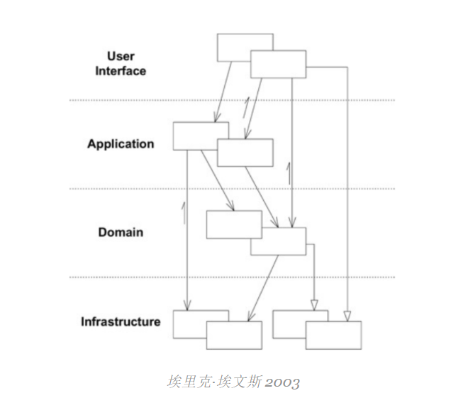

# 分层架构

分层是一种常见的做法，用于根据代码单元在系统中的角色/职责来分隔和组织代码单元。

> 在面向对象的程序中，UI、数据库和其他支持代码通常直接写入业务对象。其他业务逻辑嵌入在 UI 小部件和数据库脚本的行为中。发生这种情况是因为从短期来看，这是使事情发挥作用的最简单方法。
>
> 当与域相关的代码通过如此大量的其他代码扩散时，它变得非常难以看到和推理。对 UI 的表面更改实际上可以更改业务逻辑。若要更改业务规则，可能需要对 UI 代码、数据库代码或其他程序元素进行细致的跟踪。实现连贯的、模型驱动的对象变得不切实际。自动化测试很尴尬。由于每个活动都涉及所有技术和逻辑，因此程序必须保持非常简单，否则将无法理解。

---
## **分层**意味着什么

**在分层系统中，每一层：**

- 取决于它下面的层;
- 独立于其顶部的图层，不了解使用它的图层。

在分层架构中，层可以严格地使用，其中层只知道其正下方的层，或者以更灵活的方法使用，其中层可以访问其下的任何层。Martin Fowler和我自己的经验都告诉我，第二种情况在实践中似乎效果更好，因为它避免了在中间层中创建代理方法（甚至是完整的代理类），并且可以降级为Lasagna架构的反模式（下面将详细介绍）。

> 有时，图层的排列方式使得域图层在演示文稿中完全隐藏数据源。但是，更常见的情况是，演示文稿直接访问数据存储。虽然这不那么纯粹，但它在实践中往往效果更好。Fowler 2002，
> [企业应用程序体系结构的模式](https://www.amazon.com/dp/0321127420/ref=wl_it_dp_o_pC_nS_ttl?_encoding=UTF8&colid=CG11VVP0H8Y8&coliid=I1QPWUPW6G7YF5)

**其优点**是：

- 我们只需要了解我们正在处理的层下面的层;
- 每一层都可以用等效的实现替换，对其他层没有影响;
- 图层是标准化的最佳候选者;
- 一个层可以由几个不同的更高级别层使用。

**缺点**是：

- 图层不能封装所有内容（添加到UI的字段，很可能还需要添加到数据库中）;
- 额外的层可能会损害性能，尤其是在不同的层中。

## 60年代和70年代

尽管软件开发始于50年代，但在60年代和70年代，它实际上诞生了我们今天所知道的，作为构建应用程序的活动，这些应用程序可以由其他人交付，部署和使用，而不是开发人员自己。

然而，在这一点上，应用程序与今天截然不同。没有GUI（仅在90年代初，也许是80年代后期才出现），所有应用程序只能通过CLI使用，显示在一个哑终端中，该终端只会将用户键入的任何内容传输到应用程序，该应用程序很可能从同一台计算机使用。

应用程序非常简单，因此在构建时并未考虑分层，而是在一台计算机上部署和使用，使其成为**有效的单层**应用程序，尽管在某些时候，哑客户端甚至可能是远程的。虽然这些应用程序**非常简单**，但它们**不可扩展**，例如，如果我们需要将软件更新到新版本，则必须在安装该应用程序的每台计算机上执行此操作。

## **80年代和90年代的分层**

在 20 世纪 80 年代，企业应用程序开始栩栩如生，我们开始在一家公司中拥有多个使用台式计算机的用户，他们通过网络访问该应用程序。

此时，大多有三层：

- **用户界面（演示文稿）：**用户界面，无论是网页，CLI还是本机桌面应用程序;
  - 即：**本机Windows应用程序**作为客户端（富客户端），普通用户将在其台式计算机上使用，它将与服务器通信以实际实现目标。客户端将负责应用程序流和用户输入验证;
- **业务逻辑（域）：**作为应用程序存在的原因的逻辑;
  - 即：**一个应用程序服务器**，它将包含业务逻辑，并将接收来自本机客户端的请求，对它们进行操作并将数据保存到数据存储中;
- **数据源**：数据持久化机制（DB），或与其他应用程序的通信。
  - 即：**数据库服务器**，应用程序服务器将使用它来持久化数据。

随着可用性上下文的这种转变，分层开始成为一种实践，尽管它在1990年代（Fowler 2002）随着**客户端/服务器**系统的兴起才开始成为一种普遍的广泛实践。这实际上是一个**两层**应用程序，其中客户端将是用作应用程序接口的富客户端应用程序，服务器将具有业务逻辑和数据源。

此体系结构模式解决了**可伸缩性**问题，因为多个用户可以独立使用该应用程序，我们只需要另一台台式计算机，在其中安装客户端应用程序，仅此而已。但是，如果我们有几百个，甚至只有十分之几的客户端，并且我们想要更新应用程序，**那将是一个非常****复杂的**操作，因为我们必须逐个更新客户端。

## **90年代中期以后的分层**

大约在1995年到2005年之间，随着向云环境的普遍转变，应用程序用户，应用程序复杂性和基础架构复杂性的增加，我们最终看到了分层方案的演变，其中这种分层的典型实现可能是：

- 一个**原生浏览器应用程序**，渲染并运行用户界面，向服务器应用程序发送请求;
- **一个应用服务器**，包含表示层、应用层、域层和持久层;
- 一个**数据库服务器**，应用程序服务器将使用它来持久保存数据。

这是一种**三层**体系结构模式，也称为 n**层**。它是一种**可扩展**的解决方案，解决了在用户界面处于服务器上并编译时**更新客户端的问题**，尽管它是在客户端浏览器上呈现和运行的。

## **2000年代初之后的分层**

2003年，Eric Evans出版了他的标志性著作《[领域驱动设计：在软件的核心中解决复杂性》。](https://www.amazon.com/dp/0321125215/ref=wl_it_dp_o_pC_nS_ttl?_encoding=UTF8&colid=CG11VVP0H8Y8&coliid=I1X0NXLUHTFGE4)在那本书中发表的许多关键概念中，还有一个关于软件系统分层的愿景：

- #### 用户界面

  负责绘制用户用于与应用程序交互的屏幕，并将用户的输入转换为应用程序命令。重要的是要注意，"用户"可以是人类，但也可以是其他应用程序，这完全对应于Ivar Jacobson在EBI架构中的边界对象（在后面的文章中会详细介绍）;

- #### 应用层

  编排域对象以执行用户所需的任务。它不包含业务逻辑。这与Ivar Jacobson的EBIArchitecture中的交互器有关，除了Jacobson的交互器是任何与UI或实体无关的对象;

- #### 域层

  这是包含所有业务逻辑、实体、事件和包含业务逻辑的任何其他对象类型的层。它显然与 EBI 的实体对象类型有关。这是系统的核心;

- #### 基础设施

  支持上述层的技术功能，即。持久性或消息传递。

## **千层面架构**

*Lasagna Architecture*是通常用于指代**分层架构的反模式**的名称。它发生在以下情况：

- 我们决定使用**严格的分层方法**，其中一层只知道它下面的层。在这种情况下，**我们最终将创建代理方法，甚至是代理类**，这样我们就可以浏览中间层，而不是直接使用我们需要的层;
- 我们带领项目过度**抽象，**急于创建完美的系统;
- 小**的更新在应用程序的所有领域都有反响**，例如，整理单个层可能是一项具有巨大风险和小回报的大型任务。
- 我们最终得到**太多的层**，这增加了整个系统的复杂性;
- 我们最终会得到**太多的层**，这既增加了复杂性，又损害了整个系统的性能;
- 我们**根据其层**（即UI，Domain，DB），而不是按其子域/组件（即。产品，付款，结帐），破坏域概念的模块化和封装。

## **结论**

分层体系结构是另一种提供关注点分离、封装和解耦的方法，方法是按代码单元在应用程序中的功能角色对代码单元进行分组。

然而，就像生活中的大多数事情一样，太多会适得其反！因此，经验法则是：**只使用我们需要的图层，我们需要的层，**仅此而已！我们决不能被追逐一个不存在的建筑圣杯冲昏头脑。确实存在的是一种需求，并且最能满足这种需求。这是**精益**的一部分，顺便说一句。

此外，重要的是要注意，这种自上而下分层的方法已经过时了。这不再是我们在现代软件开发中应该做的事情，有新的更好的方法来思考应用层。我将在下面的帖子中讨论。