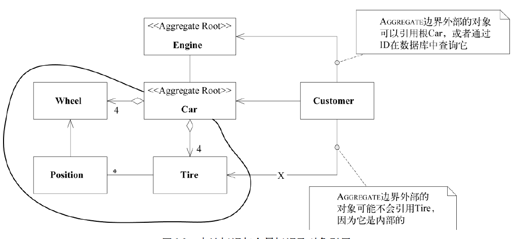
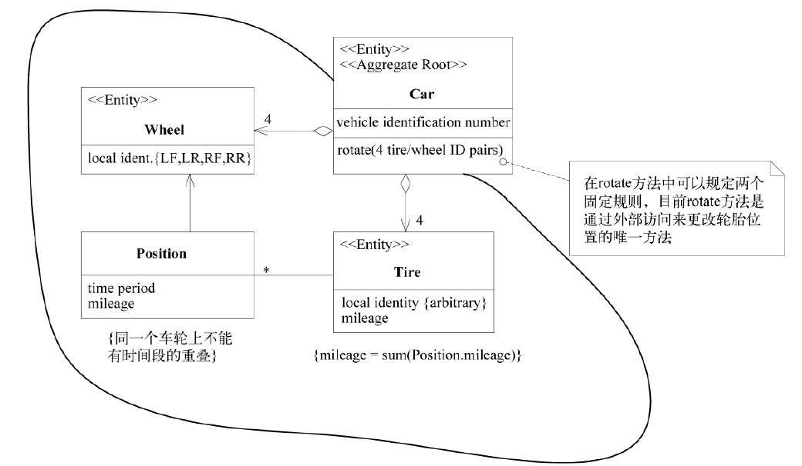

# Aggregate 

在具有复杂关联的模型中，要想保证对象更改的一致性是很困难的。不仅互不关联的对象需要遵守一些固定规则，而且紧密关联的各组对象也要遵守一些固定规则。然而，过于谨慎的锁定机制又会导致多个用户之间毫无意义地互相干扰，从而使系统不可用。

换句话说，我们如何知道一个由其他对象组成的对象从哪里开始，又到何处结束呢？在任何具有持久化数据存储的系统中，对数据进行修改的事务必须要有范围，而且要有保持数据一致性的方式（也就是说，保持数据遵守固定规则）。数据库支持各种锁机制，而且可以编写一些测试来验证。但这些特殊的解决方案分散了人们对模型的注意力，很快人们就会回到“走一步，看一步”的老路上来。

首先，我们需要用一个抽象来封装模型中的引用。AGGREGATE就是一组相关对象的集合，我们把它作为数据修改的单元。每个AGGREGATE都有一个根（root）和一个边界（boundary）。边界定义了AGGREGATE的内部都有什么。根则是AGGREGATE所包含的一个特定ENTITY。对AGGREGATE而言，外部对象只可以引用根，而边界内部的对象之间则可以互相引用。除根以外的其他ENTITY都有本地标识，但这些标识只在AGGREGATE内部才需要加以区别，因为外部对象除了根ENTITY之外看不到其他对象。

汽车修配厂的软件可能会使用汽车模型。如图所示。汽车是一个具有全局标识的ENTITY：我们需要将这部汽车与世界上所有其他汽车区分开（即使是一些非常相似的汽车）。我们可以使用车辆识别号来进行区分，车辆识别号是为每辆新汽车分配的唯一标识符。我们可能想通过4个轮子的位臵跟踪轮胎的转动历史。我们可能想知道每个轮胎的里程数和磨损度。要想知道哪个轮胎在哪儿，必须将轮胎标识为ENTITY。当脱离这辆车的上下文后，我们很可能就不再关心这些轮胎的标识了。如果更换了轮胎并将旧轮胎送到回收厂，那么软件将不再需要跟踪它们，它们会成为一堆废旧轮胎中的一部分。没有人会关心它们的转动历史。更重要的是，即使轮胎被安在汽车上，也不会有人通过系统查询特定的轮胎，然后看看这个轮胎在哪辆汽车上。人们只会在数据库中查找汽车，然后临时查看一下这部汽车的轮胎情况。因此，汽车是AGGREGATE的根ENTITY，而轮胎处于这个AGGREGATE的边界之内。另一方面，发动机组上面都刻有序列号，而且有时是独立于汽车被跟踪的。在一些应用程序中，发动机可以是自己的AGGREGATE的根。

固定规则（invariant）是指在数据变化时必须保持的一致性规则，其涉及AGGREGATE成员之间的内部关系。而任何跨越AGGREGATE的规则将不要求每时每刻都保持最新状态。通过事件处理、批处理或其他更新机制，这些依赖会在一定的时间内得以解决。但在每个事务完成时，AGGREGATE内部所应用的固定规则必须得到满足，如图所示。

现在，为了实现这个概念上的AGGREGATE，需要对所有事务应用一组规则。

- 根ENTITY具有全局标识，它最终负责检查固定规则。
- 根ENTITY具有全局标识。边界内的ENTITY具有本地标识，这些标识只在AGGREGATE内部才是唯一的。
- AGGREGATE外部的对象不能引用除根ENTITY之外的任何内部对象。根ENTITY可以把对内部ENTITY的引用传递给它们，但这些对象只能临时使用这些引用，而不能保持引用。根可以把一个VALUE OBJECT的副本传递给另一个对象，而不必关心它发生什么变化，因为它只是一个VALUE，不再与AGGREGATE有任何关联。
- 作为上一条规则的推论，只有AGGREGATE的根才能直接通过数据库查询获取。所有其他
  对象必须通过遍历关联来发现。

- AGGREGATE内部的对象可以保持对其他AGGREGATE根的引用。
- 删除操作必须一次删除AGGREGATE边界之内的所有对象。（利用垃圾收集机制，这很容易做到。由于除根以外的其他对象都没有外部引用，因此删除了根以后，其他对象均会被回收。）
- 当提交对AGGREGATE边界内部的任何对象的修改时，整个AGGREGATE的所有固定规则都必
  须被满足。

我们应该将ENTITY 和VALUE OBJECT 分门别类地聚集到AGGREGATE 中， 并定义每个AGGREGATE的边界。在每个AGGREGATE中，选择一个ENTITY作为根，并通过根来控制对边界内其他对象的所有访问。只允许外部对象保持对根的引用。对内部成员的临时引用可以被传递出去，但仅在一次操作中有效。由于根控制访问，因此不能绕过它来修改内部对象。这种设计有利于确保AGGREGATE中的对象满足所有固定规则，也可以确保在任何状态变化时AGGREGATE作为一个整体满足固定规则。
有一个能够声明AGGREGATE的技术框架是很有帮助的，这样就可以自动实施锁机制和其他一些功能。如果没有这样的技术框架，团队就必须靠自我约束来使用事先商定的AGGREGATE，并按照这些AGGREGATE来编写代码。

