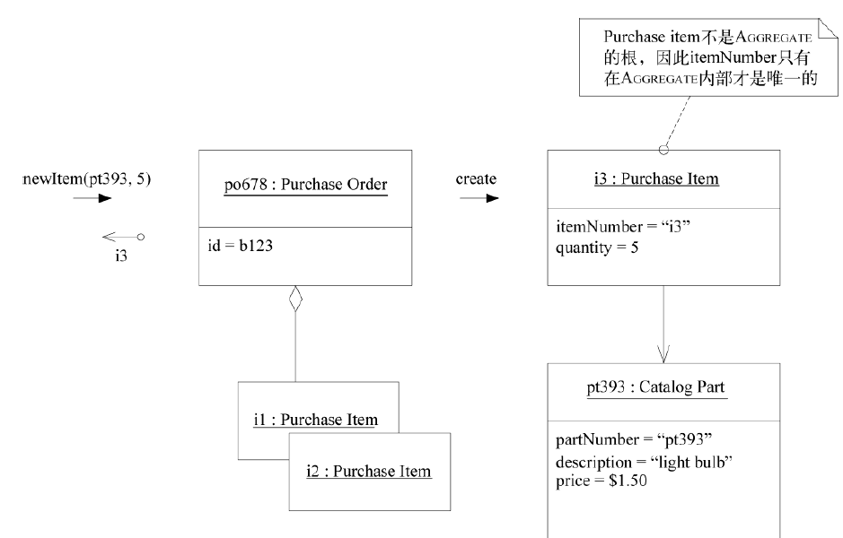

# Factory

当创建一个对象或创建整个AGGREGATE时，如果创建工作很复杂，或者暴露了过多的内部结构，则可以使用FACTORY进行封装。

FACTORY有很多种设计方式。[Gamma et al. 1995]中详尽论述了几种特定目的的创建模式，包括FACTORY METHOD（工厂方法）、ABSTRACT FACTORY（抽象工厂）和BUILDER（构建器）。该书主要研究了适用于最复杂的对象构造问题的模式。本书的重点并不是深入讨论FACTORY的设计问题，而是要表明FACTORY的重要地位——它是领域设计的重要组件。正确使用FACTORY有助于保证MODEL-DRIVEN DESIGN沿正确的轨道前进。
任何好的工厂都需满足以下两个基本需求。

(1) 每个创建方法都是原子的，而且要保证被创建对象或AGGREGATE的所有固定规则。FACTORY生成的对象要处于一致的状态。在生成ENTITY时，这意味着创建满足所有固定规则的整个AGGREGATE，但在创建完成后可以向聚合添加可选元素。在创建不变的VALUE OBJECT时，这意味着所有属性必须被初始化为正确的最终状态。如果FACTORY通过其接口收到了一个创建对象的请求，而它又无法正确地创建出这个对象，那么它应该抛出一个异常，或者采用其他机制，以确保不会返回错误的值。

(2) FACTORY应该被抽象为所需的类型，而不是所要创建的具体类。[Gamma et al. 1995]中的高级FACTORY模式介绍了这一话题。

### 选择FACTORY及其应用位置

一般来说，FACTORY的作用是隐藏创建对象的细节，而且我们把FACTORY用在那些需要隐藏细节的地方。这些决定通常与AGGREGATE有关。
例如，如果需要向一个已存在的AGGREGATE添加元素，可以在AGGREGATE的根上创建一个FACTORY ETHOD。这样就可以把AGGREGATE的内部实现细节隐藏起来，使任何外部客户看不到这些细节，同时使根负责确保AGGREGATE在添加元素时的完整性，如图6-13所示。
另一个示例是在一个对象上使用FACTORY METHOD，这个对象与生成另一个对象密切相关，但它并不拥有所生成的对象。当一个对象的创建主要使用另一个对象的数据（或许还有规则）时，则可以在后者的对象上创建一个FACTORY METHOD，这样就不必将后者的信息提取到其他地方来创建前者。这样做还有利于表达前者与后者之间的关系。

FACTORY与被构建对象之间是紧密耦合的，因此FACTORY应该只被关联到与被构建对象有着密切联系的对象上。当有些细节需要隐藏（无论要隐藏的是具体实现还是构造的复杂性）而又找不到合适的地方来隐藏它们时，必须创建一个专用的FACTORY对象或SERVICE。整个AGGREGATE通常由一个独立的FACTORY来创建，FACTORY负责把对根的引用传递出去，并确保创建出的AGGREGATE满足固定规则。如果AGGREGATE内部的某个对象需要一个FACTORY，而这个FACTORY又不适合在AGGREGATE根上创建，那么应该构建一个独立的FACTORY。但仍应遵守规则——把访问限制在AGGREGATE内部，并确保从AGGREGATE外部只能对被构建对象进行临时引用.

---

### 接口的设计

当设计FACTORY的方法签名时，无论是独立的FACTORY还是FACTORY METHOD，都要记住以下两点。

- 每个操作都必须是原子的。我们必须在与FACTORY的一次交互中把创建对象所需的所有信息传递给FACTORY。同时必须确定当创建失败时将执行什么操作，比如某些固定规则没有被满足。可以抛出一个异常或仅仅返回null。为了保持一致，可以考虑采用编码标准来处理所有FACTORY的失败。
- Factory将与其参数发生耦合。如果在选择输入参数时不小心，可能会产生错综复杂的依赖关系。耦合程度取决于对参数（argument）的处理。如果只是简单地将参数插入到要构建的对象中，则依赖度是适中的。如果从参数中选出一部分在构造对象时使用，耦合将更紧密。最安全的参数是那些来自较低设计层的参数。即使在同一层中，也有一种自然的分层倾向，其中更基本的对象被更高层的对象使用。

FACTORY负责确保它所创建的对象或AGGREGATE满足所有固定规则，然而在把应用于一个对象的规则移到该对象外部之前应三思。FACTORY可以将固定规则的检查工作委派给被创建对象，而且这通常是最佳选择。

但FACTORY与被创建对象之间存在一种特殊关系。FACTORY已经知道被创建对象的内部结构，而且创建FACTORY的目的与被创建对象的实现有着密切的联系。在某些情况下，把固定规则的相关逻辑放到FACTORY中是有好处的，这样可以让被创建对象的职责更明晰。对于AGGREGATE规则来说尤其如此（这些规则会约束很多对象）。但固定规则的相关逻辑却特别不适合放到那些与其他领域对象关联的FACTORY METHOD中。

虽然原则上在每个操作结束时都应该应用固定规则，但通常对象所允许的转换可能永远也不会用到这些规则。可能ENTITY标识属性的赋值需要满足一条固定规则。但该标识在创建后可能一直保持不变。VALUE OBJECT则是完全不变的。如果逻辑在对象的有效生命周期内永远也不被用到，那么对象就没有必要携带这个逻辑。在这种情况下，FACTORY是放臵固定规则的合适地方，这样可以使FACTORY创建出的对象更简单。

