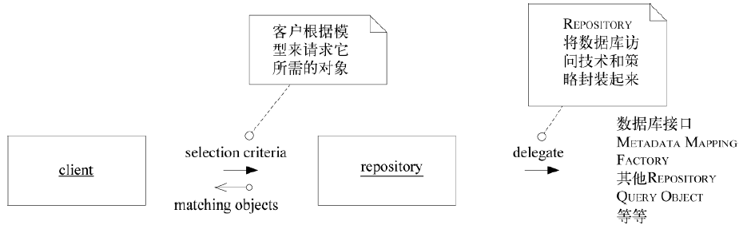
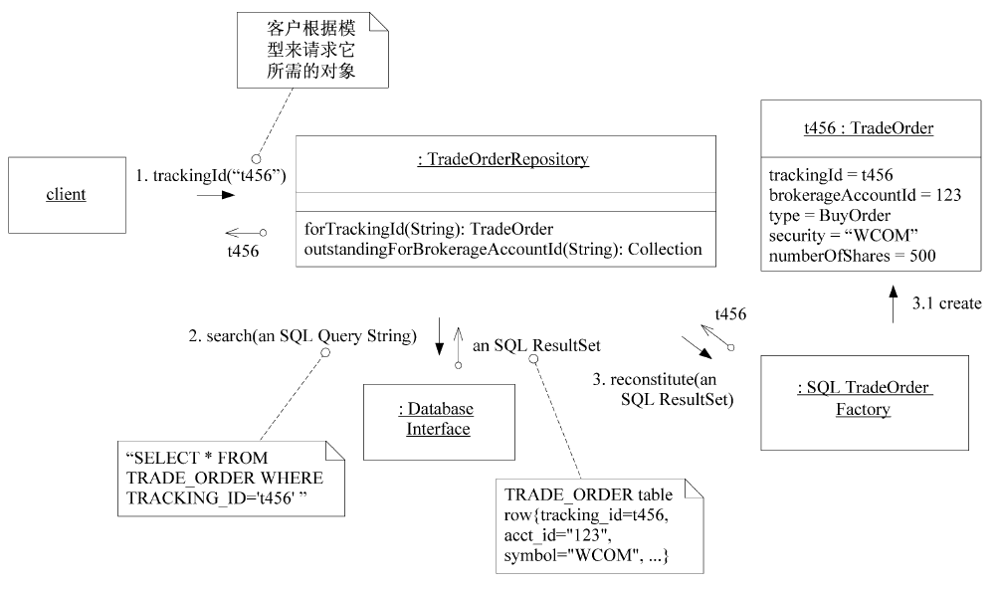

# REPOSITORY

REPOSITORY将某种类型的所有对象表示为一个概念集合（通常是模拟的）。它的行为类似于集合（collection），只是具有更复杂的查询功能。在添加或删除相应类型的对象时，REPOSITORY的后台机制负责将对象添加到数据库中，或从数据库中删除对象。这个定义将一组紧密相关的职责集中在一起，这些职责提供了对AGGREGATE根的整个生命周期的全程访问。

客户使用查询方法向REPOSITORY请求对象，这些查询方法根据客户所指定的条件（通常是特定属性的值）来挑选对象。REPOSITORY检索被请求的对象，并封装数据库查询和元数据映射机制。REPOSITORY可以根据客户所要求的各种条件来挑选对象。它们也可以返回汇总信息，如有多少个实例满足查询条件。REPOSITORY甚至能返回汇总计算，如所有匹配对象的某个数值属性的总和。

并根据模型向这个接口提出它的请求。要实现所有这些功能需要大量复杂的技术基础设施，但接口很简单，而且在概念层次上与领域模型紧密联系在一起。
因此：
为每种需要全局访问的对象类型创建一个对象，这个对象相当于该类型的所有对象在内存中的一个集合的“替身”。通过一个众所周知的全局接口来提供访问。提供添加和删除对象的方法，用这些方法来封装在数据存储中实际插入或删除数据的操作。提供根据具体条件来挑选对象的方法，并返回属性值满足查询条件的对象或对象集合（所返回的对象是完全实例化的），从而将实际的存储和查询技术封装起来。只为那些确实需要直接访问的AGGREGATE根提供REPOSITORY。让客户始终聚焦于模型，而将所有对象的存储和访问操作交给REPOSITORY来完成。

**REPOSITORY有很多优点，包括**：

- 它们为客户提供了一个简单的模型，可用来获取持久化对象并管理它们的生命周期；
- 它们使应用程序和领域设计与持久化技术（多种数据库策略甚至是多个数据源）解耦；
- 它们体现了有关对象访问的设计决策；
- 可以很容易将它们替换为“哑实现”（dummy implementation），以便在测试中使用（通常
  使用内存中的集合）。

---

### REPOSITORY的实现

​		根据所使用的持久化技术和基础设施不同，REPOSITORY的实现也将有很大的变化。理想的实现是向客户隐藏所有内部工作细节（尽管不向客户的开发人员隐藏这些细节），这样不管数据是存储在对象数据库中，还是存储在关系数据库中，或是简单地保持在内存中，客户代码都相同。REPOSITORY将会委托相应的基础设施服务来完成工作。将存储、检索和查询机制封装起来是REPOSITORY实现的最基本的特性

REPOSITORY概念在很多情况下都适用。可能的实现方法有很多，这里只能列出如下一些需要谨记的注意事项。

- 对类型进行抽象。REPOSITORY“含有”特定类型的所有实例，但这并不意味着每个类都需要有一个REPOSITORY。类型可以是一个层次结构中的抽象超类（例如，TradeOrder可以是BuyOrder或SellOrder）。类型可以是一个接口——接口的实现者并没有层次结构上的关联，也可以是一个具体类。记住，由于数据库技术缺乏这样的多态性质，因此我们将面临很多约束。
- 充分利用与客户解耦的优点。我们可以很容易地更改REPOSITORY的实现，但如果客户直接调用底层机制，我们就很难修改其实现。也可以利用解耦来优化性能，因为这样就可以使用不同的查询技术，或在内存中缓存对象，可以随时自由地切换持久化策略。通过提供一个易于操纵的、内存中的（in-memory）哑实现，还能够方便客户代码和领域对象的测试。
- 将事务的控制权留给客户。尽管REPOSITORY会执行数据库的插入和删除操作，但它通常不会提交事务。例如，保存数据后紧接着就提交似乎是很自然的事情，但想必只有客户才有上下文，从而能够正确地初始化和提交工作单元。如果REPOSITORY不插手事务控制，那么事务管理就会简单得多。

通常，项目团队会在基础设施层中添加框架，用来支持REPOSITORY的实现。REPOSITORY超类除了与较低层的基础设施组件进行协作以外，还可以实现一些基本查询，特别是要实现的灵活查询时。遗憾的是，对于类似Java这样的类型系统，这种方法会使返回的对象只能是Object类型，而让客户将它们转换为REPOSITORY含有的类型。当然，如果在Java中查询所返回的对象是集合时，客户不管怎样都要执行这样的转换。有关实现REPOSITORY的更多指导和一些支持性技术模式（如QUERY OBJECT）可以在［Fowler2002］一书中找到。

