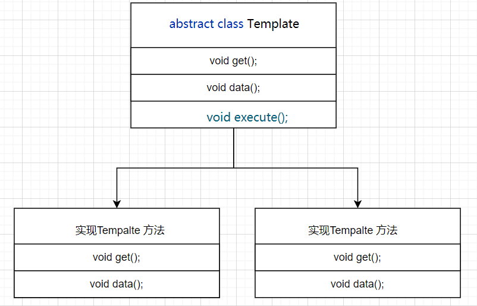

## 模板模式

### 定义

定义一个操作中的算法骨架，而将算法的一些步骤延迟到子类中，使得子类可以不改变该算法结构的情况下重定义该算法的某些特定步骤。它是一种类行为型模式。

### 类图



说明

- 模板方法是一个抽象的类，里面可以包含多个抽象的方法，供子类实现，还必须包含一个钩子方法

- 钩子方法提供统一的模板，子类只需要调用即可，就会按照规定好的操作流程进行执行；不建议子类修改钩子方法

### 代码实现

- 定义模板方法

  ```java
  public abstract class TomcatTemplate {
  
      /**
       * 设置端口
       * @param port
       */
      abstract void port(int port);
  
      /**
       * 设置超时时间
       * @param time
       */
      abstract void  connectionTimeout(Integer time);
  
      /**
       * 设置访问路径
       * @param path
       */
      abstract void  contextPath(String path);
  
      //...........
  
      public void run(int port,Integer time,String path){
          port(port);
          connectionTimeout(time);
          contextPath(path);
          System.out.println("Tomcat Run");
      }
  }
  ```

- 模板的具体执行类

  ```java
  public class TomcatRun extends TomcatTemplate{
      @Override
      void port(int port) {
          System.out.println("Tomcat port is "+port);
      }
  
      @Override
      void connectionTimeout(Integer time) {
          System.out.println("Tomcat connectionTimeout is "+time);
      }
  
      @Override
      void contextPath(String path) {
          System.out.println("Tomcat contextPath is "+path);
      }
  }
  ```

- 测试类

  ```java
  public class TemplatePatternTest {
      public static void main(String[] args) {
          TomcatTemplate tomcat = new TomcatRun();
          tomcat.run(8080,200,"/api/");
      }
  }
  ```

- 结果输出

  ```
  Tomcat port is 8080
  Tomcat connectionTimeout is 200
  Tomcat contextPath is /api/
  Tomcat Run
  ```
### 总结

- 模板方法还是很简单的，但是一定要写钩子方法，子类最好不要重写父类的钩子方法
- 我们只需要处理自己的业务即可，最终的处理交给钩子方法

模板方法在现实的应用场景还是应用的很多的，如去银行办理业务，我们可以根据业务进行场景总结，
看是否可以通过模板的方式进行实现，当然切记不要过度设计

  


  