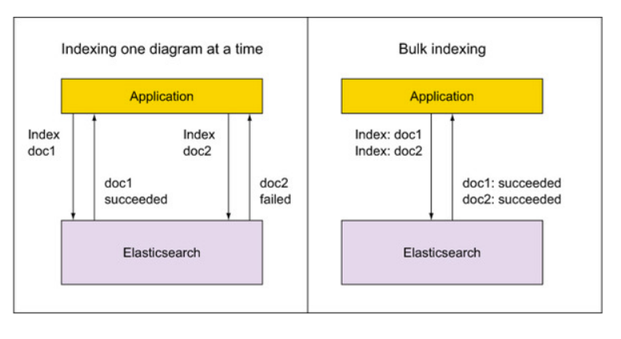

# 批量索引更新和删除

> 到目前为止，您已经一次索引了一个文档。这对于玩乐来说很好，但它意味着至少从两个方向的性能损失：
>
> - 您的应用程序必须等待 Elasticsearch 的回复，然后才能继续。
> - Elasticsearch 必须处理来自每个索引文档的请求中的所有数据。
>
> 如果您需要更高的索引速度，Elasticsearch 提供了一个批量 API，您可以使用它一次为多个文档编制索引



如图所示，您可以使用 HTTP 执行此操作，因为到目前为止，您已经用于为文档编制索引，并且您将获得包含所有索引请求结果的回复

## 批量查询

### mget

> 在之前我们的查询都是单条查询，如果查询多条就需要进行多次的IO，这样的效率不高，这时我们可以通过mget来进行批量查询，如下

```json
# 查询 index为megacorp id为 1，2的数据
GET /_mget
{
  "docs": [
    {
      "_index": "megacorp",
      "_id": "1"
    },
    {
      "_index": "megacorp",
      "_id": "2",
      "_source" :[ 
        "first_name" ,
        "last_name"  
      ]
    }
  ]
}

```

这是我们就可以同时查询不通的索引的数据，并且通过`_source`可以指定需要返回的字段

如果查询的时同一个索引，我们还可以进行优化，如下

```json
GET /megacorp/_mget
{
  "ids": [
    1,
    2
  ]
}
```

可以说mget是很重要的，一般来说，在进行查询的时候，如果一次性要查询多条数据的话，那么一定要用batch批量操作的api
尽可能减少网络开销次数，可能可以将性能提升数倍，甚至数十倍，非常非常之重要

### msearch

多搜索 API 从单个 API 请求执行多个搜索。请求的格式类似于批量 API 格式，并使用换行符分隔的 JSON (NDJSON) 格式。

结构如下：

```
header\n
body\n
header\n
body\n
```

- header用于指定index、type、search_type、preference、routing等内容，告诉ElasticSearch下一个body的查询位置。

  {"index":"<indexName>","type":"<typeName>"}
  若所有header的index相同，或index及type都相同，可通过URL指定全局index或type。

  这样，在header中就可以不再设置index或type内容。

  但请注意，header部分不可省略，需要用{}\n占位。

  否则，ElasticSearch将会把下一个body当成header处理，从而导致整个批量查询都解析错位。

- body用于指定具体的查询内容，其格式请参考_search查询格式。

```json
GET /_msearch
{"index":"megacorp"}
{"query":{"match":{"about":"I love"}}}
{"index":"megacorp"}
{"aggs":{"all_interests":{"terms":{"field": "interests.keyword"}}}}
```

如果是同一个索引可以简写成如下

```json
GET /megacorp/_msearch
{}
{"query":{"match":{"about":"I love"}}}
{}
{"aggs":{"all_interests":{"terms":{"field": "interests.keyword"}}}}
```

返回的数据是一个数组，数组中的每一个元素依次对应一个查询（body）。

```xml
{
    "responses":[<body1Response>,<body2Response>, ...]
}
```

某个查询失败将在对应的返回信息中显示错误信息，不会影响其它查询结果。

##  批量增删改

### bulk

有哪些类型的操作可以执行呢？

1. delete：删除一个文档，只要1个json串就可以了
2. create：PUT /index/type/id/_create，强制创建
3. index：普通的put操作，可以是创建文档，也可以是全量替换文档
4. update：执行的partial update操作

bulk api对json的语法，有严格的要求，每个json串不能换行，只能放一行，同时一个json串和一个json串之间，必须有一个换行

```json
POST _bulk
{"delete":{"_index":"megacorp","_id":30}}
{"create":{"_index":"megacorp","_id":5}}
{"first_name":"John","last_name":"Smith","age":25,"about":"I love to go rock climbing","interests":["sports","music"]}
{"create":{"_index":"megacorp","_id":6}}
{"first_name":"John","last_name":"Smith","age":25,"about":"I love to go rock climbing","interests":["sports","music"]}
{"index":{"_index":"megacorp","_id":7}}
{"first_name":"John","last_name":"Smith","age":25,"about":"I love to go rock climbing","interests":["sports","music"]}
{"index":{"_index":"megacorp","_id":8}}
{"first_name":"John","last_name":"Smith","age":25,"about":"I love to go rock climbing","interests":["sports","music"]}
{"update":{"_index":"megacorp","_id":1}}
{"doc":{"age":55}}

```

**bulk操作中，任意一个操作失败，是不会影响其他的操作的**，但是在返回结果里，会告诉你异常日志

```json
{
  "took" : 30,
  "errors" : true,
  "items" : [
    {
      "delete" : {
        "_index" : "megacorp",
        "_type" : "_doc",
        "_id" : "30",
        "_version" : 2,
        "result" : "not_found",
        "_shards" : {
          "total" : 2,
          "successful" : 1,
          "failed" : 0
        },
        "_seq_no" : 18,
        "_primary_term" : 1,
        "status" : 404
      }
    },
    {
      "create" : {
        "_index" : "megacorp",
        "_type" : "_doc",
        "_id" : "5",
        "status" : 409,
        "error" : {
          "type" : "version_conflict_engine_exception",
          "reason" : "[5]: version conflict, document already exists (current version [3])",
          "index_uuid" : "HJSUaB6lSWKLKfY0treFXg",
          "shard" : "0",
          "index" : "megacorp"
        }
      }
    },
    {
      "create" : {
        "_index" : "megacorp",
        "_type" : "_doc",
        "_id" : "6",
        "status" : 409,
        "error" : {
          "type" : "version_conflict_engine_exception",
          "reason" : "[6]: version conflict, document already exists (current version [3])",
          "index_uuid" : "HJSUaB6lSWKLKfY0treFXg",
          "shard" : "0",
          "index" : "megacorp"
        }
      }
    },
    {
      "index" : {
        "_index" : "megacorp",
        "_type" : "_doc",
        "_id" : "7",
        "_version" : 4,
        "result" : "updated",
        "_shards" : {
          "total" : 2,
          "successful" : 1,
          "failed" : 0
        },
        "_seq_no" : 19,
        "_primary_term" : 1,
        "status" : 200
      }
    },
    {
      "index" : {
        "_index" : "megacorp",
        "_type" : "_doc",
        "_id" : "8",
        "_version" : 4,
        "result" : "updated",
        "_shards" : {
          "total" : 2,
          "successful" : 1,
          "failed" : 0
        },
        "_seq_no" : 20,
        "_primary_term" : 1,
        "status" : 200
      }
    },
    {
      "update" : {
        "_index" : "megacorp",
        "_type" : "_doc",
        "_id" : "1",
        "_version" : 2,
        "result" : "noop",
        "_shards" : {
          "total" : 2,
          "successful" : 1,
          "failed" : 0
        },
        "_seq_no" : 8,
        "_primary_term" : 1,
        "status" : 200
      }
    }
  ]
}

```

如果只是操作同一个索引可以想mget一样指定索引

```
POST /megacorp/_bulk
{"delete":{"_id":30}}
{"delete":{"_id":31}}
{"delete":{"_id":32}}
```

**bulk size最佳大小：** bulk request会加载到内存里，如果太大的话，性能反而会下降，因此需要反复尝试一个最佳的bulk size。一般从1000~5000条数据开始，尝试逐渐增加。另外，如果看大小的话，最好是在5~15MB之间。