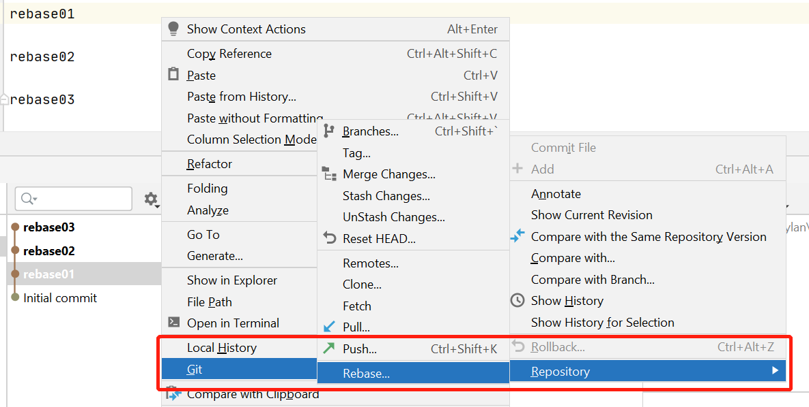
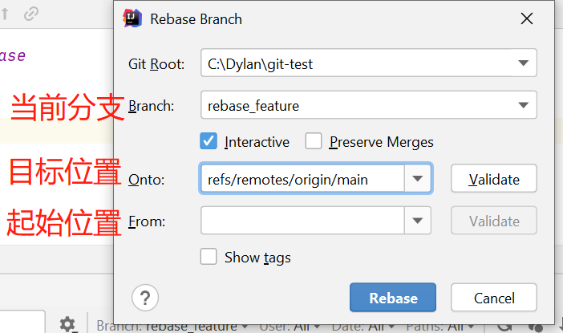
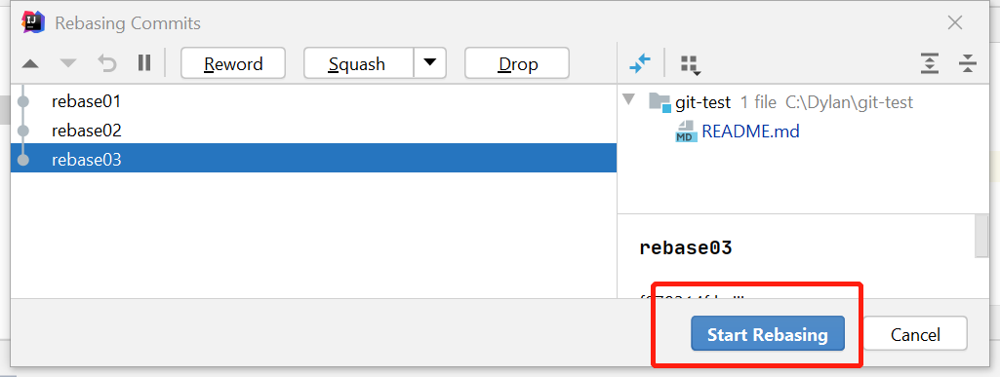
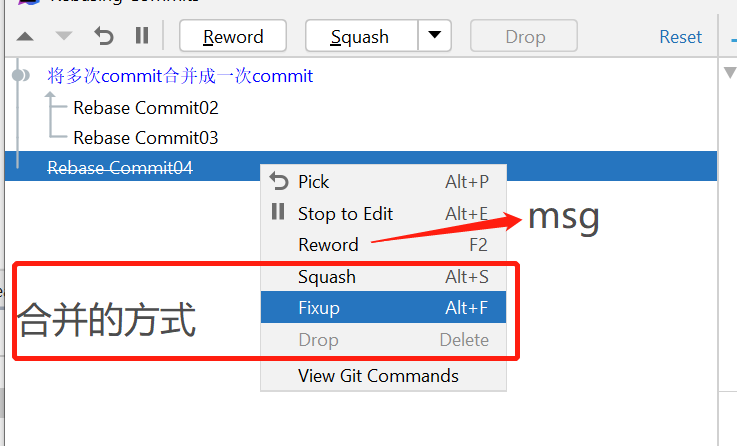
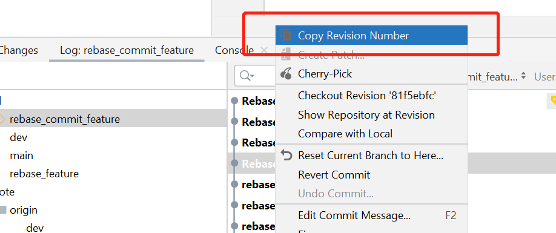
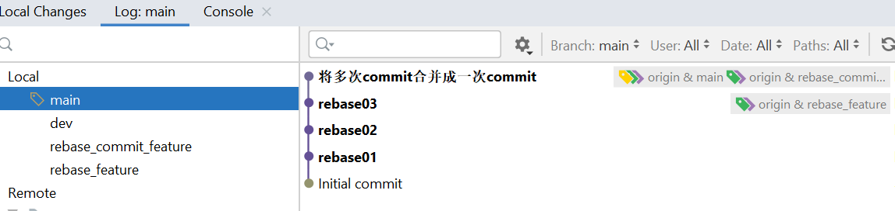

## IDEA Git Rebase 实战操作

在上一篇中我们讲解了[`git rebase` 命令以及流程分析](Rebase.md) ,但是在现实工作中很多小伙伴还是喜欢使用工具进行操作的，
接下来我们以IDEA 工具进行实战操作

- 首先我们在 github上创建一个仓库 [https://github.com/yanghaiji/git-test](https://github.com/yanghaiji/git-test)
- clone 到本地 `git clone https://github.com/yanghaiji/git-test.git`
- 创建分支 
    - dev
    - rebase_feature
    - rebase_commit_feature
注: 
- dev 分支将保留所有的操作采用merge的方式
- rebase_feature 演示rebase的用法，保留所有提交记录
- rebase_commit_feature 演示rebase的用法，将原有的提交记录合并成一个

### rebase_feature 演示

- 首先我们切换到`rebase_feature`分支，进行几次commit
- 使用git rebase进行操作
    
    
    
- `git rebase` 结束后我们切回到master 分支，执行git merge

### rebase_feature 演示

- 首先我们切换到`rebase_feature_commit`分支，进行几次commit
- 使用git rebase进行操作
    前两步的操作一样
    
    
    主要区别在于不是直接执行rebase，而是首先将commit进行压缩
    
    这里也可以选择行和进行
    
- `git rebase` 结束后我们切回到master 分支，执行git merge

细心的朋友可以看出在进行压缩的时候我将commit04进行了删除，在master最终的代码也不会出现commit04的提交

### 最终的效果
- rebase
    
- merge    
    

