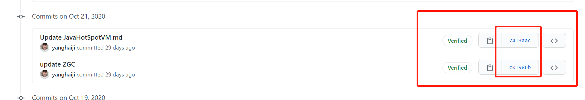
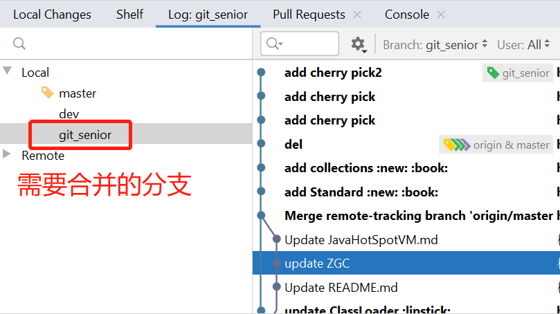
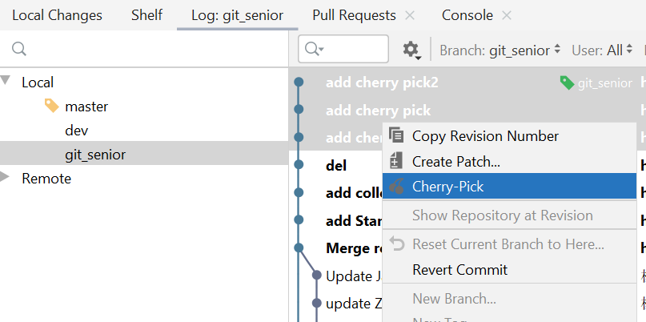

## Git 高级操作

### Chery-pick

- 什么情况下会使用到 cherry-pick

对于多分支的代码库，将代码从一个分支转移到另一个分支是常见需求。

这时分两种情况:
一种情况是，你需要另一个分支的所有代码变动，那么就采用合并（git merge）。
另一种情况是，你只需要部分代码变动（某几个提交），这时可以采用 Cherry pick

- 使用

```
 git cherry-pick <commitHash>
```

这里的commitHash值得是提交的commit id 



- 举例
举例来说，代码仓库有master和feature两个分支。
```play    
    a - b - c - d   Master
         \
           e - f - g Feature
```

现在将提交f应用到master分支。
```play
# 切换到 master 分支
$ git checkout master

# Cherry pick 操作
$ git cherry-pick f
```
合并完之后的效果

```java
    a - b - c - d - f   Master
         \
           e - f - g Feature
```

当然git cherry pick 也支持同时合并多个提交

> git cherry-pick <commitHash> <commitHash>

由于大家开发使用的都是工具，这里以小编使用的IDEA 为例进行操作
首先还是进行git check out 

这次我们将 `git_senior` 分支 的三次提交合并到 `master`分支





