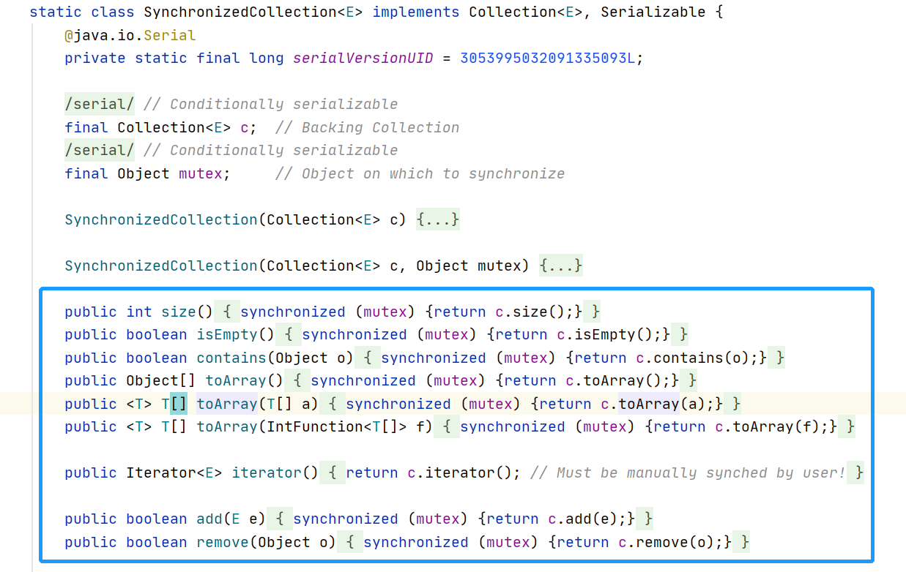

## Collections 

### 简介
此类仅由静态方法组合或返回集合。 它包含对集合进行操作的多态算法，“包装器”，返回由指定集合支持的新集合，以及其他一些可能的和最终的。 
如果提供给它们的集合或类对象为null，则此类的方法都抛出一个NullPointerException 。 

该类中包含的多态算法的文档通常包括实现的简要说明 。 这些描述应被视为实施说明 ，而不是说明书的一部分 。
 只要规范本身得到遵守，实现者就可以随意替代其他算法。 （例如，sort使用的算法不一定是一个mergeesort，但它必须是稳定的 。） 

如果集合不支持适当的突变原语，例如set方法，则该类中包含的“破坏性”算法，
即修改其操作的集合的算法被指定为抛出UnsupportedOperationException 。
 如果调用对集合没有影响，这些算法可能但不是必须抛出此异常。 
 例如，在已经排序的不可修改列表上调用sort方法可以抛出UnsupportedOperationException 。 

### 方法介绍

| Modifier and Type      | Method and Description                                       |
| ---------------------- | ------------------------------------------------------------ |
| `static  boolean`      | `addAll(Collection c,  T... elements)`  将所有指定的元素添加到指定的集合。 |
| `static  Queue`        | `asLifoQueue(Deque deque)`  返回[`Deque`]作为先进先出（ [Lifo]） `Queue`的视图 。 |
| `static  int`          | `binarySearch(List> list,  T key)`  使用二叉搜索算法搜索指定对象的指定列表。 |
| `static  int`          | `binarySearch(List list, T key, Comparator c)`  使用二叉搜索算法搜索指定对象的指定列表。 |
| `static  Collection`   | `checkedCollection(Collection c, 类 type)`  返回指定集合的动态类型安全视图。 |
| `static  List`         | `checkedList(List list, 类 type)`  返回指定列表的动态类型安全视图。 |
| `static  Map`          | `checkedMap(Map m, 类 keyType, 类 valueType)`  返回指定地图的动态类型安全视图。 |
| `static  NavigableMap` | `checkedNavigableMap(NavigableMap m, 类 keyType, 类 valueType)`  返回指定可导航地图的动态类型安全视图。 |
| `static  NavigableSet` | `checkedNavigableSet(NavigableSet s, 类 type)`  返回指定的可导航集的动态类型安全视图。 |
| `static  Queue`        | `checkedQueue(Queue queue, 类 type)`  返回指定队列的动态类型安全视图。 |
| `static  Set`          | `checkedSet(Set s, 类 type)`  返回指定集合的动态类型安全视图。 |
| `static  SortedMap`    | `checkedSortedMap(SortedMap m, 类 keyType, 类 valueType)`  返回指定排序映射的动态类型安全视图。 |
| `static  SortedSet`    | `checkedSortedSet(SortedSet s, 类 type)`  返回指定排序集的动态类型安全视图。 |
| `static  void`         | `copy(List dest, List src)`  将所有元素从一个列表复制到另一个列表中。 |
| `static boolean`       | `disjoint(Collection c1, Collection c2)`  如果两个指定的集合没有共同的元素，则返回 `true` 。 |
| `static  Enumeration`  | `emptyEnumeration()`  返回没有元素的枚举。                   |
| `static  Iterator`     | `emptyIterator()`  返回没有元素的迭代器。                    |
| `static  List`         | `emptyList()`  返回空列表（immutable）。                     |
| `static  ListIterator` | `emptyListIterator()`  返回没有元素的列表迭代器。            |
| `static  Map`          | `emptyMap()`  返回空的地图（不可变）。                       |
| `static  NavigableMap` | `emptyNavigableMap()`  返回空导航地图（不可变）。            |
| `static  NavigableSet` | `emptyNavigableSet()`  返回一个空导航集（immutable）。       |
| `static  Set`          | `emptySet()`  返回一个空集（immutable）。                    |
| `static  SortedMap`    | `emptySortedMap()`  返回空的排序映射（immutable）。          |
| `static  SortedSet`    | `emptySortedSet()`  返回一个空的排序集（immutable）。        |
| `static  Enumeration`  | `enumeration(Collection c)`  返回指定集合的枚举。            |
| `static  void`         | `fill(List list, T obj)`  用指定的元素代替指定列表的所有元素。 |
| `static int`           | `frequency(Collection c, Object o)`  返回指定集合中与指定对象相等的元素数。 |
| `static int`           | `indexOfSubList(List source, List target)`  返回指定源列表中指定目标列表的第一次出现的起始位置，如果没有此类事件，则返回-1。 |
| `static int`           | `lastIndexOfSubList(List source, List target)`  返回指定源列表中指定目标列表的最后一次出现的起始位置，如果没有此类事件则返回-1。 |
| `static  ArrayList`    | `list(Enumeration e)`  返回一个数组列表，其中包含由枚举返回的顺序由指定的枚举返回的元素。 |
| `static >T`            | `max(Collection coll)`  根据其元素的 *自然顺序*返回给定集合的最大元素。 |
| `static  T`            | `max(Collection coll,  Comparator comp)`  根据指定的比较器引发的顺序返回给定集合的最大元素。 |
| `static >T`            | `min(Collection coll)`  根据其元素的 *自然顺序*返回给定集合的最小元素。 |
| `static  T`            | `min(Collection coll,  Comparator comp)`  根据指定的比较器引发的顺序返回给定集合的最小元素。 |
| `static  List`         | `nCopies(int n,  T o)`  返回由指定对象的 `n`副本组成的不可变列表。 |
| `static  Set`          | `newSetFromMap(Map map)`  返回由指定地图支持的集合。         |
| `static  boolean`      | `replaceAll(List list, T oldVal,  T newVal)`  将列表中一个指定值的所有出现替换为另一个。 |
| `static void`          | `reverse(List list)`  反转指定列表中元素的顺序。             |
| `static  Comparator`   | `reverseOrder()`  返回一个比较器，它对实现 `Comparable`接口的对象集合施加了  *自然排序*的相反。 |
| `static  Comparator`   | `reverseOrder(Comparator cmp)`  返回一个比较器，它强制指定比较器的反向排序。 |
| `static void`          | `rotate(List list, int distance)`  将指定列表中的元素旋转指定的距离。 |
| `static void`          | `shuffle(List list)`  使用默认的随机源随机排列指定的列表。   |
| `static void`          | `shuffle(List list, Random rnd)`  使用指定的随机源随机排列指定的列表。 |
| `static  Set`          | `singleton(T o)`  返回一个只包含指定对象的不可变集。         |
| `static  List`         | `singletonList(T o)`  返回一个只包含指定对象的不可变列表。   |
| `static  Map`          | `singletonMap(K key,  V value)`  返回一个不可变的地图，只将指定的键映射到指定的值。 |
| `static >void`         | `sort(List list)`  根据其元素的[natural ordering]对指定的列表进行排序。 |
| `static  void`         | `sort(List list, Comparator c)`  根据指定的比较器引起的顺序对指定的列表进行排序。 |
| `static void`          | `swap(List list, int i, int j)`  交换指定列表中指定位置的元素。 |
| `static  Collection`   | `synchronizedCollection(Collection c)`  返回由指定集合支持的同步（线程安全）集合。 |
| `static  List`         | `synchronizedList(List list)`  返回由指定列表支持的同步（线程安全）列表。 |
| `static  Map`          | `synchronizedMap(Map m)`  返回由指定地图支持的同步（线程安全）映射。 |
| `static  NavigableMap` | `synchronizedNavigableMap(NavigableMap m)`  返回由指定的可导航地图支持的同步（线程安全）可导航地图。 |
| `static  NavigableSet` | `synchronizedNavigableSet(NavigableSet s)`  返回由指定的可导航集支持的同步（线程安全）可导航集。 |
| `static  Set`          | `synchronizedSet(Set s)`  返回由指定集合支持的同步（线程安全）集。 |
| `static  SortedMap`    | `synchronizedSortedMap(SortedMap m)`  返回由指定的排序映射支持的同步（线程安全）排序映射。 |
| `static  SortedSet`    | `synchronizedSortedSet(SortedSet s)`  返回由指定的排序集支持的同步（线程安全）排序集。 |
| `static  Collection`   | `unmodifiableCollection(Collection c)`  返回指定集合的不可修改视图。 |
| `static  List`         | `unmodifiableList(List list)`  返回指定列表的不可修改视图。  |
| `static  Map`          | `unmodifiableMap(Map m)`  返回指定地图的不可修改视图。       |
| `static  NavigableMap` | `unmodifiableNavigableMap(NavigableMap m)`  返回指定可导航地图的不可修改视图。 |
| `static  NavigableSet` | `unmodifiableNavigableSet(NavigableSet s)`  返回指定的可导航集合的不可修改的视图。 |
| `static  Set`          | `unmodifiableSet(Set s)`  返回指定集合的不可修改视图。       |
| `static  SortedMap`    | `unmodifiableSortedMap(SortedMap m)`  返回指定排序映射的不可修改视图。 |
| `static  SortedSet`    | `unmodifiableSortedSet(SortedSet s)`  返回指定排序集的不可修改视图。 |

### 常用方法示例与解析

#### addAll

将所有指定的元素添加到指定的集合。 要添加的元素可以单独指定或作为数组指定。 
这种方便方法的行为与c.addAll(Arrays.asList(elements)) 相同 ，但是在大多数实现中，这种方法可能会显着加快。 
单独指定元素时，此方法为现有集合添加一些元素提供了一种便捷的方法： 

- 示例 
```java
    List<String> listOne = new ArrayList<>();
    String[] strings = new String[]{"List","Set","Map"};
    Collections.addAll(listOne,"Yang","Hai","ji");
    Collections.addAll(listOne,strings);
    System.out.println(listOne);
```
- 分析
```java
    public static <T> boolean addAll(Collection<? super T> c, T... elements) {
        boolean result = false;
        for (T element : elements)
            result |= c.add(element);
        return result;
    }
```
这里可以看出，循环调用了`Collection`的`add`方法，实则也是调用了传入集合的`add`

#### binarySearch

使用二叉搜索算法搜索指定对象的指定列表。 该列表必须根据被按升序排列natural ordering元素（如由sort(List)方法）。 如果没有排序，结果是未定义的。 
如果列表包含与指定对象相等的多个元素，则不能保证将找到哪个元素。 
该方法以log（n）时间运行“随机访问”列表（提供近常数位置访问）。 如果指定的列表没有实现RandomAccess接口并且很大，
则该方法将执行基于迭代器的二进制搜索，执行O（n）链接遍历和O（log n）元素比较。

- 示例

虽说List的查询速度非常快，但是前提是，明确下标的前提下，如果反过来，我们知道值，想知道下标呢？`Collections.binarySearch`提供了良好的查询速度

```java
     List<String> listTwo = new ArrayList<>();
     for (int i = 0; i < 1000; i++) {
         listTwo.add("Yang"+i);
     }
     int yang999 = Collections.binarySearch(listTwo, "Yang999");
     System.out.println(yang999);
```
- 扩展

`RandomAccess` 这个类其实没有任何的方法，就只是几个接口，但是如其名，实现这个接口的类，就代表着这个类具有随机访问的特性

- 分析

```java
     public static <T>
        int binarySearch(List<? extends Comparable<? super T>> list, T key) {
            // 判断是否实现了RandomAccess
            if (list instanceof RandomAccess || list.size()<BINARYSEARCH_THRESHOLD)
                return Collections.indexedBinarySearch(list, key);
            else
            // 迭代器的方式进行查询，这样的效率很慢
                return Collections.iteratorBinarySearch(list, key);
        }
```

```java
private static <T>
    int indexedBinarySearch(List<? extends Comparable<? super T>> list, T key) {
        int low = 0;
        int high = list.size()-1;
        //这里就是二分查找方法
        while (low <= high) {
            // 这里相当与将(low + high)的结果集/2 取整数
            int mid = (low + high) >>> 1;
            Comparable<? super T> midVal = list.get(mid);
            int cmp = midVal.compareTo(key);

            if (cmp < 0)
                low = mid + 1;
            else if (cmp > 0)
                high = mid - 1;
            else
                return mid; // key found
        }
        return -(low + 1);  // key not found
    }
```

`iteratorBinarySearch`比`indexedBinarySearch` 最大的差别在于这里，这样的迭代查询，很耗时

```java
    private static <T> T get(ListIterator<? extends T> i, int index) {
        T obj = null;
        int pos = i.nextIndex();
        if (pos <= index) {
            do {
                obj = i.next();
            } while (pos++ < index);
        } else {
            do {
                obj = i.previous();
            } while (--pos > index);
        }
        return obj;
    }
```

#### synchronizedList/Set
返回由指定列表支持的同步（线程安全）列表。 为了保证串行访问，重要的是通过返回的列表完成对后台列表的所有访问。 

```java
    List<String> syncList = Collections.synchronizedList(new ArrayList<>());
```
为什么通过这样的方式创建的集合会是线程安全的呢？
通过源码我们看到他继承了`SynchronizedCollection`
```java
 static class SynchronizedList<E>
        extends SynchronizedCollection<E>
        implements List<E> {
```
而`SynchronizedCollection`内的所有方法都加了锁



#### disjoint

如果两个指定的集合没有共同的元素，则返回true 。 
如果这种方法用于不符合Collection的一般合同的Collection 。 实施方案可以选择在任一集合中迭代并测试另一集合中的包含（或执行任何等效计算）。 如果任何一个收集使用非标准平等的测试（如做了SortedSet ，其顺序是不是等号 ，或者按键的兼容 IdentityHashMap ），两个集合必须使用相同的非标准相等测试，或者这种方法的结果是不确定的。 

当使用对它们可能包含的元素有限制的集合时，还必须小心。 允许集合实现为涉及其认为不合格的元素的任何操作抛出异常。 为了绝对安全，指定的集合只应包含两个集合的符合条件的元素。 

请注意，允许在两个参数中传递相同的集合，在这种情况下，当且仅当集合为空时，该方法将返回true 。

- 示例
```java
    List<String> disjointList1 = new ArrayList<>();
    List<String> disjointList2 = new ArrayList<>();
    boolean disjoint = Collections.disjoint(disjointList1, disjointList2);
```
- 解析
```java
public static boolean disjoint(Collection<?> c1, Collection<?> c2) {
        // 优先考虑contains 的集合，因为它的时间按复杂度更低
        Collection<?> contains = c2;
        // 使用迭代器的集合，如果集合的contains（）impl 具有不同的时间复杂度，
        // 收集速度较慢 contains（）将用于迭代。对于那些 contains（）的复杂度相同，则最佳性能为通过迭代较小的集合来实现。
        Collection<?> iterate = c1;
        //性能优化案例
        //1。通常在c1上迭代。
        //2。如果c1是一个集合，则在c2上迭代。
        //3。若任一集合为空，则结果始终为true。
        //4。迭代较小的集合。
        if (c1 instanceof Set) {
            // 使用c1 的contains，set的集合的contains的时间复杂更低为 O(N/2)
            iterate = c2;
            contains = c1;
        } else if (!(c2 instanceof Set)) {
            int c1size = c1.size();
            int c2size = c2.size();
            // 为空则直接返回true
            if (c1size == 0 || c2size == 0) {
                return true;
            }
            // 选择迭代小的集合
            if (c1size > c2size) {
                iterate = c2;
                contains = c1;
            }
        }
        for (Object e : iterate) {
            if (contains.contains(e)) {
                return false;
            }
        }
        return true;
    }
```
从上面我们可以看出，`disjoint`方法为我们找到了时间复杂度最小的对比方案，不得不说大佬写的代码就是不一样
    

#### max
根据指定的比较器引发的顺序返回给定集合的最大元素。 集合中的所有元素必须由指定的比较器相互比较 （即， comp.compare(e1, e2)不得为集合中的任何元素e1和e2投放ClassCastException）。 
该方法遍历整个集合，因此它需要与集合的大小成比例的时间。 


