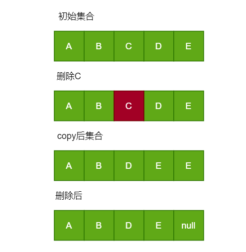

## JDK14 ArrayList 分析


### 1.概述
作为程序员，一定很熟悉 `ArrayList`, 可调整大小的数组的实现`List`接口。实现所有可选列表操作，并允许所有元素，包括`null` 。除了实现List  `接口`之外，该类还提供了一些方法来操纵内部使用的存储列表的数组的大小。（这个类是大致相当于`Vector，`不同之处在于它是不同步的）。

该`size，isEmpty，get，set，iterator`和`listIterator`操作在固定时间内运行。  `add`操作以*摊余常数运行* ，即添加n个元素需要O（n）个时间。  所有其他操作都以线性时间运行（粗略地说）。 与`LinkedList`实施相比，常数因子较低。 

每个`ArrayList`实例都有一个*容量* 。  容量是用于存储列表中的元素的数组的大小。 它总是至少与列表大小一样大。  当元素添加到ArrayList时，其容量会自动增长。  没有规定增长政策的细节，除了添加元素具有不变的摊销时间成本。 

应用程序可以添加大量使用`ensureCapacity`操作元件的前增大`ArrayList`实例的容量。  这可能会减少增量重新分配的数量。 

**请注意，此实现不同步。**  如果多个线程同时访问`884457282749`实例，并且至少有一个线程在结构上修改列表，则*必须*在外部进行同步。  （结构修改是添加或删除一个或多个元素的任何操作，或明确调整后台数组的大小;仅设置元素的值不是结构修改。）这通常是通过在一些自然地封装了列表。  如果没有这样的对象存在，列表应该使用`Collections.synchronizedList`方法“包装”。  这最好在创建时完成，以防止意外的不同步访问列表： 

```
  List list = Collections.synchronizedList(new ArrayList(...)); 
```

The iterators returned by this class's个 `iterator`和`listIterator`方法是*快速失败的*  ：如果列表在任何时间从结构上修改创建迭代器之后，以任何方式除非通过迭代器自身`remove`种或`add`方法，迭代器都将抛出一个`ConcurrentModificationException`。 因此，面对并发修改，迭代器将快速而干净地失败，而不是在未来未确定的时间冒着任意的非确定性行为。 

请注意，迭代器的故障快速行为无法保证，因为一般来说，在不同步并发修改的情况下，无法做出任何硬性保证。  失败快速迭代器尽力投入`ConcurrentModificationException` 。  因此，编写依赖于此异常的程序的正确性将是错误的：迭代器*的故障快速行为应仅用于检测错误。* 

### 2.源码分析

#### 2.1 主要成员变量

- 默认长度
    ```java 
    private static final int DEFAULT_CAPACITY = 10;
    ```
- 当构造时参数为 0 指定的集合
    ```java 
    private static final Object[] EMPTY_ELEMENTDATA = {};
    ```  
- 空的构造方法时使用
    ```java 
    private static final Object[] DEFAULTCAPACITY_EMPTY_ELEMENTDATA = {};
    ``` 
- 集合元素的缓冲区
    ```java 
    transient Object[] elementData;
    ```    
- 最终集合的长度
    ```java 
    private int size;
    ```    
  
#### 2.2 构造方法

- 无参构造
    ```java
     public ArrayList() {
            this.elementData = DEFAULTCAPACITY_EMPTY_ELEMENTDATA;
      }
    ```
- 有参构造

    - 指定初始容量
    ```java
    public ArrayList(int initialCapacity) {
        if (initialCapacity > 0) {
            this.elementData = new Object[initialCapacity];
        } else if (initialCapacity == 0) {
            this.elementData = EMPTY_ELEMENTDATA;
        } else {
            throw new IllegalArgumentException("Illegal Capacity: "+
                                               initialCapacity);
        }
    }
    ```  
   这里对入参进行了校验，根据参数的不同进行不同的处理
   
   - 将集合传入
   ```java
    public ArrayList(Collection<? extends E> c) {
        //将集合转换成数组
        elementData = c.toArray();
        //当传入的数据组长度大于0时
        if ((size = elementData.length) != 0) {
              //为了防止c.toArray() Object[]
            if (elementData.getClass() != Object[].class)
                elementData = Arrays.copyOf(elementData, size, Object[].class);
        } else {
            this.elementData = EMPTY_ELEMENTDATA;
        }
    }
    ```
#### 2.3 添加方法

- add(E e) 

    ```java
    public boolean add(E e) {
        modCount++;
        add(e, elementData, size);
        return true;
    }
  
    private void add(E e, Object[] elementData, int s) {
        if (s == elementData.length)
            elementData = grow();
        elementData[s] = e;
        size = s + 1;
    }
   private Object[] grow() {
          return grow(size + 1);
  }
    ```
  从上面的代码我们可以看出,当执行add()时,首先会对父类`AbstractList` 元素进行++ 操作,
  此变量主要是为了检查是否存在共修改，最终会导致`throw new ConcurrentModificationException()`
  当执行`add(e, elementData, size)`时,首先会判断`elementData.length`与`size`是否相等,
  `grow()`主要时对长度进行加一的操作，(这里我们也可以看出，为什么说，`ArrayList`是线程不安全的,
  当初线程同时添加数据,`size+1`会失去原子操作,导致数据出现问题)接下来就是对指定下标的进行赋值,
  并对size进行赋值;
- add(int index, E element)   
    ```java
    public void add(int index, E element) {
        rangeCheckForAdd(index);
        modCount++;
        final int s;
        Object[] elementData;
        if ((s = size) == (elementData = this.elementData).length)
            elementData = grow();
        System.arraycopy(elementData, index,
                         elementData, index + 1,
                         s - index);
        elementData[index] = element;
        size = s + 1;
    }
  
    private void rangeCheckForAdd(int index) {
        if (index > size || index < 0)
            throw new IndexOutOfBoundsException(outOfBoundsMsg(index));
    }
    ```
  `rangeCheckForAdd`只要对下标进行校验,剩下的就是和之前的差不多了,只不过这里用了System.arraycopy,比较耗性能
  
- set(int index, E element)
    ```java
    public E set(int index, E element) {
        Objects.checkIndex(index, size);
        E oldValue = elementData(index);
        elementData[index] = element;
        return oldValue;
    }
    ```  
  当我们执行set时,首先也会对下标进行校验,首先根据指定下标获取到要替换值,再根据下标进行从新赋值,再将原有的旧值进行返回
- remove(int index)
    ```java
    public E remove(int index) {
        Objects.checkIndex(index, size);
        final Object[] es = elementData;
    
        @SuppressWarnings("unchecked") E oldValue = (E) es[index];
        fastRemove(es, index);
    
        return oldValue;
    }
  
    private void fastRemove(Object[] es, int i) {
        modCount++;
        final int newSize;
        if ((newSize = size - 1) > i)
            System.arraycopy(es, i + 1, es, i, newSize - i);
        es[size = newSize] = null;
    }
    ```  
  根据下标进行删除的时,首先还是会校验入参，然后获取要修改的值，执行`fastRemove`方法，
  这里也有`modCount` , 首先我们要判断要删除的位置，如果下标位置是`size`,
  那直接将其重置为`null` ,否则将进行进行copy,过程如下:
  
  
- remove(Object o)
    ```java
       public boolean remove(Object o) {
           final Object[] es = elementData;
           final int size = this.size;
           int i = 0;
           found: {
               if (o == null) {
                   for (; i < size; i++)
                       if (es[i] == null)
                           break found;
               } else {
                   for (; i < size; i++)
                       if (o.equals(es[i]))
                           break found;
               }
               return false;
           }
           fastRemove(es, i);
           return true;
       }
    ```    
  此方法是根据给的的元素进行删除，由于集合内可以存在`null` ,所以当我传递为`null`直接跳出循环
  这里说明一下,`found: {}` 是一个代码块,我们可以直接跳出次代码块,通过`found: {}`我们可以计算出
  要删除元素的下标,再次执行`fastRemove(es, i)`方法,当集合内存在多个元素且值完全相同,只会删除第一个元素,执行的过程和上边的根据下标删除类似
  
关于ArrayList还有很多方法，比如`set() clear().....`,如果你掌握了上边的源码，再看其他的方法也是类似的

**总结** 

- ArrayList 是实现不安全的,在`add(),remove()`方法既可以看出
- ArrayList 查询的速度非常快,它可以根据下标快速定位,但是新增的效率就相对耗时的多(System.arraycopy)
    
  