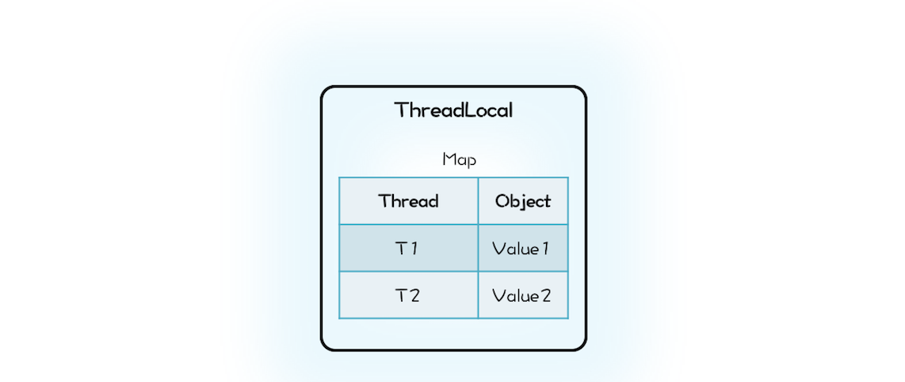
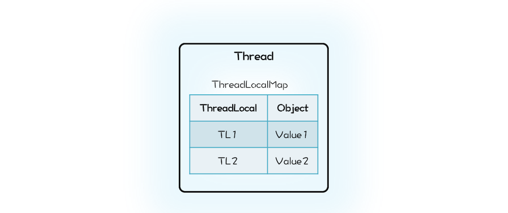

## 线程本地存储模式：没有共享，就没有伤害

民国年间某山东省主席参加某大学校庆演讲，在篮球场看到十来个人穿着裤衩抢一个球，观之实在不雅，于是怒斥学校的总务处长贪污，并且发话：“多买几个球，一人发一个，省得你争我抢！”小时候听到这个段子只是觉得好玩，今天再来看，却别有一番滋味。为什么呢？因为其间蕴藏着解决并发问题的一个重要方法：避免共享。

我们曾经一遍一遍又一遍地重复，多个线程同时读写同一共享变量存在并发问题。前面两篇文章我们突破的是写，没有写操作自然没有并发问题了。其实还可以突破共享变量，没有共享变量也不会有并发问题，正所谓是没有共享，就没有伤害。

那如何避免共享呢？思路其实很简单，多个人争一个球总容易出矛盾，那就每个人发一个球。对应到并发编程领域，就是每个线程都拥有自己的变量，彼此之间不共享，也就没有并发问题了。

线程封闭，其本质上就是避免共享。你已经知道通过局部变量可以做到避免共享，那还有没有其他方法可以做到呢？有的，Java 语言提供的线程本地存储（ThreadLocal）就能够做到。下面我们先看看 ThreadLocal 到底该如何使用。

### ThreadLocal 的使用方法

下面这个静态类 ThreadId 会为每个线程分配一个唯一的线程 Id，如果一个线程前后两次调用 ThreadId 的 get() 方法，两次 get() 方法的返回值是相同的。但如果是两个线程分别调用 ThreadId 的 get() 方法，那么两个线程看到的 get() 方法的返回值是不同的。若你是初次接触 ThreadLocal，可能会觉得奇怪，为什么相同线程调用 get() 方法结果就相同，而不同线程调用 get() 方法结果就不同呢？

```java

static class ThreadId {
  static final AtomicLong 
  nextId=new AtomicLong(0);
  //定义ThreadLocal变量
  static final ThreadLocal<Long> 
  tl=ThreadLocal.withInitial(
    ()->nextId.getAndIncrement());
  //此方法会为每个线程分配一个唯一的Id
  static long get(){
    return tl.get();
  }
}
```
能有这个奇怪的结果，都是 ThreadLocal 的杰作，不过在详细解释 ThreadLocal 的工作原理之前，我们再看一个实际工作中可能遇到的例子来加深一下对 ThreadLocal 的理解。你可能知道 SimpleDateFormat 不是线程安全的，那如果需要在并发场景下使用它，你该怎么办呢？

其实有一个办法就是用 ThreadLocal 来解决，下面的示例代码就是 ThreadLocal 解决方案的具体实现，这段代码与前面 ThreadId 的代码高度相似，同样地，不同线程调用 SafeDateFormat 的 get() 方法将返回不同的 SimpleDateFormat 对象实例，由于不同线程并不共享 SimpleDateFormat，所以就像局部变量一样，是线程安全的。

```java

static class SafeDateFormat {
  //定义ThreadLocal变量
  static final ThreadLocal<DateFormat>
  tl=ThreadLocal.withInitial(
    ()-> new SimpleDateFormat(
      "yyyy-MM-dd HH:mm:ss"));
      
  static DateFormat get(){
    return tl.get();
  }
}
//不同线程执行下面代码
//返回的df是不同的
DateFormat df =
  SafeDateFormat.get()；
```

通过上面两个例子，相信你对 ThreadLocal 的用法以及应用场景都了解了，下面我们就来详细解释 ThreadLocal 的工作原理。

### ThreadLocal 的工作原理

在解释 ThreadLocal 的工作原理之前， 你先自己想想：如果让你来实现 ThreadLocal 的功能，你会怎么设计呢？ThreadLocal 的目标是让不同的线程有不同的变量 V，那最直接的方法就是创建一个 Map，它的 Key 是线程，Value 是每个线程拥有的变量 V，ThreadLocal 内部持有这样的一个 Map 就可以了。你可以参考下面的示意图和示例代码来理解。




```java
class MyThreadLocal<T> {
  Map<Thread, T> locals = 
    new ConcurrentHashMap<>();
  //获取线程变量  
  T get() {
    return locals.get(
      Thread.currentThread());
  }
  //设置线程变量
  void set(T t) {
    locals.put(
      Thread.currentThread(), t);
  }
}
```
那 Java 的 ThreadLocal 是这么实现的吗？这一次我们的设计思路和 Java 的实现差异很大。Java 的实现里面也有一个 Map，叫做 ThreadLocalMap，不过持有 ThreadLocalMap 的不是 ThreadLocal，而是 Thread。Thread 这个类内部有一个私有属性 threadLocals，其类型就是 ThreadLocalMap，ThreadLocalMap 的 Key 是 ThreadLocal。你可以结合下面的示意图和精简之后的 Java 实现代码来理解。



```java

class Thread {
  //内部持有ThreadLocalMap
  ThreadLocal.ThreadLocalMap 
    threadLocals;
}
class ThreadLocal<T>{
  public T get() {
    //首先获取线程持有的
    //ThreadLocalMap
    ThreadLocalMap map =
      Thread.currentThread()
        .threadLocals;
    //在ThreadLocalMap中
    //查找变量
    Entry e = 
      map.getEntry(this);
    return e.value;  
  }
  static class ThreadLocalMap{
    //内部是数组而不是Map
    Entry[] table;
    //根据ThreadLocal查找Entry
    Entry getEntry(ThreadLocal key){
      //省略查找逻辑
    }
    //Entry定义
    static class Entry extends
    WeakReference<ThreadLocal>{
      Object value;
    }
  }
}
```
初看上去，我们的设计方案和 Java 的实现仅仅是 Map 的持有方不同而已，我们的设计里面 Map 属于 ThreadLocal，而 Java 的实现里面 ThreadLocalMap 则是属于 Thread。这两种方式哪种更合理呢？很显然 Java 的实现更合理一些。在 Java 的实现方案里面，ThreadLocal 仅仅是一个代理工具类，内部并不持有任何与线程相关的数据，所有和线程相关的数据都存储在 Thread 里面，这样的设计容易理解。而从数据的亲缘性上来讲，ThreadLocalMap 属于 Thread 也更加合理。

当然还有一个更加深层次的原因，那就是不容易产生内存泄露。在我们的设计方案中，ThreadLocal 持有的 Map 会持有 Thread 对象的引用，这就意味着，只要 ThreadLocal 对象存在，那么 Map 中的 Thread 对象就永远不会被回收。ThreadLocal 的生命周期往往都比线程要长，所以这种设计方案很容易导致内存泄露。而 Java 的实现中 Thread 持有 ThreadLocalMap，而且 ThreadLocalMap 里对 ThreadLocal 的引用还是弱引用（WeakReference），所以只要 Thread 对象可以被回收，那么 ThreadLocalMap 就能被回收。Java 的这种实现方案虽然看上去复杂一些，但是更加安全。

Java 的 ThreadLocal 实现应该称得上深思熟虑了，不过即便如此深思熟虑，还是不能百分百地让程序员避免内存泄露，例如在线程池中使用 ThreadLocal，如果不谨慎就可能导致内存泄露。

### ThreadLocal 与内存泄露

在线程池中使用 ThreadLocal 为什么可能导致内存泄露呢？原因就出在线程池中线程的存活时间太长，往往都是和程序同生共死的，这就意味着 Thread 持有的 ThreadLocalMap 一直都不会被回收，再加上 ThreadLocalMap 中的 Entry 对 ThreadLocal 是弱引用（WeakReference），所以只要 ThreadLocal 结束了自己的生命周期是可以被回收掉的。但是 Entry 中的 Value 却是被 Entry 强引用的，所以即便 Value 的生命周期结束了，Value 也是无法被回收的，从而导致内存泄露。

那在线程池中，我们该如何正确使用 ThreadLocal 呢？其实很简单，既然 JVM 不能做到自动释放对 Value 的强引用，那我们手动释放就可以了。如何能做到手动释放呢？估计你马上想到 try{}finally{}方案了，这个简直就是手动释放资源的利器。示例的代码如下，你可以参考学习。

```java

ExecutorService es;
ThreadLocal tl;
es.execute(()->{
  //ThreadLocal增加变量
  tl.set(obj);
  try {
    // 省略业务逻辑代码
  }finally {
    //手动清理ThreadLocal 
    tl.remove();
  }
});
```
### InheritableThreadLocal 与继承性

通过 ThreadLocal 创建的线程变量，其子线程是无法继承的。也就是说你在线程中通过 ThreadLocal 创建了线程变量 V，而后该线程创建了子线程，你在子线程中是无法通过 ThreadLocal 来访问父线程的线程变量 V 的。

如果你需要子线程继承父线程的线程变量，那该怎么办呢？其实很简单，Java 提供了 InheritableThreadLocal 来支持这种特性，InheritableThreadLocal 是 ThreadLocal 子类，所以用法和 ThreadLocal 相同，这里就不多介绍了。

不过，我完全不建议你在线程池中使用 InheritableThreadLocal，不仅仅是因为它具有 ThreadLocal 相同的缺点——可能导致内存泄露，更重要的原因是：线程池中线程的创建是动态的，很容易导致继承关系错乱，如果你的业务逻辑依赖 InheritableThreadLocal，那么很可能导致业务逻辑计算错误，而这个错误往往比内存泄露更要命。

### 总结
线程本地存储模式本质上是一种避免共享的方案，由于没有共享，所以自然也就没有并发问题。如果你需要在并发场景中使用一个线程不安全的工具类，最简单的方案就是避免共享。避免共享有两种方案，一种方案是将这个工具类作为局部变量使用，另外一种方案就是线程本地存储模式。这两种方案，局部变量方案的缺点是在高并发场景下会频繁创建对象，而线程本地存储方案，每个线程只需要创建一个工具类的实例，所以不存在频繁创建对象的问题。

线程本地存储模式是解决并发问题的常用方案，所以 Java SDK 也提供了相应的实现：ThreadLocal。通过上面我们的分析，你应该能体会到 Java SDK 的实现已经是深思熟虑了，不过即便如此，仍不能尽善尽美，例如在线程池中使用 ThreadLocal 仍可能导致内存泄漏，所以使用 ThreadLocal 还是需要你打起精神，足够谨慎。

