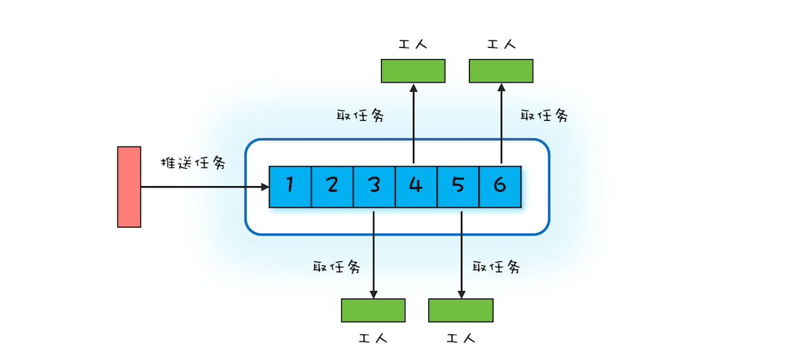
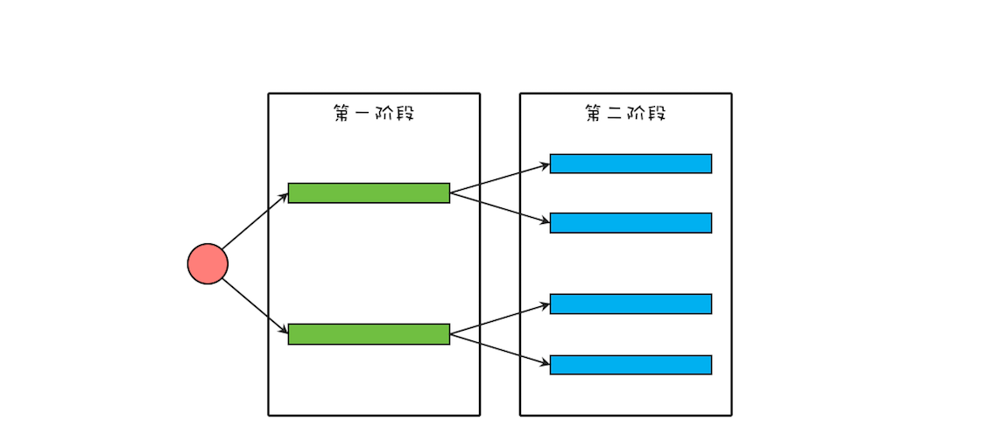
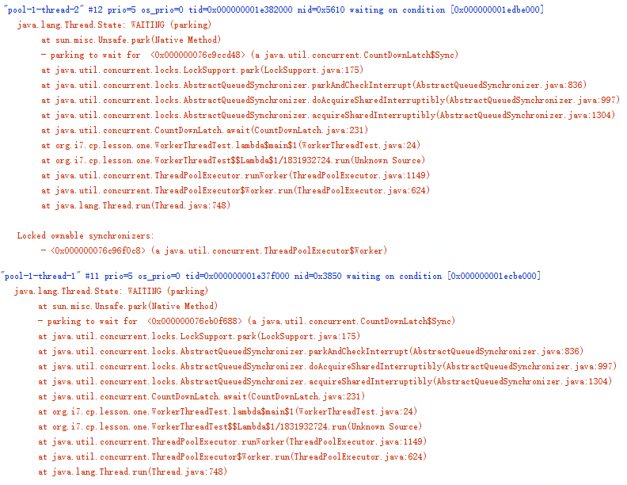

## Worker Thread模式：如何避免重复创建线程？

在上一篇文章中，我们介绍了一种最简单的分工模式——Thread-Per-Message 模式，对应到现实世界，其实就是委托代办。这种分工模式如果用 Java Thread 实现，频繁地创建、销毁线程非常影响性能，同时无限制地创建线程还可能导致 OOM，所以在 Java 领域使用场景就受限了。

要想有效避免线程的频繁创建、销毁以及 OOM 问题，就不得不提今天我们要细聊的，也是 Java 领域使用最多的 Worker Thread 模式。

Worker Thread 模式及其实现

Worker Thread 模式可以类比现实世界里车间的工作模式：车间里的工人，有活儿了，大家一起干，没活儿了就聊聊天等着。你可以参考下面的示意图来理解，Worker Thread 模式中 Worker Thread 对应到现实世界里，其实指的就是车间里的工人。不过这里需要注意的是，车间里的工人数量往往是确定的。



那在编程领域该如何模拟车间的这种工作模式呢？或者说如何去实现 Worker Thread 模式呢？通过上面的图，你很容易就能想到用阻塞队列做任务池，然后创建固定数量的线程消费阻塞队列中的任务。其实你仔细想会发现，这个方案就是 Java 语言提供的线程池。

线程池有很多优点，例如能够避免重复创建、销毁线程，同时能够限制创建线程的上限等等。学习完上一篇文章后你已经知道，用 Java 的 Thread 实现 Thread-Per-Message 模式难以应对高并发场景，原因就在于频繁创建、销毁 Java 线程的成本有点高，而且无限制地创建线程还可能导致应用 OOM。线程池，则恰好能解决这些问题。

那我们还是以 echo 程序为例，看看如何用线程池来实现。

下面的示例代码是用线程池实现的 echo 服务端，相比于 Thread-Per-Message 模式的实现，改动非常少，仅仅是创建了一个最多线程数为 500 的线程池 es，然后通过 es.execute() 方法将请求处理的任务提交给线程池处理。

```java

ExecutorService es = Executors
  .newFixedThreadPool(500);
final ServerSocketChannel ssc = 
  ServerSocketChannel.open().bind(
    new InetSocketAddress(8080));
//处理请求    
try {
  while (true) {
    // 接收请求
    SocketChannel sc = ssc.accept();
    // 将请求处理任务提交给线程池
    es.execute(()->{
      try {
        // 读Socket
        ByteBuffer rb = ByteBuffer
          .allocateDirect(1024);
        sc.read(rb);
        //模拟处理请求
        Thread.sleep(2000);
        // 写Socket
        ByteBuffer wb = 
          (ByteBuffer)rb.flip();
        sc.write(wb);
        // 关闭Socket
        sc.close();
      }catch(Exception e){
        throw new UncheckedIOException(e);
      }
    });
  }
} finally {
  ssc.close();
  es.shutdown();
}   
```

### 正确地创建线程池

Java 的线程池既能够避免无限制地创建线程导致 OOM，也能避免无限制地接收任务导致 OOM。只不过后者经常容易被我们忽略，例如在上面的实现中，就被我们忽略了。所以强烈建议你用创建有界的队列来接收任务。

当请求量大于有界队列的容量时，就需要合理地拒绝请求。如何合理地拒绝呢？这需要你结合具体的业务场景来制定，即便线程池默认的拒绝策略能够满足你的需求，也同样建议你在创建线程池时，清晰地指明拒绝策略。

同时，为了便于调试和诊断问题，我也强烈建议你在实际工作中给线程赋予一个业务相关的名字。

综合以上这三点建议，echo 程序中创建线程可以使用下面的示例代码。

```java

ExecutorService es = new ThreadPoolExecutor(
  50, 500,
  60L, TimeUnit.SECONDS,
  //注意要创建有界队列
  new LinkedBlockingQueue<Runnable>(2000),
  //建议根据业务需求实现ThreadFactory
  r->{
    return new Thread(r, "echo-"+ r.hashCode());
  },
  //建议根据业务需求实现RejectedExecutionHandler
  new ThreadPoolExecutor.CallerRunsPolicy());
```

### 避免线程死锁

使用线程池过程中，还要注意一种线程死锁的场景。如果提交到相同线程池的任务不是相互独立的，而是有依赖关系的，那么就有可能导致线程死锁。实际工作中，我就亲历过这种线程死锁的场景。具体现象是应用每运行一段时间偶尔就会处于无响应的状态，监控数据看上去一切都正常，但是实际上已经不能正常工作了。

这个出问题的应用，相关的逻辑精简之后，如下图所示，该应用将一个大型的计算任务分成两个阶段，第一个阶段的任务会等待第二阶段的子任务完成。在这个应用里，每一个阶段都使用了线程池，而且两个阶段使用的还是同一个线程池。



我们可以用下面的示例代码来模拟该应用，如果你执行下面的这段代码，会发现它永远执行不到最后一行。执行过程中没有任何异常，但是应用已经停止响应了。

```java

//L1、L2阶段共用的线程池
ExecutorService es = Executors.
  newFixedThreadPool(2);
//L1阶段的闭锁    
CountDownLatch l1=new CountDownLatch(2);
for (int i=0; i<2; i++){
  System.out.println("L1");
  //执行L1阶段任务
  es.execute(()->{
    //L2阶段的闭锁 
    CountDownLatch l2=new CountDownLatch(2);
    //执行L2阶段子任务
    for (int j=0; j<2; j++){
      es.execute(()->{
        System.out.println("L2");
        l2.countDown();
      });
    }
    //等待L2阶段任务执行完
    l2.await();
    l1.countDown();
  });
}
//等着L1阶段任务执行完
l1.await();
System.out.println("end");
```
当应用出现类似问题时，首选的诊断方法是查看线程栈。下图是上面示例代码停止响应后的线程栈，你会发现线程池中的两个线程全部都阻塞在 l2.await(); 这行代码上了，也就是说，线程池里所有的线程都在等待 L2 阶段的任务执行完，那 L2 阶段的子任务什么时候能够执行完呢？永远都没那一天了，为什么呢？因为线程池里的线程都阻塞了，没有空闲的线程执行 L2 阶段的任务了。



原因找到了，那如何解决就简单了，最简单粗暴的办法就是将线程池的最大线程数调大，如果能够确定任务的数量不是非常多的话，这个办法也是可行的，否则这个办法就行不通了。其实这种问题通用的解决方案是为不同的任务创建不同的线程池。对于上面的这个应用，L1 阶段的任务和 L2 阶段的任务如果各自都有自己的线程池，就不会出现这种问题了。

最后再次强调一下：提交到相同线程池中的任务一定是相互独立的，否则就一定要慎重。

### 总结

我们曾经说过，解决并发编程里的分工问题，最好的办法是和现实世界做对比。对比现实世界构建编程领域的模型，能够让模型更容易理解。上一篇我们介绍的 Thread-Per-Message 模式，类似于现实世界里的委托他人办理，而今天介绍的 Worker Thread 模式则类似于车间里工人的工作模式。如果你在设计阶段，发现对业务模型建模之后，模型非常类似于车间的工作模式，那基本上就能确定可以在实现阶段采用 Worker Thread 模式来实现。

Worker Thread 模式和 Thread-Per-Message 模式的区别有哪些呢？从现实世界的角度看，你委托代办人做事，往往是和代办人直接沟通的；对应到编程领域，其实现也是主线程直接创建了一个子线程，主子线程之间是可以直接通信的。而车间工人的工作方式则是完全围绕任务展开的，一个具体的任务被哪个工人执行，预先是无法知道的；对应到编程领域，则是主线程提交任务到线程池，但主线程并不关心任务被哪个线程执行。

Worker Thread 模式能避免线程频繁创建、销毁的问题，而且能够限制线程的最大数量。Java 语言里可以直接使用线程池来实现 Worker Thread 模式，线程池是一个非常基础和优秀的工具类，甚至有些大厂的编码规范都不允许用 new Thread() 来创建线程的，必须使用线程池。

不过使用线程池还是需要格外谨慎的，除了今天重点讲到的如何正确创建线程池、如何避免线程死锁问题，还需要注意前面我们曾经提到的 ThreadLocal 内存泄露问题。同时对于提交到线程池的任务，还要做好异常处理，避免异常的任务从眼前溜走，从业务的角度看，有时没有发现异常的任务后果往往都很严重。


