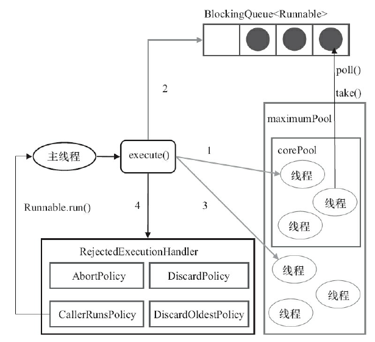

## Java中的线程池

### 使用线程池的好处

Java中的线程池是运用场景最多的并发框架，几乎所有需要异步或并发执行任务的程序
都可以使用线程池。在开发过程中，合理地使用线程池能够带来3个好处。
第一：降低资源消耗。通过重复利用已创建的线程降低线程创建和销毁造成的消耗。
第二：提高响应速度。当任务到达时，任务可以不需要等到线程创建就能立即执行。
第三：提高线程的可管理性。线程是稀缺资源，如果无限制地创建，不仅会消耗系统资源，
还会降低系统的稳定性，使用线程池可以进行统一分配、调优和监控。但是，要做到合理利用
线程池，必须对其实现原理了如指掌。

### 线程池的实现原理

当向线程池提交一个任务之后，线程池是如何处理这个任务的呢？本问来看一下线程池
的主要处理流程




ThreadPoolExecutor执行execute方法分下面4种情况。
1）如果当前运行的线程少于corePoolSize，则创建新线程来执行任务（注意，执行这一步骤需要获取全局锁）。
2）如果运行的线程等于或多于corePoolSize，则将任务加入BlockingQueue。
3）如果无法将任务加入BlockingQueue（队列已满），则创建新的线程来处理任务（注意，执行这一步骤需要获取全局锁）。

4）如果创建新线程将使当前运行的线程超出maximumPoolSize，任务将被拒绝，并调用
RejectedExecutionHandler.rejectedExecution()方法。

ThreadPoolExecutor采取上述步骤的总体设计思路，是为了在执行execute()方法时，尽可能地避免获取全局锁（那将会是一个严重的可伸缩瓶颈）。在ThreadPoolExecutor完成预热之后（当前运行的线程数大于等于corePoolSize），几乎所有的execute()方法调用都是执行步骤2，而步骤2不需要获取全局锁。

**源码分析：**上面的流程分析让我们很直观地了解了线程池的工作原理，让我们再通过源代
码来看看是如何实现的，线程池执行任务的方法如下。

```
    public void execute(Runnable command) {
        if (command == null)
            throw new NullPointerException();
		// 1.如果正在运行的线程少于corePoolSize，请尝试以给定的命令作为其第一个任务来启动新线程。对addWorker的调用以原子方式检查runState和workerCount，因此可以通过返回false来防止错误警报，从而在不应该添加线程时添加线程。
        int c = ctl.get();
        if (workerCountOf(c) < corePoolSize) {
            if (addWorker(command, true))
                return;
            c = ctl.get();
        }
         // 2.如果一个任务可以成功地排队，那么我们仍然需要仔细检查是否应该添加一个线程（因为自从上次检查以来已有的线程已经死亡），或者在进入这个方法后池是否关闭。因此，我们重新检查状态，如果有必要，在停止排队时回滚排队，如果没有，则启动一个新线程。
        if (isRunning(c) && workQueue.offer(command)) {
            int recheck = ctl.get();
            if (! isRunning(recheck) && remove(command))
                reject(command);
            else if (workerCountOf(recheck) == 0)
                addWorker(null, false);
        }
        // 3.如果无法将任务排队，则尝试添加新线程。如果失败了，我们知道我们已经关闭或者饱和了，所以拒绝这个任务。
        else if (!addWorker(command, false))
            reject(command);
    }
}
```

判断当前核心线程池里是否有空闲线程，有则通过addWorker方法创建工作线程执行任务。addWorker方法较长，筛选出重要的代码来解析。

```
//ThreadPoolExecutor#addWorker
private boolean addWorker(Runnable firstTask, boolean core) {
/*首先会再次检查线程池是否处于运行状态，核心线程池中是否还有空闲线程，都满足条件过后则会调用compareAndIncrementWorkerCount先将正在运行的线程数+1，数量自增成功则跳出循环，自增失败则继续从头继续循环*/
　　...
　　if (compareAndIncrementWorkerCount(c))
　　　　break retry;
　　...
/*正在运行的线程数自增成功后则将线程封装成工作线程Worker*/
　　boolean workerStarted = false;
　　boolean workerAdded = false;
　　Worker w = null;
　　try {
　　　　final ReentrantLock mainLock = this.mainLock;        //全局锁
　　　　w = new Woker(firstTask);        //将线程封装为Worker工作线程
　　　　final Thread t = w.thread;
　　　　if (t != null) {
　　　　　　mainLock.lock();    //获取全局锁
/*当持有了全局锁的时候，还需要再次检查线程池的运行状态等*/
　　　　　　try {
　　　　　　　　int c = clt.get();
　　　　　　　　int rs = runStateOf(c);        //线程池运行状态
　　　　　　　　if (rs < SHUTDOWN || (rs == SHUTDOWN && firstTask == null)){        //线程池处于运行状态，或者线程池关闭且任务线程为空
　　　　　　　　　　if (t.isAlive())    //线程处于活跃状态，即线程已经开始执行或者还未死亡，正确的应线程在这里应该是还未开始执行的
　　　　　　　　　　　　throw new IllegalThreadStateException();
　　　　　　　　　　workers.add(w);    //private final HashSet<Worker> wokers = new HashSet<Worker>();包含线程池中所有的工作线程，只有在获取了全局的时候才能访问它。将新构造的工作线程加入到工作线程集合中
　　　　　　　　　　int s = worker.size();    //工作线程数量
　　　　　　　　　　if (s > largestPoolSize)
　　　　　　　　　　　　largestPoolSize = s;
　　　　　　　　　　workerAdded = true;    //新构造的工作线程加入成功
　　　　　　　　}
　　　　　　} finally {
　　　　　　　　mainLock.unlock();
　　　　　　}
　　 　　　　if (workerAdded) {
　　　　　　　　t.start();    //在被构造为Worker工作线程，且被加入到工作线程集合中后，执行线程任务，注意这里的start实际上执行Worker中run方法，所以接下来分析Worker的run方法
　　　　　　　　workerStarted = true;
　　　　　　}
　　　　}
　　} finally {
　　　　if (!workerStarted)    //未能成功创建执行工作线程
　　　　　　addWorkerFailed(w);    //在启动工作线程失败后，将工作线程从集合中移除
　　}
　　return workerStarted;
}
```

　ThreadPoolExecutor#runWorker，在此方法中，Worker在执行完任务后，还会循环获取任务队列里的任务执行（其中的getTask方法），也就是说Worker不仅仅是在执行完给它的任务就释放或者结束，它不会闲着，而是继续从任务队列中获取任务，直到任务队列中没有任务可执行时，它才退出循环完成任务。