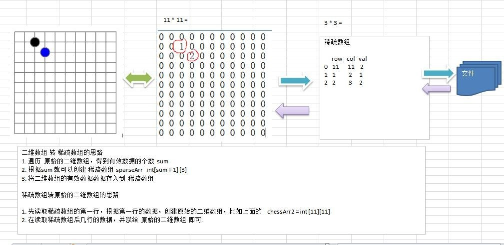

# 稀疏数组

稀疏数组就是数组中，大部分的元素值都未被使用（或都为0），在数组中仅有少 部分的空间使用。
因此造成内存空间的浪费，为了解决这问题，并且不影响数组中原 有的元素值，我们采用了一种压缩的方式来 表示稀疏数组的内容。 
如图二维数组所示，有大部分的空间是无用的。


在这里可以使用稀疏数组进行压缩。其中在稀疏数组中第一部分所记录的是原数组的列数和行数以及元素使用的个数、第二部分所记录的是原数组中元素的位置和内容。
经过压缩之后，原来需要声明大小为63的数组，而使用压缩后，只需要声明大小为6*3的数组，仅需18个存储空间。


### 一个实际的需求

 |

编写的五子棋程序中，有存盘退出和续上盘的功能。

- 分析问题:

    因为该二维数组的很多值是默认值 0, 因此记录了很多没有意义的数据->稀疏数组。
    
- 应用实例
    1)	使用稀疏数组，来保留类似前面的二维数组(棋盘、地图等等)
    2)	把稀疏数组存盘，并且可以从新恢复原来的二维数组数
    3)	整体思路分析
    
      |
        
- 代码 实战

   源代码在:source-code/java/datastructure/SparseArray
   
   ```java
    public static void main(String[] args) {
    
            //1. 创建一个二维数组
            int[][] array1 = new int[11][11];
            array1[1][2]=1;
            array1[2][3]=2;
            //2. 输出原始数组
            System.out.println("---原始二维数组---");
            for (int[] row : array1) {
                for (int data : row) {
                    System.out.printf("%d\t",data);
                }//换行
                System.out.println();
            }
    
    
            //3.将二维数组转换成稀疏数组
            //3.1 遍历二维数组，得到非0的个数
            //记录不等于0的个数
            int sum = 0;
            for (int[] ints : array1) {
                for (int j = 0; j < array1.length; j++) {
                    //二维数组的第 i 行，第 j 列不等于 0
                    if (ints[j] != 0) {
                        sum++;
                    }
                }
            }
            //3.2 创建稀疏数组
            int[][] sparseArray = new int[sum + 1][3];
            // 初始化稀疏数组 第一行
            sparseArray[0][0]= array1.length;
            sparseArray[0][1]=array1.length;
            sparseArray[0][2]=sum;
    
            int count = 0;
            for (int i = 0; i < array1.length; i++) {
                for (int j = 0; j < array1.length; j++) {
                    if (array1[i][j]!=0){
                        count++;
                        sparseArray[count][0] = i;
                        sparseArray[count][1] = j;
                        sparseArray[count][2] = array1[i][j];
                    }
                }
            }
    
            System.out.println("---得到的稀疏数组---");
            for (int[] ints : sparseArray) {
                System.out.printf("%d\t%d\t%d\t\n", ints[0], ints[1], ints[2]);
            }
    
            //4. 将稀疏数组恢复成原始二维数组
            //4.1 读取稀疏数组的第一行数据，根据第一行的数据回复原始而二维数组
            int[][] array2 = new int[sparseArray[0][0]][sparseArray[0][1]];
            //4.2 读取后叙述数据，并赋值给二维数组
            for (int i = 1; i < sparseArray.length; i++) {
                //sparseArray[i][0] : 原始行号
                //sparseArray[i][1] : 原始列号
                //sparseArray[i][2] : 具体的值
                array2[sparseArray[i][0]][sparseArray[i][1]] = sparseArray[i][2];
            }
            System.out.println("恢复后的二维数组");
            for (int[] row: array2){
                for(int data : row){
                    System.out.printf("%d\t",data);
                }
                System.out.println();
            }
        }
    ```


