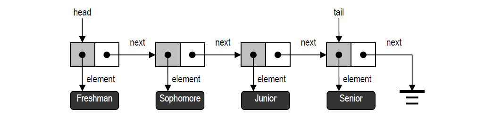
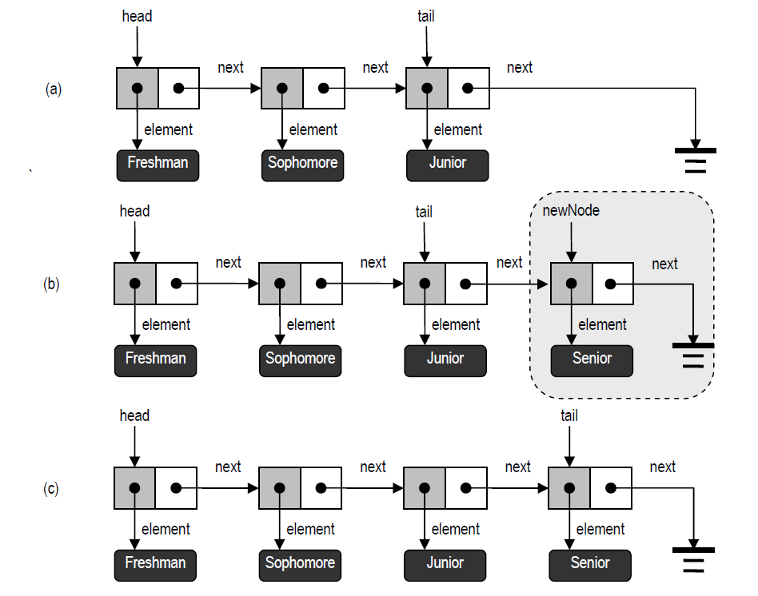

## 数据结构 ☞ 链表

前面我们介绍了栈与队列的 ADT，并利用数组加以实现。遗憾的是，尽管这种实现简单明了，
但由于数组长度必须固定，在空间效率及适应性方面还存在不足。本节将介绍一种基于链表的实现，
以消除上述缺陷。

- [单链表](#单链表)
- [Java 实现单链表](#Java实现单链表)
- [基于单链表实现栈](#基于单链表实现栈)
- [基于单链表实现队列](#基于单链表实现队列)

### 单链表

所谓链表（Linked list），就是按线性次序排列的一组数据节点。如图 所示，每个节点都是
一个对象，它通过一个引用element指向对应的数据元素，同时还通过一个引用next指向下一节点。

###### 

节点间这种相互指向的关系，乍看起来有循环引用之嫌，然而实际上却完全可行，而且不难实
现。每个节点的next 引用都相当于一个链接或指针，指向另一节点。借助于这些next 引用，我们
可以从一个节点移动至其它节点。链表的第一个和最后一个节点，分别称作链表的首节点（Head）
和末节点（Tail）。末节点的特征是，其next 引用为空。如此定义的链表，称作单链表（Singly linked list）。

与数组类似，单链表中的元素也具有一个线性次序⎯⎯若P 的next 引用指向S，则P 就是S
的直接前驱，而S 是P 的直接后继。与数组不同的是，单链表的长度不再固定，而是可以根据实际
需要不断变化。如此一来，包含n 个元素的单链表只需占用O(n)空间⎯⎯这要比定长数组更为灵活。

### Java实现单链表

```java
public class Node<E> implements Position<E> {
    //数据对象
    private E element;
    //指向后继节点
    private Node next;

    /**
     * 指向数据对象、后继节点的引用都置空
     */
    public Node()
    {
        this(null, null);
    }

    /**
     * 指定数据对象及后继节点
     * @param e
     * @param n
     */
    public Node(E e, Node n)
    {
        element = e; next = n;
    }


    @Override
    public E getElem()
    {
        return element;
    }

    @Override
    public E setElem(E e)
    {
        E oldElem = element;
        element = e;
        return oldElem;
    }

    /**
     * 取当前节点的后继节点
     * @return
     */
    public Node getNext()
    {
        return next;
    }

    /**
     * 修改当前节点的后继节点
     * @param newNext
     */
    public void setNext(Node newNext)
    {
        next = newNext;
    }

}
```
- 首节点的插入与删除
对于如图(a)所示的单链表，为了插入一个节点，我们首先要创建该节点，然后将其next
引用指向当前的首节点（图二(b)），然后将队列的head引用指向新插入的节点（图二(c)）。


- 首节点的删除
反之，对于如图二(a)所示的单链表，为了删除首节点，我们首先将首节点的next引用复制一
份，然后才删除该节点（图二(b)），最后将表头引用设置为先前复制的引用（图二(c)）。


- 末节点的插入
假定我们借助一个引用tail始终指向的末节点，则在表尾插入新节点也只需O(1)时间。对于如图
二(a)所示的单链表，为了将一个新节点作为末节点插入，我们首先要创建该节点，将其next引用
置为空，并将当前末节点的next引用指向该新节点（图二(b)），最后将tail引用指向新节点（图
二(c)）。需要特别提醒的是，上述操作的次序很有讲究，不能随意调换。



### 基于单链表实现栈

接下来让我们看看，如何利用单链表结构来实现栈与队列。
由于栈的操作只限于栈顶元素，而单链表只有对首元素才能在O(1)时间内完成插入和删除，故
这里把单链表的首节点作为栈顶，其余元素依次排列。此外，为了保证getSize()方法也能够在O(1)
时间内完成，还需借助一个实例变量来动态记录栈中元素的数目。具体的实现如代码所示。
```java
public class StackList<E> implements Stack<E>{

    //指向栈顶元素
    protected Node top;
    //栈中元素的数目
    protected int size;

    public StackList() {
        this.size=0;
        this.top=null;
    }

    @Override
    public void push(E e) {
        //创建一个新节点，将其作为首节点插入
        //Node<E> node = new Node<>(e,top);
        //更新首节点引用
        //top = node;
        top = new Node<>(e,top);
        //更新操作长度
        size ++;
    }

    @Override
    public E pop() throws ExceptionStackEmpty {
        if (isEmpty()){
            throw new ExceptionStackEmpty("意外：栈空");
        }
        //获取当前的节点
        E elem = (E) top.getElem();
        //重置首节点元素
        top = top.getNext();
        //操作长度减一
        size--;
        return elem;
    }

    @Override
    public int size() {
        return size;
    }

    @Override
    public boolean isEmpty() {
        return top == null;
    }

    @Override
    public E top() throws ExceptionStackEmpty {
        if (isEmpty()){
            throw new ExceptionStackEmpty("意外：栈空");
        }
        return (E) top.getElem();
    }
}
```

若栈中实际共有n 个元素，则除常数个实例变量外，只需保存n 个节点。由于每个节点只占用
O(1)空间，故上述实现只占用O(n)的空间。于是，占用的空间量将取决于栈的实际规模，而不再一
成不变。相对于利用数组的实现，这一实现的另一优点在于，无需针对溢出问题而刻意去设置一个
意外错。当然，溢出错误仍然会得到处理，只不过交由JRE 来处理。这不仅统一和简化了错误的处
理，而且更重要的是，出现栈溢出错误的可能性大大降低⎯⎯此时，只有在JRE 没有剩余空间时才
会出现栈溢出的现象；而在基于数组的实现中，只要超过数组的长度就会报栈溢出。这两种处理方
法有着本质的区别，前者中JRE 报告的OutOfMemoryError 属于错误（Error），而后者报告的
ExceptionStackFull 属于意外（Exception）。
这里设置了一个实例变量top，指向表中的首节点。在新元素e 入栈时，只需创建一个以e 为
数据的节点v，并将v 作为首节点插入。反过来，在退栈时，可以直接摘除首节点，并返回其数据。
综上可见，所有插入、删除操作都可以在表的前端进行。根据前面关于单链表结构的分析结论，这
些操作都可以在O(1)时间内完成，这一效率与基于数组的栈实现相同。

### 基于单链表实现队列
与栈一样，我们也可以借助单链表来实现队列ADT。同样地，出于效率方面的考虑，我们将以
单链表的首（末）节点作为队列的首（末）节点⎯⎯这样，可以回避单链表在尾部进行删除操作时
效率低下的缺陷。此外，还需要两个实例变量分别指示表的首、末节点。具体的实现如代码所示：
```java
public class LinkedQueue<E> implements Queue<E>{
    //指向表首元素
    protected Node<E> head;
    //指向表末元素
    protected Node<E> tail;
    //队列中元素的数目
    protected int size;

    public LinkedQueue() {
        //构造方法（空队列）
        head = tail = null;
        size = 0;
    }

    @Override
    public int size() {
        return size;
    }

    @Override
    public boolean isEmpty() {
//        return (head = tail) == null;
        return 0 == size;
    }

    @Override
    public E front() throws ExceptionQueueEmpty {
        return head.getElem();
    }

    @Override
    public void enqueue(E e) throws ExceptionQueueFull {
        Node<E> node = new Node<>();
        node.setElem(e);
        node.setNext(null);
        if (0 == size){
            //若此前队列为空，则直接插入
            head = node;
        }else {
            tail.setNext(node);
        }
        //更新指向末节点引用
        tail = node;
        //更新规模
        size++;
    }

    @Override
    public E dequeue() throws ExceptionQueueEmpty {
        if(isEmpty()){
            throw new ExceptionQueueEmpty("意外：队列空");
        }
        E old = head.getElem();
        head = head.getNext();
        size--;
        //若队列已空，须将末节点引用置空
        if (0 == size){
            tail = null;
        }
        return old;
    }
}
```


