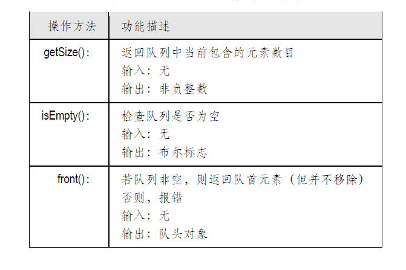
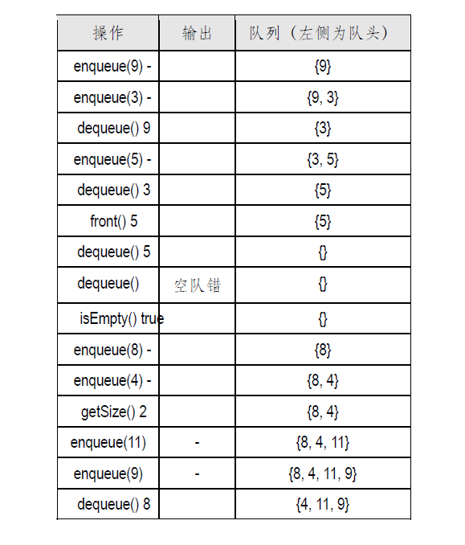

## 数据结构 ☞ 队列

- [简介](#简介)
- [队列ADT](#队列ADT)
- [Queue接口](#Queue接口)
- [基于数组的实现](#基于数组的实现)
- [队空与队满](#队空与队满)

### 简介
与栈一样，队列也是最基本的数据结构之一。队列也是对象的一种容器，其中对象的插入和删
除遵循“先进先出”（First-In-First-Out, FIFO）的原则⎯⎯也就是说，每次删除的只能是最先插入的
对象。因此，我们可以想象成将对象追加在队列的后端，而从其前端摘除对象。就这一性质而言，
队列与栈堪称“孪生兄弟”。比如，在银行等待接受服务时，顾客们就会排成一个队列⎯⎯最先到达
者优先得到服务。再如，用球桶来乘放羽毛球时，所有的球也排成一个队列⎯⎯你总是从一端将球
取出，而从另一端把球放入。

### 队列ADT
队列的抽象数据类型就是一个容器，其中的对象排成一个序列，我们只能访问和取出排在最前
端（Front）的对象，只能在队列的尾部（Rear）插入新对象。正是按照这一规则，才能保证最先被
插入的对象首先被删除（FIFO）。
队列ADT 首先支持下面的两个基本方法：


此外，与栈ADT 类似地，队列ADT 还支持如下的方法：



给出了从一个空队列开始，在依次执行一系列操作的过程中，队列中内容的相应变化。



队列的应用十分广泛，无论是商店、剧院、机场还是银行、医院，凡是按照“先到的客户优先
接受服务”原则的场合，都可以利用队列这一数据结构来编排相应的服务。

### Queue接口
如下 给出了队列ADT的一个Java接口。这是一个通用的接口，来自任何类的对象，都可以
作为队列的成员。因此与栈一样，在从队列中取出一个对象后，也需要对其进行强制转换。
```java
public interface Queue<E> {

    /**
     * 返回队列的长度
     * @return
     */
    int size();

    /**
     * 判断队列是否为空
     * @return
     */
    boolean isEmpty();

    /**
     * 获取队列第一个元素，但是不删除
     * @return
     * @throws ExceptionQueueEmpty
     */
    E front() throws ExceptionQueueEmpty;

    /**
     * 入队
     * @param e
     * @throws ExceptionQueueFull
     */
    void enqueue (E e) throws ExceptionQueueFull;

    /**
     * 出队
     * @return
     * @throws ExceptionQueueEmpty
     */
    E dequeue() throws ExceptionQueueEmpty;
}
```


可以看出，这里的size()和isEmpty()方法与栈的对应方法完全相同。这两个方法加上front()
方法都属于所谓的访问式方法（Accessor method）⎯⎯这类方法仅仅读取队列的信息，但不会修
改队列的内容。


### 基于数组的实现
- 顺序数组
借助一个定长数组Q 来存放对象，即可简单地实现队列。那么，为了符合FIFO 准则，应该如
何表示和记录队列中各对象的次序呢？
一种自然的办法就是仿照栈的实现，以Q[0]作为队首，其它对象顺序往后存放。然而如此一来，
每次首元素出队之后，都需要将后续的所有元素向前顺移一个单元⎯⎯若队长为n，这项工作需要
O(n)时间，因此效率很低。
-  循环数组
为了避免数组的整体移动，可以引入如下两个变量fist 和last：
    - fist：始终等于Q 的首元素在数组中的下标，即指向下次出队元素的位置
    - last：始终等于Q 的末元素的下标加一，即指向下次入队元素的位置
一开始，fist = last = 0，此时队空。每次有对象入队时，将其存放于Q[last]，然后r 加一，以指向下一
单元。对称地，每次有对象出队之后，也将f 加一，指向新的队首元素。这样，对front()、enqueue()
和dequeue()方法的每一次调用都只需常数时间。

然而，这还不够。细心的读者或许已经注意到，按照上述约定，在队列的生命期内，fist last 始终
在单调增加。因此，若队列数组的容量为N，则在经过N 次入队操作后，last 所指向的单元必然超出
数组的范围；在经过N 次出队操作后，fist 所指向的单元也会出现类似的问题。

解决上述问题的一种简便方法，就是在每次fist 或 last 加一后，都要以数组的长度做取模运算，以
保证其所指单元的合法性。就其效果而言，这就相当于把数组的头和尾相联，构成一个环状结构。
基于上述构想，可以得到如代码 所示的算法

```java
public class QueueArray<E> implements Queue<E>{
    transient Object[] elementData;

    //默认长度
    transient static final int DEFAULT_CAPACITY = 512;

    //实际容量
    protected int capacity;

    //队首的位置
    private int fist = 0;

    //队尾元素的位置
    private int last = 0;

    public QueueArray() {
        this(DEFAULT_CAPACITY);
    }

    public QueueArray(int initialCapacity) {
        if(initialCapacity > 0){
            capacity = initialCapacity;
            this.elementData = new Object[initialCapacity];
        }
        else if(initialCapacity == 0){
            capacity = DEFAULT_CAPACITY;
            this.elementData = new Object[DEFAULT_CAPACITY];
        }
        else{
            throw new IllegalArgumentException("Illegal Capacity: "+initialCapacity);
        }
    }


    @Override
    public int size() {
        return (capacity - fist +last) % capacity;
    }

    @Override
    public boolean isEmpty() {
        return fist == last;
    }

    @Override
    public E front() throws ExceptionQueueEmpty {
        assertEmpty();
        return elementData(fist);
    }

    @Override
    public void enqueue(E e) throws ExceptionQueueFull {
        if(size() == capacity-1){
            throw new ExceptionQueueFull("Queue overflow.");
        }
        elementData[last] = e;
        last = (last + 1) % capacity;
    }

    @Override
    public E dequeue() throws ExceptionQueueEmpty {
        E element ;
        assertEmpty();
        element = elementData(fist);
        elementData[fist] =null;
        fist = (fist + 1) %capacity;
        return element;
    }

    protected void assertEmpty(){
        if (isEmpty()) {
            throw new ExceptionQueueEmpty("意外：队列空");
        }
    }

    E elementData(int index) {
        return (E) elementData[index];
    }
}
```
### 队空与队满
请注意，这里采用的依然是定长数组，故与栈一样，有可能出现空间溢出的情况。一旦空间溢
出，需要给出ExceptionQueueFull 意外错。反过来，对于空队列的出队操作也需要禁止，这里将报
ExceptionQueueEmpty 意外错。那么，如何判断这两种情况呢？其中的一些细节值得讨论。
我们注意到，当队列中不含任何对象时，必有fist = last。然而，反之却不然。
试考虑如下情况：在数组中只剩下一个空闲单元（此时有fist ≡ (last+1) mod N）时，需要插入一个
对象。若则按照上面的enqueue()算法，插入后有fist = last，但事实上此时的队列已满。如果根据“fist = last”
判断队列为空，则尽管队列中含有元素，但出队操作却无法进行；反过来，尽管数组空间已满，却
还能插入新元素（原有的元素将被覆盖掉）。
为了解决这一问题，一种简便易行的方法就是禁止队列的实际规模超过N-1。请注意在代码
中的enqueue()算法的实现：一旦队列规模将要超过这一范围，即报ExceptionQueueFull意外错。


