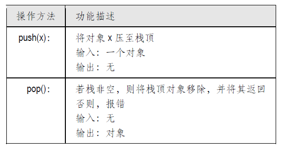
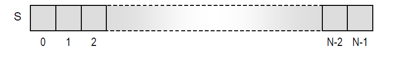

## 数据结构 - 栈

- [栈简介](#栈简介)
- [栈ADT](#栈ADT)
- [基于数组的简单实现](#基于数组的简单实现)
- [Java虚拟机中的栈](#Java虚拟机中的栈)

### 栈简介

栈是存放对象的一种特殊容器，在插入与删除对象时，这种结构遵循后进先出（Last-in-first-out，
LIFO）的原则⎯⎯也就是说，对象可以任意插入栈中，但每次取出的都是此前插入的最后一个对象。
比如一摞椅子（如图二.1 所示），只能将最顶端的椅子移出，也只能将新椅子放到最顶端⎯⎯这两
种操作分别称作入栈（Push）和退栈（Pop）。


由椅子构成的栈

栈是最基本的数据结构之一，在实际应用中几乎无所不在。例如，网络浏览器会将用户最近访
问过的地址组织为一个栈：用户每访问一个新页面，其地址就会被存放至栈顶；而用户每次按下
“Back”按钮，最后一个被记录下的地址就会被清除掉。再如，当今主流的文本编辑器大都支持编
辑操作的历史记录功能：用户的编辑操作会被依次记录在一个栈中；一旦出现误操作，用户只需按
下“Undo”按钮，即可撤销最近一次操作并回到此前的编辑状态。

### 栈ADT

作为一种抽象数据类型，栈必须支持以下方法：



此外，还可以定义如下的方法：


给出了从一个空栈开始，在依次执行一系列操作的过程中，栈中内容的相应变化


### Stack
由于其重要性，在Java 的java.util 包中已经专门为栈结构内建了一个类⎯⎯java.util.Stack。
任何Java 对象都可以作为该内建类的栈元素，同时该类还提供了多种方法：push()、pop()、peek()
（功能等价于top()）、getSize()以及empty()（功能等价于isEmpty()）。在遇到空栈时，方法pop()
和peek()都会报意外错ExceptionStackEmpty。这个内建类使用起来很方便，不过，为了达到学习
的效果，我们还是需要对其中若干最基本的问题进行讨论，并亲自动手来设计并实现栈结构。

Java抽象数据类型的实现过程，通常可以分为两步。首先，要给出其应用程序接口定义
（Application programming interface, API），简称接口（Interface）。接口的作用，就是明确ADT所
支持方法的名称、声明及调用的形式。此外，还要针对各种可能出现的错误条件，定义相应的意外。

例如代码1 中定义的ExceptionStackEmpty的意外⎯⎯在对空栈应用pop()或top()方法时，这一意外就会被抛出，以报告错误。
```java
public class ExceptionStackEmpty extends RuntimeException{
    
    public ExceptionStackEmpty(String message) {
        super(message);
    }
}
```
以下代码2 给出了栈ADT的完整Java接口。可以看出，这个接口非常通用，按照该接口的定
义，属于任何类（哪怕是异构类）的对象，都可以作为栈的成员。
```java
public interface Stack<E> {

    /**
     * 入栈
     */
    void push(E e);

    /**
     * 出栈
     */
    E pop() throws ExceptionStackEmpty;

    /**
     * 获取长度
     */
    int size();

    /**
     * 判断是否为空
     */
    boolean isEmpty();

    /**
     * 取栈顶元素（但不删除）
     */
    Object top() throws ExceptionStackEmpty;
}
```
要使栈ADT 真正有用，还需要定义出一个具体的类，来实现与该ADT 接口中定义的各个方法。
接下来，我们就给出Stack 接口的一个简单实现。

### 基于数组的简单实现
- 思路
为了实现栈接口，我们可以用一个数组来存放其中的元素。具体来说，就是使用一个容量为N的数组S，再加上一个变量top 来只是当前栈顶的位置。



由于Java数组的元素都是从0 开始编号，所以top必须初始化为-1；反过来，只要top = -1，就
说明栈为空。另一方面，由于数组的容量固定，因此有可能会出现栈溢出的情况。为此，我们专门
引入一个新的意外ExceptionStackFull（如代码 3 所示），以指示这类错误。需要注意的是，
这一例外并非栈ADT本身的要求，而只是针对数组实现而设置的。
```java
public class ExceptionStackFull extends RuntimeException{

    public ExceptionStackFull(String message) {
        super(message);
    }
}
```
- 自定义实现Stack
基于数组的栈实现细节
```java
public class StackArray<E> implements Stack<E> {

    transient Object[] elementData;

    //默认长度
    transient static final int DEFAULT_CAPACITY = 512;

    //实际容量
    protected int capacity;

    //栈顶元素的位置
    protected int top = -1;

    public StackArray() {
        this(DEFAULT_CAPACITY);
    }

    public StackArray(int initialCapacity) {
        if(initialCapacity > 0){
            capacity = initialCapacity;
            this.elementData = new Object[initialCapacity];
        }
        else if(initialCapacity == 0){
            capacity = DEFAULT_CAPACITY;
            this.elementData = new Object[DEFAULT_CAPACITY];
        }
        else{
            throw new IllegalArgumentException("Illegal Capacity: "+initialCapacity);
        }
    }

    @Override
    public void push(Object e) {
        if (size() == capacity){
            throw new ExceptionStackFull("意外：栈溢出");
        }
        elementData[++top] = e;
    }

    @Override
    public E pop() throws ExceptionStackEmpty {
        E element;
        assertEmpty();
        element = elementData(top);
        elementData[top--] = null;
        return element;
    }

    @Override
    public int size() {
        return (top + 1);
    }

    @Override
    public boolean isEmpty() {
        return top < 0;
    }

    @Override
    public E top() throws ExceptionStackEmpty {
        assertEmpty();
        return elementData(top);
    }

    protected void assertEmpty(){
        if (isEmpty()) {
            throw new ExceptionStackEmpty("意外：栈空");
        }
    }

    E elementData(int index) {
        return (E) elementData[index];
    }
}
```

### Java虚拟机中的栈

Java 的每一个程序都要被编译为一个二进制指令序列，这些指令可以在一个特定的计算模型
⎯⎯Java 虚拟机（Java Virtual Machine, JVM）⎯⎯上执行。就Java 语言自身的定义而言，JVM
起着关键性的作用。正是由于可以将Java 源程序编译为JVM 的可执行代码，而不是在某一特定CPU
上直接支持的可执行代码，才使得Java 程序可以运行于任何计算机⎯⎯只要该计算机上配有一个
JVM 解释器。十分有趣的是，对于JVM 的定义而言，栈这一数据结构也是至关重要的。
- Java 方法栈
任一运行中的Java程序（更准确地说，应该是运行中的Java线程）都会配备一个私有的栈，称
作Java方法栈（Java method stack）或简称Java栈（Java stack），用来记录各个方法在被调用过
程中的局部变量等重要信息（参见图 3）。
具体来说，在Java 程序的执行期间，JVM 会维护一个栈，其中的元素分别是当前活跃的某个
方法实例的描述符，称作帧（Frame）。比如，若方法N 调用了方法M，则在M 的这个实例所对应
的帧中，记录了该实例的调用参数以及其中的局部变量，还有关于N 的信息，以及在M 结束时应该
返回给N 的东西。

JVM 还设置了一个称作程序计数器（Program counter）的变量PC，负责记录程序在JVM 中
运行到的当前位置。当方法N 要调用方法M 时，程序计数器当前的数值就会被存放在N 的实例所
对应的帧中⎯⎯这样，待M 执行完毕后，JVM 才能知道应该返回到什么位置并继续执行下去。Java
栈中最顶层的帧，总是对应于当前正在执行的方法实例。其余的各帧，分别对应于某个被挂起、尚
未执行完的方法。居于栈底的那一帧对应于main 方法，其余各帧自栈底向上按照被调用的次序顺序
排列。每当有一个方法被调用，其对应的帧就会被压入栈中；一旦当前方法实例运行终止，程序计
数器就会恢复为该帧中先前保存的位置，然后该帧出栈，控制权转交给新栈顶所对应的方法实例。
JVM 还会通过Java 栈将参数传递给被调用的方法。具体来说，Java 是按照“值传递”
（Call-by-value）的方式传递参数的。也就是说，以参数形式传递给被调用方法的，总是变量或表
达式当前的实际值。

对于属于基本类型（比如int或float）的变量x，x的当前值就是其算数值。假设方法N调用方法M
时，如果x作为参数传递给M，那么x的当前值就会被复制到M所对应帧中的某个局部变量（参见图 3）。
需要指出的是，此后即使方法M修改了该局部变量的数值，x在N中的数值也决不会受到影响。
不过，倘若x 是指向某对象o 的一个引用，那么x 的当前值就是对象o 的内存地址。因此，如
果将x 作为参数传递给方法N，实际上传递的是对象o 的内存地址。这个地址被复制给N 的某个局
部变量y 之后，y 也将和x 一样地指向对象o。


java方法栈的实例：方法main调用方法N，方法N再调用方法M

因此，一旦方法M 通过引用y 改变了对象o 的状态，也就是修改了该引用所指的对象。同理，
即使方法M 将y 指向其它对象，x 依然还是指向对象o。

JVM 正是这样地借助方法栈来调用方法并传递参数。无独有偶，方法栈并非Java 首次采用，
实际上，多数现代程序语言（C、C++等）都采用了这一机制。


