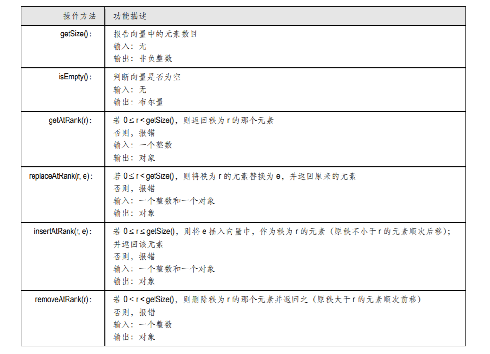
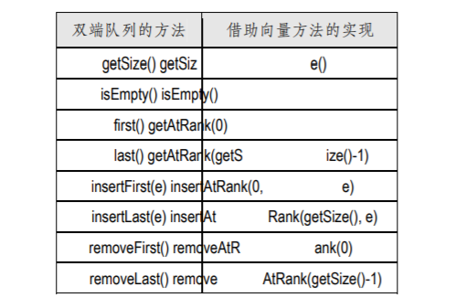

## 数据结构 ☞ 向量与数组

假定集合 S 由 n 个元素组成，它们按照线性次序存放，于是我们就可以直接访问其中的第一个
元素、第二个元素、第三个元素……。也就是说，通过[0, n-1]之间的每一个整数，都可以直接访问
到唯一的元素 e，而这个整数就等于 S 中位于 e 之前的元素个数⎯⎯在此，我们称之为该元素的秩
（Rank）。不难看出，若元素 e 的秩为 r，则只要 e 的直接前驱（或直接后继）存在，其秩就是 r-1
（或 r+1）。这一定义与 Java、C++之类的程序语言中关于数组元素的编号规则是一致的。

支持通过秩直接访问其中元素的序列，称作向量（Vector）或数组列表（Array list）。实际上，
秩这一直观概念的功能非常强大⎯⎯它可以直接指定插入或删除元素的位置。

- [向量ADT](#向量ADT)
- [基于数组的简单实现](#基于数组的简单实现)
- [ 基于可扩充数组的实现](#基于可扩充数组的实现)


### 向量ADT
向量 ADT 定义了如下方法:



请注意其中的 insertAtRank()方法，该方法之所以要返回被插入的元素，是为了使程序员可以链式编程。

一种直截了当的方法就是采用数组来实现向量：下标为r的数组项，就对应于秩为r的元素。当
然，还有很多种其它的实现形式。之所以要提出秩的概念，就是为了使我们不用了解序列的具体实
现，就可以通过广义的“下标”直接访问序列中对应的元素。如 表三.2 所示，随着序列的更新，其
中元素的秩也会不断变化。


- 意外错
当作为参数的秩越界时，对应的意外错为ExceptionBoundaryViolation
```java
public class ExceptionBoundaryViolation extends RuntimeException{

    public ExceptionBoundaryViolation(String message) {
        super(message);
    }
}
```
- 向量接口
```java
public interface Vector<E> {

    /**
     * 返回向量中元素数目
     * @return
     */
    int size();

    /**
     * 判断向量是否为空
     * @return
     */
    boolean isEmpty();

    /**
     * 取秩为r的元素
     * @param r
     * @return
     * @throws ExceptionBoundaryViolation
     */
    E getAtRank(int r) throws ExceptionBoundaryViolation;

    /**
     * 替换指定下标的元素
     * @param r
     * @param obj
     * @return
     * @throws ExceptionBoundaryViolation
     */
    E replaceAtRank(int r, E obj) throws ExceptionBoundaryViolation;

    /**
     * 插入obj，作为秩为r的元素；返回该元素
     * @param r
     * @param obj
     * @return
     */
    E insertAtRank(int r, E obj) throws ExceptionBoundaryViolation;

    /**
     * 删除秩为r的元素
     * @param r
     * @return
     * @throws ExceptionBoundaryViolation
     */
    E removeAtRank(int r) throws ExceptionBoundaryViolation;
}
```

- 利用向量实现双端队列
向量提供的以上方法似乎不多，但如图 所示，通过这些方法，完全可以实现之前定
义的双端队列ADT中的所有方法。



### 基于数组的简单实现
基于数组，可以直接实现向量 ADT。我们借用一个数组 A[]，其中 A[i]分别存放一个引用，指向
秩为 i 的向量元素。为此，A[]的容量 N 需要足够大，还需要设置一个实例变量 n 指示向量的实际规模。

```java
public class ArrayVector<E> implements Vector<E>{
    //数组的容量
    private final int DEFAULT_CAPACITY = 1024;
    //向量的实际规模
    private int size = 0;
    //对象数组
    private Object[] elementData;

    public ArrayVector() {
        this.elementData = new Object[DEFAULT_CAPACITY];
        this.size=0;
    }

    @Override
    public int size() {
        return size;
    }

    @Override
    public boolean isEmpty() {
        return 0 == size;
    }

    @Override
    public E getAtRank(int r) throws ExceptionBoundaryViolation {
        if (0 > r || r >= size) {
            throw new ExceptionBoundaryViolation("意外：秩越界");
        }
        return elementData(r);
    }

    @Override
    public E replaceAtRank(int r, E obj) throws ExceptionBoundaryViolation {
        if (0 > r || r >= size) {
            throw new ExceptionBoundaryViolation("意外：秩越界");
        }
        E oldEle = elementData(r);
        elementData[r] = obj;
        return oldEle;
    }

    @Override
    public E insertAtRank(int r, E obj) throws ExceptionBoundaryViolation {
        if (0 > r || r >= DEFAULT_CAPACITY) {
            throw new ExceptionBoundaryViolation("意外：秩越界");
        }
        if (size >= DEFAULT_CAPACITY){
            throw new ExceptionBoundaryViolation("意外：数组溢出");
        }
        //后续元素顺次后移
        System.arraycopy(elementData, r, elementData, r + 1, size - r);
        //插入
        elementData[r] = obj;
        //更新当前规模
        size++;
        return obj;
    }

    @Override
    public E removeAtRank(int r) throws ExceptionBoundaryViolation {
        if (0 > r || r >= size) {
            throw new ExceptionBoundaryViolation("意外：秩越界");
        }
        E bak = elementData(r);
        //后续元素顺次前移
        System.arraycopy(elementData, r + 1, elementData, r, size - r);
        size--;//更新当前规模
        return bak;
    }

    E elementData(int index) {
        return (E) elementData[index];
    }
}
```
 基于可扩充数组的实现

### 基于可扩充数组的实现
上面给出的向量实现，有个很大的缺陷⎯⎯数组容量N固定。一方面，在向量规模很小时，
预留这么多的空间实属浪费；反过来，当向量规模超过N时，即使系统有足够的空间资源，也会因
意外错而崩溃。幸好，有一个简易的方法可以克服这一缺陷。

我们希望向量能够根据实际需要，动态地扩充数组的容量。当然，Java 语言本身并不支持这一
功能，与多数程序语言一样，Java 中数组的容量都是固定的。我们的策略是，一旦数组空间溢出（即n≥N），
insertAtRank()方法就会做如下处理：

    1. 开辟一个容量为2N的新数组B
    2. 将A[]中各元素搬迁至B[]，即B[i]=A[i]，i=0, …, N-1 
    3. 将A替换为B，即令A=B 
    
此后，insertAtRank()就可以将新元素插入至扩容后的数组了。
实际上，这就是所谓的可扩充数组（Extendable array）策略。就像蝉一样，每当生长到足够
大时，就会蜕去原来的外壳，换上一身更大的外壳。具体过程如图所示。不必担心原先的数组，
它占用的空间将被内存回收器自动回收   

 

```java
public class ExtArrayVector<E> implements Vector<E>{

    private int DEFAULT_CAPACITY = 16;
    //向量的实际规模
    private int size;
    //对象数组
    private Object elementData[];

    public ExtArrayVector() {
        this.elementData = new Object[DEFAULT_CAPACITY];
        this.size = 0;
    }

    public ExtArrayVector(int initialCapacity) {
        if(initialCapacity < 0){
            throw new ExceptionBoundaryViolation("initialCapacity :" + initialCapacity);
        }
        this.elementData = new Object[initialCapacity];
        this.size = 0;
    }

    @Override
    public int size() {
        return size;
    }

    @Override
    public boolean isEmpty() {
        return 0 == size;
    }

    @Override
    public E getAtRank(int r) throws ExceptionBoundaryViolation {
        if(0 > r || r >size){
            throw new ExceptionBoundaryViolation("下标越界");
        }
        return elementData(r);
    }

    @Override
    public E replaceAtRank(int r, E obj) throws ExceptionBoundaryViolation {
        if(r > size){
            throw new ExceptionBoundaryViolation("下标越界");
        }
        E oldEle = elementData(r);
        elementData[r] = obj;
        return oldEle;
    }

    @Override
    public E insertAtRank(int r, E obj) throws ExceptionBoundaryViolation {
        if(0 > r){
            throw new ExceptionBoundaryViolation("下标越界");
        }
        //空间溢出的处理
        if (DEFAULT_CAPACITY <= size) {
            DEFAULT_CAPACITY *= 2;
            //开辟一个容量加倍的数组
            Object[] elementCopy = new Object[DEFAULT_CAPACITY];
            for (int i=0; i<size; i++) {
                //elementData[]中内容复制至elementCopy[]
                elementCopy[i] = elementData[i];
            }
            //用elementCopy替换elementData（原elementData[]将被自动回收）
            elementData = elementCopy;
        }
        //后续元素顺次后移
        for (int i=size; i>r; i--) {
            elementData[i] = elementData[i-1];
        }
        elementData[r] = obj;//插入
        size++;//更新当前规模
        return obj;
    }

    @Override
    public E removeAtRank(int r) throws ExceptionBoundaryViolation {
        if(0 > r || r > size){
            throw new ExceptionBoundaryViolation("下标越界");
        }
        E oldEle = elementData(r);
        System.arraycopy(elementData, r + 1, elementData, r, size - r);
        size--;//更新当前规模
        return oldEle;
    }

    E elementData(int index) {
        return (E) elementData[index];
    }
}
```


- 时间复杂度的分摊分析
与简单的数组实现相比，基于可扩充数组的实现可以更高效地利用存储空间。另外，只要系统
还有可利用的空间，向量的最大规模将不再受限于数组的容量。然而，我们也需要为此付出代价⎯⎯
每次扩容时，需要花费额外的时间以将原数组的内容复制到新数组中。准确地说，为了将数组的容
量由 N 扩至 2N，需要花费 O(N)的时间。

如此看来，上述扩充数组的策略似乎效率很低。然而幸运的是，这不过是一种错觉。事实上，
每经过一次扩充，数组的容量都会加倍，此后，至少要再经过 N 次插入操作，才有可能需要再次扩
容。也就是说，随着向量规模的增加，需要进行扩容的概率会急剧下降。下面，我们就对此做一严格的分析。

不过，扩容操作的执行并不确定，因此无法采用通常的方法来度量和分析其复杂度。为此，我
们可以引入分摊复杂度的概念。所谓分摊运行时间（Amortized running time ），就是指在连续执行
的足够多次操作中，每次操作所需的平均运行时间。

需要强调的是: 这里分摊时间(Amortized time) 与平均时间(Average r unning time) 有本质的区
别。一个算法的平均运行时间，指的是对于出现概率符合某种分布的所有输入，算法所需运行时间
的平均值，因此也称作期望运行时间（Expected running time）。而这里的分摊运行时间，指的是
在反复使用某一算法及其数据结构的过程中，连续的足够多次运行所需时间的平均值。

以这里的可扩充数组为例，我们需要考察对这一结构的连续 n 次操作，将每次操作所需的时间
累计起来，然后除以 n，只要 n 足够大，这个平均时间就是分摊运行时间。


