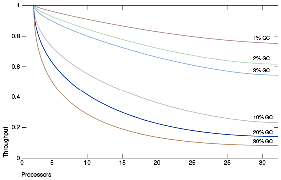
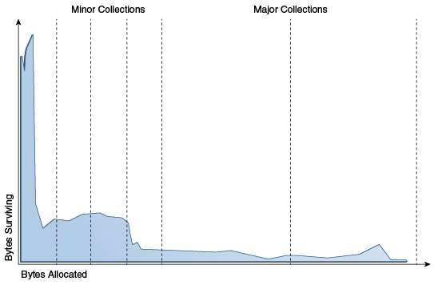
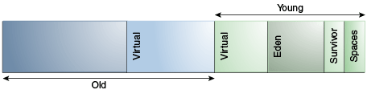
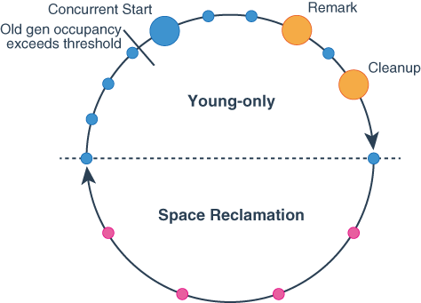

## HotSpot虚拟机垃圾收集优化指南

- [1. 垃圾收集优化简介](#垃圾收集优化简介)
    - [1.1 什么是垃圾收集器](#什么是垃圾收集器)
    - [1.2 为什么选择垃圾收集器很重要](#为什么选择垃圾收集器很重要)
- [2. Ergonomics](#Ergonomics)  
    - [2.1 垃圾收集器，堆和运行时编译器的默认选择](#垃圾收集器，堆和运行时编译器的默认选择)
    - [2.2 基于行为的调整](#基于行为的调整)  
        - [2.2.1 最大暂停时间目标](#最大暂停时间目标)  
        - [2.2.2 吞吐量目标](#吞吐量目标)  
        - [2.2.3 Footprint](#Footprint)  
    - [2.3 调整策略](#调整策略)  
- [3. 垃圾收集器的实现](#垃圾收集器的实现)  
    - [3.1 通用垃圾收集](#通用垃圾收集)  
    - [3.2 Generations](#Generations)  
    - [3.3 性能考量](#性能考量)  
    - [3.4 吞吐量和足迹测量](#吞吐量和足迹测量)  
- [4. 影响垃圾收集性能的因素](#影响垃圾收集性能的因素)      
    - [4.1 总堆](#总堆)      
        - [4.1.1 影响Generations大小的堆选项](#影响Generations大小的堆选项)      
        - [4.1.2 堆大小的默认选项值](#堆大小的默认选项值)      
        - [4.1.3 通过最小化Java堆大小来节省动态占用空间](#通过最小化Java堆大小来节省动态占用空间)      
    - [4.2 年轻一代](#年轻一代)      
        - [4.2.1 年轻代大小选项](#年轻代大小选项)      
        - [4.2.2 幸存者空间大小](#幸存者空间大小)  
- [5. 可用收集器](#可用收集器)            
    - [5.1 串行收集器](#串行收集器)  
    - [5.2 并联收集器](#并联收集器)  
    - [5.3 垃圾优先G1垃圾收集器](#垃圾优先G1垃圾收集器)  
    - [5.4 Z垃圾收集器](#Z垃圾收集器)  
    - [5.5 选择收集器](#选择收集器)  
- [6. 并行收集器](#并行收集器)  
    - [6.1 并行收集器垃圾收集器线程数](#并行收集器垃圾收集器线程数)  
    - [6.2 并行收集器中代的安排](#并行收集器中代的安排)  
    - [6.3 并行收集器工效学](#并行收集器工效学)  
        - [6.3.1 指定并行收集器行为的选项](#指定并行收集器行为的选项)  
        - [6.3.2 并行收集器目标的优先级](#并行收集器目标的优先级)  
        - [6.3.3 并行收集器生成大小调整](#并行收集器生成大小调整)  
        - [6.3.4 并行收集器默认堆大小](#并行收集器默认堆大小)
            - [6.3.4.1 并行收集器的初始堆大小和最大堆大小的规范](#并行收集器的初始堆大小和最大堆大小的规范)
    - [6.4 并行收集器时间过多和OutOfMemoryError](#并行收集器时间过多和OutOfMemoryError)  
    - [6.5 并行收集器测量](#并行收集器测量)  
- [7.G1垃圾收集器](#G1垃圾收集器)    
    - [7.1 G1垃圾收集器简介](#G1垃圾收集器简介)    
    - [7.2 启用G1](#启用G1)    
    - [7.3 基本概念](#基本概念)    
        - [7.3.1 堆布局](#堆布局)    
        - [7.3.2 垃圾回收周期](#垃圾回收周期)    
    - [7.4 垃圾优先](#垃圾优先)  
        - [7.4.1 垃圾优先](#Java堆大小调整)  
            - [7.4.1.1 年轻代阶段大小](#年轻代阶段大小)  
            - [7.4.1.2 空间回收阶段生成大小](#空间回收阶段生成大小)  
        - [7.4.2 定期垃圾回收](#定期垃圾回收)  
        - [7.4.3 确定初始堆占用率](#确定初始堆占用率)  
        - [7.4.4 堆非常紧的情况下的行为](#堆非常紧的情况下的行为)  
    - [7.5 G1默认值](#G1默认值)  
    - [7.6 与其他收集器的比较](#与其他收集器的比较)
- [8. 圾收集器优化](#垃圾收集器优化)  
    - [8.1 G1的一般建议](#G1的一般建议)  
    - [8.2 从其他收集器移至G1](#从其他收集器移至G1)  
    - [8.3 改善G1表现](#改善G1表现)  
        - [8.3.1 观察完整的垃圾收集](#观察完整的垃圾收集)  
        - [8.3.2 巨大的物体碎片](#巨大的物体碎片)  
        - [8.3.3 调整延迟](#调整延迟)  
            - [8.3.3.1 异常的系统或实时使用](#异常的系统或实时使用)  
            - [8.3.3.2 参考对象处理花费的时间太长](#参考对象处理花费的时间太长)  
            - [8.3.3.2 “仅年轻”阶段中的“仅年轻”集合花费的时间太长](#“仅年轻”阶段中的“仅年轻”集合花费的时间太长)  
            - [8.3.3.3 混合收集时间太长](#混合收集时间太长)  
            - [8.3.3.4 高更新RS和扫描RS时间](#高更新RS和扫描RS时间)  
        - [8.3.4 吞吐量调整](#吞吐量调整)  
        - [8.3.5 调整堆大小](#调整堆大小)  
        - [8.3.6 可调默认值](#可调默认值) 
- [9. Z垃圾收集器](#ZGC垃圾收集器)         
    - [9.1 设置堆大小](#设置堆大小)         
    - [9.2 设置堆大小](#设置并发GC线程数)         
    
### 垃圾收集优化简介
从桌面上的小applet到大型服务器上的Web服务，各种各样的应用程序都使用Java平台标准版（Java SE）。
为了支持这种多样化的部署范围，Java HotSpot VM提供了多个垃圾收集器，每个垃圾收集器旨在满足不同的需求。
Java SE根据运行应用程序的计算机的类别选择最合适的垃圾收集器。但是，此选择可能并非对每个应用程序都是最佳的。
具有严格性能目标或其他要求的用户，开发人员和管理员可能需要明确选择垃圾回收器并调整某些参数以实现所需的性能水平。
本文档提供了有助于完成这些任务的信息。

首先，在串行停止世界收集器的上下文中描述了垃圾收集器的一般功能和基本调整选项。
然后介绍了其他收集器的特定功能以及选择收集器时要考虑的因素。
#### 什么是垃圾收集器

垃圾收集器（GC）自动管理应用程序的动态内存分配请求。

垃圾收集器通过以下操作执行自动动态内存管理：

- 从操作系统分配内存并将其还给操作系统。
- 根据请求将内存分发给应用程序。
- 确定应用程序仍在使用该内存的哪些部分。
- 回收未使用的内存，以供应用程序重新使用。

Java HotSpot垃圾收集器采用了各种技术来提高这些操作的效率：

- 将分代清理与老化结合使用，将精力集中在堆中最有可能包含大量可回收内存区域的区域上。
- 使用多个线程来积极地使操作并行化，或者在后台与应用程序并发执行一些长时间运行的操作。
- 尝试通过压缩活动对象来恢复较大的连续可用内存。

#### 为什么选择垃圾收集器很重要

垃圾收集器的目的是使应用程序开发人员摆脱手动动态内存管理。开发人员摆脱了将分配与释放分配进行匹配的需求，
并密切注意分配的动态内存的生命周期。这完全消除了与内存管理有关的某些错误类别，
但付出了一些额外的运行时开销。Java HotSpot VM提供了一系列垃圾收集算法供您选择。

什么时候选择垃圾收集器很重要？对于某些应用程序，答案永远是不可能的。也就是说，在存在垃圾收集的情况下，
应用程序可以在频率和持续时间适度的暂停下表现良好。但是，对于大类应用程序却不是这种情况，
尤其是那些具有大量数据（数千兆字节），许多线程和高事务处理率的应用程序。

阿姆达尔定律（给定问题中的并行加速受问题的顺序部分限制）意味着大多数工作负载无法完美并行化；
某些部分始终是顺序的，不能从并行性中受益。在Java平台中，当前有4种受支持的垃圾收集替代方案，
除其中一种（串行GC）之外，其余所有方案均并行进行以提高性能。尽可能减少垃圾收集的开销非常重要。在下面的示例中可以看到。

图1-1中的图对理想系统进行了建模，该系统除了垃圾回收外，还具有完美的可伸缩性。
红线表示应用程序仅在单处理器系统上花费1％的时间进行垃圾回收。在具有32个处理器的系统上，这意味着吞吐量损失超过20％。
洋红线显示，对于一个应用程序来说，垃圾回收的时间为10％（在单处理器应用程序中，垃圾回收的时间不算多），
当扩展到32个处理器时，将损失超过75％的吞吐量。

图1-1比较垃圾回收中花费的时间百分比



该图表明，在小型系统上进行开发时，可忽略的吞吐量问题可能会在扩展到大型系统时成为主要瓶颈。
但是，在减少这种瓶颈方面进行小的改进可以提高性能。
对于足够大的系统，有必要选择正确的垃圾收集器并在必要时进行调整。

串行收集器通常适合大多数小型应用程序，特别是那些在现代处理器上需要高达约100 MB的堆的应用程序。
其他收集器具有额外的开销或复杂性，这是专门行为的代价。如果应用程序不需要备用收集器的特殊行为，请使用串行收集器。
不能期望串行收集器是最佳选择的一种情况是大型，高线程应用程序运行在具有大量内存和两个或多个处理器的计算机上。
在此类服务器级计算机上运行应用程序时，默认情况下会选择“垃圾优先”（G1）收集器；

### Ergonomics

人体工程学是Java虚拟机（JVM）和垃圾收集启发法（例如基于行为的启发法）提高应用程序性能的过程。

JVM为垃圾收集器，堆大小和运行时编译器提供了依赖于平台的默认选择。这些选择可满足不同类型应用程序的需求，
同时需要较少的命令行调整。此外，基于行为的调整可动态优化堆的大小，以满足应用程序的指定行为。

本节描述了这些默认选择和基于行为的调整。在使用后续各节中介绍的更详细的控件之前，请使用这些默认值。

#### 垃圾收集器，堆和运行时编译器的默认选择

这些是重要的垃圾收集器，堆大小和运行时编译器的默认选择： 

- 垃圾优先（G1）收集器
- GC线程的最大数量受堆大小和可用CPU资源的限制 
- 初始堆大小为物理内存的1/64 
- 最大堆大小为物理内存的1/4 
- 使用C1和C2的分层编译器 

#### 基于行为的调整

可以将Java HotSpot VM垃圾收集器配置为优先满足以下两个目标之一：
最大暂停时间和应用程序吞吐量。如果达到了首选目标，则收集者将尝试使另一个最大化。
自然地，这些目标并不总是可以满足的：应用程序需要最小的堆来容纳至少所有实时数据，
而其他配置可能会阻止达到某些或所有期望的目标。

##### 最大暂停时间目标

在暂停时间是在垃圾收集器停止应用程序并恢复空间不再使用的持续时间。其意图*最大停顿时间*目标是限制最长的这些暂停的。

垃圾回收器会保持平均的暂停时间和该平均值的方差。平均值是从执行开始算起的，但会对其进行加权，以使最近的暂停次数增加。
如果平均时间加上暂停时间的方差大于最大暂停时间目标，则垃圾收集器认为未达到目标。

最大暂停时间目标是通过命令行选项`-XX:MaxGCPauseMillis=<nnn>`*指定的*。这被解释为向垃圾收集器的提示，要求暂停时间为**毫秒*或更短*。
垃圾收集器会调整Java堆大小以及与垃圾收集相关的其他参数，以使垃圾收集的暂停时间短于**毫秒。最大暂停时间目标的默认值因收集器而异。
这些调整可能导致垃圾回收更加频繁地发生，从而降低了应用程序的整体吞吐量。但是，在某些情况下，无法达到所需的暂停时间目标。

##### 吞吐量目标

吞吐量目标是根据收集垃圾所花费的时间来衡量的，而在垃圾收集之外所花费的时间就是*应用时间*。

该目标由命令行选项`-XX:GCTimeRatio=<nnn>`指定。垃圾回收时间与应用程序时间之比为1 /（1+ *nnn*）。
例如，`-XX:GCTimeRatio=19`将垃圾收集目标设置为目标1/20或总时间的5％。

垃圾收集所花费的时间是所有垃圾收集引起的暂停的总时间。如果没有达到吞吐量目标，
那么垃圾收集器可能采取的一种措施是增加堆的大小，以便在两次收集暂停之间花费在应用程序中的时间可以更长。

#### Footprint

如果已满足吞吐量和最大暂停时间目标，则垃圾收集器会减小堆的大小，直到无法满足其中一个目标（始终是吞吐量目标）。
可以分别使用` -Xms=`**和`-Xmx=`**分别设置垃圾收集器可以使用的最小和最大堆大小，以分别指定最小和最大堆大小。

#### 调整策略

堆增长或缩小到支持所选吞吐量目标的大小。了解有关堆调整策略的信息，例如选择最大堆大小和选择最大暂停时间目标。

除非您知道需要的堆大于默认的最大堆大小，否则不要为堆选择最大值。选择适合您的应用程序的吞吐量目标。

应用程序行为的更改可能导致堆增大或缩小。例如，如果应用程序开始以更高的速率分配，那么堆会增长以保持相同的吞吐量。

如果堆增长到最大大小并且未达到吞吐量目标，则最大堆大小对于吞吐量目标而言太小。将最大堆大小设置为接近平台上总物理内存的值，
但不会导致应用程序交换。再次执行该应用程序。如果仍然没有达到吞吐量目标，那么对于平台上的可用内存来说，应用程序时间目标太高了。

如果可以满足吞吐量目标，但暂停时间太长，则选择最大暂停时间目标。选择最大暂停时间目标可能意味着您的吞吐量目标将无法实现，因此请选择对应用程序可接受的折衷值。

当垃圾收集器试图满足竞争目标时，堆的大小通常会发生波动。即使应用程序已达到稳定状态，也是如此。达到吞吐量目标（可能需要更大的堆）的压力与目标竞争，
以获得最大的暂停时间和最小的占用空间（这两者都可能需要一个小堆）。

### 垃圾收集器的实现
Java SE平台的优势之一在于，它使开发人员免受内存分配和垃圾回收的复杂性的困扰。

但是，当垃圾收集是主要瓶颈时，了解实现的某些方面很有用。垃圾收集器对应用程序使用对象的方式进行了假设，
这些反映在可调整的参数中，可以调整这些参数以提高性能，而不会牺牲抽象的力量。

#### 通用垃圾收集

当无法从正在运行的程序中任何其他活动对象的任何引用中访问该对象时，该对象被视为垃圾，并且VM可以重用其内存。

一种理论上最直接的垃圾回收算法，每次运行时都会遍历每个可到达的对象。任何剩余的对象都被视为垃圾。
这种方法花费的时间与活动对象的数量成正比，这对于维护大量活动数据的大型应用程序是不允许的。

Java HotSpot VM包含许多不同的垃圾收集算法，除了ZGC使用称为通用收集的技术外，所有算法均如此。
垃圾收集每次都会检查堆中的每个活动对象，而分代收集则利用大多数应用程序的经验观察到的属性，
以最大程度地减少回收未使用（垃圾）对象所需的工作。这些观察到的特性中最重要的是弱代假设，
该假设指出大多数物体只能存活很短的时间。

图3-1中的蓝色区域是对象生命周期的典型分布。x轴显示以分配的字节为单位的对象寿命。
、y轴上的字节数是具有相应生存期的对象中的总字节数。左侧的尖峰表示分配后可以回收的对象（换句话说，已经“死亡”）。
例如，iterator对象通常仅在单个循环的时间内才存在。

图3-1对象生命周期的典型分布


有些对象的寿命更长，因此分布向右扩展。例如，通常在初始化时分配一些对象，这些对象会一直存在直到VM退出。
在这两个极端之间的是在某些中间计算过程中存在的对象，此处被视为初始峰值右侧的块。
一些应用程序的外观分布非常不同，但是令人惊讶的是，大量应用程序具有这种总体形状。
通过关注大多数对象“早逝”这一事实，可以进行有效的收集。

#### Generations

为了针对这种情况进行优化，内存要分代管理（存储着不同年龄对象的内存池）。
当`Generations`填满时，垃圾回收会在每个`Generations`中发生。

绝大多数对象分配在专用于年轻对象（年轻一代）的池中，并且大多数对象在那里死亡。
当年轻一代填满时，将导致次要集合，其中仅收集年轻一代。没有回收其他`Generations`的垃圾。
首先，这种收集的费用与所收集的有生命物体的数量成正比；可以很快收集到充满死亡物体的年轻一代。
通常，在每个次要收藏期间，来自年轻一代的幸存对象中有一部分会转移到老一代。
最终，老一代人填满了，必须被收集起来，导致大量收集，其中收集了整个堆。
主要集合的持续时间通常比次要集合的持续时间长得多，因为涉及的对象数量大得多。
图3-2显示了串行垃圾收集器中各代的默认排列：


在启动时，Java HotSpot VM会在地址空间中保留整个Java堆，但除非需要，
否则不会为其分配任何物理内存。从逻辑上讲，覆盖Java堆的整个地址空间都分为年轻一代和老一代。
保留给对象存储器的完整地址空间可以分为年轻一代和老一代。

年轻一代由伊甸园和两个幸存者空间组成。大多数对象最初是在eden中分配的。
一个幸存者空间随时都是空的，在伊甸园中用作活动对象的目的地，而在垃圾回收期间，另一个幸存者空间用作目的地；垃圾回收后，
伊甸园和源幸存者空间为空。在下一个垃圾收集中，交换了两个幸存者空间的目的。
最近填充的一个空间是复制到另一个幸存者空间中的活动对象的来源。以这种方式在幸存者空间之间复制对象，
直到将它们复制了一定次数或空间不足为止。这些对象被复制到旧区域中。此过程也称为老化。

#### 性能考量

垃圾收集的主要衡量指标是吞吐量和延迟。

- *吞吐量*是长时间内未花费在垃圾收集上的总时间的百分比。吞吐量包括分配所花费的时间（但是通常不需要调整分配速度）。
- *延迟*是应用程序的响应能力。垃圾收集暂停会影响应用程序的响应速度。

用户对垃圾回收有不同的要求。例如，有些人认为Web服务器的正确度量标准是吞吐量，因为垃圾回收期间的暂停可能是可以容忍的，
或者可能被网络延迟所掩盖。但是，在交互式图形程序中，即使短暂的暂停也会对用户体验产生负面影响。

一些用户对其他注意事项敏感。*足迹*是流程的工作集，以页和缓存行为单位。在物理内存有限或有许多进程的系统上，
占用空间可能决定可伸缩性。*及时性*是当一个物体变得死亡之间的时间当内存可用，分布式系统，包括远程方法调用（RMI）的重要考虑因素。

通常，为特定`Generations`选择大小是这些考虑之间的权衡。例如，一个非常大的年轻一代可以最大化吞吐量，但是这样做会以占用空间，
及时性和暂停时间为代价。可以通过使用少量的年轻一代来最小化年轻一代的停顿，但会降低吞吐量。
一代的大小不会影响另一一代的收集频率和暂停时间。

没有选择`Generations`大小的正确方法。最佳选择取决于应用程序使用内存的方式以及用户需求。
因此，虚拟机对垃圾收集器的选择并非总是最佳选择，并且可能会被命令行选项所取代。

#### 吞吐量和足迹测量

吞吐量和占用空间最好使用特定于应用程序的指标来衡量。

例如，可以使用客户端负载生成器来测试Web服务器的吞吐量。但是，通过检查虚拟机本身的诊断输出，很容易估计由于垃圾收集而引起的暂停。命令行选项`-verbose:gc `在每个集合上输出有关堆和垃圾回收的信息。这是一个例子：

```
[15,651s][info ][gc] GC(36) Pause Young (G1 Evacuation Pause) 239M->57M(307M) (15,646s, 15,651s) 5,048ms
[16,162s][info ][gc] GC(37) Pause Young (G1 Evacuation Pause) 238M->57M(307M) (16,146s, 16,162s) 16,565ms
[16,367s][info ][gc] GC(38) Pause Full (System.gc()) 69M->31M(104M) (16,202s, 16,367s) 164,581ms
```

输出显示两个年轻集合，然后是由应用程序调用发起的完整集合`System.gc()`。这些行以时间戳记开始，指示从应用程序启动开始的时间。接下来是有关该行的日志级别（info）和标签（gc）的信息。其后是GC标识号。在这种情况下，存在三个GC，其编号分别为36、37和38。然后记录GC的类型和说明GC的原因。此后，将记录有关内存消耗的一些信息。该日志使用“ GC前使用”->“ GC后使用”（“堆大小”）的格式。

在示例的第一行中，这是239M-> 57M（307M），这意味着在GC之前使用了239 MB，GC清除了大部分内存，但仍有57 MB可用。堆大小为307 MB。请注意，在此示例中，完整的GC将堆从307 MB缩小到104 MB。在内存使用信息之后，将记录GC的开始和结束时间以及持续时间（结束-开始）。

该`-verbose:gc`命令是的别名`-Xlog:gc`。`-Xlog`是用于登录HotSpot JVM的常规日志记录配置选项。这是一个基于标签的系统，其中`gc`是标签之一。要获取有关GC正在执行的操作的更多信息，可以配置日志记录以打印具有` gc`标签和任何其他标签的任何消息。的命令行选项是` -Xlog:gc`。

这是一个用G1记录的G1年轻系列的示例`-Xlog:gc`：

```verilog
[10.178s][info][gc,start ] GC(36) Pause Young (G1 Evacuation Pause) 
[10.178s][info][gc,task ] GC(36) Using 28 workers of 28 for evacuation 
[10.191s][info][gc,phases ] GC(36) Pre Evacuate Collection Set: 0.0ms
[10.191s][info][gc,phases ] GC(36) Evacuate Collection Set: 6.9ms 
[10.191s][info][gc,phases ] GC(36) Post Evacuate Collection Set: 5.9ms 
[10.191s][info][gc,phases ] GC(36) Other: 0.2ms 
[10.191s][info][gc,heap ] GC(36) Eden regions: 286->0(276) 
[10.191s][info][gc,heap ] GC(36) Survivor regions: 15->26(38)
[10.191s][info][gc,heap ] GC(36) Old regions: 88->88 
[10.191s][info][gc,heap ] GC(36) Humongous regions: 3->1 
[10.191s][info][gc,metaspace ] GC(36) Metaspace: 8152K->8152K(1056768K)
[10.191s][info][gc ] GC(36) Pause Young (G1 Evacuation Pause) 391M->114M(508M) 13.075ms 
[10.191s][info][gc,cpu ] GC(36) User=0.20s Sys=0.00s Real=0.01s
```

注意：

产生的输出格式`-Xlog:gc`在将来的发行版中可能会更改。

### 影响垃圾收集性能的因素
影响垃圾收集性能的两个最重要因素是总可用内存和专用于年轻一代的堆的比例。

#### 总堆

影响垃圾收集性能的最重要因素是总可用内存。由于收集是在`Generations`填满时发生的，因此吞吐量与可用内存量成反比。

>注意：
>以下有关堆的增长和收缩，堆布局和默认值的讨论以串行收集器为例。尽管其他收集器使用类似的机制，
>但此处介绍的详细信息可能不适用于其他收集器。有关其他收集器的类似信息，请参阅相应主题。

#### 影响Generations大小的堆选项

许多选项会影响`Generations`大小。图4-1说明了堆中已提交空间和虚拟空间之间的区别。在虚拟机初始化时，
将保留堆的整个空间。可以使用该`-Xmx`选项指定保留空间的大小。如果`-Xms`参数的值小于参数的值` -Xmx`，
则并非所有保留的空间都会立即提交给虚拟机。在此图中，未使用的空间标记为“虚拟”。
堆的不同部分，即老一辈和年轻一代，可以根据需要增长到虚拟空间的极限。

一些参数是堆的一部分与另一部分的比率。例如，该参数`–XX:NewRatio`表示老一代对年轻一代的相对大小。
图4-1堆选项


#### 堆大小的默认选项值

默认情况下，虚拟机在每个集合上增加或缩小堆，以尝试将每个集合中活动对象的可用空间比例保持在特定范围内。

该目标范围由选项`-XX:MinHeapFreeRatio=`**和`-XX:MaxHeapFreeRatio=`**设置为百分比，
总大小由限制在下方，`–Xms```而由限制在上方`–Xmx```。

使用这些选项，如果某代中的可用空间百分比下降到40％以下，则该代将扩展以维持40％的可用空间，
直到该代最大允许的大小。同样，如果可用空间超过70％，则生成会收缩，因此只有70％的空间可用，这取决于生成的最小大小。

Java SE中为Parallel收集器使用的计算现在已用于所有垃圾收集器。计算的一部分是64位平台的最大堆大小的上限。

以下是有关服务器应用程序堆大小的一般准则：

- 除非您在暂停方面遇到问题，否则请尝试为虚拟机分配尽可能多的内存。默认大小通常太小。
- 通过从虚拟机中删除最重要的大小决策，将`-Xms`和设置`-Xmx`为相同的值可以提高可预测性。但是，如果选择不当，虚拟机将无法补偿。
- 通常，随着处理器数量的增加，内存也会增加，因为分配可以并行进行。

#### 通过最小化Java堆大小来节省动态占用空间

如果您需要最小化应用程序的动态内存占用量（在执行过程中消耗的最大RAM），则可以通过最小化Java堆大小来做到这一点。
Java SE Embedded应用程序可能需要这样做。

通过使用命令行选项和降低选项的值` -XX:MaxHeapFreeRatio`（默认值为70％）和`-XX:MinHeapFreeRatio`（默认值为40％）
来最小化Java堆大小。降低到10％，并且已经显示出可以成功减小堆大小而不会导致过多的性能下降；
但是，结果可能会因您的应用程序而有很大差异。对这些参数尝试不同的值，直到它们尽可能的低，但仍保持可接受的性能。
 `-XX:MaxHeapFreeRatio``-XX:MinHeapFreeRatio``-XX:MaxHeapFreeRatio``-XX:MinHeapFreeRatio`

另外，您可以指定`-XX:-ShrinkHeapInSteps`，这会立即将Java堆减小到目标大小（由参数指定`-XX:MaxHeapFreeRatio`）。
使用此设置可能会导致性能下降。默认情况下，Java运行时以递增方式将Java堆减小到目标大小。此过程需要多个垃圾回收周期。

#### 年轻一代

在总可用内存之后，影响垃圾收集性能的第二大影响因素是专用于年轻一代的堆的比例。

年轻一代越大，收藏的次数就越少。但是，对于有限的堆大小，较大的年轻代意味着较小的旧代，这将增加主要集合的频率。
最佳选择取决于应用程序分配的对象的生命周期分布。

#### 年轻代大小选项

默认情况下，年轻代大小由option控制`-XX:NewRatio`。

例如，设置`-XX:NewRatio=3`意味着年轻一代与老一代之间的比例为1：3。换句话说，伊甸园和幸存者空间的总大小将是堆总大小的四分之一。

这些选择`-XX:NewSize`和`-XX:MaxNewSize`限制了年轻一代的大小。这些设置为相同的值修正的年轻一代，
就像设置`-Xms`和`-Xmx`相同的值修正总堆大小。这对于以比允许的整数倍更好的粒度调整年轻一代很有用`-XX:NewRatio`。

#### 幸存者空间大小
您可以使用该选项-XX:SurvivorRatio来调整幸存者空间的大小，但这通常对性能并不重要。

例如，-XX:SurvivorRatio=6将伊甸园和幸存者空间之间的比例设置为1：6。换句话说，
每个幸存者空间将是伊甸园大小的六分之一，因此是年轻一代的八分之一（而不是七分之一，因为有两个幸存者空间）。

如果幸存者空间太小，那么复制集合将直接溢出到旧一代中。如果幸存者空间太大，那么它们将毫无用处。
在每次垃圾回收时，虚拟机都会选择一个阈值数，该阈值是对象在旧之前可以复制的次数。
选择此阈值可使幸存者半满。您可以使用日志配置`-Xlog:gc`,age来显示此阈值和新一代对象的使用期限。
这对于观察应用程序的生命周期分布也很有用。

**表4-1幸存者空间大小调整的默认选项值**

| 选项                | 默认值     |
| :------------------ | :--------- |
| `-XX:NewRatio`      | 2          |
| `-XX:NewSize`       | 1310兆字节 |
| `-XX:MaxNewSize`    | 不限       |
| `-XX:SurvivorRatio` | 8          |

从总堆的最大大小和`-XX:NewRatio`参数的值计算出年轻代的最大大小。参数的“不受限制”默认值`-XX:MaxNewSize`表示，
`-XX:MaxNewSize`除非`-XX:MaxNewSize`在命令行上指定的值，否则计算值不受限制。

以下是服务器应用程序的一般准则：

- 首先确定您可以负担得起的虚拟机的最大堆大小。然后，针对年轻一代的尺寸绘制性能指标，以找到最佳设置。
  - 请注意，最大堆大小应始终小于计算机上安装的内存量，以避免过多的页面错误和崩溃。
- 如果总堆大小是固定的，则增加年轻代大小需要减少旧代大小。保留足够大的旧一代以容纳应用程序在任何给定时间使用的所有实时数据，
以及一定数量的空闲空间（10％到20％或更多）。
- 遵守先前对旧一代的限制：
  - 给年轻一代留下很多记忆。
  - 随着处理器数量的增加，可以增加年轻代的大小，因为分配可以并行化。
  

### 可用收集器  

到目前为止，讨论的是串行收集器。Java HotSpot VM包括三种不同类型的收集器，每种收集器具有不同的性能特征。

#### 串行收集器

串行收集器使用单个线程来执行所有垃圾收集工作，这使之相对高效，因为线程之间没有通信开销。

它最适合单处理器计算机，因为它不能利用多处理器硬件，
尽管它在多处理器上对于数据集较小（最大约100 MB）的应用很有用。
默认情况下，在某些硬件和操作系统配置上选择了串行收集器，或者可以使用选项明确启用串行收集器`-XX:+UseSerialGC`。

#### 并联收集器

并行收集器也称为*吞吐量收集器*，它是类似于串行收集器的分代收集器。
串行收集器和并行收集器之间的主要区别是并行收集器具有多个线程，这些线程用于加速垃圾收集。

并行收集器旨在用于具有在多处理器或多线程硬件上运行的中型到大型数据集的应用程序。您可以使用`-XX:+UseParallelGC`选项启用它。

并行压缩是使并行收集器能够并行执行主要收集的功能。如果没有并行压缩，则使用单个线程执行主要集合，
这会大大限制可伸缩性。如果`-XX:+UseParallelGC`已指定选项，则默认情况下启用并行压缩。
您可以使用` -XX:-UseParallelOldGC `选项禁用它。

#### 垃圾优先G1垃圾收集器

G1是一个并发收集器。通常，并发收集器会与应用程序同时执行一些昂贵的工作。
该收集器旨在从小型计算机扩展到具有大量内存的大型多处理器计算机。它提供了以高概率满足暂停时间目标的能力，同时实现了高吞吐量。

默认情况下，G1在大多数硬件和操作系统配置中处于选中状态，或者可以使用明确启用`-XX:+UseG1GC`。

#### Z垃圾收集器

Z垃圾收集器（ZGC）是可伸缩的低延迟垃圾收集器。ZGC同时执行所有昂贵的工作，而不会停止执行应用程序线程。

ZGC适用于需要低延迟（少于10毫秒的暂停）和/或使用非常大的堆（数TB）的应用程序。您可以使用`-XX:+UseZGC`选项启用。

从JDK 11开始，ZGC作为实验功能可用。

#### 选择收集器

除非您的应用程序有非常严格的暂停时间要求，否则请先运行您的应用程序并允许VM选择收集器。

如有必要，请调整堆大小以提高性能。如果性能仍然不能满足您的目标，请使用以下准则作为选择收集器的起点：

- 如果应用程序的数据集较小（最大约为100 MB），则选择带有选项的串行收集器`-XX:+UseSerialGC`。
- 如果应用程序将在单个处理器上运行，并且没有暂停时间要求，则选择带有选项的串行收集器`-XX:+UseSerialGC`。
- 如果（a）峰值应用程序性能是第一要务，并且（b）没有暂停时间要求或一秒或更长时间的暂停是可接受的，
    则让VM选择收集器或使用选择并行收集器`-XX:+UseParallelGC`。
- 如果响应时间比整体吞吐量更重要，并且必须将垃圾收集暂停时间保持更短，那么请使用选择并发的收集器`-XX:+UseG1GC`。
- 如果响应时间是高优先级，和/或您使用的堆非常大，请使用选择一个完全并发的收集器`-XX:UseZGC`。

这些准则只是选择收集器的起点，因为性能取决于堆的大小，应用程序维护的实时数据量以及可用处理器的数量和速度。

如果推荐的收集器没有达到所需的性能，则首先尝试调整堆和生成大小以达到所需的目标。
如果性能仍然不足，请尝试使用其他收集器：使用并发收集器来减少暂停时间，并使用并行收集器来增加多处理器硬件上的总体吞吐量。

### 并行收集器
并行收集器（在此也称为吞吐量收集器）是类似于串行收集器的分代收集器。
串行收集器和并行收集器之间的主要区别是并行收集器具有多个线程，这些线程用于加速垃圾收集。

并行收集器通过命令行选项启用-XX:+UseParallelGC。默认情况下，
使用此选项，次要收集和主要收集都可以并行运行，以进一步减少垃圾收集的开销。

#### 并行收集器垃圾收集器线程数
在具有<N>个硬件线程（其中<N>大于8）的机器上，并行收集器使用固定比例的<N>作为垃圾收集器线程的数量。

对于<N>的较大值，该分数约为5/8 。<N>的值小于8时，使用的数字为<N>。在选定的平台上，该分数下降到5/16。
垃圾收集器线程的特定数量可以使用命令行选项（稍后将进行描述）进行调整。在具有一个处理器的主机上，
由于并行执行（例如，同步）所需的开销，并行收集器的性能可能不如串行收集器。
但是，当运行具有中型到大型堆的应用程序时，在具有两个处理器的计算机上，
它通常比串行收集器的性能要适中，并且在可用两个以上处理器的情况下，其性能通常明显好于串行收集器。

垃圾收集器线程的数量可以通过命令行选项-XX:ParallelGCThreads=<N>控制。
如果要使用命令行选项调整堆，那么并行收集器要获得良好性能所需的堆大小与串行收集器所需的堆大小相同。
但是，启用并行收集器应缩短收集暂停时间。因为多个垃圾收集器线程正在参与次要收集，
所以由于收集期间从年轻一代升级到老一代，可能会产生一些碎片。
次要收集中涉及的每个垃圾收集线程都保留了旧版本中的一部分以进行升级，
并且将可用空间划分为这些“促销缓冲区”会导致碎片效应。减少垃圾收集器线程的数量并增加旧一代的大小将减少这种碎片效应。

#### 并行收集器中代的安排

在并行收集器中，中代的布置是不同的。

这种安排如图6-1所示：

图6-1并行收集器中的世代排列


#### 并行收集器工效学
当使用来选择并行收集器时`-XX:+UseParallelGC`，它将启用一种自动调整的方法，该方法允许您指定行为而不是生成大小和其他低级调整详细信息。

#### 指定并行收集器行为的选项

您可以指定最大的垃圾收集暂停时间，吞吐量和占用空间（堆大小）。

- 最大垃圾收集暂停时间：最大暂停时间目标是通过命令行选项`-XX:MaxGCPauseMillis=`*指定的*。
这被解释为需要**毫秒或更短的暂停时间的提示；默认情况下，没有最大暂停时间目标。
如果指定了暂停时间目标，则将调整堆大小和与垃圾回收相关的其他参数，以使垃圾回收暂停时间短于指定值；
但是，可能无法始终满足期望的暂停时间目标。这些调整可能导致垃圾收集器降低应用程序的整体吞吐量。

- 吞吐量：吞吐量目标是根据进行垃圾收集所花费的时间与在垃圾收集之外所花费的时间（称为*应用时间*）来衡量的。
    该目标由命令行选项`-XX:GCTimeRatio=`**指定，该选项将垃圾回收时间与应用程序时间的比率设置为`1 / (1 + `*<N>*`)`。

  例如，`-XX:GCTimeRatio=19`将垃圾收集的目标设置为总时间的1/20或5％。默认值为99，导致垃圾回收的目标时间为1％。

- 占用空间：使用选项`-Xmx`**指定最大堆占用空间。另外，收集器还有一个隐含的目标，就是只要满足其他目标，就可以使堆的大小最小化。

#### 并行收集器目标的优先级

目标是最大暂停时间目标，吞吐量目标和最小占用空间目标，并且按以下顺序解决目标：

首先达到最大暂停时间目标。只有在达到目标后，吞吐量目标才能实现。同样，只有在达到前两个目标之后，才会考虑足迹目标。

#### 并行收集器生成大小调整

每次收集结束时都会更新统计信息，例如收集器保留的平均暂停时间。

然后进行确定目标是否实现的测试，并对世代大小进行任何必要的调整。唯一的例外是，在保留统计信息和调整世代大小方面，
将忽略显式垃圾回收（例如，对System.gc（）的调用）。

增长和缩小世代的大小是通过增加作为世代大小的固定百分比来实现的，这样一来，世代就可以朝其期望的大小递增或递减。
生长和收缩以不同的速率进行。默认情况下，世代以20％的增量增长，而以5％的增量萎缩。
成长百分比由年轻一代的命令行选项`-XX:YoungGenerationSizeIncrement=`**和
老一代的`-XX:TenuredGenerationSizeIncrement=`*控制*。
通过命令行标记`-XX:AdaptiveSizeDecrementScaleFactor=`**可以调整代收缩的百分比。
如果增长增量为*X*％，则收缩的增量为*X* / *D*％。

如果收集器决定在启动时增加一代，那么增量中会添加一个补充百分比。这种补充随着收集的数量而衰减，
并且没有长期影响。补充的目的是提高启动性能。缩小百分比没有补充。

如果没有达到最大的停顿时间目标，那么一次只能缩小一代。如果两个世代的暂停时间都超过目标，则首先缩减具有较大暂停时间的世代大小。

如果没有达到吞吐量目标，那么两代产品的大小都会增加。每一个都按其对总垃圾收集时间的贡献成比例地增加。
例如，如果年轻一代的垃圾收集时间是总收集时间的25％，并且如果年轻一代的完全增量将增加20％，则年轻一代将增加5％。

#### 并行收集器默认堆大小

除非在命令行上指定了初始堆大小和最大堆大小，否则它们是根据计算机上的内存量来计算的。
默认的最大堆大小是物理内存的四分之一，而初始堆大小是物理内存的1/64。分配给年轻代的最大空间量是堆总大小的三分之一。


##### 并行收集器的初始堆大小和最大堆大小的规范

您可以使用选项`-Xms`（初始堆大小）和`-Xmx`（最大堆大小）指定初始堆大小和最大堆大小。

如果你知道你的应用程序有多少堆需要工作做好，那么你可以设置`-Xms`并`-Xmx`以相同的值。
如果您不知道，那么JVM将从使用初始堆大小开始，然后增长Java堆，直到找到堆使用和性能之间的平衡为止。

其他参数和选项可能会影响这些默认值。要验证您的默认值，请使用该`-XX:+PrintFlagsFinal`选项并` -XX:MaxHeapSize`在输出中查找。
例如，在Linux上，您可以运行以下命令：

```
java -XX:+PrintFlagsFinal <GC options> -version | grep MaxHeapSize
```

#### 并行收集器时间过多和OutOfMemoryError

并行收集器将`OutOfMemoryError`在垃圾收集（GC）中花费太多时间。

如果超过98％的总时间花费在垃圾收集上，而回收的少于2％的堆`OutOfMemoryError`，则抛出。
此功能旨在防止应用程序长时间运行，而由于堆太小而几乎没有进展，甚至没有进展。
如有必要，可以通过`-XX:-UseGCOverheadLimit`在命令行中添加选项来禁用此功能。

#### 并行收集器测量

并行收集器输出的详细垃圾收集器与串行收集器的输出基本相同。

### G1垃圾收集器

#### G1垃圾收集器简介

Garbage-First（G1）垃圾收集器的目标是将多处理器机器扩展到大量内存。它尝试以高概率满足垃圾收集暂停时间目标，
同时实现高吞吐量而几乎不需要配置。G1的目标是使用当前的目标应用程序和环境在延迟和吞吐量之间达到最佳平衡，其特点包括：

- 堆大小高达数十GB或更大，其中超过50％的Java堆占用实时数据。
- 对象分配和升级的速率可能会随时间而显着变化。
- 堆中有大量碎片。
- 可预测的暂停时间目标目标不超过几百毫秒，避免了长时间的垃圾收集暂停。

G1在应用程序运行的同时执行其部分工作。它交换处理器资源，否则该资源对于较短的收集暂停可用于应用程序。

这在应用程序运行时使用一个或多个活动的垃圾回收线程时最为明显。因此，与吞吐量收集器相比，
尽管使用G1收集器的垃圾收集暂停通常要短得多，但应用程序吞吐量也往往会略低。

G1是默认收集器。

G1收集器可实现高性能，并尝试通过以下各节中描述的几种方式满足暂停时间目标。

#### 启用G1

Garbage-First垃圾收集器是默认的收集器，因此通常不必执行任何其他操作。您可以通过` -XX:+UseG1GC`在命令行上提供显式启用它。

#### 基本概念
G1是中代的，增量的，并行的，大多数是并发的，停止运行的并撤离的垃圾收集器，
它监视每个停止运行中的暂停中的暂停时间目标。与其他收集器类似，G1将堆分成（虚拟的）年轻一代和老一代。
回收工作主要集中在最有效的年轻一代，而老一代则偶尔进行回收

某些操作总是在停下来的暂停中执行以提高吞吐量。在应用程序停止时会花费更多时间的其他操作（如*全局标记之*类的整个堆操作）
与应用程序并行并发执行。为了使停顿工作停顿的时间不至于进行空间争夺，G1分步和并行地逐步执行空间争夺。
G1通过跟踪有关先前应用程序行为和垃圾收集暂停的信息以建立相关成本的模型来实现可预测性。
它使用此信息来确定暂停中完成的工作。例如，G1首先回收最有效区域中的空间（也就是大部分被垃圾填充的区域，因此称为名称）。

G1主要通过疏散来回收空间：将在选定存储区域中收集的活动对象复制到新的存储区域中，并在此过程中对其进行压缩。疏散完成后，
活动对象先前占用的空间将重新用于应用程序分配。

垃圾优先收集器不是实时收集器。它试图在更长的时间内以较高的概率达到设定的暂停时间目标，但对于给定的暂停时间却并非总是绝对有把握。

#### 堆布局

G1将堆划分为一组大小相等的堆区域，每个堆区域都有一个连续的虚拟内存范围，如图7-1所示。区域是内存分配和回收的单位。
在任何给定时间，这些区域中的每个区域都可以为空（浅灰色），或分配给特定的年龄段（年轻或年长）。
随着内存请求的到来，内存管理器将释放可用区域。内存管理器将它们分配给一个世代，然后将它们作为可以分配自身的可用空间返回给应用程序。


>该图由10 x 10的网格组成。网格的大多数单元都是灰色的。19个单元格的颜色为深蓝色。
>这些深蓝色单元格随机分布在网格的上部六行中。这些深蓝色单元格中有两个包含一个红色框。
>两个单元格宽一个单元格高的单元格（出现在第一行中）和一个三个单元格宽一个单元格高的单元格（出现在第六行中）被涂成深蓝色，
>并标记为“ H”。八个单元格的颜色为浅蓝色，并包含一个红色框。其中两个单元格标记为“ S”。
>这些带有红色框的浅蓝色单元格是随机分布的，大多数位于网格的上半部分。

年轻的一代包含伊甸园区域（红色）和幸存者区域（带有“ S”的红色）。这些区域提供的功能与其他收集器中相应的连续空间相同，
所不同的是，在G1中，这些区域通常以非连续模式布置在内存中。较旧的区域（浅蓝色）构成了旧的一代。
对于跨越多个区域的对象，旧区域可能是巨大的（浅蓝色，带有“ H”）。

应用程序总是分配给年轻的一代，即伊甸园地区，但直接分配为属于老一代的庞大对象除外。

#### 垃圾回收周期

在较高级别上，G1收集器在两相之间交替。仅限年轻阶段包含垃圾回收，这些垃圾回收逐渐将旧一代中的对象填充到当前可用的内存中。
在太空回收阶段，G1除了处理年轻一代外，还逐步回收老一代的空间。然后，循环以仅年轻阶段重新开始。

图7-2给出了有关此循环的概述，并举例说明了可能发生的垃圾收集暂停的顺序：



>此图显示了G1阶段的顺序以及在这些阶段可能出现的暂停。有实心圆圈，每个圆圈代表垃圾收集暂停：
>蓝色圆圈代表仅年轻的收集暂停，橙色圆圈代表由标记引起的暂停，红色圆圈代表混合的收集暂停。
>停顿处在两个箭头上，形成一个圆圈：每个停顿都发生在仅年轻阶段，另一个则代表混合收集阶段。
>“仅限年轻”阶段开始于一些以蓝色小圆圈表示的“仅限年轻”垃圾收集。
>旧版本中的对象占用率达到由InitiatingHeapOccupancyPercent定义的阈值后，
>下一个垃圾收集暂停将是一个初始标记垃圾收集暂停，显示为较大的蓝色圆圈。
>除了与其他仅用于年轻人的暂停相同的工作外，它还准备并发标记。

>在运行并行标记时，可能会出现其他仅年轻的暂停，直到Remark暂停（第一个大的橙色圆圈），
>G1完成标记为止。在清理暂停之前，可能会发生其他仅年轻的垃圾回收。清除暂停后，
>将有一个最终的仅年轻垃圾收集，该过程将完成仅年轻阶段。在空间回收阶段，
>将出现一系列混合收集，表示为红色实心圆圈。通常，在G1致力于使空间回收效率尽可能高的情况下，
>混合垃圾收集的停顿要少于仅年轻人的停顿。

以下列表详细描述了G1垃圾回收周期的各个阶段，它们的暂停以及这些阶段之间的过渡：

1. 仅限年轻阶段：此阶段开始于一些普通的年轻收藏，这些收藏将对象推广到老一辈。
当老一代占用率达到某个阈值（初始堆占用阈值）时，仅年轻阶段和空间回收阶段之间的过渡开始。
此时，G1计划并发开始年轻集合，而不是正常年轻集合。 
   - 并发开始：这种类型的收集除了执行正常的年轻收集外，还开始标记过程。
   并发标记确定了在下一个空间回收阶段中要保留的旧生成区域中所有当前可到达的（活动）对象。
   馆藏标记尚未完全完成时，可能会出现普通的年轻馆藏。标记结束时有两个特殊的停顿世界：“注释”和“清理”。 
   - 备注：此暂停将最终完成标记本身，执行全局引用处理和类卸载，回收完全为空的区域并清理内部数据结构。
   在“备注”和“清除”之间，G1计算信息以便以后能够同时回收选定的旧生成区域中的可用空间，这些信息将在“清除暂停”中最终确定。
   - 清理：此暂停确定是否将实际进行空间回收阶段。如果随后进行空间回收阶段，则仅年轻人阶段将以单个“ Prepared Mixed”年轻人集合结束。 
2. 空间回收阶段：此阶段包括多个混合集合，除了年轻一代区域外，它们还撤离了旧一代区域集的活物。
当G1确定撤离更多旧一代地区不会产生值得努力的足够自由空间时，太空争夺阶段结束。

在进行空间回收之后，收集周期会从另一个仅年轻阶段开始。作为备份，如果应用程序在收集活动信息时内存不足，
则G1会像其他收集器一样执行就地停止的全堆压缩（Full GC）。

#### 垃圾优先
`G1`垃圾收集器的一些重要细节。

#### Java堆大小调整

G1在调整Java堆大小时会遵循标准规则，使用Java堆`-XX:InitialHeapSize`的最小大小，
`-XX:MaxHeapSize`最大Java堆大小来确定`-XX:MinHeapFreeRatio `可用内存的最小百分比，
`-XX:MaxHeapFreeRatio`以便确定调整大小后可用内存的最大百分比。G1收集器考虑在Remark期间调整Java堆的大小，
并且Full GC仅暂停。此过程可能会向操作系统释放内存或从操作系统中分配内存。

#### 年轻代阶段大小

G1总是在正常的年轻集合的末尾为下一个突变者阶段确定年轻一代的大小。
这样，G1可以满足使用` -XX:MaxGCPauseTimeMillis`并`-XX:PauseTimeIntervalMillis`
基于对实际暂停时间的长期观察而设置的暂停时间目标。它考虑了撤离规模相似的年轻一代需要多长时间。
这包括诸如在收集期间必须复制多少个对象以及这些对象之间如何相互连接的信息。

如果没有特别的限制，那么G1自适应大小的值之间的年轻一代大小`-XX:G1NewSizePercent`和
`-XX:G1MaxNewSizePercent`确定，以满足暂停时间。有关如何解决长时间停顿的更多信息,请参考[8. 圾收集器优化](#圾收集器优化)

可替代地，可以`-XX:NewSize`与结合`-XX:MaxNewSize`使用以分别设置最小和最大年轻代大小。

>注意：
仅指定这些后面的选项之一，即可将年轻一代的大小固定为分别与- `XX:NewSize`和一起传递的值`-XX:MaxNewSize`。这将禁用暂停时间控制。

#### 空间回收阶段生成大小

在空间回收阶段，G1尝试在单个垃圾回收暂停中最大化旧一代中回收的空间量。将年轻一代的大小设置为允许的最小值，
通常由确定`-XX:G1NewSizePercent`。

在此阶段中每个混合集合的开始时，G1从候选集合集中选择一组区域，以添加到集合集中。这套旧区域包括三个部分：

- 最少的旧发电区域，以确保疏散进度。这组较旧的区域集由候选集合集中的区域数除以由决定的空间回收阶段的长度来确定`-XX:G1MixedGCCountTarget`。
- 如果G1预测在收集最小集合之后还有剩余时间，则从候选集合集合中获得更多的旧区域。添加旧区域，直到预计将使用剩余时间的80％。
- G1的一组可选收集集区域在其他两个部分被抽空后逐渐递增，并且在此暂停中还剩下时间。

前两组区域是在初始收集过程中收集的，而可选收集集中的其他区域则适合剩余的暂停时间。此方法可确保空间回收进度，
同时由于管理可选收集集而提高了保持暂停时间的可能性和最小的开销。

当可回收集合集合候选区域中的剩余空间量小于设置的百分比时，空间回收阶段结束` -XX:G1HeapWastePercent`。

#### 定期垃圾回收

如果由于应用程序不活动导致很长时间没有垃圾回收，则VM可能会长时间保留大量未使用的内存，这些内存可能会在其他地方使用。
为了避免这种情况，可以使用该`-XX:G1PeriodicGCInterval`选项强制G1进行常规垃圾回收。
该选项确定G1考虑执行垃圾收集的最小间隔（以毫秒为单位）。如果自从之前的任何垃圾回收暂停以来经过了这段时间，
并且没有正在进行的并发周期，则G1会触发其他垃圾回收，并具有以下可能的效果：

- 在仅年轻阶段：G1使用并发开始暂停或`-XX:-G1PeriodicGCInvokesConcurrent`完全GC （如果已指定）开始并发标记。
- 在空间回收阶段：G1继续空间回收阶段，触发适合于当前进度的垃圾回收暂停类型。

该`-XX:G1PeriodicGCSystemLoadThreshold`选项可用于优化是否触发垃圾回收：
如果`getloadavg()`JVM主机系统（例如，容器）上的调用返回的平均一分钟系统负载值大于该值，则不会进行定期垃圾回收。运行

#### 确定初始堆占用率

默认情况下，G1通过观察标记所需的时间以及标记周期中旧代中通常分配的内存量来自动确定最佳的IHOP。此功能称为“ *自适应IHOP”*。
如果此功能处于活动状态，那么`-XX:InitiatingHeapOccupancyPercent`只要没有足够的观察结果可以很好地预测“起始堆占用”阈值，
该选项就可以将初始值确定为当前旧数据库大小的百分比。使用选项关闭G1的这种行为`-XX:-G1UseAdaptiveIHOP`。
在这种情况下，值`-XX:InitiatingHeapOccupancyPercent`始终确定该阈值。

在内部，Adaptive IHOP尝试设置“初始堆占用”，以便当旧世代占用率为当前最大旧世代大小减去`-XX:G1HeapReservePercent`
作为额外缓冲区的值时，开始空间回收阶段的第一个混合垃圾收集。

#### 打标

G1标记使用称为快照快照（SATB）的算法。在标记初始时暂停时，它将为堆创建虚拟快照，
此时在标记开始时所有处于活动状态的对象都被认为在其余标记中处于活动状态。
这意味着出于空间回收的目的（在某些情况下例外），在标记过程中变成死（不可到达）的对象仍被认为是带电的。
与其他收集器相比，这可能导致错误地保留了一些额外的内存。但是，SATB可能在备注暂停期间提供更好的延迟。
在该标记过程中过于保守地认为有生命的物体将在下一次标记期间回收。

#### 堆非常紧的情况下的行为

当应用程序保留大量内存以致疏散找不到足够的空间复制时，疏散失败就会发生。
撤离失败意味着G1尝试通过将已经移动的任何对象保留在新位置来完成当前的垃圾收集，
而不复制任何尚未移动的对象，仅调整对象之间的引用。疏散失败可能会产生一些额外的开销，
但通常应与其他年轻集合一样快。在撤离失败的垃圾收集之后，G1将正常恢复应用程序，
而无需采取任何其他措施。G1假定疏散失败发生在垃圾收集即将结束时；

如果此假设不成立，则G1最终将安排完整GC。这种类型的收集执行整个堆的就地压缩。这可能很慢。

#### 大型对象

大型对象是大于或等于一半区域大小的对象。除非使用该选项进行设置，
否则当前区域的大小将按照“ G1 GC的工程学默认值”中的说明进行工程学确定`-XX:G1HeapRegionSize`

这些巨大的对象有时会以特殊方式处理：

- 在上一代中，每个大型对象都被分配为一系列连续区域。对象本身的起点始终按该顺序位于第一个区域的起点。
序列的最后一个区域中的所有剩余空间都将丢失以进行分配，直到回收整个对象为止。
- 通常，大型对象只能在清理暂停期间的标记结束时回收，或者在无法访问时在完全GC期间回收。
但是，对于大型对象有特殊的规定，用于原始类型的数组，例如，` bool`各种整数和浮点值。
如果在任何类型的垃圾回收暂停中许多对象都未引用大型对象，则G1机会尝试回收大型对象。默认情况下启用此行为，
但您可以使用选项禁用它`-XX:G1EagerReclaimHumongousObjects`。
- 庞大对象的分配可能导致垃圾回收暂停提前发生。G1在每次大型对象分配时都会检查“起始堆占用”阈值，
如果当前占用量超过该阈值，则可能会立即强制执行初始标记年轻集合。
- 巨大的物体永远不会移动，即使在Full GC中也不会移动。这可能会导致过早的Full GC缓慢出现，
或者由于区域空间的碎片化而导致意外的内存不足情况，并留有大量可用空间。

#### G1默认值

| 选项和默认值                                                 | 描述                                                         |
| :----------------------------------------------------------- | :----------------------------------------------------------- |
| `-XX:MaxGCPauseMillis=200`                                   | 最大暂停时间的目标。                                         |
| `-XX:GCPauseTimeInterval`= *<ergo>*                                | 最大暂停时间间隔的目标。默认情况下，G1不设置任何目标，允许G1在极端情况下连续执行垃圾回收。 |
| `-XX:ParallelGCThreads`= *<ergo>*                                  | 垃圾回收暂停期间用于并行工作的最大线程数。这是通过以下方式从运行VM的计算机的可用线程数得出的：如果该进程可用的CPU线程数少于或等于8，请使用该数量。否则，将线程数的八分之八增加到最终线程数。在每个暂停开始时，使用的最大线程数进一步受到最大总堆大小的限制：` -XX:HeapSizePerGCThread`对于Java堆容量，G1不会使用多个线程。 |
| `-XX:ConcGCThreads`= *<ergo>*                                      | 用于并发工作的最大线程数。默认情况下，此值`-XX:ParallelGCThreads `除以4。 |
| `-XX:+G1UseAdaptiveIHOP``-XX:InitiatingHeapOccupancyPercent=45` | 用于控制初始堆占用的默认值指示该值的自适应确定已打开，并且对于前几个收集周期，G1将使用旧一代的占用率的45％作为标记开始阈值。 |
| `-XX:G1HeapRegionSize= `                                     | 基于初始堆大小和最大堆大小的堆区域大小的集合。因此该堆包含大约2048个堆区域。堆区域的大小可以从1到32 MB不等，并且必须为2的幂。 |
| `-XX:G1NewSizePercent=5``-XX:G1MaxNewSizePercent=60`         | 总体上，年轻代的大小在这两个值之间变化，以当前使用的Java堆的百分比表示。 |
| `-XX:G1HeapWastePercent=5`                                   | 集合中允许的未回收空间设置为候选百分比。如果收集集合候选中的可用空间小于该间隔，则G1停止空间回收阶段。 |
| `-XX:G1MixedGCCountTarget=8`                                 | 许多集合中空间回收阶段的预期长度。                           |
| `-XX:G1MixedGCLiveThresholdPercent=85`                       | 在此空间回收阶段，不会收集活动对象占用率高于此百分比的旧区域。 |

注意：

`<ergo>` 表示实际值是根据环境根据工程学确定的。

#### 与其他收集器的比较

这是G1与其他收集器之间主要区别的摘要：

- 并行GC只能从整体上压缩和回收旧一代中的空间。G1将这项工作逐步分配到多个较短的馆藏中。这大大缩短了暂停时间，但潜在地增加了吞吐量。
- G1同时执行部分旧式空间回收。
- G1可能比上述收集器显示更高的开销，由于并发性而影响吞吐量。
- ZGC的目标是非常大的堆，旨在以更短的吞吐量成本提供显着更短的暂停时间。

由于其工作方式，G1具有一些独特的机制来提高垃圾收集效率：

- G1可以在任何收集期间回收旧的一些完全空的，较大的区域。这样可以避免许多其他不必要的垃圾收集，而无需付出很多努力即可释放大量空间。
- G1可以选择尝试同时对Java堆上的重复字符串进行重复数据删除。

始终启用从上一代回收空的大型对象。您可以使用选项禁用此功能`-XX:-G1EagerReclaimHumongousObjects`。
默认情况下，禁用字符串重复数据删除。您可以使用选项启用它` -XX:+G1EnableStringDeduplication`。

### 垃圾收集器优化

#### G1的一般建议

通常的建议是使用G1的默认设置，最终给它一个不同的暂停时间目标，并` -Xmx`根据需要使用设置最大Java堆大小。

G1默认值与其他任何一个收集器的平衡方式都不一样。G1在默认配置中的目标既不是最大吞吐量也不是最低延迟，
而是在高吞吐量下提供相对较小且均匀的暂停。但是，G1的增量回收堆空间和暂停时间控制的机制在应用程序线程和空间回收效率方面都产生了一些开销。

如果您喜欢高吞吐量，请通过使用`-XX:MaxGCPauseMillis `或提供更大的堆来放松暂停时间目标。如果延迟是主要要求，
则修改暂停时间目标。避免通过使用诸如等选项将年轻代大小限制为特定值`-Xmn`，
` -XX:NewRatio`因为年轻代大小是G1允许其满足暂停时间的主要手段。将年轻代大小设置为单个值将覆盖并实际上禁用暂停时间控制。


#### 从其他收集器移至G1

通常，从其他收集器（尤其是并发标记扫描收集器）移至G1时，首先要删除所有影响垃圾收集的选项，并仅使用`-Xmx`和设置暂停时间目标和总堆大小`-Xms`。

许多选项对其他收集器以某种特定方式响应很有用，或者根本没有效果，甚至降低了吞吐量和达到暂停时间目标的可能性。例如，设置年轻代大小可以完全阻止G1调整年轻代大小以满足暂停时间目标。

#### 改善G1表现

G1旨在提供良好的整体性能，而无需指定其他选项。但是，在某些情况下，默认的启发式方法或默认配置会提供次优的结果。本节提供了有关这些情况下的诊断和改进的一些准则。本指南仅描述在给定应用程序的情况下G1提供的可能性，以提高所选指标中的垃圾收集器性能。在逐个案例的基础上，应用程序级优化可能比尝试调整VM更好地发挥作用更有效，例如，通过避免寿命更长的对象完全避免出现问题的情况。

出于诊断目的，G1提供了全面的日志记录。一个好的开始是使用该`-Xlog:gc*=debug`选项，然后在必要时从中优化输出。该日志在有关垃圾回收活动的暂停期间和暂停期间提供了详细的概述。这包括收集的类型以及在暂停的特定阶段花费的时间的细分。

以下小节探讨了一些常见的性能问题。

#### 观察完整的垃圾收集

完整堆垃圾收集（完整GC）通常非常耗时。通过在日志中找到“ *暂停已满（分配失败）* ”一词，可以检测到旧一代中堆占用率过高导致的完整GC 。完整的GC通常在垃圾收集之前遇到，垃圾收集遇到由`to-space exhausted`标签指示的疏散失败。

发生完全GC的原因是因为应用程序分配了太多无法快速回收的对象。通常，并发标记无法及时完成以开始空间回收阶段。分配大量巨大对象可能会增加进入完全GC的可能性。由于在G1中分配这些对象的方式，它们可能会占用比预期更多的内存。

目标应该是确保并发标记按时完成。这可以通过降低旧版本中的分配率或给并发标记更多的时间来完成。

G1为您提供了几种更好地处理这种情况的选项：

- 您可以使用`gc+heap=info`日志记录来确定Java堆上巨大对象所占据的区域数 。`Y`在“ `Humongous regions: X->Y`” 行中，您可以看到巨大物体占据的区域数量。如果这个数量比旧区域的数量大，最好的选择是尝试减少该物体的数量。您可以通过增加区域的数量来实现使用` -XX:G1HeapRegionSize`选项的大小 ，当前选择的堆区域大小将打印在日志的开头。
- 增加Java堆的大小。这通常会增加标记必须完成的时间。
- 通过`-XX:ConcGCThreads`显式设置增加并发标记线程的数量。
- 强制G1更早开始标记。G1根据较早的应用程序行为自动确定启动堆占用百分比（IHOP）阈值。如果应用程序行为发生变化，则这些预测可能是错误的。有两种选择：通过修改来增加自适应IHOP计算中使用的缓冲区，降低何时开始空间回收的目标占用率`-XX:G1ReservePercent`；或者，通过使用`-XX:-G1UseAdaptiveIHOP`和手动设置来禁用IHOP的自适应计算` -XX:InitiatingHeapOccupancyPercent`。

完整GC的分配失败以外的其他原因通常表明，应用程序或某些外部工具导致了完整堆收集。如果是原因` System.gc()`，并且无法修改应用程序源，则可以通过使用` -XX:+ExplicitGCInvokesConcurrent`或让VM通过设置完全消除完全GC的影响`-XX:+DisableExplicitGC`。外部工具仍然可以强制使用Full GC。只能通过不要求将它们删除。


#### 巨大的物体碎片

由于有必要为它们找到一组连续的区域，因此在耗尽所有Java堆内存之前可能会发生Full GC。在这种情况下，可能的选项是通过使用选项` -XX:G1HeapRegionSize `来减少堆对象的数量或增加堆的大小来增加堆区域的大小。在极端情况下，即使可用内存另有指示，G1可能没有足够的连续空间来分配对象。如果Full GC无法回收足够的连续空间，这将导致VM退出。结果，除了如上所述减少庞大的对象分配数量或增加堆之外，没有其他选择。


#### 调整延迟

本节讨论了在常见延迟问题（即，暂停时间过长）的情况下改善G1行为的提示。

##### 异常的系统或实时使用

对于每个垃圾收集暂停，`gc+cpu=info`日志输出都包含一行，其中包含来自操作系统的信息，并详细说明了暂停时间的花费时间。
此类输出的示例是`User=0.19s Sys=0.00s Real=0.01s`。

用户时间是在VM代码中花费的时间，*系统时间*是在操作系统中花费的时间，而*实时*是暂停期间经过的绝对时间。
如果系统时间相对较长，则通常是环境造成的。

高系统时间的常见已知问题是：

- VM从操作系统内存分配或释放内存可能会导致不必要的延迟。通过使用选项`-Xms`和将最小和最大堆大小设置为相同的值` -Xmx`，
并预先触摸所有内存`-XX:+AlwaysPreTouch`以将此项工作移至VM启动阶段，可以避免延迟。
- 特别是在Linux中，通过*透明大页面（THP）*功能将小页面合并为大页面趋向于使随机进程停止，而不仅仅是在暂停期间。
因为VM分配并维护大量内存，所以VM长时间停滞的进程的风险要比平常高。有关如何禁用“透明大页面”功能的信息，请参阅操作系统的文档。
- 由于某些后台任务间歇性地占用了写入日志的硬盘的所有I / O带宽，因此写入日志输出可能会停顿一段时间。
考虑将单独的磁盘用于日志或其他一些存储，例如内存支持的文件系统，以避免这种情况。

需要注意的另一种情况是，实时情况比其他情况的总和要大得多，这可能表明VM在可能超负荷的计算机上没有获得足够的CPU时间。

##### 参考对象处理花费的时间太长

该`Reference Processing`阶段显示有关处理参考对象所花费时间的信息。在此`Reference Processing`阶段中，
G1根据特定类型的参考对象的要求更新参考对象的参考对象。默认情况下，G1尝试`Reference Processing`使用以下试探法来并行化子阶段：
对于每个`-XX:ReferencesPerThread`引用，对象启动一个线程，并受中的值限制`-XX:ParallelGCThreads`。
可以通过将其设置`-XX:ReferencesPerThread`为0以默认使用所有可用线程来禁用此启发式方法，
或者通过完全禁用并行化`-XX:-ParallelRefProcEnabled`。

##### “仅年轻”阶段中的“仅年轻”集合花费的时间太长

正常的年轻对象，以及通常任何年轻的集合，所花费的时间大约与年轻一代的大小成正比，或更具体地说，
与集合集中需要复制的活动对象的数量成正比。如果“ *撤离集合设置”*阶段花费的时间太长，
尤其是“ *对象复制”*子阶段减少`-XX:G1NewSizePercent`。这减小了年轻一代的最小尺寸，从而允许可能更短的停顿。

如果应用程序性能，尤其是幸存的对象数量突然变化，则可能会出现年轻一代的大小问题。
这可能会导致垃圾收集暂停时间激增。使用减小最大新生代大小可能很有用`-XX:G1MaxNewSizePercent`。
这限制了年轻代的最大大小，因此限制了暂停期间需要处理的对象数量。

##### 混合收集时间太长

混合馆藏用于回收旧时代的空间。混合集合的集合集包含年轻人和老年人区。
您可以通过启用`gc+ergo+cset=trace`日志输出来获取有关年轻人或较老一代地区疏散多少时间对暂停时间的信息。
分别查看年轻和老一代地区的*预计年轻区域*时间和*预计老区域*时间。

- 通过增加垃圾回收，将旧的区域回收扩展到更多的垃圾收集中`-XX:G1MixedGCCountTarget`。
- 通过不使用-将它们放到候选集合集中，避免收集要按比例花费大量时间的区域`XX:G1MixedGCLiveThresholdPercent`。
在许多情况下，人满为患的地区需要花费很多时间来收集。
- 尽早停止旧时代的空间回收，以使G1不会收集那么多高度占领的区域。在这种情况下，增加` -XX:G1HeapWastePercent`。

请注意，最后两个选项减少了可在当前空间回收阶段回收空间的收集集候选区域的数量。
这可能意味着G1可能无法回收旧一代中足够的空间来持续运行。但是，以后的空间回收阶段可能能够对它们进行垃圾收集。

##### 高更新RS和扫描RS时间

为了使G1能够撤离单个旧区域，G1跟踪*跨区域引用的*位置，即从一个区域指向另一个*区域的引用*。
指向给定区域的跨区域引用*集*称为该区域的*记忆集*。移动区域的内容时，必须更新记忆的集。
区域记忆集的维护大部分是并发的。为了提高性能，当应用程序在两个对象之间安装新的跨区域引用时，
G1不会立即更新记忆的区域集。记住的集合更新请求将被延迟并进行批量处理以提高效率。

G1需要完整的记住集进行垃圾回收，因此垃圾回收的*Update RS*阶段将处理所有未完成的记住集更新请求。
该*扫描RS*在记忆组对象引用阶段的搜索，移动区域中的内容，然后更新到新的位置，这些对象的引用。根据应用程序，这两个阶段可能会花费大量时间。

使用该选项调整堆区域的大小` -XX:G1HeapRegionSize`会影响跨区域引用的数量以及所记住的集合的大小。
处理记住的区域集可能是垃圾收集工作的重要组成部分，因此这对可达到的最大暂停时间有直接影响。
较大的区域往往具有较少的跨区域参考，因此处理它们所花费的相对工作量会减少，尽管与此同时，
较大的区域可能意味着每个区域有更多的活体撤离，这增加了其他阶段的时间。

G1尝试安排对记忆集合更新的并发处理，以使Update RS阶段占用大约`-XX:G1RSetUpdatingPauseTimePercent`
允许的最大暂停时间的百分比。通过减小该值，G1通常可以同时执行更多记住的集更新工作。

虚假的高更新RS时间与应用程序分配大对象的组合可能是由优化引起的，该优化尝试通过批量处理来减少并发记住的集更新工作。
如果创建此类批处理的应用程序恰好在垃圾回收之前发生，则垃圾回收必须在暂停的“更新RS时间”部分处理所有这些工作。
使用` -XX:-ReduceInitialCardMarks `禁用此行为并有可能避免这些情况。

扫描RS时间也由G1执行的压缩量确定，以使记住的设置存储大小保持较低。记住的集合在内存中存储的越紧凑，
在垃圾回收过程中检索存储的值所花费的时间就越长。G1自动执行此压缩，称为记忆集粗化，同时根据该区域记忆集的当前大小更新记忆集。
尤其是在最高压缩级别下，检索实际数据可能会非常缓慢。该选项`-XX:G1SummarizeRSetStatsPeriod`与` gc+remset=trace`
级别日志记录一起显示是否发生这种粗化。如果是这样，则“ *GC之前摘要”*部分`X `中的行`Did  coarsenings`中的值较高。
`-XX:G1RSetRegionEntries`可以显着增加选择权以减少这些粗化的数量。
避免在生产环境中使用这种记住的详细记录集，因为收集此数据可能会花费大量时间。

#### 吞吐量调整

G1的默认策略试图在吞吐量和延迟之间保持平衡。但是，在某些情况下需要更高的吞吐量。除了减少前面部分所述的总体暂停时间外，
还可以减少暂停的频率。主要思想是使用来增加最大暂停时间`-XX:MaxGCPauseMillis`。世代大小启发法将自动适应年轻世代的大小，
这直接决定了停顿的频率。如果这没有导致预期的行为，特别是在空间垦殖阶段，
则使用增加最小最小代大小` -XX:G1NewSizePercent`将迫使G1这样做。

在某些情况下，`-XX:G1MaxNewSizePercent`最大允许的年轻代大小可能会通过限制年轻代大小来限制吞吐量。
可以通过查看`gc+heap=info`日志的区域摘要输出来诊断。在这种情况下，
伊甸园地区和幸存者地区`-XX:G1MaxNewSizePercent`的总百分比接近地区总数的百分比。
考虑`-XX:G1MaxNewSizePercent`在这种情况下增加。

增加吞吐量的另一种方法是尝试减少并发工作量，尤其是并发记住的集更新通常需要大量CPU资源。
越来越多的` -XX:G1RSetUpdatingPauseTimePercent`工作从并发操作转移到垃圾回收暂停。
在最坏的情况下，可以通过设置禁用并发记忆集更新`-XX:-G1UseAdaptiveConcRefinement`
 `-XX:G1ConcRefinementGreenZone=``2G` `-XX:G1ConcRefinementThreads=``0`。
 这通常会禁用此机制，并将所有记住的集合更新工作移至下一个垃圾回收暂停。

通过使用启用大页面使用`-XX:+UseLargePages`也可以提高吞吐量。有关如何设置大页面，请参阅您的操作系统文档。

您可以通过禁用它来最大程度地减少堆大小调整工作。设置选项`-Xms `，并`-Xmx `为相同的值。此外,
您可以`-XX:+AlwaysPreTouch`用来将操作系统工作移至将具有物理内存的虚拟内存移至VM启动时间。为了使停顿时间更一致，
这两种措施都是特别理想的。

#### 调整堆大小

像其他收集器一样，G1旨在调整堆大小，以使垃圾收集所花费的时间低于该`-XX:GCTimeRatio`选项确定的比率。调整此选项以使G1满足您的要求。

#### 可调默认值

本节介绍了默认值以及本主题中介绍的有关命令行选项的一些其他信息。

表8-1可调默认值G1 GC

| 选项和默认值                                                 | 描述                                                         |
| :----------------------------------------------------------- | :----------------------------------------------------------- |
| `-XX:+G1UseAdaptiveConcRefinement`<ergo>`-XX:G1ConcRefinementGreenZone=`**`-XX:G1ConcRefinementYellowZone=`**`-XX:G1ConcRefinementRedZone=`**`-XX:G1ConcRefinementThreads=`** | 并发记忆集更新（优化）使用这些选项来控制并发优化线程的工作分配。G1为这些选项选择人体工程学值，以便`-XX:G1RSetUpdatingPauseTimePercent`在垃圾收集暂停中花费时间来处理所有剩余工作，并根据需要进行自适应调整。请谨慎更改，因为这可能会导致暂停时间过长。 |
| `-XX:+ReduceInitialCardMarks`                                | 这会将初始对象分配的并发记忆集更新（优化）工作分批处理。     |
| `-XX:+ParallelRefProcEnabled`<ergo>`-XX:ReferencesPerThread=1000` | `-XX:ReferencesPerThread`确定并行度：对于每*N个*参考对象，一个线程将参与参考处理的子阶段，受限制`-XX:ParallelGCThreads`。值0表示`-XX:ParallelGCThreads`将始终使用值所指示的最大线程数。 这确定是否应由多个线程并行处理java.lang.Ref。*实例。 |
| `-XX:G1RSetUpdatingPauseTimePercent=`<ergo>`10`              | 这确定了在更新RS阶段更新所有剩余的已记住集时应花费的总垃圾回收时间G1的百分比。G1使用此设置控制并发记忆集更新的数量。 |
| `-XX:G1SummarizeRSetStatsPeriod=`<ergo>`0`                   | 这是G1在多个GC中生成已记忆集合摘要报告的时间段。将此设置为零可禁用。生成记住的集合摘要报告是一项昂贵的操作，因此仅在必要时才应使用，并且其价值较高。使用` gc+remset=trace`打印任何东西。 |
| `-XX:GCTimeRatio=`<ergo>`12`                                 | 这是目标时间比例的除数，该目标时间比例是垃圾回收而不是应用程序所花费的时间。用于确定在增加堆之前可以在垃圾回收中花费的目标时间比例的实际公式为` 1 / (1 + GCTimeRatio)`。此默认值导致目标大约有8％的时间用于垃圾回收。 |
| `-XX:G1PeriodicGCInterval=`<ergo>`0`                         | 检查G1是否应触发定期垃圾回收的时间间隔（毫秒）。设置为零以禁用。 |
| `-XX:+G1PeriodicGCInvokesConcurrent`                         | 如果设置，则定期垃圾回收会触发并发标记或继续现有的回收周期，否则会触发完整GC。 |
| `-XX:G1PeriodicGCSystemLoadThreshold=``0.0`                  | 由主机` getloadavg()`调用返回的当前系统负载的阈值，以确定是否应触发定期垃圾回收。当前系统负载高于此值会阻止定期垃圾回收。零值表示此阈值检查已禁用。 |

>注意：
<ergo> 表示实际值是根据环境根据工程学确定的

### ZGC垃圾收集器

Z垃圾收集器（ZGC）是可伸缩的低延迟垃圾收集器。ZGC可同时执行所有昂贵的工作，而不会将应用程序线程的执行停止超过10ms，
这使得它适合于要求低延迟和/或使用非常大堆（数TB）的应用程序。

Z垃圾收集器可作为实验功能使用，并通过命令行选项启用` -XX:+UnlockExperimentalVMOptions -XX:+UseZGC`。

#### 设置堆大小

ZGC最重要的调整选项是设置最大堆大小`(-Xmx)`。由于ZGC是并发收集器，因此必须选择一个最大堆大小，以便：1）堆可以容纳应用程序的实时集，以及2）
堆中有足够的净空以允许在GC处于运行状态时为分配提供服务运行。需要多少空间非常取决于分配率和应用程序的实时设置大小。
通常，给ZGC的内存越多越好。但是同时，浪费内存是不可取的，因此，这全都在于在内存使用和GC需要运行的频率之间找到平衡。

#### 设置并发GC线程数

您可能要看的第二个调整选项是设置并发GC线程数`(-XX:ConcGCThreads)`。ZGC具有启发式功能，可以自动选择此数字。
这种启发式方法通常效果很好，但是根据应用程序的特性，可能需要对其进行调整。此选项从根本上决定了应该给GC多少CPU时间。
给它太多，GC将占用应用程序太多的CPU时间。给它太少，应用程序分配垃圾的速度可能比GC收集垃圾的速度快。