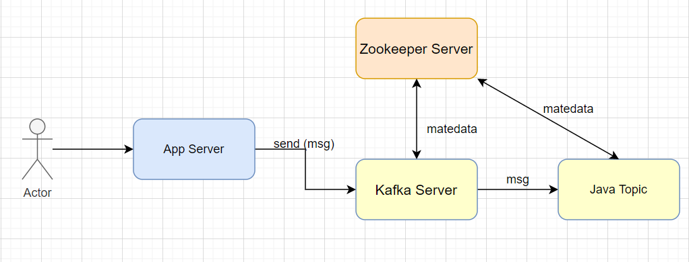
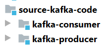
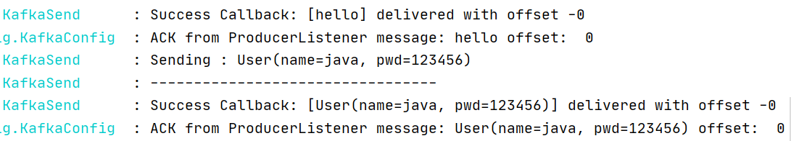
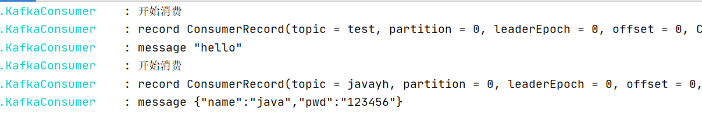

## Kafka整合SpringBoot Demo

前几篇文章说了一些关于kafka的基础以及服务的搭建，尽然已经有了服务，那我们就进一步结合代码来体验一下kafka，本demo采用SpringBoot.2.3.1.RELEASE

### 项目结构

首先让我们来看一下项目调用流程，如图:



根据调用流程我们现在`Kafka Server` `Zookeeper Server` ，我们缺少 `producer` 以及 `consumer`

创建项目结构如下：



### 项目集成依赖以版本说明

- SpringBoot版本
```xml
    <groupId>org.springframework.boot</groupId>
    <artifactId>spring-boot-starter-parent</artifactId>
    <version>2.3.1.RELEASE</version>
```
- Kafka依赖
```xml
    <dependency>
        <groupId>org.springframework.kafka</groupId>
        <artifactId>spring-kafka</artifactId>
    </dependency>
```
- 版本依赖说明

| Spring for Apache Kafka Version | Spring Integration for Apache Kafka Version | `kafka-clients`         | Spring Boot             |
| ------------------------------- | ------------------------------------------- | ----------------------- | ----------------------- |
| 2.7.0-SNAPSHOT                  | 5.4.x                                       | 2.7.0 (RC5)             | 2.4.x                   |
| 2.6.x                           | 5.3.x or 5.4.x                              | 2.6.0                   | 2.3.x or 2.4.x          |
| 2.5.x                           | 3.3.x                                       | 2.5.1                   | 2.3.x                   |
| 2.4.x                           | 3.2.x                                       | 2.4.1                   | 2.2.x                   |
| 2.3.x                           | 3.2.x                                       | 2.3.1                   | 2.2.x                   |
| ~~2.2.x~~                       | ~~3.1.x~~                                   | ~~2.0.1, 2.1.x, 2.2.x~~ | ~~2.1.x (End of Life)~~ |
| ~~2.1.x~~                       | ~~3.0.x~~                                   | ~~1.0.2~~               | ~~2.0.x (End of Life)~~ |
| ~~1.3.x~~                       | ~~2.3.x~~                                   | ~~0.11.0.x, 1.0.x~~     | ~~1.5.x (End of Life)~~ |

- 主要说明
Spring Boot 2.3.5及更高版本引入了一个版本的Jackson，该版本引入了不兼容的Scala库。或升级spring-kafka，并kafka-clients与2.6.x 307

```xml
<dependency>
    <groupId>org.scala-lang</groupId>
    <artifactId>scala-library</artifactId>
    <version>2.12.11</version>
    <scope>test</scope>
</dependency>

<dependency>
    <groupId>org.scala-lang</groupId>
    <artifactId>scala-reflect</artifactId>
    <version>2.12.11</version>
    <scope>test</scope>
</dependency>
```
```xml
<dependency>
    <groupId>org.springframework.kafka</groupId>
    <artifactId>spring-kafka</artifactId>
    <version>2.6.4</version>
</dependency>

<dependency>
    <groupId>org.springframework.kafka</groupId>
    <artifactId>spring-kafka-test</artifactId>
    <version>2.6.4</version>
    <scope>test</scope>
</dependency>

<dependency>
    <groupId>org.apache.kafka</groupId>
    <artifactId>kafka-clients</artifactId>
    <version>{kafka-version}</version>
</dependency>

<!-- optional - only needed when using kafka-streams -->
<dependency>
    <groupId>org.apache.kafka</groupId>
    <artifactId>kafka-streams</artifactId>
    <version>{kafka-version}</version>
</dependency>

<dependency>
    <groupId>org.apache.kafka</groupId>
    <artifactId>kafka-clients</artifactId>
    <version>{kafka-version}</version>
    <classifier>test</classifier>
    <scope>test</scope>
</dependency>

<dependency>
    <groupId>org.apache.kafka</groupId>
    <artifactId>kafka_2.13</artifactId>
    <version>{kafka-version}</version>
    <scope>test</scope>
</dependency>

<dependency>
    <groupId>org.apache.kafka</groupId>
    <artifactId>kafka_2.13</artifactId>
    <version>{kafka-version}</version>
    <classifier>test</classifier>
    <scope>test</scope>
</dependency>
```

### 创建kafka-producer

- 项目配置
```properties
server:
  port: 9001

spring:
  application:
    name: kafka-producer
  kafka:
    bootstrap-servers: localhost:9092
    producer:
      batch-size: 16785                                   # 一次最多发送的数据量
      retries: 1                                          #发送失败后的重复发送次数
      buffer-memory: 33554432                            #32M批处理缓冲区
      key-serializer: org.apache.kafka.common.serialization.StringSerializer
      value-serializer: org.springframework.kafka.support.serializer.JsonSerializer

## 配置topic
javayh:
  group-id: javayh-kafka
  kafka:
    test: test
    javayh: javayh
```

- 创建Topic
```java
public class KafkaTopicConfig {

    @Value("${javayh.kafka.javayh}")
    private String topic1;

    @Value("${javayh.kafka.test}")
    private String topic2;

    @Bean
    NewTopic topic1() {
         //第一个是参数是topic名字，第二个参数是分区个数，第三个是topic的复制因子个数
        //当broker个数为1个时会创建topic失败，
        //提示：replication factor: 2 larger than available brokers: 1
        //只有在集群中才能使用kafka的备份功能
        //new NewTopic("foo", 10, (short) 2);
        return TopicBuilder.name(topic1).build();
    }

    @Bean
    NewTopic topic2() {
        return TopicBuilder.name(topic2).build();
    }

}
```

- 编写KafkaSend工具
```java
public class KafkaSend {
    
    private final KafkaTemplate kafkaTemplate;

    public KafkaSend(KafkaTemplate kafkaTemplate) {
        this.kafkaTemplate = kafkaTemplate;
    }

    public void send(String kafkaTopic,Object message) {
        kafkaTemplate.send(kafkaTopic, message);
    }

    public void send(String kafkaTopic,String key ,Object message) {
        kafkaTemplate.send(kafkaTopic, key,message);
    }

    public void sendCallback(String topicName,Object message) {
        log.info("Sending : {}", message);
        log.info("---------------------------------");
        ListenableFuture<SendResult<String, Object>> future = kafkaTemplate.send(topicName, message);
        callback(message, future);
    }

    public void sendCallback(String kafkaTopic,String key ,Object message) {
        log.info("Sending : {}", message);
        log.info("---------------------------------");
        ListenableFuture<SendResult<String, Object>> future =   kafkaTemplate.send(kafkaTopic, key,message);
        callback(message, future);
    }


    private void callback(Object message, ListenableFuture<SendResult<String, Object>> future) {
        future.addCallback(new ListenableFutureCallback<>() {
            @Override
            public void onSuccess(SendResult<String, Object> result) {
                log.info("Success Callback: [{}] delivered with offset -{}", message,
                        result.getRecordMetadata().offset());
            }
            @Override
            public void onFailure(Throwable ex) {
                log.warn("Failure Callback: Unable to deliver message [{}]. {}", message, ex.getMessage());
            }
        });
    }

}
```

- 对外REST API
```java
@RestController
@RequestMapping("/kafka/")
public class KafkaController {
    @Resource
    private KafkaService kafkaService;

    @GetMapping(value = "test-01/{msg}")
    public void sendKafka(@PathVariable String msg){
        kafkaService.sendKafka("test",msg);
    }

    @GetMapping(value = "test-02")
    public void sendKafka(){
        User user = new User("java","123456");
        kafkaService.sendKafka("javayh",user);
    }
}
```

### 创建kafka-consumer
- 项目配置
```properties
server:
  port: 9002

spring:
  application:
    name: kafka-consumer
  kafka:
    bootstrap-servers: localhost:9092
    consumer:
      key-deserializer: org.apache.kafka.common.serialization.StringDeserializer
      value-deserializer: org.apache.kafka.common.serialization.StringDeserializer
      auto-offset-reset: latest                           #最早未被消费的offset earliest
      max-poll-records: 3100                              #批量消费一次最大拉取的数据量
      enable-auto-commit: false                           #是否开启自动提交
      auto-commit-interval: 1000                          #自动提交的间隔时间
      session-timeout: 20000                              #连接超时时间
      max-poll-interval: 15000                            #手动提交设置与poll的心跳数,如果消息队列中没有消息，等待毫秒后，调用poll()方法。如果队列中有消息，立即消费消息，每次消费的消息的多少可以通过max.poll.records配置。
      max-partition-fetch-bytes: 15728640                 #设置拉取数据的大小,15M

## 配置topic
javayh:
  group-id: javayh-kafka
  kafka:
    test: test
    javayh: javayh
```

- 创建consumer
```java
public class KafkaConsumer {

    /**
     *  消费者
     * @param record 消息
     */
    @Transactional
    @KafkaListener(topics = "test",groupId = "javayh-kafka")
    public void processMessage(ConsumerRecord<String, String> record) {
        Optional<?> kafkaMessage = Optional.ofNullable(record.value());
        if (kafkaMessage.isPresent()) {
            Object message = kafkaMessage.get();
            log.info("开始消费");
            log.info("record {}",record);
            log.info("message {}", message);
        }
    }

    @Transactional
    @KafkaListener(topics = "javayh",id = "javayh-kafka")
    public void processMessage2(ConsumerRecord<String, Object> record) {
        Optional<?> kafkaMessage = Optional.ofNullable(record.value());
        if (kafkaMessage.isPresent()) {
            Object message = kafkaMessage.get();
            log.info("开始消费");
            log.info("record {}",record);
            log.info("message {}", message);
        }
    }
}
```
注意：请在启动类添加 `@EnableKafka` 服务无法进行监听

### 测试生产与消费

- 启动zookeeper
- 启动kafka
- 启动kafka-producer服务
- 启动kafka-consumer服务
注：如果您不了解如何启动 zookeeper与kafka服务请参考 [服务搭建与测试命令](../base/Quickstart.md)

- 访问
    - http://localhost:9001/kafka/test-01/hello
    - http://localhost:9001/kafka/test-02
    - 效果如下：
    
    
    
    
    


