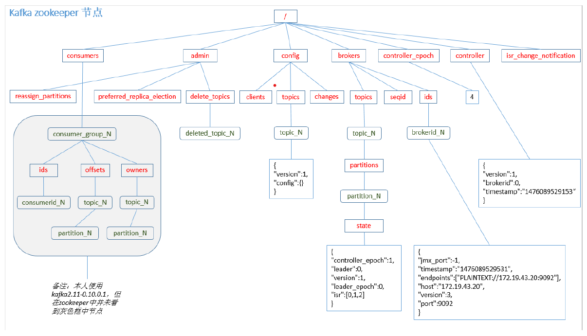

## Kafka消费者

### 消费方式

consumer采用 pull（拉 模式从 broker中读取数据。
push（推 模式很难适应消费速率不同的消费者，因为消息发送速率是由 broker决定的。
它的目标是尽可能以最快速度传递消息，但是这样很容易造成 consumer来不及处理消息，
典型的表现就是拒绝服务以及网络拥塞。而pull 模式则可以根据consumer 的消费能力以适
当的速率消费消息。

pull 模式不足之处是，如果kafka 没有数据，消费者可能会陷入循环中，一直返回空数
据。针对这一点，Kafka 的消费者在消费数据时会传入一个时长参数timeout，如果当前没有
数据可供消费，consumer 会等待一段时间之后再返回，这段时长即为timeout。

### 分区分配策略

一个consumer group 中有多个consumer，一个 topic 有多个partition，所以必然会涉及
到partition 的分配问题，即确定那个partition 由哪个consumer 来消费。
Kafka 有两种分配策略，一是RoundRobin，一是Range。

### offset的维护
由于consumer 在消费过程中可能会出现断电宕机等故障，consumer 恢复后，需要从故
障前的位置的继续消费，所以consumer 需要实时记录自己消费到了哪个offset，以便故障恢
复后继续消费。


Kafka 0.9 版本之前，consumer 默认将offset 保存在Zookeeper 中，从0.9 版本开始，
consumer 默认将offset 保存在Kafka 一个内置的topic 中，该topic 为__consumer_offsets。

1）修改配置文件consumer.properties 

> exclude.internal.topics=false

2）读取offset
 0.11.0.0 之前版本:

```
bin/kafka console consumer.sh topic __consumer_offsets --zookeeper localhost:2181 formatter"kafka.coordinator.GroupMetadataManager \$OffsetsMessageFormatter" --consumer.config config/consumer.properties --from beginning
```

0.11.0.0之后版 本 (含 ): 

```
bin/kafka console consumer.sh topic __consumer_offsets --zookeeper localhost:2181 formatter "kafka.coordinator.group.GroupMetadataManager \$OffsetsMessageFormatter" --consumer.config config/consumer.properties --from beginning
```

注：测试同一个消费者组中的消费者， 同一时刻只能 有一个消费者消费。


