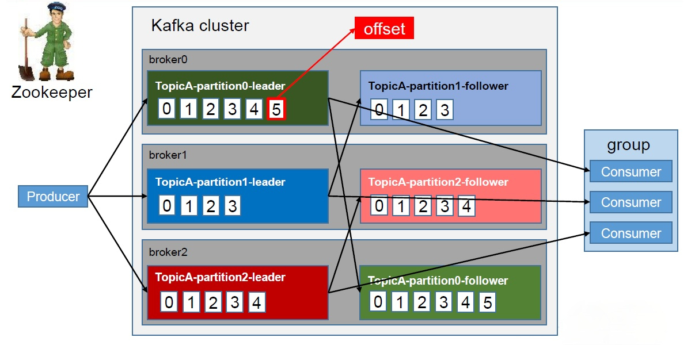
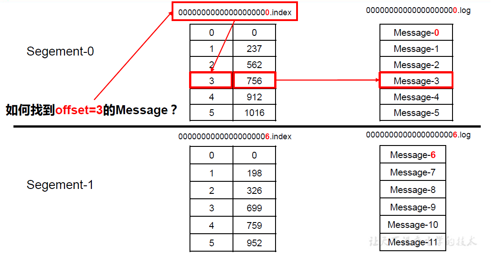

## Kafka 工作流程及文件存储机制

### 工作流程

Kafka 中消息是以topic 进行分类的，生产者生产消息，消费者消费消息，都是面向topic的。

topic 是逻辑上的概念，而partition 是物理上的概念，每个partition 对应于一个log 文
件，该log 文件中存储的就是producer 生产的数据。Producer 生产的数据会被不断追加到该
log 文件末端，且每条数据都有自己的offset。消费者组中的每个消费者，都会实时记录自己
消费到了哪个offset，以便出错恢复时，从上次的位置继续消费。

### Kafka文件存储机制

由于生产者生产的消息会不断追加到log 文件末尾，为防止log 文件过大导致数据定位
效率低下，**Kafka 采取了分片和索引机制**，将每个partition 分为多个segment。每个segment
对应两个文件——“.index”文件和“.log”文件。这些文件位于一个文件夹下，该文件夹的命名
规则为：topic 名称+分区序号。例如，first 这个topic 有三个分区，则其对应的文件夹为first-
0,first-1,first-2。

index 和log 文件以当前segment 的第一条消息的offset 命名。下图为index 文件和log
文件的结构示意图。

“
“.index”文件存储大量的 索引信息 ，“，“.log”文件存储大量的 数据 ，索引文件中的元
数据指向对应数据文件中 message的物理偏移地址 。

