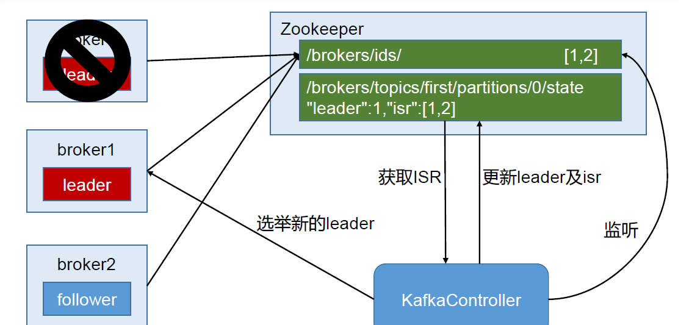

## Zookeeper 在 kafka中的左右

Kafka 集群中有一个broker 会被选举为Controller，负责管理集群broker 的上下线，所
有topic 的分区副本分配和leader 选举等工作。
Controller 的管理工作都是依赖于Zookeeper 的。
以下为partition 的leader 选举过程：

## Kafka 事务

Kafka 从0.11 版本开始引入了事务支持。事务可以保证Kafka 在Exactly Once 语义的基
础上，生产和消费可以跨分区和会话，要么全部成功，要么全部失败。

### Producer事务
为了实现跨分区跨会话的事务，需要引入一个全局唯一的
Transaction ID，并将 Producer获得的 PID和 Transaction ID绑定。这样当 Producer重启后就可以通过正在进行的 Transaction ID获得原来的 PID。
为了管理.

Transaction Kafka引入了一个新的组件 Transaction Coordinator。 Producer就
是通过和 Transaction Coordinator交互获得 Transaction ID对应的任务状态。 Transaction Coordinator还负责将事务所有写入 Kafka的一个内部 Topic，这样即使整个服务重启，由于
事务状态得到保存，进行中的事务状态可以得到恢复，从而继续进行。

### Consumer事务
上述事务机制主要是从Producer方面考虑，对于 Consumer而言，事务的保证就会相对
较弱，尤其时无法保证 Commit的信息被精确消费。这是由于 Consumer可以通过 offset访
问任意信息，而且不同的 Segment File生命周期不同，同一事务的消息可能会出现重启后被
删除的情况。
