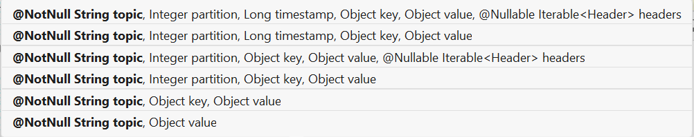
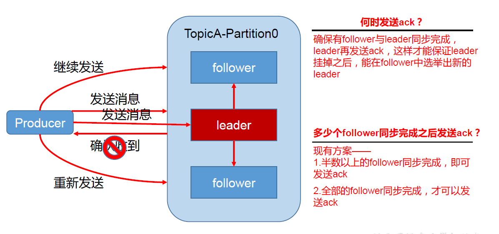
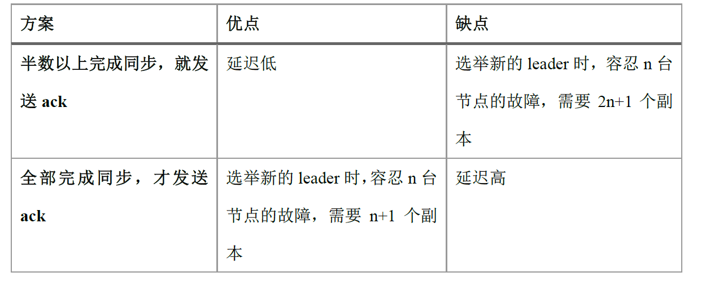
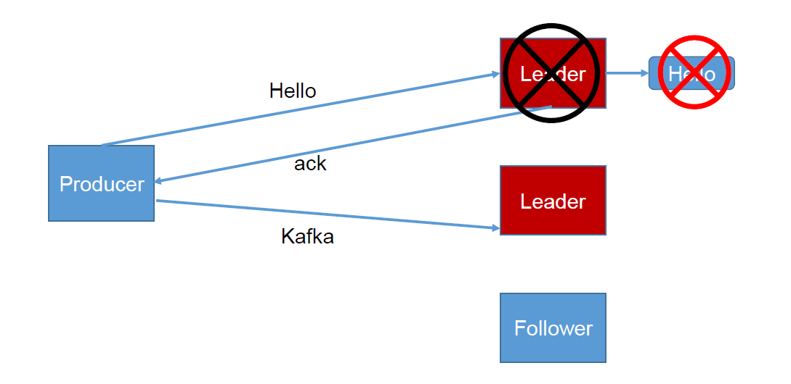
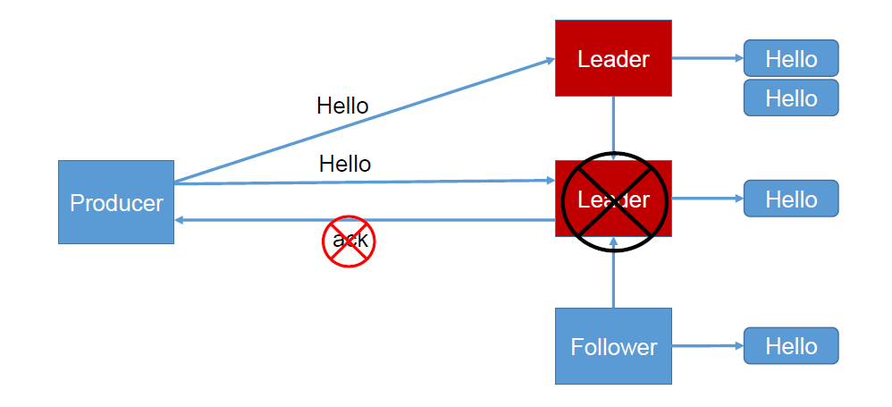
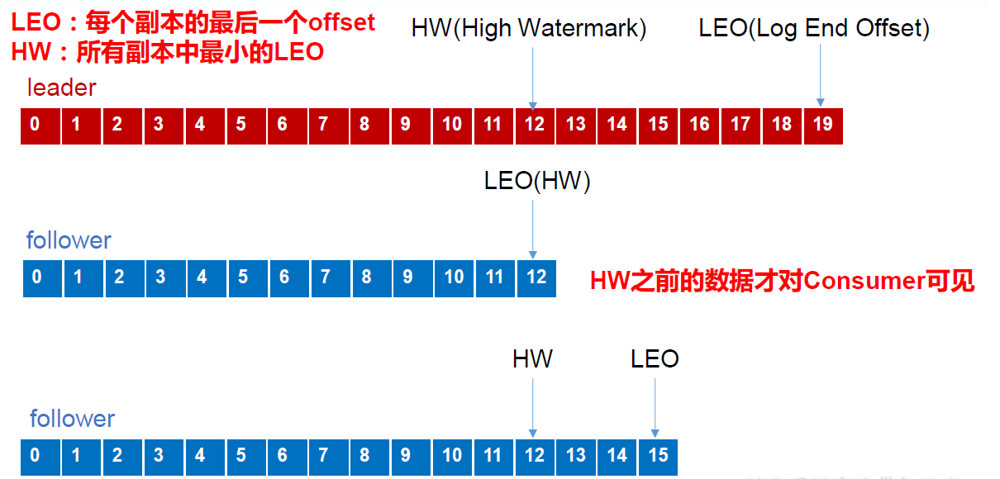

## Kafka生产者

### 分区策略

- 分区的原因
    - 方便在集群中扩展 ，每个 Partition可以通过调整以适应它所在的机器，而一个 topic又可以有多个 Partition组成，因此整个集群就可以适应任意大小的数据了；
    - 可以提高并发 ，因为可以以 Partition为单位读写了。
- 分区的原则
我们需要将producer发送的数据封装成一个 ProducerRecord对象

1. 指明 partition 的情况下，直接将指明的值直接作为 partition 值；
2. 没有指明 partition 值但有 key 的情况下，将 key 的 hash 值与 topic 的 partition 数进行取余得到 partition 值；
3. 既没有 partition 值又没有 key 值的情况下，第一次调用时随机生成一个整数（后面每次调用在这个整数上自增），将这个值与 topic 可用的 partition 总数取余得到 partition 值，也就是常说的 round-robin 算法。

### 数据可靠性保证

**为保证producer发送的数据，能可靠的发送到指定的 topic topic的每个 partition收到
producer发送的数据后， 都 需要向 producer发送 ack acknowledgement确认收到 ）），如果
producer收到 ack 就会进行下一轮的发送，否 则重新发送数据。**

- 副本数据同步策略

Kafka 选择了第二种方案，原因如下：

1. 同样为了容忍n 台节点的故障，第一种方案需要2n+1 个副本，而第二种方案只需要n+1
   个副本，而Kafka 的每个分区都有大量的数据，第一种方案会造成大量数据的冗余。
2. 虽然第二种方案的网络延迟会比较高，但网络延迟对Kafka 的影响较小。

- ISR
采用第二种方案之后，设想以下情景：leader 收到数据，所有follower 都开始同步数据，
但有一个follower，因为某种故障，迟迟不能与leader 进行同步，那leader 就要一直等下去，
直到它完成同步，才能发送ack。这个问题怎么解决呢？
Leader 维护了一个动态的in-sync replica set (ISR)，意为和leader 保持同步的follower 集
合。当ISR 中的follower 完成数据的同步之后，leader 就会给follower 发送ack。如果follower
长时间未向leader 同步数据， 则该follower 将被踢出ISR ， 该时间阈值由replica.lag.time.max.ms 参数设定。
Leader 发生故障之后，就会从ISR 中选举新的leader。

- ack 应答机制

	对于某些不太重要的数据，对数据的可靠性要求不是很高，能够容忍数据的少量丢失，
所以没必要等ISR 中的follower 全部接收成功。

	所以Kafka 为用户提供了三种可靠性级别，用户根据对可靠性和延迟的要求进行权衡，
选择以下的配置。

**acks 参数配置：**

acks：
>0：producer 不等待broker 的ack，这一操作提供了一个最低的延迟，broker 一接收到还
没有写入磁盘就已经返回，当broker 故障时有可能丢失数据；
>
>1：producer 等待broker 的ack，partition 的leader 落盘成功后返回ack，如果在follower
同步成功之前leader 故障，那么将会丢失数据；

>-1（all）：producer 等待broker 的ack，partition 的leader 和follower 全部落盘成功后才
 返回ack。但是如果在follower 同步完成后，broker 发送ack 之前，leader 发生故障，那么会
 造成数据重复。

- 故障处理细节

1. LEO：指的是每个副本最大的offset；

2. HW：指的是消费者能见到的最大的offset，ISR 队列中最小的LEO。
   
   （1）follower 故障
   follower 发生故障后会被临时踢出ISR，待该follower 恢复后，follower 会读取本地磁盘
   记录的上次的HW，并将log 文件高于HW 的部分截取掉，从HW 开始向leader 进行同步。
   等该follower 的LEO 大于等于该Partition 的HW，即follower 追上leader 之后，就可以重
   新加入ISR 了。

   （2）leader 故障
   leader 发生故障之后，会从ISR 中选出一个新的leader，之后，为保证多个副本之间的数据一致性
   其余的 follower会先将各自的 log文件 高于 HW的部分截掉 ，然后从新的 leader同步数据。
   
   注意： 这只能保证副本之间的数据一致性，并不能保证数据不丢失或者不重复。
### Exactly Once语义   
将服务器的ACK级别设置为 -1，可以保证 Producer到 Server之间不会丢失数据，即 At Least Once语义 。
相对的，将服务器 ACK级别设置为 0，可以保证生产者每条消息只会被发送一次，即 At Most Once语义。

At Least Once可以保证数据不丢失，但是不能保证数据不重复；相对的， At Least Once可以保证数据不重复，
但是不能保证数据不丢失。 但是，对于一些非常重要的信息，比如说交易数据，下游数据消费者要求数据既不重复也不丢失，
即 Exactly Once语义。在 0.11版本以前的 Kafka，对此是无能为力的，只能保证数据不丢失，再在下游消费者对数据做全局去重。
对于多个下游应用的情况，每个都需要单独做全局去重，这就对性能造成了很大影响。

0.11版本的 Kafka，引入了一项重大特性：幂等性。所谓的幂等性就是指 Producer不论向 Server发送多少次重复数据， 
Server端都只会持久化一条。幂等性结合 At Least Once语义，就构成了 Kafka的 Exactly Once语义。
即：`At Least Once + 幂等性 = Exactly Once`要启用幂等性，只需要将Producer的参数enable.idompotence设置为 true即可。
 Kafka的幂等性实现其实就是将原来下游需要做的去重放在了数据上游。开启幂等性Producer在初始化的时候会被分配一个 PID，
 发往同一 Partition的消息会附带 Sequence Number。而Broker端会对 <PID, Partition, SeqNumber>做缓存，
 当具有相同主键的消息提交时， Broker只会持久化一条。但是PID重启就会变化，同时不同的 Partition也具有不同主键，
 所以幂等性无法保证跨分区跨会话的 Exactly Once。

   

