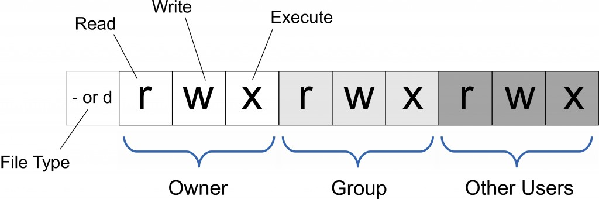
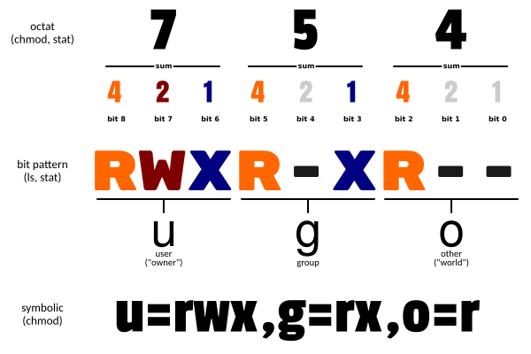

## 文件管理常用命令

- [cat 命令](#cat命令)
- [chmod命令](#chmod命令)
- [chown 命令](#chown命令)
- [find 命令](#find命令)
- [cut命令](#cut命令)
- [ln 命令](#ln命令)
- [less命令](#less命令)
- [more命令](#more命令)
- [mv 命令](#mv命令)
- [cp 命令](#cp命令)
- [rm 命令](#rm命令)
- [rcp命令](#rcp命令)
- [scp命令](#scp命令)
- [awk 命令](#awk命令)

### cat命令

- 语法

  ```
  cat [-AbeEnstTuv] [--help] [--version] fileName
  ```

  参数说明：

  -n 或 --number：由 1 开始对所有输出的行数编号。

  -b 或 --number-nonblank：和 -n 相似，只不过对于空白行不编号。

  -s 或 --squeeze-blank：当遇到有连续两行以上的空白行，就代换为一行的空白行。

  -v 或 --show-nonprinting：使用 ^ 和 M- 符号，除了 LFD 和 TAB 之外。

  -E 或 --show-ends : 在每行结束处显示 $。

  -T 或 --show-tabs: 将 TAB 字符显示为 ^I。

  -A, --show-all：等价于 -vET。

  -e：等价于"-vE"选项；

  -t：等价于"-vT"选项；

- 示例

  - 文件追加

    ```
    cat -n textfile1 > textfile2
    ```

  - 把 textfile1 和 textfile2 的文档内容加上行号（空白行不加）之后将内容附加到 textfile3 文档里

    ```
    cat -b textfile1 textfile2 >> textfile3
    ```

  - 清空文件

    ```
    cat /home/null /home/test.txt
    ```

  - 输出文件

    ```
    cat log.log
    ```

### chmod命令

Linux/Unix 的文件调用权限分为三级 : 文件所有者（Owner）、用户组（Group）、其它用户（Other Users）。


​只有文件所有者和超级用户可以修改文件或目录的权限。可以使用绝对模式（八进制数字模式），符号模式指定文件的权限。


- 语法

  ```
  chmod [-cfvR] [--help] [--version] mode file...
  ```

  mode : 权限设定字串，格式如下 :

  ```
  [ugoa...][[+-=][rwxX]...][,...]
  ```

  其中：

  - u 表示该文件的拥有者，g 表示与该文件的拥有者属于同一个群体(group)者，o 表示其他以外的人，a 表示这三者皆是。
  - \+ 表示增加权限、- 表示取消权限、= 表示唯一设定权限。
  - r 表示可读取，w 表示可写入，x 表示可执行，X 表示只有当该文件是个子目录或者该文件已经被设定过为可执行。

  其他参数说明：

  - -c : 若该文件权限确实已经更改，才显示其更改动作
  - -f : 若该文件权限无法被更改也不要显示错误讯息
  - -v : 显示权限变更的详细资料
  - -R : 对目前目录下的所有文件与子目录进行相同的权限变更(即以递归的方式逐个变更)
  - --help : 显示辅助说明
  - --version : 显示版本

- 符号模式

  使用符号模式可以设置多个项目：who（用户类型），operator（操作符）和 permission（权限），每个项目的设置可以用逗号隔开。 命令 chmod 将修改 who 指定的用户类型对文件的访问权限，用户类型由一个或者多个字母在 who 的位置来说明，如 who 的符号模式表所示:

  | who  | 用户类型 | 说明                 |
  | :--- | :------- | :------------------- |
  | `u`  | user     | 文件所有者           |
  | `g`  | group    | 文件所有者所在组     |
  | `o`  | others   | 所有其他用户         |
  | `a`  | all      | 所用用户, 相当于 ugo |

- operator 的符号模式表:

  | Operator | 说明                                                   |
  | :------- | :----------------------------------------------------- |
  | `+`      | 为指定的用户类型增加权限                               |
  | `-`      | 去除指定用户类型的权限                                 |
  | `=`      | 设置指定用户权限的设置，即将用户类型的所有权限重新设置 |

- permission 的符号模式表:

  | 模式 | 名字         | 说明                                                         |
  | :--- | :----------- | :----------------------------------------------------------- |
  | `r`  | 读           | 设置为可读权限                                               |
  | `w`  | 写           | 设置为可写权限                                               |
  | `x`  | 执行权限     | 设置为可执行权限                                             |
  | `X`  | 特殊执行权限 | 只有当文件为目录文件，或者其他类型的用户有可执行权限时，才将文件权限设置可执行 |
  | `s`  | setuid/gid   | 当文件被执行时，根据who参数指定的用户类型设置文件的setuid或者setgid权限 |
  | `t`  | 粘贴位       | 设置粘贴位，只有超级用户可以设置该位，只有文件所有者u可以使用该位 |

- 八进制语法

  chmod命令可以使用八进制数来指定权限。文件或目录的权限位是由9个权限位来控制，每三位为一组，它们分别是文件所有者（User）的读、写、执行，用户组（Group）的读、写、执行以及其它用户（Other）的读、写、执行。历史上，文件权限被放在一个比特掩码中，掩码中指定的比特位设为1，用来说明一个类具有相应的优先级。

  | #    | 权限           | rwx  | 二进制 |
  | :--- | :------------- | :--- | :----- |
  | 7    | 读 + 写 + 执行 | rwx  | 111    |
  | 6    | 读 + 写        | rw-  | 110    |
  | 5    | 读 + 执行      | r-x  | 101    |
  | 4    | 只读           | r--  | 100    |
  | 3    | 写 + 执行      | -wx  | 011    |
  | 2    | 只写           | -w-  | 010    |
  | 1    | 只执行         | --x  | 001    |
  | 0    | 无             | ---  | 000    |

  例如， 765 将这样解释：

  - 所有者的权限用数字表达：属主的那三个权限位的数字加起来的总和。如 rwx ，也就是 4+2+1 ，应该是 7。
  - 用户组的权限用数字表达：属组的那个权限位数字的相加的总和。如 rw- ，也就是 4+2+0 ，应该是 6。
  - 其它用户的权限数字表达：其它用户权限位的数字相加的总和。如 r-x ，也就是 4+0+1 ，应该是 5。

- 示例

  将文件 file1.txt 设为所有人皆可读取 :	

  ```
  chmod ugo+r file1.txt
  ```

  将文件 file1.txt 设为所有人皆可读取 :

  ```
  chmod a+r file1.txt
  ```

  将文件 file1.txt 与 file2.txt 设为该文件拥有者，与其所属同一个群体者可写入，但其他以外的人则不可写入 :

  ```
  chmod ug+w,o-w file1.txt file2.txt
  ```

  将 ex1.py 设定为只有该文件拥有者可以执行 :

  ```
  chmod u+x ex1.py
  ```

  将目前目录下的所有文件与子目录皆设为任何人可读取 :

  ```
  chmod -R a+r 
  ```

  此外chmod也可以用数字来表示权限如 :

  ```
  chmod 777 file
  ```

  语法为：

  ```
  chmod abc file
  ```

  其中a,b,c各为一个数字，分别表示User、Group、及Other的权限。

- r=4，w=2，x=1

  - 若要 rwx 属性则 4+2+1=7；
  - 若要 rw- 属性则 4+2=6；
  - 若要 r-x 属性则 4+1=5。

  ```
  chmod a=rwx file
  ```
  ```
  chmod 777 file
  ```
  ```
  chmod ug=rwx,o=x file
  ```
  ```
  chmod 771 file
  ```
  效果相同

  若用 chmod 4755 filename 可使此程序具有 root 的权限。

- 更多说明

  | `命令`                                     | 说明                                                         |
  | :----------------------------------------- | :----------------------------------------------------------- |
  | `chmod a+r file`                           | 给file的所有用户增加读权限                                   |
  | `chmod a-x file`                           | 删除file的所有用户的执行权限                                 |
  | `chmod a+rw file`                          | 给file的所有用户增加读写权限                                 |
  | `chmod +rwx file`                          | 给file的所有用户增加读写执行权限                             |
  | `chmod u=rw,go= file`                      | 对file的所有者设置读写权限，清空该用户组和其他用户对file的所有权限（空格代表无权限） |
  | `chmod -R u+r,go-r docs`                   | 对目录docs和其子目录层次结构中的所有文件给用户增加读权限，而对用户组和其他用户删除读权限 |
  | `chmod 664 file`                           | 对file的所有者和用户组设置读写权限, 为其其他用户设置读权限   |
  | `chmod 0755 file`                          | 相当于`u=rwx (4+2+1),go=rx (4+1 & 4+1)`。`0` 没有特殊模式。  |
  | `chmod 4755 file`                          | `4`设置了设置用户ID位，剩下的相当于 u=rwx (4+2+1),go=rx (4+1 & 4+1)。 |
  | `find path/ -type d -exec chmod a-x {} \;` | 删除可执行权限对path/以及其所有的目录（不包括文件）的所有用户，使用'-type f'匹配文件 |
  | `find path/ -type d -exec chmod a+x {} \;` | 允许所有用户浏览或通过目录path/                              |

### chown命令

- 语法

  ```
  chown [-cfhvR] [--help] [--version] user[:group] file...
  ```

  **参数** :

  - user : 新的文件拥有者的使用者 ID
  - group : 新的文件拥有者的使用者组(group)
  - -c : 显示更改的部分的信息
  - -f : 忽略错误信息
  - -h :修复符号链接
  - -v : 显示详细的处理信息
  - -R : 处理指定目录以及其子目录下的所有文件
  - --help : 显示辅助说明
  - --version : 显示版本

- 示例

  把 /var/run/httpd.pid 的所有者设置 root：

  ```
  chown root /var/run/httpd.pid
  ```

  将文件 file1.txt 的拥有者设为 haiji，群体的使用者 haijigroup :

  ```
  chown haiji:haijigroup file1.txt
  ```

  将当前前目录下的所有文件与子目录的拥有者皆设为 haiji，群体的使用者 haijigroup:

  ```
  chown -R haiji:haijigroup 
  ```
  
  把 /home/runoob 的关联组设置为 512 （关联组ID），不改变所有者：
  
  ```
  chown :512 /home/haiji
  ```

### find命令

- 语法

  ```
  find   path   -option   [   -print ]   [ -exec   -ok   command ]   {} \
  ```

  **参数说明** :

  find 根据下列规则判断 path 和 expression，在命令列上第一个 - ( ) , ! 之前的部份为 path，之后的是 expression。如果 path 是空字串则使用目前路径，如果 expression 是空字串则使用 -print 为预设 expression。

  expression 中可使用的选项有二三十个之多，在此只介绍最常用的部份。

  -mount, -xdev : 只检查和指定目录在同一个文件系统下的文件，避免列出其它文件系统中的文件

  -amin n : 在过去 n 分钟内被读取过

  -anewer file : 比文件 file 更晚被读取过的文件

  -atime n : 在过去n天内被读取过的文件

  -cmin n : 在过去 n 分钟内被修改过

  -cnewer file :比文件 file 更新的文件

  -ctime n : 在过去n天内被修改过的文件

  -empty : 空的文件-gid n or -group name : gid 是 n 或是 group 名称是 name

  -ipath p, -path p : 路径名称符合 p 的文件，ipath 会忽略大小写

  -name name, -iname name : 文件名称符合 name 的文件。iname 会忽略大小写

  -size n : 文件大小 是 n 单位，b 代表 512 位元组的区块，c 表示字元数，k 表示 kilo bytes，w 是二个位元组。

  -type c : 文件类型是 c 的文件。

  d: 目录

  c: 字型装置文件

  b: 区块装置文件

  p: 具名贮列

  f: 一般文件

  l: 符号连结

  s: socket

  -pid n : process id 是 n 的文件

  你可以使用 ( ) 将运算式分隔，并使用下列运算。

  exp1 -and exp2

  ! expr

  -not expr

  exp1 -or exp2

  exp1, exp2

- 示例

  将当前目录及其子目录下所有文件后缀为 **.c** 的文件列出来:

  ```
  # find . -name "*.c"
  ```

  将目前目录其其下子目录中所有一般文件列出

  ```
  # find . -type f
  ```

  将当前目录及其子目录下所有最近 20 天内更新过的文件列出:

  ```
  # find . -ctime -20
  ```

  查找 /var/log 目录中更改时间在 7 日以前的普通文件，并在删除之前询问它们：

  ```
  # find /var/log -type f -mtime +7 -ok rm {} \;
  ```

  查找当前目录中文件属主具有读、写权限，并且文件所属组的用户和其他用户具有读权限的文件：

  ```
  # find . -type f -perm 644 -exec ls -l {} \;
  ```

  查找系统中所有文件长度为 0 的普通文件，并列出它们的完整路径：

  ```
  # find / -type f -size 0 -exec ls -l {} \;
  ```

  

### cut命令

- 语法

  ```
  cut  [-bn] [file]
  cut [-c] [file]
  cut [-df] [file]
  ```

  **使用说明:**

  cut 命令从文件的每一行剪切字节、字符和字段并将这些字节、字符和字段写至标准输出。

  如果不指定 File 参数，cut 命令将读取标准输入。必须指定 -b、-c 或 -f 标志之一。

  **参数:**

  - -b ：以字节为单位进行分割。这些字节位置将忽略多字节字符边界，除非也指定了 -n 标志。
  - -c ：以字符为单位进行分割。
  - -d ：自定义分隔符，默认为制表符。
  - -f ：与-d一起使用，指定显示哪个区域。
  - -n ：取消分割多字节字符。仅和 -b 标志一起使用。如果字符的最后一个字节落在由 -b 标志的 List 参数指示的范围之内，该字符将被写出；否则，该字符将被排除

- 示例

  ```
  cat -b 3 log.log
  ```

  

### ln命令

- 语法

  ```
  ln [参数][源文件或目录][目标文件或目录]
  ```

  其中参数的格式为

  [-bdfinsvF] [-S backup-suffix] [-V {numbered,existing,simple}]

  [--help] [--version] [--]

  **命令功能** :
  Linux文件系统中，有所谓的链接(link)，我们可以将其视为档案的别名，而链接又可分为两种 : 硬链接(hard link)与软链接(symbolic link)，硬链接的意思是一个档案可以有多个名称，而软链接的方式则是产生一个特殊的档案，该档案的内容是指向另一个档案的位置。硬链接是存在同一个文件系统中，而软链接却可以跨越不同的文件系统。

  不论是硬链接或软链接都不会将原本的档案复制一份，只会占用非常少量的磁碟空间。

  **软链接**：

  - 1.软链接，以路径的形式存在。类似于Windows操作系统中的快捷方式
  - 2.软链接可以 跨文件系统 ，硬链接不可以
  - 3.软链接可以对一个不存在的文件名进行链接
  - 4.软链接可以对目录进行链接

  **硬链接**：

  - 1.硬链接，以文件副本的形式存在。但不占用实际空间。
  - 2.不允许给目录创建硬链接
  - 3.硬链接只有在同一个文件系统中才能创建

  #### 命令参数

  **必要参数**：

  - -b 删除，覆盖以前建立的链接
  - -d 允许超级用户制作目录的硬链接
  - -f 强制执行
  - -i 交互模式，文件存在则提示用户是否覆盖
  - -n 把符号链接视为一般目录
  - -s 软链接(符号链接)
  - -v 显示详细的处理过程

  **选择参数**：

  - -S "-S<字尾备份字符串> "或 "--suffix=<字尾备份字符串>"
  - -V "-V<备份方式>"或"--version-control=<备份方式>"
  - --help 显示帮助信息
  - --version 显示版本信息

- 示例

  ```
  ln -s /root/logs/test/log.log  /root/logs/
  ```

  验证输出

  ```
  # ll log.log
  lrwxrwxrwx. 1 root root 26 Jan 20 21:59 log.log -> /root/logs/test/log.log
  ```

### less命令

- 语法

  ```
  less [参数] 文件 
  ```

  **参数说明**：

  - -b <缓冲区大小> 设置缓冲区的大小
  - -e 当文件显示结束后，自动离开
  - -f 强迫打开特殊文件，例如外围设备代号、目录和二进制文件
  - -g 只标志最后搜索的关键词
  - -i 忽略搜索时的大小写
  - -m 显示类似more命令的百分比
  - -N 显示每行的行号
  - -o <文件名> 将less 输出的内容在指定文件中保存起来
  - -Q 不使用警告音
  - -s 显示连续空行为一行
  - -S 行过长时间将超出部分舍弃
  - -x <数字> 将"tab"键显示为规定的数字空格
  - /字符串：向下搜索"字符串"的功能
  - ?字符串：向上搜索"字符串"的功能
  - n：重复前一个搜索（与 / 或 ? 有关）
  - N：反向重复前一个搜索（与 / 或 ? 有关）
  - b 向上翻一页
  - d 向后翻半页
  - h 显示帮助界面
  - Q 退出less 命令
  - u 向前滚动半页
  - y 向前滚动一行
  - 空格键 滚动一页
  - 回车键 滚动一行
  - [pagedown]： 向下翻动一页
  - [pageup]： 向上翻动一页

- 示例

  1、查看文件

  ```
  less log.log
  ```

  2、ps查看进程信息并通过less分页显示

  ```
  ps -ef |less
  ```

  3、浏览多个文件

  ```
  less log2.log log1.log
  ```

  说明：
  输入 ：n后，切换到 log2.log
  输入 ：p 后，切换到log1.log

 - 附加备注

   1.全屏导航

   - ctrl + F - 向前移动一屏
   - ctrl + B - 向后移动一屏
   - ctrl + D - 向前移动半屏
   - ctrl + U - 向后移动半屏

   2.单行导航

   - j - 向前移动一行
   - k - 向后移动一行

   3.其它导航

   - G - 移动到最后一行
   - g - 移动到第一行
   - q / ZZ - 退出 less 命令

   4.其它有用的命令

   - v - 使用配置的编辑器编辑当前文件
   - h - 显示 less 的帮助文档
   - &pattern - 仅显示匹配模式的行，而不是整个文件

   5.标记导航

   当使用 less 查看大文件时，可以在任何一个位置作标记，可以通过命令导航到标有特定标记的文本位置：

   - ma - 使用 a 标记文本的当前位置
   - 'a - 导航到标记 a 处

### more命令

- 语法

  ```
  more [-dlfpcsu] [-num] [+/pattern] [+linenum] [fileNames..]
  ```

  **参数**：

  - -num 一次显示的行数
  - -d 提示使用者，在画面下方显示 [Press space to continue, 'q' to quit.] ，如果使用者按错键，则会显示 [Press 'h' for instructions.] 而不是 '哔' 声
  - -l 取消遇见特殊字元 ^L（送纸字元）时会暂停的功能
  - -f 计算行数时，以实际上的行数，而非自动换行过后的行数（有些单行字数太长的会被扩展为两行或两行以上）
  - -p 不以卷动的方式显示每一页，而是先清除萤幕后再显示内容
  - -c 跟 -p 相似，不同的是先显示内容再清除其他旧资料
  - -s 当遇到有连续两行以上的空白行，就代换为一行的空白行
  - -u 不显示下引号 （根据环境变数 TERM 指定的 terminal 而有所不同）
  - +/pattern 在每个文档显示前搜寻该字串（pattern），然后从该字串之后开始显示
  - +num 从第 num 行开始显示
  - fileNames 欲显示内容的文档，可为复数个数

- 示例

  逐页显示 testfile 文档内容，如有连续两行以上空白行则以一行空白行显示。

  ```
  more -s testfile
  ```

  从第 20 行开始显示 testfile 之文档内容。

  ```
  more +20 testfile
  ```

- 常用操作命令

  - Enter 向下n行，需要定义。默认为1行
  - Ctrl+F 向下滚动一屏
  - 空格键 向下滚动一屏
  - Ctrl+B 返回上一屏
  - = 输出当前行的行号
  - ：f 输出文件名和当前行的行号
  - V 调用vi编辑器
  - !命令 调用Shell，并执行命令
  - q 退出more

###  mv命令

- 语法

  ```
  mv [options] source dest
  mv [options] source... directory
  ```

  **参数说明**：

  - **-b**: 当目标文件或目录存在时，在执行覆盖前，会为其创建一个备份。
  - **-i**: 如果指定移动的源目录或文件与目标的目录或文件同名，则会先询问是否覆盖旧文件，输入 y 表示直接覆盖，输入 n 表示取消该操作。
  - **-f**: 如果指定移动的源目录或文件与目标的目录或文件同名，不会询问，直接覆盖旧文件。
  - **-n**: 不要覆盖任何已存在的文件或目录。
  - **-u**：当源文件比目标文件新或者目标文件不存在时，才执行移动操作。

  **mv 参数设置与运行结果**

  | 命令格式                                         | 运行结果                                                     |
  | :----------------------------------------------- | :----------------------------------------------------------- |
  | `mv source_file(文件) dest_file(文件)`           | 将源文件名 source_file 改为目标文件名 dest_file              |
  | `mv source_file(文件) dest_directory(目录)`      | 将文件 source_file 移动到目标目录 dest_directory 中          |
  | `mv source_directory(目录) dest_directory(目录)` | 目录名 dest_directory 已存在，将 source_directory 移动到目录名 dest_directory 中；目录名 dest_directory 不存在则 source_directory 改名为目录名 dest_directory |
  | `mv source_directory(目录) dest_file(文件)`      | 出错                                                         |

- 示例

  将文件 aaa 改名为 bbb :

  ```
  mv aaa bbb
  ```

  将 info 目录放入 logs 目录中。注意，如果 logs 目录不存在，则该命令将 info 改名为 logs。

  ```
  mv info/ logs 
  ```

  再如将 **/usr/haiji下的所有文件和目录移到当前目录下，命令行为：

  ```
  $ mv /usr/haiji/*  . 
  ```

### cp命令

- 语法

  ```
  cp [options] source dest
  
  cp [options] source... directory
  ```

  **参数说明**：

  - -a：此选项通常在复制目录时使用，它保留链接、文件属性，并复制目录下的所有内容。其作用等于dpR参数组合。
  - -d：复制时保留链接。这里所说的链接相当于Windows系统中的快捷方式。
  - -f：覆盖已经存在的目标文件而不给出提示。
  - -i：与-f选项相反，在覆盖目标文件之前给出提示，要求用户确认是否覆盖，回答"y"时目标文件将被覆盖。
  - -p：除复制文件的内容外，还把修改时间和访问权限也复制到新文件中。
  - -r：若给出的源文件是一个目录文件，此时将复制该目录下所有的子目录和文件。
  - -l：不复制文件，只是生成链接文件。

- 示例

  使用指令 **cp** 将当前目录 **test/** 下的所有文件复制到新目录 **newtest** 下，输入如下命令：

  ```
  $ cp –r test/ newtest          
  ```

  注意：用户使用该指令复制目录时，必须使用参数 **-r** 或者 **-R** 。

### rm命令

- 语法

  ```
  rm [options] name...
  ```

  **参数**：

  - -i 删除前逐一询问确认。
  - -f 即使原档案属性设为唯读，亦直接删除，无需逐一确认。
  - -r 将目录及以下之档案亦逐一删除。

- 示例

  删除文件可以直接使用rm命令，若删除目录则必须配合选项"-r"，例如：

  ```
  # rm  test.txt 
  rm：是否删除 一般文件 "test.txt"? y  
  # rm  homework  
  rm: 无法删除目录"homework": 是一个目录  
  # rm  -r  homework  
  rm：是否删除 目录 "homework"? y 
  ```

  删除当前目录下的所有文件及目录，命令行为：

  ```
  rm  -r  * 
  ```

  文件一旦通过rm命令删除，则无法恢复，所以必须格外小心地使用该命令。
  
### rcp命令

rcp指令用在远端复制文件或目录，如同时指定两个以上的文件或目录，且最后的目的地是一个已经存在的目录，则它会把前面指定的所有文件或目录复制到该目录中。

- 语法

  ```
  rcp [-pr][源文件或目录][目标文件或目录]
  rcp [-pr][源文件或目录...][目标文件]
  ```

  **参数**：

  -p 　保留源文件或目录的属性，包括拥有者，所属群组，权限与时间。

  -r 　递归处理，将指定目录下的文件与子目录一并处理。

- 示例

  使用rcp指令复制远程文件到本地进行保存。

  设本地主机当前账户为rootlocal，远程主机账户为root，要将远程主机（218.6.132.5）主目录下的文件"testfile"复制到本地目录"test"中，则输入如下命令：

  ```
  rcp root@218.6.132.5:./testfile testfile  #复制远程文件到本地  
  rcp root@218.6.132.5:home/rootlocal/testfile testfile  
  #要求当前登录账户cmd 登录到远程主机  
  rcp 218.6.132.5:./testfile testfile
  ```

  注意：指令"rcp"执行以后不会有返回信息，仅需要在目录"test"下查看是否存在文件"testfile"。若存在，则表示远程复制操作成功，否则远程复制操作失败。

  

  

    

### scp命令

scp 是 secure copy 的缩写, scp 是 linux 系统下基于 ssh 登陆进行安全的远程文件拷贝命令。

scp 是加密的，rcp 是不加密的，scp 是 rcp 的加强版。

- 语法

  ```
  scp [-1246BCpqrv] [-c cipher] [-F ssh_config] [-i identity_file]
  [-l limit] [-o ssh_option] [-P port] [-S program]
  [[user@]host1:]file1 [...] [[user@]host2:]file2
  ```

  **参数说明：**

  - -1： 强制scp命令使用协议ssh1
  - -2： 强制scp命令使用协议ssh2
  - -4： 强制scp命令只使用IPv4寻址
  - -6： 强制scp命令只使用IPv6寻址
  - -B： 使用批处理模式（传输过程中不询问传输口令或短语）
  - -C： 允许压缩。（将-C标志传递给ssh，从而打开压缩功能）
  - -p：保留原文件的修改时间，访问时间和访问权限。
  - -q： 不显示传输进度条。
  - -r： 递归复制整个目录。
  - -v：详细方式显示输出。scp和ssh(1)会显示出整个过程的调试信息。这些信息用于调试连接，验证和配置问题。
  - -c cipher： 以cipher将数据传输进行加密，这个选项将直接传递给ssh。
  - -F ssh_config： 指定一个替代的ssh配置文件，此参数直接传递给ssh。
  - -i identity_file： 从指定文件中读取传输时使用的密钥文件，此参数直接传递给ssh。
  - -l limit： 限定用户所能使用的带宽，以Kbit/s为单位。
  - -o ssh_option： 如果习惯于使用ssh_config(5)中的参数传递方式，
  - -P port：注意是大写的P, port是指定数据传输用到的端口号
  - -S program： 指定加密传输时所使用的程序。此程序必须能够理解ssh(1)的选项。

- 示例

  - 1、从本地复制到远程

  命令格式：

  ```
  scp local_file remote_username@remote_ip:remote_folder 
  或者 
  scp local_file remote_username@remote_ip:remote_file 
  或者 
  scp local_file remote_ip:remote_folder 
  或者 
  scp local_file remote_ip:remote_file 
  ```

  - 第1,2个指定了用户名，命令执行后需要再输入密码，第1个仅指定了远程的目录，文件名字不变，第2个指定了文件名；
  - 第3,4个没有指定用户名，命令执行后需要输入用户名和密码，第3个仅指定了远程的目录，文件名字不变，第4个指定了文件名；

  应用实例：

  ```
  scp /home/space/music/1.mp3 root@www.test.com:/home/root/others/music 
  scp /home/space/music/1.mp3 root@www.test.com:/home/root/others/music/001.mp3 
  scp /home/space/music/1.mp3 www.test.com:/home/root/others/music 
  scp /home/space/music/1.mp3 www.test.com:/home/root/others/music/001.mp3 
  ```

  复制目录命令格式：

  ```
  scp -r local_folder remote_username@remote_ip:remote_folder 
  或者 
  scp -r local_folder remote_ip:remote_folder 
  ```

  - 第1个指定了用户名，命令执行后需要再输入密码；
  - 第2个没有指定用户名，命令执行后需要输入用户名和密码；

  应用实例：

  ```
  scp -r /home/space/music/ root@www.tset.com:/home/root/others/ 
  scp -r /home/space/music/ www.runoob.com:/home/root/others/ 
  ```

  上面命令将本地 music 目录复制到远程 others 目录下。

  #### 2、从远程复制到本地

  从远程复制到本地，只要将从本地复制到远程的命令的后2个参数调换顺序即可，如下实例

  应用实例：

  ```
  scp root@www.runoob.com:/home/root/others/music /home/space/music/1.mp3 
  scp -r www.runoob.com:/home/root/others/ /home/space/music/
  ```

  ### 说明

  1.如果远程服务器防火墙有为scp命令设置了指定的端口，我们需要使用 -P 参数来设置命令的端口号，命令格式如下：

  ```
  #scp 命令使用端口号 4588
  scp -P 4588 remote@www.test.com:/usr/local/sin.sh /home/administrator
  ```

  2.使用scp命令要确保使用的用户具有可读取远程服务器相应文件的权限，否则scp命令是无法起作用的。

    

### awk命令

- 语法

```
awk [选项参数] 'script' var=value file(s)
或
awk [选项参数] -f scriptfile var=value file(s)
```

**选项参数说明：**

- -F fs or --field-separator fs
  指定输入文件折分隔符，fs是一个字符串或者是一个正则表达式，如-F:。
- -v var=value or --asign var=value
  赋值一个用户定义变量。
- -f scripfile or --file scriptfile
  从脚本文件中读取awk命令。
- -mf nnn and -mr nnn
  对nnn值设置内在限制，-mf选项限制分配给nnn的最大块数目；-mr选项限制记录的最大数目。这两个功能是Bell实验室版awk的扩展功能，在标准awk中不适用。
- -W compact or --compat, -W traditional or --traditional
  在兼容模式下运行awk。所以gawk的行为和标准的awk完全一样，所有的awk扩展都被忽略。
- -W copyleft or --copyleft, -W copyright or --copyright
  打印简短的版权信息。
- -W help or --help, -W usage or --usage
  打印全部awk选项和每个选项的简短说明。
- -W lint or --lint
  打印不能向传统unix平台移植的结构的警告。
- -W lint-old or --lint-old
  打印关于不能向传统unix平台移植的结构的警告。
- -W posix
  打开兼容模式。但有以下限制，不识别：/x、函数关键字、func、换码序列以及当fs是一个空格时，将新行作为一个域分隔符；操作符**和**=不能代替^和^=；fflush无效。
- -W re-interval or --re-inerval
  允许间隔正则表达式的使用，参考(grep中的Posix字符类)，如括号表达式[[:alpha:]]。
- -W source program-text or --source program-text
  使用program-text作为源代码，可与-f命令混用。
- -W version or --version
  打印bug报告信息的版本。

------

- 基本用法

log.txt文本内容如下：

```
2 this is a test
3 Are you like awk
This's a test
10 There are orange,apple,mongo
```

用法一：

```
awk '{[pattern] action}' {filenames}   # 行匹配语句 awk '' 只能用单引号
```

实例：

```
# 每行按空格或TAB分割，输出文本中的1、4项
 $ awk '{print $1,$4}' log.txt
 ---------------------------------------------
 2 a
 3 like
 This's
 10 orange,apple,mongo
 # 格式化输出
 $ awk '{printf "%-8s %-10s\n",$1,$4}' log.txt
 ---------------------------------------------
 2        a
 3        like
 This's
 10       orange,apple,mongo
 
```

用法二：

```
awk -F  #-F相当于内置变量FS, 指定分割字符
```

实例：

```
# 使用","分割
 $  awk -F, '{print $1,$2}'   log.txt
 ---------------------------------------------
 2 this is a test
 3 Are you like awk
 This's a test
 10 There are orange apple
 # 或者使用内建变量
 $ awk 'BEGIN{FS=","} {print $1,$2}'     log.txt
 ---------------------------------------------
 2 this is a test
 3 Are you like awk
 This's a test
 10 There are orange apple
 # 使用多个分隔符.先使用空格分割，然后对分割结果再使用","分割
 $ awk -F '[ ,]'  '{print $1,$2,$5}'   log.txt
 ---------------------------------------------
 2 this test
 3 Are awk
 This's a
 10 There apple
```

用法三：

```
awk -v  # 设置变量
```

实例：

```
 $ awk -va=1 '{print $1,$1+a}' log.txt
 ---------------------------------------------
 2 3
 3 4
 This's 1
 10 11
 $ awk -va=1 -vb=s '{print $1,$1+a,$1b}' log.txt
 ---------------------------------------------
 2 3 2s
 3 4 3s
 This's 1 This'ss
 10 11 10s
```

用法四：

```
awk -f {awk脚本} {文件名}
```

实例：

```
 $ awk -f cal.awk log.txt
```

------

- 运算符

| 运算符                  | 描述                             |
| :---------------------- | :------------------------------- |
| = += -= *= /= %= ^= **= | 赋值                             |
| ?:                      | C条件表达式                      |
| \|\|                    | 逻辑或                           |
| &&                      | 逻辑与                           |
| ~ 和 !~                 | 匹配正则表达式和不匹配正则表达式 |
| < <= > >= != ==         | 关系运算符                       |
| 空格                    | 连接                             |
| + -                     | 加，减                           |
| * / %                   | 乘，除与求余                     |
| + - !                   | 一元加，减和逻辑非               |
| ^ ***                   | 求幂                             |
| ++ --                   | 增加或减少，作为前缀或后缀       |
| $                       | 字段引用                         |
| in                      | 数组成员                         |

过滤第一列大于2的行

```
$ awk '$1>2' log.txt    #命令
#输出
3 Are you like awk
This's a test
10 There are orange,apple,mongo
```

过滤第一列等于2的行

```
$ awk '$1==2 {print $1,$3}' log.txt    #命令
#输出
2 is
```

过滤第一列大于2并且第二列等于'Are'的行

```
$ awk '$1>2 && $2=="Are" {print $1,$2,$3}' log.txt    #命令
#输出
3 Are you
```

------

- 内建变量

| 变量        | 描述                                                       |
| :---------- | :--------------------------------------------------------- |
| $n          | 当前记录的第n个字段，字段间由FS分隔                        |
| $0          | 完整的输入记录                                             |
| ARGC        | 命令行参数的数目                                           |
| ARGIND      | 命令行中当前文件的位置(从0开始算)                          |
| ARGV        | 包含命令行参数的数组                                       |
| CONVFMT     | 数字转换格式(默认值为%.6g)ENVIRON环境变量关联数组          |
| ERRNO       | 最后一个系统错误的描述                                     |
| FIELDWIDTHS | 字段宽度列表(用空格键分隔)                                 |
| FILENAME    | 当前文件名                                                 |
| FNR         | 各文件分别计数的行号                                       |
| FS          | 字段分隔符(默认是任何空格)                                 |
| IGNORECASE  | 如果为真，则进行忽略大小写的匹配                           |
| NF          | 一条记录的字段的数目                                       |
| NR          | 已经读出的记录数，就是行号，从1开始                        |
| OFMT        | 数字的输出格式(默认值是%.6g)                               |
| OFS         | 输出记录分隔符（输出换行符），输出时用指定的符号代替换行符 |
| ORS         | 输出记录分隔符(默认值是一个换行符)                         |
| RLENGTH     | 由match函数所匹配的字符串的长度                            |
| RS          | 记录分隔符(默认是一个换行符)                               |
| RSTART      | 由match函数所匹配的字符串的第一个位置                      |
| SUBSEP      | 数组下标分隔符(默认值是/034)                               |

```
$ awk 'BEGIN{printf "%4s %4s %4s %4s %4s %4s %4s %4s %4s\n","FILENAME","ARGC","FNR","FS","NF","NR","OFS","ORS","RS";printf "---------------------------------------------\n"} {printf "%4s %4s %4s %4s %4s %4s %4s %4s %4s\n",FILENAME,ARGC,FNR,FS,NF,NR,OFS,ORS,RS}'  log.txt
FILENAME ARGC  FNR   FS   NF   NR  OFS  ORS   RS
---------------------------------------------
log.txt    2    1         5    1
log.txt    2    2         5    2
log.txt    2    3         3    3
log.txt    2    4         4    4
$ awk -F\' 'BEGIN{printf "%4s %4s %4s %4s %4s %4s %4s %4s %4s\n","FILENAME","ARGC","FNR","FS","NF","NR","OFS","ORS","RS";printf "---------------------------------------------\n"} {printf "%4s %4s %4s %4s %4s %4s %4s %4s %4s\n",FILENAME,ARGC,FNR,FS,NF,NR,OFS,ORS,RS}'  log.txt
FILENAME ARGC  FNR   FS   NF   NR  OFS  ORS   RS
---------------------------------------------
log.txt    2    1    '    1    1
log.txt    2    2    '    1    2
log.txt    2    3    '    2    3
log.txt    2    4    '    1    4
# 输出顺序号 NR, 匹配文本行号
$ awk '{print NR,FNR,$1,$2,$3}' log.txt
---------------------------------------------
1 1 2 this is
2 2 3 Are you
3 3 This's a test
4 4 10 There are
# 指定输出分割符
$  awk '{print $1,$2,$5}' OFS=" $ "  log.txt
---------------------------------------------
2 $ this $ test
3 $ Are $ awk
This's $ a $
10 $ There $
```

------

- 使用正则，字符串匹配

```
# 输出第二列包含 "th"，并打印第二列与第四列
$ awk '$2 ~ /th/ {print $2,$4}' log.txt
---------------------------------------------
this a
```

**~ 表示模式开始。// 中是模式。**

```
# 输出包含 "re" 的行
$ awk '/re/ ' log.txt
---------------------------------------------
3 Are you like awk
10 There are orange,apple,mongo
```

------

- 忽略大小写

```
$ awk 'BEGIN{IGNORECASE=1} /this/' log.txt
---------------------------------------------
2 this is a test
This's a test
```

------

- 模式取反

```
$ awk '$2 !~ /th/ {print $2,$4}' log.txt
---------------------------------------------
Are like
a
There orange,apple,mongo
$ awk '!/th/ {print $2,$4}' log.txt
---------------------------------------------
Are like
a
There orange,apple,mongo
```

------

-  awk脚本

关于 awk 脚本，我们需要注意两个关键词 BEGIN 和 END。

- BEGIN{ 这里面放的是执行前的语句 }
- END {这里面放的是处理完所有的行后要执行的语句 }
- {这里面放的是处理每一行时要执行的语句}

假设有这么一个文件（学生成绩表）：

```
$ cat score.txt
Marry   2143 78 84 77
Jack    2321 66 78 45
Tom     2122 48 77 71
Mike    2537 87 97 95
Bob     2415 40 57 62
```

我们的 awk 脚本如下：

```
$ cat cal.awk
#!/bin/awk -f
#运行前
BEGIN {
    math = 0
    english = 0
    computer = 0
 
    printf "NAME    NO.   MATH  ENGLISH  COMPUTER   TOTAL\n"
    printf "---------------------------------------------\n"
}
#运行中
{
    math+=$3
    english+=$4
    computer+=$5
    printf "%-6s %-6s %4d %8d %8d %8d\n", $1, $2, $3,$4,$5, $3+$4+$5
}
#运行后
END {
    printf "---------------------------------------------\n"
    printf "  TOTAL:%10d %8d %8d \n", math, english, computer
    printf "AVERAGE:%10.2f %8.2f %8.2f\n", math/NR, english/NR, computer/NR
}
```

我们来看一下执行结果：

```
$ awk -f cal.awk score.txt
NAME    NO.   MATH  ENGLISH  COMPUTER   TOTAL
---------------------------------------------
Marry  2143     78       84       77      239
Jack   2321     66       78       45      189
Tom    2122     48       77       71      196
Mike   2537     87       97       95      279
Bob    2415     40       57       62      159
---------------------------------------------
  TOTAL:       319      393      350
AVERAGE:     63.80    78.60    70.00
```

------

- 另外一些实例

AWK 的 hello world 程序为：

```
BEGIN { print "Hello, world!" }
```

计算文件大小

```
$ ls -l *.txt | awk '{sum+=$5} END {print sum}'
--------------------------------------------------
666581
```

从文件中找出长度大于 80 的行：

```
awk 'length>80' log.txt
```

打印九九乘法表

```
seq 9 | sed 'H;g' | awk -v RS='' '{for(i=1;i<=NF;i++)printf("%dx%d=%d%s", i, NR, i*NR, i==NR?"\n":"\t")}'
```


