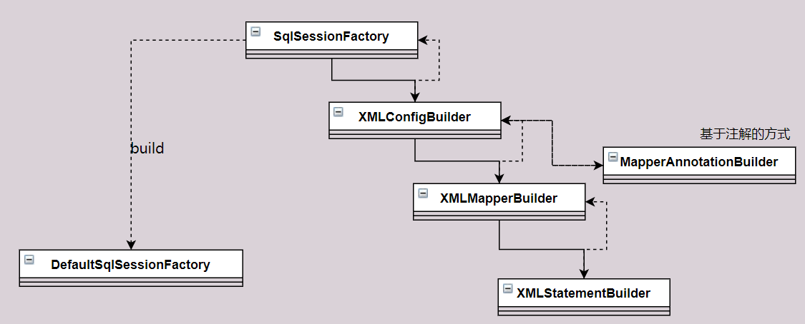

## Mybatis SqlSessionFactory 初始化流程

### SqlSessionFactory

每个基于 MyBatis 的应用都是以一个 SqlSessionFactory 的实例为核心的。SqlSessionFactory 的实例可以通过 SqlSessionFactoryBuilder 获得。而 SqlSessionFactoryBuilder 则可以从 XML 配置文件或一个预先配置的 Configuration 实例来构建出 SqlSessionFactory 实例。

从 XML 文件中构建 SqlSessionFactory 的实例非常简单，建议使用类路径下的资源文件进行配置。 但也可以使用任意的输入流（InputStream）实例，比如用文件路径字符串或 file:// URL 构造的输入流。MyBatis 包含一个名叫 Resources 的工具类，它包含一些实用方法，使得从类路径或其它位置加载资源文件更加容易。

```
String resource = "org/mybatis/example/mybatis-config.xml";
InputStream inputStream = Resources.getResourceAsStream(resource);
SqlSessionFactory sqlSessionFactory = new SqlSessionFactoryBuilder().build(inputStream);
```

XML 配置文件中包含了对 MyBatis 系统的核心设置，包括获取数据库连接实例的数据源（DataSource）以及决定事务作用域和控制方式的事务管理器（TransactionManager）。后面会再探讨 XML 配置文件的详细内容，这里先给出一个简单的示例：

```
<?xml version="1.0" encoding="UTF-8" ?>
<!DOCTYPE configuration
  PUBLIC "-//mybatis.org//DTD Config 3.0//EN"
  "http://mybatis.org/dtd/mybatis-3-config.dtd">
<configuration>
  <environments default="development">
    <environment id="development">
      <transactionManager type="JDBC"/>
      <dataSource type="POOLED">
        <property name="driver" value="${driver}"/>
        <property name="url" value="${url}"/>
        <property name="username" value="${username}"/>
        <property name="password" value="${password}"/>
      </dataSource>
    </environment>
  </environments>
  <mappers>
    <mapper resource="org/mybatis/example/BlogMapper.xml"/>
  </mappers>
</configuration>
```

当然，还有很多可以在 XML 文件中配置的选项，上面的示例仅罗列了最关键的部分。 注意 XML 头部的声明，它用来验证 XML 文档的正确性。environment 元素体中包含了事务管理和连接池的配置。mappers 元素则包含了一组映射器（mapper），这些映射器的 XML 映射文件包含了 SQL 代码和映射定义信息。

### 不使用 XML 构建 SqlSessionFactory

如果你更愿意直接从 Java 代码而不是 XML 文件中创建配置，或者想要创建你自己的配置建造器，MyBatis 也提供了完整的配置类，提供了所有与 XML 文件等价的配置项。

```
DataSource dataSource = BlogDataSourceFactory.getBlogDataSource();
TransactionFactory transactionFactory = new JdbcTransactionFactory();
Environment environment = new Environment("development", transactionFactory, dataSource);
Configuration configuration = new Configuration(environment);
configuration.addMapper(BlogMapper.class);
SqlSessionFactory sqlSessionFactory = new SqlSessionFactoryBuilder().build(configuration);
```

注意该例中，configuration 添加了一个映射器类（mapper class）。映射器类是 Java 类，它们包含 SQL 映射注解从而避免依赖 XML 文件。不过，由于 Java 注解的一些限制以及某些 MyBatis 映射的复杂性，要使用大多数高级映射（比如：嵌套联合映射），仍然需要使用 XML 配置。有鉴于此，如果存在一个同名 XML 配置文件，MyBatis 会自动查找并加载它（在这个例子中，基于类路径和 BlogMapper.class 的类名，会加载 BlogMapper.xml）。具体细节稍后讨论。

### SqlSessionFactoryBuilder

```java
String resource = "mybatis-config.xml";
InputStream inputStream = Resources.getResourceAsStream(resource);
SqlSessionFactory sqlSessionFactory = new SqlSessionFactoryBuilder().build(inputStream);
```

- build 方法：

  ```java
  // 1.我们最初调用的build
  public SqlSessionFactory build(InputStream inputStream) {
      //调用了重载方法
      return build(inputStream, null, null);
  }
  ​
  // 2.调用的重载方法
  public SqlSessionFactory build(InputStream inputStream, String environment, Properties properties) {
      try {
          // 创建 XMLConfigBuilder, XMLConfigBuilder是专门解析mybatis的配置文件的类
          XMLConfigBuilder parser = new XMLConfigBuilder(inputStream, environment, properties);
          // 执行 XML 解析
          // 创建 DefaultSqlSessionFactory 对象
          return build(parser.parse());
      } catch (Exception e) {
          //···
      }
  }
  ```

- parser.parse()

  ```java
  public Configuration parse() {
      if (parsed) {
        throw new BuilderException("Each XMLConfigBuilder can only be used once.");
      }
      // 标记已解析
      parsed = true;
      // parser.evalNode("/configuration")，
      // 通过xpath 读取配置文件的节点，将读取出配置文件的所以节点
      //<configuration>
      //   <environments default="development">
    	//   </environments>
      //<configuration>
      parseConfiguration(parser.evalNode("/configuration"));
      return configuration;
    }
  ```

- parseConfiguration(XNode root) 

  ```java
  // 解析每个节点 这里每个方法进去都会有很多配置，这里就不一一解析，大家感兴趣可以看看，
  //  settingsElement(settings);mapperElement(root.evalNode("mappers"));
  private void parseConfiguration(XNode root) {
      try {
          //issue #117 read properties first
          // 解析 <properties /> 标签
          propertiesElement(root.evalNode("properties"));
          // 解析 <settings /> 标签
          Properties settings = settingsAsProperties(root.evalNode("settings"));
          // 加载自定义的 VFS 实现类
          loadCustomVfs(settings);
          // 解析 <typeAliases /> 标签
          typeAliasesElement(root.evalNode("typeAliases"));
          // 解析 <plugins /> 标签
          pluginElement(root.evalNode("plugins"));
          // 解析 <objectFactory /> 标签
          objectFactoryElement(root.evalNode("objectFactory"));
          // 解析 <objectWrapperFactory /> 标签
          objectWrapperFactoryElement(root.evalNode("objectWrapperFactory"));
          // 解析 <reflectorFactory /> 标签
          reflectorFactoryElement(root.evalNode("reflectorFactory"));
          // 赋值 <settings /> 到 Configuration 属性
          settingsElement(settings);
          // read it after objectFactory and objectWrapperFactory issue #631
          // 解析 <environments /> 标签
          environmentsElement(root.evalNode("environments"));
          // 解析 <databaseIdProvider /> 标签
          databaseIdProviderElement(root.evalNode("databaseIdProvider"));
          // 解析 <typeHandlers /> 标签
          typeHandlerElement(root.evalNode("typeHandlers"));
          // 解析 <mappers /> 标签
          mapperElement(root.evalNode("mappers"));
      } catch (Exception e) {
          throw new BuilderException("Error parsing SQL Mapper Configuration. Cause: " + e, e);
      }
  }
  
      // 获取mapper
    private void mapperElement(XNode parent) throws Exception {
      if (parent != null) {
        for (XNode child : parent.getChildren()) {
           // 如果是 包将在这里进行渲染
          if ("package".equals(child.getName())) {
            String mapperPackage = child.getStringAttribute("name");
            configuration.addMappers(mapperPackage);
          } else {
              // 读取resource 标签 
            String resource = child.getStringAttribute("resource");
             // 读取url 标签  
            String url = child.getStringAttribute("url");
              // 读取注解
            String mapperClass = child.getStringAttribute("class");
              // 根据不同的方式完成
            if (resource != null && url == null && mapperClass == null) {
              ErrorContext.instance().resource(resource);
              InputStream inputStream = Resources.getResourceAsStream(resource);
              XMLMapperBuilder mapperParser = new XMLMapperBuilder(inputStream, configuration, resource, configuration.getSqlFragments());
              mapperParser.parse();
            } else if (resource == null && url != null && mapperClass == null) {
              ErrorContext.instance().resource(url);
              InputStream inputStream = Resources.getUrlAsStream(url);
              XMLMapperBuilder mapperParser = new XMLMapperBuilder(inputStream, configuration, url, configuration.getSqlFragments());
              mapperParser.parse();
            } else if (resource == null && url == null && mapperClass != null) {
              Class<?> mapperInterface = Resources.classForName(mapperClass);
              configuration.addMapper(mapperInterface);
            } else {
              throw new BuilderException("A mapper element may only specify a url, resource or class, but not more than one.");
            }
          }
        }
      }
    }
  
  private void settingsElement(Properties props) {
      configuration.setAutoMappingBehavior(AutoMappingBehavior.valueOf(props.getProperty("autoMappingBehavior", "PARTIAL")));
      configuration.setAutoMappingUnknownColumnBehavior(AutoMappingUnknownColumnBehavior.valueOf(props.getProperty("autoMappingUnknownColumnBehavior", "NONE")));
      configuration.setCacheEnabled(booleanValueOf(props.getProperty("cacheEnabled"), true));
      configuration.setProxyFactory((ProxyFactory) createInstance(props.getProperty("proxyFactory")));
   .....
      configuration.setShrinkWhitespacesInSql(booleanValueOf(props.getProperty("shrinkWhitespacesInSql"), false));
    }
  ```

- mapperParser.parse();

  ```java
  // 这里我们先看一下 mapperParser.parse();方法 懂得原理，都是类似的
    public void parse() {
      if (!configuration.isResourceLoaded(resource)) {
        // 加载 mapper所有子节点
        configurationElement(parser.evalNode("/mapper"));
        configuration.addLoadedResource(resource);
          // 绑定 Namespace
        bindMapperForNamespace();
      }
  	// 构建ResultMap	 
      parsePendingResultMaps();
      parsePendingCacheRefs();
      parsePendingStatements();
    }
    	// 这里将解析整个 xml文件
      private void configurationElement(XNode context) {
      try {
        String namespace = context.getStringAttribute("namespace");
        if (namespace == null || namespace.isEmpty()) {
          throw new BuilderException("Mapper's namespace cannot be empty");
        }
        builderAssistant.setCurrentNamespace(namespace);
        cacheRefElement(context.evalNode("cache-ref"));
        cacheElement(context.evalNode("cache"));
        parameterMapElement(context.evalNodes("/mapper/parameterMap"));
        resultMapElements(context.evalNodes("/mapper/resultMap"));
        sqlElement(context.evalNodes("/mapper/sql"));
          // 解析标签，
        buildStatementFromContext(context.evalNodes("select|insert|update|delete"));
      } catch (Exception e) {
        throw new BuilderException("Error parsing Mapper XML. The XML location is '" + resource + "'. Cause: " + e, e);
      }
    }
  
  // 关于注解的方式的parse
    public void parse() {
      String resource = type.toString();
      if (!configuration.isResourceLoaded(resource)) {
        loadXmlResource();
        configuration.addLoadedResource(resource);
        assistant.setCurrentNamespace(type.getName());
        parseCache();
        parseCacheRef();
        for (Method method : type.getMethods()) {
          if (!canHaveStatement(method)) {
            continue;
          }
          if (getAnnotationWrapper(method, false, Select.class, SelectProvider.class).isPresent()
              && method.getAnnotation(ResultMap.class) == null) {
            parseResultMap(method);
          }
          try {
            parseStatement(method);
          } catch (IncompleteElementException e) {
            configuration.addIncompleteMethod(new MethodResolver(this, method));
          }
        }
      }
      parsePendingMethods();
    }
  ```

**到此Mybatis的初始化工作就完毕了，主要做了两件大事**

1. 解析核心配置文件到`Configuration`对象，解析映射配置文件到`MappedStatement`对象，并保存在`Configuration`的对应Map中
2. 创建了`DefaultSqlSessionFactory`返回

通过上面的代码分析，总结了一下使用的重要的类，通过下图的装配，最终返回`SqlSessionFactory`，而`SqlSessionFactory`的最终实现是 `DefaultSqlSessionFactory`，关于`DefaultSqlSessionFactory`的介绍我们将放在下篇文章进行讲解，感兴趣的小伙伴可以持续关注！



## 拓展

看到这里很多人就会有个疑问，这是通过配置文件的方式在进行配置，但是SpringBoot 没有这样的配置文件，是怎么做到的呢？其实SpringBoot是通过自定配置完成；

```java
@Configuration
// 实例化 SqlSessionFactory
@ConditionalOnClass({SqlSessionFactory.class, SqlSessionFactoryBean.class})
@ConditionalOnSingleCandidate(DataSource.class)
// MybatisProperties 我们常用的配置
@EnableConfigurationProperties({MybatisProperties.class})
@AutoConfigureAfter({DataSourceAutoConfiguration.class, MybatisLanguageDriverAutoConfiguration.class})
public class MybatisAutoConfiguration implements InitializingBean {}
```

如果大家感兴趣，可以看看`SqlSessionFactoryBean` 代码，很多地方还是复用我们刚刚看到的代码的！