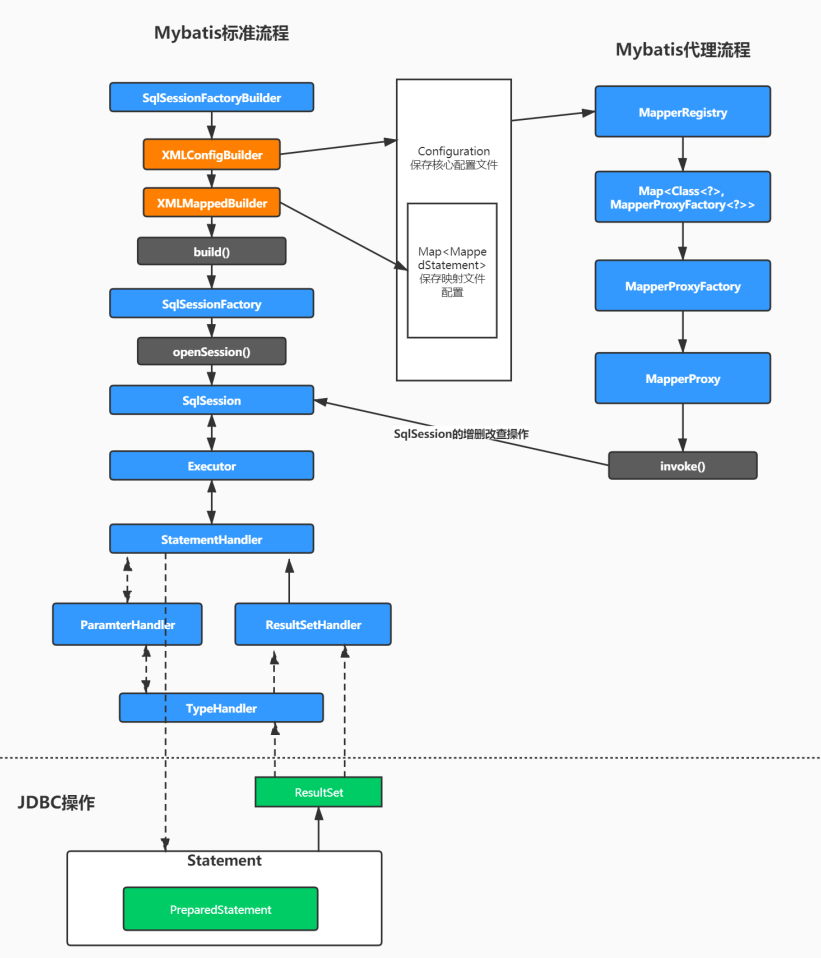

### 代理方式源码分析

回顾代理模式的写法：

```
/**
 * mapper代理方式
 */
public void test2() throws IOException {

  InputStream inputStream = Resources.getResourceAsStream("sqlMapConfig.xml");
  SqlSessionFactory factory = new SqlSessionFactoryBuilder().build(inputStream);
  SqlSession sqlSession = factory.openSession();

  // 使用JDK动态代理对mapper接口产生代理对象
  IUserMapper mapper = sqlSession.getMapper(IUserMapper.class);

  //代理对象调用接口中的任意方法，执行的都是动态代理中的invoke方法
  List<Object> allUser = mapper.findAllUser();

}
```

这里我们就需要带着问题去看源码

- SqlSession是如何生成接口的代理对象的
- 代理对象执行方法时（`invoke`），是如何进行一些处理的

#### getMapper()源码解析

我们看`getMapper()`之前，首先思考一下，使用代理模式开发，需要怎么做？

1. 创建Dao接口，编写方法，编写对应的`mapper`映射文件
2. 在核心配置类中扫描Dao接口，一般是使用扫描包的形式

所以，我们先去看解析核心配置中`mappers`标签的源码，看看扫描后，他是将我们配置的类放到了哪里？

**通过Mybatis初始化过程的源码分析，我们直接来到`XMLConfigBuilder.mapperElement()`方法**

```
private void mapperElement(XNode parent) throws Exception {
    if (parent != null) {
        // 遍历子节点
        for (XNode child : parent.getChildren()) {
            // 如果是 package 标签，则扫描该包
            if ("package".equals(child.getName())) {
                // 获得包名
                String mapperPackage = child.getStringAttribute("name");
                // 添加到 configuration 中
                configuration.addMappers(mapperPackage);
            // 如果是 mapper 标签，
            } else {
                // ···
            }
        }
    }
}
```

这里可以看到，如果扫描包的形式，会调用`configuration.addMappers()`方法

```
public class MapperRegistry {

    /**
     * MapperProxyFactory 的映射
     *
     * KEY：Mapper 接口
     */
    //这个类中维护一个HashMap存放MapperProxyFactory
    private final Map<Class<?>, MapperProxyFactory<?>> knownMappers = new HashMap<>();


    public void addMappers(String packageName) {
        addMappers(packageName, Object.class);
    }
    /**
     * 扫描指定包，并将符合的类，添加到 {@link #knownMappers} 中
     *
     * @since 3.2.2
     */
    public void addMappers(String packageName, Class<?> superType) {
        // 扫描指定包下的指定类
        ResolverUtil<Class<?>> resolverUtil = new ResolverUtil<>();
        resolverUtil.find(new ResolverUtil.IsA(superType), packageName);
        Set<Class<? extends Class<?>>> mapperSet = resolverUtil.getClasses();
        // 遍历，添加到 knownMappers 中
        for (Class<?> mapperClass : mapperSet) {
            addMapper(mapperClass);
        }
    }
    public <T> void addMapper(Class<T> type) {
        // 判断，必须是接口。
        if (type.isInterface()) {
            // 已经添加过，则抛出 BindingException 异常
            if (hasMapper(type)) {
                throw new BindingException("Type " + type + " is already known to the MapperRegistry.");
            }
            boolean loadCompleted = false;
            try {
                // 添加到 knownMappers 中
                knownMappers.put(type, new MapperProxyFactory<>(type));
                // 解析 Mapper 的注解配置
                MapperAnnotationBuilder parser = new MapperAnnotationBuilder(config, type);
                parser.parse();
                // 标记加载完成
                loadCompleted = true;
            } finally {
                // 若加载未完成，从 knownMappers 中移除
                if (!loadCompleted) {
                    knownMappers.remove(type);
                }
            }
        }
    }
}
```

通过源码，我们发现了Mybatis会获取包下所有类对象Class，然后通过`new MapperProxyFactory<>(type)`创建出代理工厂对象，`Map, MapperProxyFactory> knownMappers`存放到Map中

- key：类对象
- value：`MapperProxyFactory`代理工厂对象

到此，我们就知道了，在Mybatis初始化过程中，会将配置的Dao类保存到Map中

**接着，我们去查看`getMapper()`源码**

```
@Override
public <T> T getMapper(Class<T> type) {
    return configuration.getMapper(type, this);
}

public <T> T getMapper(Class<T> type, SqlSession sqlSession) {
    return mapperRegistry.getMapper(type, sqlSession);
}

@SuppressWarnings("unchecked")
public <T> T getMapper(Class<T> type, SqlSession sqlSession) {
    // 获得 MapperProxyFactory 对象
    final MapperProxyFactory<T> mapperProxyFactory = (MapperProxyFactory<T>) knownMappers.get(type);
    // 不存在，则抛出 BindingException 异常
    if (mapperProxyFactory == null) {
        throw new BindingException("Type " + type + " is not known to the MapperRegistry.");
    }
    /// 通过动态代理工厂生成实例。
    try {
        return mapperProxyFactory.newInstance(sqlSession);
    } catch (Exception e) {
        throw new BindingException("Error getting mapper instance. Cause: " + e, e);
    }
}
```

最终就来到了`MapperRegistry`对象中，也就是刚刚注册Dao接口的地方，通过源码会发现，他先从Map中取出该类对应的`MapperProxyFactory`，然后调用`mapperProxyFactory.newInstance(sqlSession)`来构建代理对象

```
/**
 * Mapper Proxy 工厂类
 *
 * @author Lasse Voss
 */
public class MapperProxyFactory<T> {
    
    @SuppressWarnings("unchecked")
    protected T newInstance(MapperProxy<T> mapperProxy) {
        return (T) Proxy.newProxyInstance(mapperInterface.getClassLoader(), new Class[]{mapperInterface}, mapperProxy);
    }

    //MapperProxyFactory类中的newInstance方法
    public T newInstance(SqlSession sqlSession) {
        // 创建了JDK动态代理的invocationHandler接口的实现类mapperProxy
        final MapperProxy<T> mapperProxy = new MapperProxy<>(sqlSession, mapperInterface, methodCache);
        // 调用了重载方法
        return newInstance(mapperProxy);
    }
}
```

1. 创建`MapperProxy`对象，这个对象实现类`InvocationHandler`代理必备接口
2. 通过JDK动态代理的方式，构建出Dao对应的代理对象并返回

所以，通过源码，我们最终知道了：

- Mybatis初始化时，会扫描配置的包，把Dao接口和对应的`MapperProxyFactory`以键值对形式保存到Map中
- 通过getMapper()获取代理对象时，是使用JDK动态代理的形式创建出了`MapperProxy`代理对象

#### invoke()源码分析

通过前面的学习，我们知道代理类不管执行什么方法，都会走`invoke()`方法，所以我们直接取`MapperProxy`查看`invoke`方法的源码

```
@Override
public Object invoke(Object proxy, Method method, Object[] args) throws Throwable {
    //····
    // 获得 MapperMethod 对象
    final MapperMethod mapperMethod = cachedMapperMethod(method);
    // 重点在这：MapperMethod最终调用了执行的方法
    return mapperMethod.execute(sqlSession, args);
}

public Object execute(SqlSession sqlSession, Object[] args) {
    Object result;
    //判断mapper中的方法类型，最终调用的还是SqlSession中的方法
    switch (command.getType()) {
        case INSERT: {
            // 转换参数
            Object param = method.convertArgsToSqlCommandParam(args);
            // 执行 INSERT 操作
            // 转换 rowCount
            result = rowCountResult(sqlSession.insert(command.getName(), param));
            break;
        }
        case UPDATE: {
            // 转换参数
            Object param = method.convertArgsToSqlCommandParam(args);
            // 转换 rowCount
            result = rowCountResult(sqlSession.update(command.getName(), param));
            break;
        }
        case DELETE: {
            // 转换参数
            Object param = method.convertArgsToSqlCommandParam(args);
            // 转换 rowCount
            result = rowCountResult(sqlSession.delete(command.getName(), param));
            break;
        }
        case SELECT:
            // 无返回，并且有 ResultHandler 方法参数，则将查询的结果，提交给 ResultHandler 进行处理
            if (method.returnsVoid() && method.hasResultHandler()) {
                executeWithResultHandler(sqlSession, args);
                result = null;
                // 执行查询，返回列表
            } else if (method.returnsMany()) {
                result = executeForMany(sqlSession, args);
                // 执行查询，返回 Map
            } else if (method.returnsMap()) {
                result = executeForMap(sqlSession, args);
                // 执行查询，返回 Cursor
            } else if (method.returnsCursor()) {
                result = executeForCursor(sqlSession, args);
                // 执行查询，返回单个对象
            } else {
                // 转换参数
                Object param = method.convertArgsToSqlCommandParam(args);
                // 查询单条
                result = sqlSession.selectOne(command.getName(), param);
                if (method.returnsOptional() &&
                    (result == null || !method.getReturnType().equals(result.getClass()))) {
                    result = Optional.ofNullable(result);
                }
            }
            break;
        case FLUSH:
            result = sqlSession.flushStatements();
            break;
        default:
            throw new BindingException("Unknown execution method for: " + command.getName());
    }
    // 返回结果为 null ，并且返回类型为基本类型，则抛出 BindingException 异常
    if (result == null && method.getReturnType().isPrimitive() && !method.returnsVoid()) {
        throw new BindingException("Mapper method '" + command.getName()
                                   + " attempted to return null from a method with a primitive return type (" + method.getReturnType() + ").");
    }
    // 返回结果
    return result;
}
```

通过源码，我们可以看到，首先会判断方法类型，是增删改查中的哪一种，然后其实还是调用的SqlSession中的增删改查方法

查询方法里，会根据返回值不同进行不同的请求，我们看一下返回列表也就是`List`类型的方法

```
private <E> Object executeForMany(SqlSession sqlSession, Object[] args) {
    List<E> result;
    // 转换参数
    Object param = method.convertArgsToSqlCommandParam(args);
    // 执行 SELECT 操作
    if (method.hasRowBounds()) {
        RowBounds rowBounds = method.extractRowBounds(args);
        result = sqlSession.selectList(command.getName(), param, rowBounds);
    } else {
        result = sqlSession.selectList(command.getName(), param);
    }
    // issue #510 Collections & arrays support
    // 封装 Array 或 Collection 结果
    if (!method.getReturnType().isAssignableFrom(result.getClass())) {
        if (method.getReturnType().isArray()) { // 情况一，Array
            return convertToArray(result);
        } else {
            return convertToDeclaredCollection(sqlSession.getConfiguration(), result); // 情况二，Collection
        }
    }
    // 直接返回的结果
    return result; // 情况三，默认
}
```

可以看到，实际还是执行的 `sqlSession.selectList()`方法，然后传入`StatementId`等参数

到这里关于Mybatis的执行流程就梳理完成了，如果您没有看到之前的文章，

## Mybatis整体流程总结




