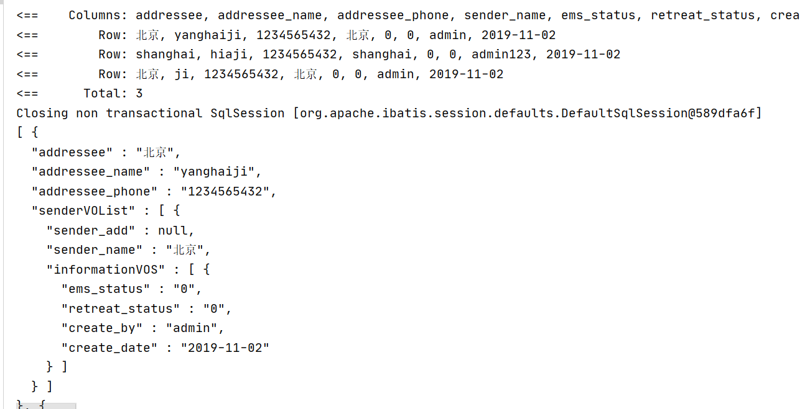
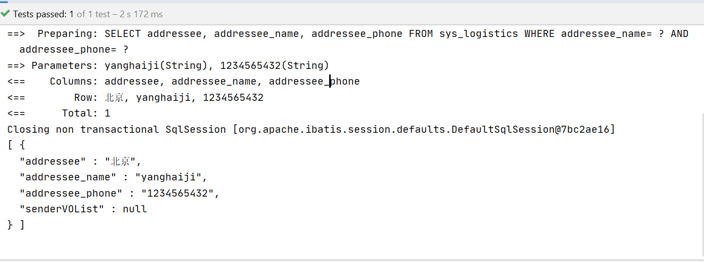

## Mybatis 学习扩展

* [多级映射返回JSON数据](#多级映射返回JSON数据)
* [foreach里写if](#foreach里写if)

##  多级映射返回JSON数据
在日常的开发中，接口的返回数据大多都是Json，以下也是一个很常见的json格式
```json
[
  {
    "addressee": "北京",
    "addressee_name": "yanghaiji",
    "addressee_phone": "1234565432",
    "senderVOList": [
      {
        "sender_add": null,
        "sender_name": "北京",
        "informationVOS": [
          {
            "ems_status": "0",
            "retreat_status": "0",
            "create_by": "admin",
            "create_date": "2019-11-02"
          }
        ]
      }
    ]
  },
  {
    "addressee": "shanghai",
    "addressee_name": "hiaji",
    "addressee_phone": "1234565432",
    "senderVOList": [
      {
        "sender_add": null,
        "sender_name": "shanghai",
        "informationVOS": [
          {
            "ems_status": "0",
            "retreat_status": "0",
            "create_by": "admin123",
            "create_date": "2019-11-02"
          }
        ]
      }
    ]
  },
  {
    "addressee": "北京",
    "addressee_name": "ji",
    "addressee_phone": "1234565432",
    "senderVOList": [
      {
        "sender_add": null,
        "sender_name": "北京",
        "informationVOS": [
          {
            "ems_status": "0",
            "retreat_status": "0",
            "create_by": "admin",
            "create_date": "2019-11-02"
          }
        ]
      }
    ]
  }
]
```
看到上边的json，您会想到，直接查询一下，在java代码进行循环拼接？实则不然，Mybatis为我们提供了很好的帮助，
细心的朋友会在[mybatis 结果映射](结果映射.md)中有所感悟，其实我们只需要利用到` <resultMap>` `<collection>`
等结果映射标签即可完成，不需要代码处理

首先我们写这样一段sql
```sql
<select id="findAll" resultMap="logisticsMap">
    SELECT
        addressee,
        addressee_name,
        addressee_phone,
        sender_add sender_name,
        ems_status,
        retreat_status,
        create_by,
        create_date
    FROM
        sys_logistics
</select>
```
根据您需要的结构编写实体类，这里略过，大家可以参考`source-code` 关系Mybatis的相关代码

然后开始编写`resultMap`
这里我只是三层的关系，更多的层次关系继续写就可以
```xml
<resultMap type="com.javayh.advanced.mybatis.vo.LogisticsVO" id="logisticsMap">
    <result property="addressee" column="addressee"/>
    <result property="addressee_name" column="addressee_name"/>
    <result property="addressee_phone" column="addressee_phone"/>
    <collection property="senderVOList"  resultMap = "senderVOListMap"/>
</resultMap>
<resultMap type="com.javayh.advanced.mybatis.vo.LogisticsSenderVO" id="senderVOListMap">
    <result property="sender_add" column="sender_add"/>
    <result property="sender_name" column="sender_name"/>
    <collection property="informationVOS"  resultMap = "informationVOSMap"/>
</resultMap>
<resultMap type="com.javayh.advanced.mybatis.vo.OtherInformationVO" id="informationVOSMap">
    <result property="create_by" column="create_by"/>
    <result property="create_date" column="create_date"/>
    <result property="retreat_status" column="retreat_status"/>
    <result property="ems_status" column="ems_status"/>
</resultMap>
```
最后测试
```java
@Test
void mapperMap() throws JsonProcessingException {
    List<LogisticsVO> all = testMapper.findAll();
    ObjectMapper objectMapper = new ObjectMapper();
    String s = objectMapper.writerWithDefaultPrettyPrinter().writeValueAsString(all);
    System.out.println(s);
}
```


## foreach里写if

大多数我们都是利用 `foreach` 来做某个字段的 `in` 查询，但是有一天一个朋友问我，`foreach` 里可以写`if`吗?
我的第一反应是应该可以写，后来想了一下，肯定是可以的，当然我们也不能全部停留在自己的想法上，还是要去实现一下的;
```xml
<select id="findListAndIf" resultType="com.javayh.advanced.mybatis.vo.LogisticsVO">
     SELECT
        addressee,
        addressee_name,
        addressee_phone
    FROM
        sys_logistics
    <trim prefix="WHERE" prefixOverrides="AND | OR">
        <foreach item="vos" index="vos" collection="vos"  separator="," >
            <if test="vos.addressee_name != null and vos.addressee_name != ''">
                AND addressee_name= #{vos.addressee_name}
            </if>
            <if test="vos.addressee_phone != null and vos.addressee_phone != ''">
                AND addressee_phone= #{vos.addressee_phone}
            </if>
        </foreach>
    </trim>
</select>
```
由于我们这里直接写 `WHERE ` 肯定会报错 ，毕竟这是动态 `SQL`，所以我们采用`<trim>`来写，如果您还不了解，可以看一下[Mybatis 动态SQL](动态SQL.md)
假设可以，最终执行的`SQL`应该是类似这样：
```sql
SELECT 
    addressee, addressee_name, addressee_phone 
FROM sys_logistics 
WHERE addressee_name= ? 
    AND addressee_phone= ? 
```

`SQL`与已经写完，来开发个接口验证一下：
```java
@Test
void mapperIf() throws JsonProcessingException {
    LogisticsVO yanghaiji = LogisticsVO.builder().addressee_name("yanghaiji").addressee_phone("1234565432").build();
    List<LogisticsVO> logisticsVOS = new ArrayList<>();
    logisticsVOS.add(yanghaiji);
    List<LogisticsVO> all = testMapper.findListAndIf(logisticsVOS);
    ObjectMapper objectMapper = new ObjectMapper();
    String s = objectMapper.writerWithDefaultPrettyPrinter().writeValueAsString(all);
    System.out.println(s);
}
```
通过下图我们可以看出，和我预想的`sql`是一样的，源代码，请参考`source-code` 内`mybatis`相关的代码

