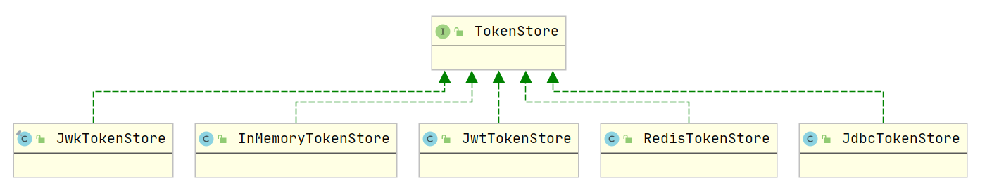

## OAuth2 内置断点生成Token源码解析

在我们现实的开发者,当我们使用oauth的时候，当需要生成token时,
只需要去调用`/oauth/token`,但是他具体做了什么？就可以实现今天我们就来一探究竟

### TokenEndpoint

不难看出最终调用的时`TokenEndpoint`这个类，那么我们来分析学习一下这个类

首先映入眼帘的时`@FrameworkEndpoint`,`@FrameworkEndpoint`与`@Controller`的同义词，
但仅用于框架提供的端点（因此它永远不会与用`@Controller`定义的用户自己的端点冲突）

框架为我们提供了`POST`与`GET`请求，但最终走的都是`POST`请求

```java
@FrameworkEndpoint
public class TokenEndpoint extends AbstractEndpoint {
    // 以下是核心部分代码...
    @RequestMapping(value = "/oauth/token", method=RequestMethod.POST)
    public ResponseEntity<OAuth2AccessToken> postAccessToken(Principal principal, @RequestParam Map<String, String> parameters) throws HttpRequestMethodNotSupportedException {
 
        if (!(principal instanceof Authentication)) {
            throw new InsufficientAuthenticationException(
                    "There is no client authentication. Try adding an appropriate authentication filter.");
        }
 
        // 1. 从 principal 中获取 clientId, 进而 load client 信息
        String clientId = getClientId(principal);
        ClientDetails authenticatedClient = getClientDetailsService().loadClientByClientId(clientId);
 
        // 2. 从 parameters 中拿 clientId、scope、grantType 组装 TokenRequest
        TokenRequest tokenRequest = getOAuth2RequestFactory().createTokenRequest(parameters, authenticatedClient);
 
        // 3. 校验 client 信息
        if (clientId != null && !clientId.equals("")) {
            if (!clientId.equals(tokenRequest.getClientId())) {
                // 双重校验: 确保从 principal 拿到的 client 信息与根据 parameters 得到的 client 信息一致
                throw new InvalidClientException("Given client ID does not match authenticated client");
            }
        }
        if (authenticatedClient != null) {
            oAuth2RequestValidator.validateScope(tokenRequest, authenticatedClient);
        }
 
        // 4. 根据 grantType 设置 TokenRequest 的 scope。
        // 授权类型有: password 模式、authorization_code 模式、refresh_token 模式、client_credentials 模式、implicit 模式
        if (!StringUtils.hasText(tokenRequest.getGrantType())) {
            throw new InvalidRequestException("Missing grant type");
        }
        if (tokenRequest.getGrantType().equals("implicit")) {
            throw new InvalidGrantException("Implicit grant type not supported from token endpoint");
        }
 
        // 如果是授权码模式, 则清空 scope。 因为授权请求过程会确定 scope, 所以没必要传
        if (isAuthCodeRequest(parameters)) {
            if (!tokenRequest.getScope().isEmpty()) {
                logger.debug("Clearing scope of incoming token request");
                tokenRequest.setScope(Collections.<String> emptySet());
            }
        }
 
        // 如果是刷新 Token 模式, 解析并设置 scope
        if (isRefreshTokenRequest(parameters)) {
            tokenRequest.setScope(OAuth2Utils.parseParameterList(parameters.get(OAuth2Utils.SCOPE)));
        }
 
        // 5. 通过令牌授予者获取 token
        OAuth2AccessToken token = getTokenGranter().grant(tokenRequest.getGrantType(), tokenRequest);
        if (token == null) {
            throw new UnsupportedGrantTypeException("Unsupported grant type: " + tokenRequest.getGrantType());
        }
 
        return getResponse(token);
    }
    // ...
}
```

这里我们来看一下生成token的逻辑，也就是` OAuth2AccessToken token = getTokenGranter().grant(tokenRequest.getGrantType(), tokenRequest);`
这段代码，调用的时 `AbstractTokenGranter` 类
```java
public OAuth2AccessToken grant(String grantType, TokenRequest tokenRequest) {
		if (!this.grantType.equals(grantType)) {
			return null;
		}
		String clientId = tokenRequest.getClientId();
        // loadClientByClientId， 这里我们是可以自定的
		ClientDetails client = clientDetailsService.loadClientByClientId(clientId);
		validateGrantType(grantType, client);

		if (logger.isDebugEnabled()) {
			logger.debug("Getting access token for: " + clientId);
		}
		return getAccessToken(client, tokenRequest);
	}
```

```java
protected OAuth2AccessToken getAccessToken(ClientDetails client, TokenRequest tokenRequest) {
	return tokenServices.createAccessToken(getOAuth2Authentication(client, tokenRequest));
}
```

`getOAuth2Authentication` 有三种方式的实现

```java
## 授权码模式
AuthorizationCodeTokenGranter
## 简单模式
ImplicitTokenGranter
## 密码模式
ResourceOwnerPasswordTokenGranter
```

### 密码模式下生成Token

```java
	@Override
	protected OAuth2Authentication getOAuth2Authentication(ClientDetails client, TokenRequest tokenRequest) {

		Map<String, String> parameters = new LinkedHashMap<String, String>(tokenRequest.getRequestParameters());
		String username = parameters.get("username");
		String password = parameters.get("password");
		// 删除密码，方式上下文密码泄露
		parameters.remove("password");

		Authentication userAuth = new UsernamePasswordAuthenticationToken(username, password);
		((AbstractAuthenticationToken) userAuth).setDetails(parameters);
		try {
			userAuth = authenticationManager.authenticate(userAuth);
		}
		catch (AccountStatusException ase) {
			//covers expired, locked, disabled cases (mentioned in section 5.2, draft 31)
			throw new InvalidGrantException(ase.getMessage());
		}
		catch (BadCredentialsException e) {
			// If the username/password are wrong the spec says we should send 400/invalid grant
			throw new InvalidGrantException(e.getMessage());
		}
		if (userAuth == null || !userAuth.isAuthenticated()) {
			throw new InvalidGrantException("Could not authenticate user: " + username);
		}
		
		OAuth2Request storedOAuth2Request = getRequestFactory().createOAuth2Request(client, tokenRequest);		
		return new OAuth2Authentication(storedOAuth2Request, userAuth);
	}
```

`OAuth2Request storedOAuth2Request = getRequestFactory().createOAuth2Request(client, tokenRequest);	`
最终调用的是`TokenRequest`
 
```java
	public OAuth2Request createOAuth2Request(ClientDetails client) {
		Map<String, String> requestParameters = getRequestParameters();
		HashMap<String, String> modifiable = new HashMap<String, String>(requestParameters);
		// Remove password if present to prevent leaks
		modifiable.remove("password");
		modifiable.remove("client_secret");
		// Add grant type so it can be retrieved from OAuth2Request
		modifiable.put("grant_type", grantType);
		return new OAuth2Request(modifiable, client.getClientId(), client.getAuthorities(), true, this.getScope(),
				client.getResourceIds(), null, null, null);
	}
```

我们知道了密码模式下的`createOAuth2Request`，这是我们在回到`createAccessToken`,他最终调用的是`DefaultTokenServices`的方法，

```java
	@Transactional
	public OAuth2AccessToken createAccessToken(OAuth2Authentication authentication) throws AuthenticationException {
        // 这里有多种实现方式，详细见下图
		OAuth2AccessToken existingAccessToken = tokenStore.getAccessToken(authentication);
		OAuth2RefreshToken refreshToken = null;
		if (existingAccessToken != null) {
			if (existingAccessToken.isExpired()) {
				if (existingAccessToken.getRefreshToken() != null) {
					refreshToken = existingAccessToken.getRefreshToken();
					// 这里是是删除token，会根据您所选择的TokenStore进行选择
                    //如: JDBC 最终执行的是 delete from oauth_access_token where token_id = ?
                    // Redis 则会 拼接上系统默认的前缀，在进行删除，如果您重写了redisTokenStore，会带上您自定义的前缀
					tokenStore.removeRefreshToken(refreshToken);
				}
				tokenStore.removeAccessToken(existingAccessToken);
			}
			else {
				// 重新存储访问令牌，以防身份验证发生更改
                // 如: JDBC 最终执行的是
                // insert into oauth_access_token 
                //      (token_id, token, authentication_id, user_name, client_id, authentication, refresh_token) 
                //  values (?, ?, ?, ?, ?, ?, ?)    
                //  Redis 则会 拼接上系统默认的前缀，进行序列化的一系列操作
				tokenStore.storeAccessToken(existingAccessToken, authentication);
				return existingAccessToken;
			}
		}

		// 刷新令牌，客户端可能错油refresh_token ,
        // 仅在没有与过期访问令牌关联的现有刷新令牌的情况下创建新的刷新令牌。
        // 客户端可能持有现有的刷新令牌，因此在旧的访问令牌过期的情况下我们会重新使用它。
		if (refreshToken == null) {
            // 本质其实就是 生成一个UUID ，做了一些关于时间的设置
			refreshToken = createRefreshToken(authentication);
		}
		// 刷新令牌时以过期，这是需要重新生成token
		else if (refreshToken instanceof ExpiringOAuth2RefreshToken) {
			ExpiringOAuth2RefreshToken expiring = (ExpiringOAuth2RefreshToken) refreshToken;
			if (System.currentTimeMillis() > expiring.getExpiration().getTime()) {
                // 同上
				refreshToken = createRefreshToken(authentication);
			}
		}
        // 通过 DefaultOAuth2AccessToken 进行生成Token,但是 这是一个默认的信息，如果您想要一些额外的信息，
        // 需要自定义时，我们需要重写 TokenEnhancerChain 或者 JwtAccessTokenConverter 的方法 示例我会放在下边
		OAuth2AccessToken accessToken = createAccessToken(authentication, refreshToken);
        // 将生成的token进行持久化，与之前选择的 tokenStore有关
		tokenStore.storeAccessToken(accessToken, authentication);
		// 方式被修改
		refreshToken = accessToken.getRefreshToken();
		if (refreshToken != null) {
			tokenStore.storeRefreshToken(refreshToken, authentication);
		}
		return accessToken;

	}
```
tokenStore 的多种实现方式


- MyTokenEnhancerChain
```java
public class MyTokenEnhancerChain extends TokenEnhancerChain {

    /**
     * 生成token
     *
     * @param accessToken
     * @param authentication
     * @return
     */
    @Override
    public OAuth2AccessToken enhance(OAuth2AccessToken accessToken, OAuth2Authentication authentication) {
        DefaultOAuth2AccessToken defaultOAuth2AccessToken = new DefaultOAuth2AccessToken(accessToken);
        final Map<String, Object> additionalInfo = new HashMap<>(8);
        if (!authentication.isClientOnly()) {
            if (authentication.getPrincipal() != null && authentication.getPrincipal() instanceof BaseUserDetails) {
                // 设置额外用户信息
                BaseUser  baseUser = ((BaseUser) authentication.getPrincipal());
                additionalInfo.put("id", baseUser.getUserId());
                additionalInfo.put("email", baseUser.getEmail());
                additionalInfo.put("nick_name", baseUser.getNickName());
            }
        }
        defaultOAuth2AccessToken.setAdditionalInformation(additionalInfo);
        return super.enhance(defaultOAuth2AccessToken, authentication);
    }
}
```

- MyJwtAccessTokenConverter
```java
public class BaseJwtAccessTokenEnhancer extends JwtAccessTokenConverter {

    @Override
    public OAuth2AccessToken enhance(OAuth2AccessToken accessToken, OAuth2Authentication authentication) {
        DefaultOAuth2AccessToken defaultOAuth2AccessToken = new DefaultOAuth2AccessToken(accessToken);
        if (authentication.getPrincipal() != null && authentication.getPrincipal() instanceof BaseUserDetails) {
            // 设置额外用户信息
            BaseUser  baseUser = ((BaseUser) authentication.getPrincipal());
            additionalInfo.put("id", baseUser.getUserId());
            additionalInfo.put("email", baseUser.getEmail());
            additionalInfo.put("nick_name", baseUser.getNickName());
        }
        return super.enhance(defaultOAuth2AccessToken, authentication);
    }

    @Override
    public OAuth2AccessToken extractAccessToken(String value, Map<String, ?> map) {
        return super.extractAccessToken(value, map);
    }
}
```


### 授权码模式下生成Token

```java
	@Override
	protected OAuth2Authentication getOAuth2Authentication(ClientDetails client, TokenRequest tokenRequest) {
		Map<String, String> parameters = tokenRequest.getRequestParameters();
		String authorizationCode = parameters.get("code");
		String redirectUri = parameters.get(OAuth2Utils.REDIRECT_URI);
		if (authorizationCode == null) {
			throw new InvalidRequestException("An authorization code must be supplied.");
		}
        // 这里会将持久化的code进行删除
		OAuth2Authentication storedAuth = authorizationCodeServices.consumeAuthorizationCode(authorizationCode);
		if (storedAuth == null) {
			throw new InvalidGrantException("Invalid authorization code: " + authorizationCode);
		}
		OAuth2Request pendingOAuth2Request = storedAuth.getOAuth2Request();
		// https://jira.springsource.org/browse/SECOAUTH-333
		// This might be null, if the authorization was done without the redirect_uri parameter
		String redirectUriApprovalParameter = pendingOAuth2Request.getRequestParameters().get(
				OAuth2Utils.REDIRECT_URI);

		if ((redirectUri != null || redirectUriApprovalParameter != null)
				&& !pendingOAuth2Request.getRedirectUri().equals(redirectUri)) {
			throw new RedirectMismatchException("Redirect URI mismatch.");
		}
		String pendingClientId = pendingOAuth2Request.getClientId();
		String clientId = tokenRequest.getClientId();
		if (clientId != null && !clientId.equals(pendingClientId)) {
			throw new InvalidClientException("Client ID mismatch");
		}
		Map<String, String> combinedParameters = new HashMap<String, String>(pendingOAuth2Request
				.getRequestParameters());
		// 合并最后添加新参数的参数，以便在发生任何碰撞时替代这些参数
		combinedParameters.putAll(parameters);
		
		// Make a new stored request with the combined parameters
		OAuth2Request finalStoredOAuth2Request = pendingOAuth2Request.createOAuth2Request(combinedParameters);
		
		Authentication userAuth = storedAuth.getUserAuthentication();
		
		return new OAuth2Authentication(finalStoredOAuth2Request, userAuth);

	}
```

如何让生成token,与上面的过程是一样的


