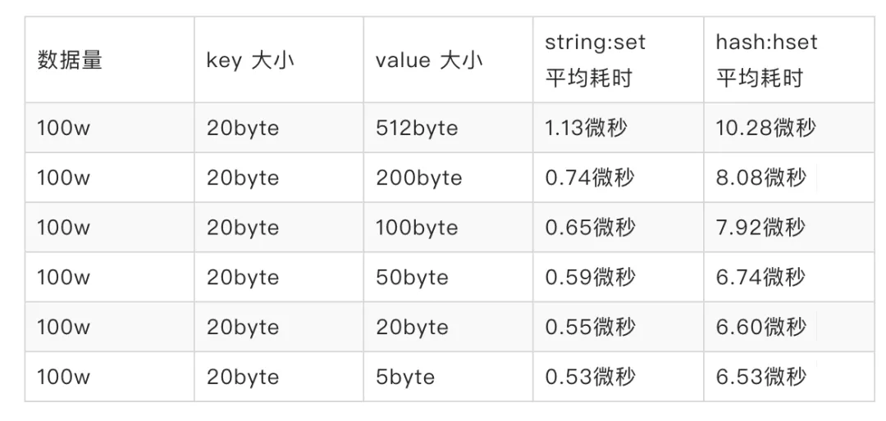
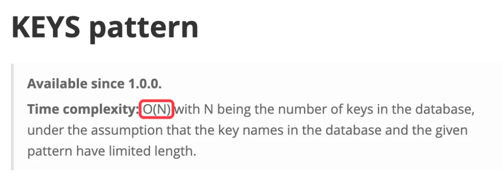
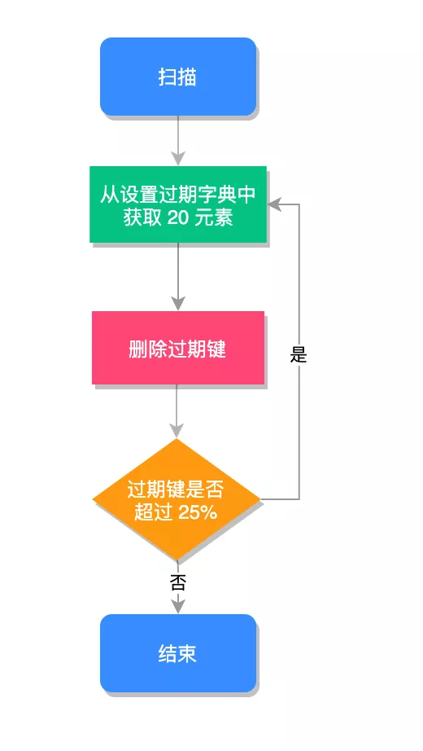
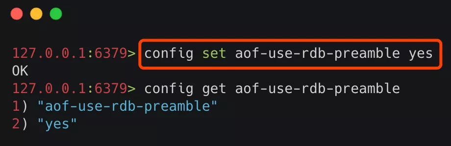
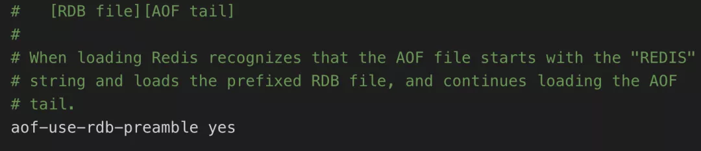

## 大厂Redis 性能优化的 13 条军规

Redis 是基于单线程模型实现的，也就是 Redis 是使用一个线程来处理所有的客户端请求的，尽管 Redis 使用了非阻塞式 IO，并且对各种命令都做了优化（大部分命令操作时间复杂度都是 O(1)），但由于 Redis 是单线程执行的特点，因此它对性能的要求更加苛刻，本文我们将通过一些优化手段，让 Redis 更加高效的运行。

本文我们将使用以下手段，来提升 Redis 的运行速度：

1. 缩短键值对的存储长度；
2. 使用 lazy free（延迟删除）特性；
3. 设置键值的过期时间；
4. 禁用长耗时的查询命令；
5. 使用 slowlog 优化耗时命令；
6. 使用 Pipeline 批量操作数据；
7. 避免大量数据同时失效；
8. 客户端使用优化；
9. 限制 Redis 内存大小；
10. 使用物理机而非虚拟机安装 Redis 服务；
11. 检查数据持久化策略；
12. 禁用 THP 特性；
13. 使用分布式架构来增加读写速度。

## 1. 缩短键值对的存储长度

键值对的长度是和性能成反比的，比如我们来做一组写入数据的性能测试，执行结果如下：



从以上数据可以看出，在 key 不变的情况下，value 值越大操作效率越慢，因为 Redis 对于同一种数据类型会使用不同的内部编码进行存储，比如字符串的内部编码就有三种：int（整数编码）、raw（优化内存分配的字符串编码）、embstr（动态字符串编码），这是因为 Redis 的作者是想通过不同编码实现效率和空间的平衡，然而数据量越大使用的内部编码就越复杂，而越是复杂的内部编码存储的性能就越低。

这还只是写入时的速度，当键值对内容较大时，还会带来另外几个问题：

- 内容越大需要的持久化时间就越长，需要挂起的时间越长，Redis 的性能就会越低；
- 内容越大在网络上传输的内容就越多，需要的时间就越长，整体的运行速度就越低；
- 内容越大占用的内存就越多，就会更频繁的触发内存淘汰机制，从而给 Redis 带来了更多的运行负担。

因此在保证完整语义的同时，我们要尽量的缩短键值对的存储长度，必要时要对数据进行序列化和压缩再存储，以 Java 为例，序列化我们可以使用 protostuff 或 kryo，压缩我们可以使用 snappy。

## 2. 使用 lazy free 特性

lazy free 特性是 Redis 4.0 新增的一个非常使用的功能，它可以理解为惰性删除或延迟删除。意思是在删除的时候提供异步延时释放键值的功能，把键值释放操作放在 BIO(Background I/O) 单独的子线程处理中，以减少删除删除对 Redis 主线程的阻塞，可以有效地避免删除 big key 时带来的性能和可用性问题。

lazy free 对应了 4 种场景，默认都是关闭的：

```
lazyfree-lazy-eviction no
lazyfree-lazy-expire no
lazyfree-lazy-server-del no
slave-lazy-flush no
```

它们代表的含义如下：

- lazyfree-lazy-eviction：表示当 Redis 运行内存超过 maxmeory 时，是否开启 lazy free 机制删除；
- lazyfree-lazy-expire：表示设置了过期时间的键值，当过期之后是否开启 lazy free 机制删除；
- lazyfree-lazy-server-del：有些指令在处理已存在的键时，会带有一个隐式的 del 键的操作，比如 rename 命令，当目标键已存在，Redis 会先删除目标键，如果这些目标键是一个 big key，就会造成阻塞删除的问题，此配置表示在这种场景中是否开启 lazy free 机制删除；
- slave-lazy-flush：针对 slave(从节点) 进行全量数据同步，slave 在加载 master 的 RDB 文件前，会运行 flushall 来清理自己的数据，它表示此时是否开启 lazy free 机制删除。

建议开启其中的 lazyfree-lazy-eviction、lazyfree-lazy-expire、lazyfree-lazy-server-del 等配置，这样就可以有效的提高主线程的执行效率。

## 3.设置键值的过期时间

我们应该根据实际的业务情况，对键值设置合理的过期时间，这样 Redis 会帮你自动清除过期的键值对，以节约对内存的占用，以避免键值过多的堆积，频繁的触发内存淘汰策略。

## 4.禁用长耗时的查询命令

Redis 绝大多数读写命令的时间复杂度都在 O(1) 到 O(N) 之间，在官方文档对每命令都有时间复杂度说明，地址：https://redis.io/commands，如下图所示：



其中 O(1) 表示可以安全使用的，而 O(N) 就应该当心了，N 表示不确定，数据越大查询的速度可能会越慢。因为 Redis 只用一个线程来做数据查询，如果这些指令耗时很长，就会阻塞 Redis，造成大量延时。

要避免 O(N) 命令对 Redis 造成的影响，可以从以下几个方面入手改造：

- 决定禁止使用 keys 命令；
- 避免一次查询所有的成员，要使用 scan 命令进行分批的，游标式的遍历；
- 通过机制严格控制 Hash、Set、Sorted Set 等结构的数据大小；
- 将排序、并集、交集等操作放在客户端执行，以减少 Redis 服务器运行压力；
- 删除 (del) 一个大数据的时候，可能会需要很长时间，所以建议用异步删除的方式 unlink，它会启动一个新的线程来删除目标数据，而不阻塞 Redis 的主线程。

## 5.使用 slowlog 优化耗时命令

我们可以使用 `slowlog` 功能找出最耗时的 Redis 命令进行相关的优化，以提升 Redis 的运行速度，慢查询有两个重要的配置项：

- `slowlog-log-slower-than` ：用于设置慢查询的评定时间，也就是说超过此配置项的命令，将会被当成慢操作记录在慢查询日志中，它执行单位是微秒 (1 秒等于 1000000 微秒)；
- `slowlog-max-len` ：用来配置慢查询日志的最大记录数。

我们可以根据实际的业务情况进行相应的配置，其中慢日志是按照插入的顺序倒序存入慢查询日志中，我们可以使用 `slowlog get n` 来获取相关的慢查询日志，再找到这些慢查询对应的业务进行相关的优化。

## 6.使用 Pipeline 批量操作数据

Pipeline (管道技术) 是客户端提供的一种批处理技术，用于一次处理多个 Redis 命令，从而提高整个交互的性能。

我们使用 Java 代码来测试一下 Pipeline 和普通操作的性能对比，Pipeline 的测试代码如下：

```
publicclass PipelineExample {
    public static void main(String[] args) {
        Jedis jedis = new Jedis("127.0.0.1", 6379);
        // 记录执行开始时间
        long beginTime = System.currentTimeMillis();
        // 获取 Pipeline 对象
        Pipeline pipe = jedis.pipelined();
        // 设置多个 Redis 命令
        for (int i = 0; i < 100; i++) {
            pipe.set("key" + i, "val" + i);
            pipe.del("key"+i);
        }
        // 执行命令
        pipe.sync();
        // 记录执行结束时间
        long endTime = System.currentTimeMillis();
        System.out.println("执行耗时：" + (endTime - beginTime) + "毫秒");
    }
}
```

以上程序执行结果为：

> 执行耗时：297毫秒

普通的操作代码如下：

```
publicclass PipelineExample {
    public static void main(String[] args) {
        Jedis jedis = new Jedis("127.0.0.1", 6379);
        // 记录执行开始时间
        long beginTime = System.currentTimeMillis();
        for (int i = 0; i < 100; i++) {
            jedis.set("key" + i, "val" + i);
            jedis.del("key"+i);
        }
        // 记录执行结束时间
        long endTime = System.currentTimeMillis();
        System.out.println("执行耗时：" + (endTime - beginTime) + "毫秒");
    }
}
```

以上程序执行结果为：

> 执行耗时：17276毫秒

从以上的结果可以看出，管道的执行时间是 297 毫秒，而普通命令执行时间是 17276 毫秒，管道技术要比普通的执行大约快了 58 倍。

## 7.避免大量数据同时失效

Redis 过期键值删除使用的是贪心策略，它每秒会进行 10 次过期扫描，此配置可在 redis.conf 进行配置，默认值是 `hz 10`，Redis 会随机抽取 20 个值，删除这 20 个键中过期的键，如果过期 key 的比例超过 25% ，重复执行此流程，如下图所示：



如果在大型系统中有大量缓存在同一时间同时过期，那么会导致 Redis 循环多次持续扫描删除过期字典，直到过期字典中过期键值被删除的比较稀疏为止，而在整个执行过程会导致 Redis 的读写出现明显的卡顿，卡顿的另一种原因是内存管理器需要频繁回收内存页，因此也会消耗一定的 CPU。

为了避免这种卡顿现象的产生，我们需要预防大量的缓存在同一时刻一起过期，就简单的解决方案就是在过期时间的基础上添加一个指定范围的随机数。

## 8.客户端使用优化

在客户端的使用上我们除了要尽量使用 Pipeline 的技术外，还需要注意要尽量使用 Redis 连接池，而不是频繁创建销毁 Redis 连接，这样就可以减少网络传输次数和减少了非必要调用指令。

## 9.限制 Redis 内存大小

在 64 位操作系统中 Redis 的内存大小是没有限制的，也就是配置项 maxmemory 是被注释掉的，这样就会导致在物理内存不足时，使用 swap 空间既交换空间，而当操心系统将 Redis 所用的内存分页移至 swap 空间时，将会阻塞 Redis 进程，导致 Redis 出现延迟，从而影响 Redis 的整体性能。因此我们需要限制 Redis 的内存大小为一个固定的值，当 Redis 的运行到达此值时会触发内存淘汰策略，内存淘汰策略在 Redis 4.0 之后有 8 种：

1. noeviction：不淘汰任何数据，当内存不足时，新增操作会报错，Redis 默认内存淘汰策略；
2. allkeys-lru：淘汰整个键值中最久未使用的键值；
3. allkeys-random：随机淘汰任意键值;
4. volatile-lru：淘汰所有设置了过期时间的键值中最久未使用的键值；
5. volatile-random：随机淘汰设置了过期时间的任意键值；
6. volatile-ttl：优先淘汰更早过期的键值。

在 Redis 4.0 版本中又新增了 2 种淘汰策略：

1. volatile-lfu：淘汰所有设置了过期时间的键值中，最少使用的键值；
2. allkeys-lfu：淘汰整个键值中最少使用的键值。

其中 allkeys-xxx 表示从所有的键值中淘汰数据，而 volatile-xxx 表示从设置了过期键的键值中淘汰数据。

我们可以根据实际的业务情况进行设置，默认的淘汰策略不淘汰任何数据，在新增时会报错。

## 10.使用物理机而非虚拟机

在虚拟机中运行 Redis 服务器，因为和物理机共享一个物理网口，并且一台物理机可能有多个虚拟机在运行，因此在内存占用上和网络延迟方面都会有很糟糕的表现，我们可以通过 `./redis-cli --intrinsic-latency 100` 命令查看延迟时间，如果对 Redis 的性能有较高要求的话，应尽可能在物理机上直接部署 Redis 服务器。

## 11.检查数据持久化策略

Redis 的持久化策略是将内存数据复制到硬盘上，这样才可以进行容灾恢复或者数据迁移，但维护此持久化的功能，需要很大的性能开销。
在 Redis 4.0 之后，Redis 有 3 种持久化的方式：

- RDB（Redis DataBase，快照方式）将某一个时刻的内存数据，以二进制的方式写入磁盘；
- AOF（Append Only File，文件追加方式），记录所有的操作命令，并以文本的形式追加到文件中；
- 混合持久化方式，Redis 4.0 之后新增的方式，混合持久化是结合了 RDB 和 AOF 的优点，在写入的时候，先把当前的数据以 RDB 的形式写入文件的开头，再将后续的操作命令以 AOF 的格式存入文件，这样既能保证 Redis 重启时的速度，又能减低数据丢失的风险。

RDB 和 AOF 持久化各有利弊，RDB 可能会导致一定时间内的数据丢失，而 AOF 由于文件较大则会影响 Redis 的启动速度，为了能同时拥有 RDB 和 AOF 的优点，Redis 4.0 之后新增了混合持久化的方式，因此我们在必须要进行持久化操作时，应该选择混合持久化的方式。

查询是否开启混合持久化可以使用 `config get aof-use-rdb-preamble` 命令，执行结果如下图所示：


其中 yes 表示已经开启混合持久化，no 表示关闭，Redis 5.0 默认值为 yes。如果是其他版本的 Redis 首先需要检查一下，是否已经开启了混合持久化，如果关闭的情况下，可以通过以下两种方式开启：

1. 通过命令行开启
2. 通过修改 Redis 配置文件开启

① 通过命令行开启

使用命令 `config set aof-use-rdb-preamble yes` 执行结果如下图所示



命令行设置配置的缺点是重启 Redis 服务之后，设置的配置就会失效。

② 通过修改 Redis 配置文件开启

在 Redis 的根路径下找到 redis.conf 文件，把配置文件中的 `aof-use-rdb-preamble no` 改为 `aof-use-rdb-preamble yes` 如下图所示：



配置完成之后，需要重启 Redis 服务器，配置才能生效，但修改配置文件的方式，在每次重启 Redis 服务之后，配置信息不会丢失。

需要注意的是，在非必须进行持久化的业务中，可以关闭持久化，这样可以有效的提升 Redis 的运行速度，不会出现间歇性卡顿的困扰。

## 12.禁用 THP 特性

Linux kernel 在 2.6.38 内核增加了 Transparent Huge Pages (THP) 特性 ，支持大内存页 2MB 分配，默认开启。

当开启了 THP 时，fork 的速度会变慢，fork 之后每个内存页从原来 4KB 变为 2MB，会大幅增加重写期间父进程内存消耗。同时每次写命令引起的复制内存页单位放大了 512 倍，会拖慢写操作的执行时间，导致大量写操作慢查询。例如简单的 incr 命令也会出现在慢查询中，因此 Redis 建议将此特性进行禁用，禁用方法如下：

```
echo never > /sys/kernel/mm/transparent_hugepage/enabled
```

为了使机器重启后 THP 配置依然生效，可以在 `/etc/rc.local` 中追加 `echo never > /sys/kernel/mm/transparent_hugepage/enabled`。

## 13.使用分布式架构来增加读写速度

Redis 分布式架构有三个重要的手段：

1. 主从同步
2. 哨兵模式
3. Redis Cluster 集群

使用主从同步功能我们可以把写入放到主库上执行，把读功能转移到从服务上，因此就可以在单位时间内处理更多的请求，从而提升的 Redis 整体的运行速度。

而哨兵模式是对于主从功能的升级，但当主节点奔溃之后，无需人工干预就能自动恢复 Redis 的正常使用。

Redis Cluster 是 Redis 3.0 正式推出的，Redis 集群是通过将数据库分散存储到多个节点上来平衡各个节点的负载压力。

Redis Cluster 采用虚拟哈希槽分区，所有的键根据哈希函数映射到 0 ~ 16383 整数槽内，计算公式：slot = CRC16(key) & 16383，每一个节点负责维护一部分槽以及槽所映射的键值数据。这样 Redis 就可以把读写压力从一台服务器，分散给多台服务器了，因此性能会有很大的提升。

在这三个功能中，我们只需要使用一个就行了，毫无疑问 Redis Cluster 应该是首选的实现方案，它可以把读写压力自动的分担给更多的服务器，并且拥有自动容灾的能力。