## Redis 内部数据结构 ☞ 字典

字典， 又称符号表（symbol table）、关联数组（associative array）或者映射（map）， 是一种用于保存键值对（key-value pair）的抽象数据结构。

在字典中， 一个键（key）可以和一个值（value）进行关联（或者说将键映射为值）， 这些关联的键和值就被称为键值对。

字典中的每个键都是独一无二的， 程序可以在字典中根据键查找与之关联的值， 或者通过键来更新值， 又或者根据键来删除整个键值对， 等等。

字典经常作为一种数据结构内置在很多高级编程语言里面， 但 Redis 所使用的 C 语言并没有内置这种数据结构， 因此 Redis 构建了自己的字典实现。

字典在 Redis 中的应用相当广泛， 比如 Redis 的数据库就是使用字典来作为底层实现的， 对数据库的增、删、查、改操作也是构建在对字典的操作之上的。

举个例子， 当我们执行命令：

```
redis> SET msg "hello world"
OK
```

在数据库中创建一个键为 `"msg"` ， 值为 `"hello world"` 的键值对时， 这个键值对就是保存在代表数据库的字典里面的。

除了用来表示数据库之外， 字典还是哈希键的底层实现之一： 当一个哈希键包含的键值对比较多， 又或者键值对中的元素都是比较长的字符串时， Redis 就会使用字典作为哈希键的底层实现。

举个例子， `website` 是一个包含 `10086` 个键值对的哈希键， 这个哈希键的键都是一些数据库的名字， 而键的值就是数据库的主页网址：

```
redis> HLEN website
(integer) 10086

redis> HGETALL website
1) "Redis"
2) "Redis.io"
3) "MariaDB"
4) "MariaDB.org"
5) "MongoDB"
6) "MongoDB.org"
# ...
```

`website` 键的底层实现就是一个字典， 字典中包含了 `10086` 个键值对：

- 其中一个键值对的键为 `"Redis"` ， 值为 `"Redis.io"` 。
- 另一个键值对的键为 `"MariaDB"` ， 值为 `"MariaDB.org"` ；
- 还有一个键值对的键为 `"MongoDB"` ， 值为 `"MongoDB.org"` ；

诸如此类。

除了用来实现数据库和哈希键之外， Redis 的不少功能也用到了字典， 在后续的章节中会不断地看到字典在 Redis 中的各种不同应用。

### 哈希算法

当要将一个新的键值对添加到字典里面时， 程序需要先根据键值对的键计算出哈希值和索引值， 然后再根据索引值， 将包含新键值对的哈希表节点放到哈希表数组的指定索引上面。

Redis 计算哈希值和索引值的方法如下：

```
# 使用字典设置的哈希函数，计算键 key 的哈希值
hash = dict->type->hashFunction(key);

# 使用哈希表的 sizemask 属性和哈希值，计算出索引值
# 根据情况不同， ht[x] 可以是 ht[0] 或者 ht[1]
index = hash & dict->ht[x].sizemask;
```

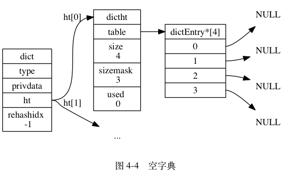

举个例子， 对于图 4-4 所示的字典来说， 如果我们要将一个键值对 `k0` 和 `v0` 添加到字典里面， 那么程序会先使用语句：

```
hash = dict->type->hashFunction(k0);
```

计算键 `k0` 的哈希值。

假设计算得出的哈希值为 `8` ， 那么程序会继续使用语句：

```
index = hash & dict->ht[0].sizemask = 8 & 3 = 0;
```

计算出键 `k0` 的索引值 `0` ， 这表示包含键值对 `k0` 和 `v0` 的节点应该被放置到哈希表数组的索引 `0` 位置上， 如图 4-5 所示。

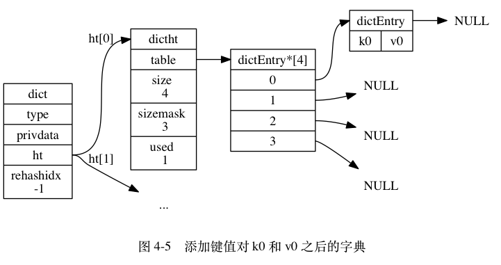

当字典被用作数据库的底层实现， 或者哈希键的底层实现时， Redis 使用 MurmurHash2 算法来计算键的哈希值。

MurmurHash 算法最初由 Austin Appleby 于 2008 年发明， 这种算法的优点在于， 即使输入的键是有规律的， 算法仍能给出一个很好的随机分布性， 并且算法的计算速度也非常快。

### 解决键冲突(hash冲突)

当有两个或以上数量的键被分配到了哈希表数组的同一个索引上面时， 我们称这些键发生了冲突（collision）。

Redis 的哈希表使用链地址法（separate chaining）来解决键冲突： 每个哈希表节点都有一个 `next` 指针， 多个哈希表节点可以用 `next` 指针构成一个单向链表， 被分配到同一个索引上的多个节点可以用这个单向链表连接起来， 这就解决了键冲突的问题。

举个例子， 假设程序要将键值对 `k2` 和 `v2` 添加到图 4-6 所示的哈希表里面， 并且计算得出 `k2` 的索引值为 `2` ， 那么键 `k1` 和 `k2` 将产生冲突， 而解决冲突的办法就是使用 `next` 指针将键 `k2` 和 `k1` 所在的节点连接起来， 如图 4-7 所示。

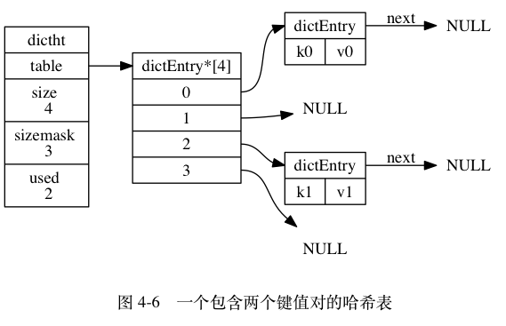

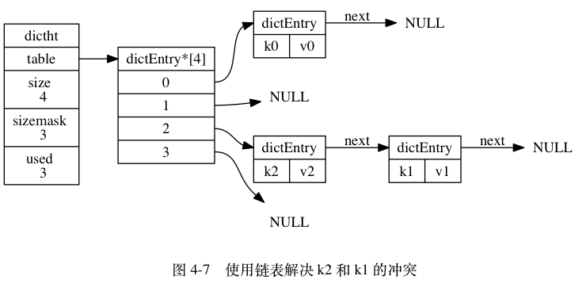

因为 `dictEntry` 节点组成的链表没有指向链表表尾的指针， 所以为了速度考虑， 程序总是将新节点添加到链表的表头位置（复杂度为 O(1)）， 排在其他已有节点的前面。

### rehash

随着操作的不断执行， 哈希表保存的键值对会逐渐地增多或者减少， 为了让哈希表的负载因子（load factor）维持在一个合理的范围之内， 当哈希表保存的键值对数量太多或者太少时， 程序需要对哈希表的大小进行相应的扩展或者收缩。

扩展和收缩哈希表的工作可以通过执行 rehash （重新散列）操作来完成， Redis 对字典的哈希表执行 rehash 的步骤如下：

1. 为字典的ht[1]哈希表分配空间， 这个哈希表的空间大小取决于要执行的操作， 以及ht[0]当前包含的键值对数量 （也即是ht[0].used属性的值）：
   - 如果执行的是扩展操作， 那么 `ht[1]` 的大小为第一个大于等于 `ht[0].used * 2` 的 2^n （`2` 的 `n` 次方幂）；
   - 如果执行的是收缩操作， 那么 `ht[1]` 的大小为第一个大于等于 `ht[0].used` 的 2^n 。
2. 将保存在 `ht[0]` 中的所有键值对 rehash 到 `ht[1]` 上面： rehash 指的是重新计算键的哈希值和索引值， 然后将键值对放置到 `ht[1]` 哈希表的指定位置上。
3. 当 `ht[0]` 包含的所有键值对都迁移到了 `ht[1]` 之后 （`ht[0]` 变为空表）， 释放 `ht[0]` ， 将 `ht[1]` 设置为 `ht[0]` ， 并在 `ht[1]` 新创建一个空白哈希表， 为下一次 rehash 做准备。

举个例子， 假设程序要对图 4-8 所示字典的 `ht[0]` 进行扩展操作， 那么程序将执行以下步骤：

1. `ht[0].used` 当前的值为 `4` ， `4 * 2 = 8` ， 而 `8` （2^3）恰好是第一个大于等于 `4` 的 `2` 的 `n` 次方， 所以程序会将 `ht[1]` 哈希表的大小设置为 `8` 。 图 4-9 展示了 `ht[1]` 在分配空间之后， 字典的样子。
2. 将 `ht[0]` 包含的四个键值对都 rehash 到 `ht[1]` ， 如图 4-10 所示。
3. 释放 `ht[0]` ，并将 `ht[1]` 设置为 `ht[0]` ，然后为 `ht[1]` 分配一个空白哈希表，如图 4-11 所示。

至此， 对哈希表的扩展操作执行完毕， 程序成功将哈希表的大小从原来的 `4` 改为了现在的 `8` 。

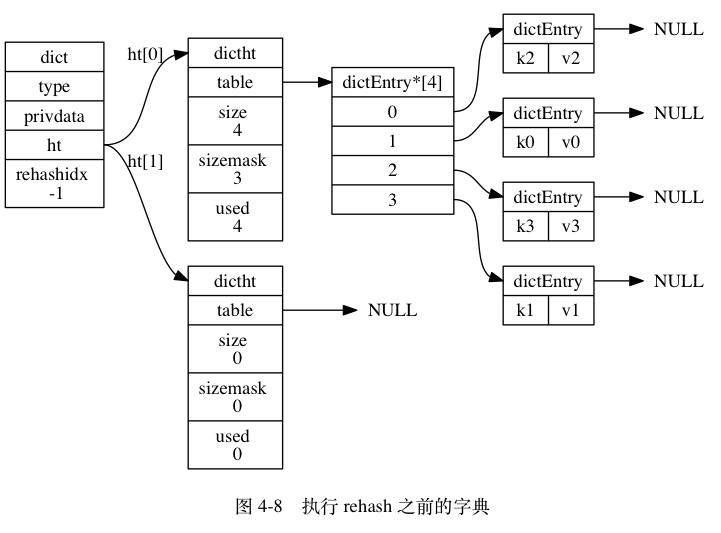

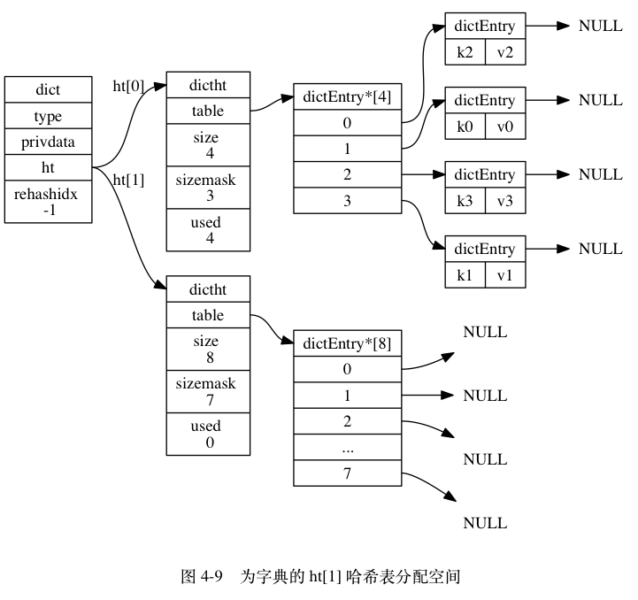


### 哈希表的扩展与收缩

当以下条件中的任意一个被满足时， 程序会自动开始对哈希表执行扩展操作：

1. 服务器目前没有在执行 BGSAVE 命令或者 BGREWRITEAOF 命令， 并且哈希表的负载因子大于等于 `1` ；
2. 服务器目前正在执行 BGSAVE 命令或者 BGREWRITEAOF 命令， 并且哈希表的负载因子大于等于 `5` ；

其中哈希表的负载因子可以通过公式：

```
# 负载因子 = 哈希表已保存节点数量 / 哈希表大小
load_factor = ht[0].used / ht[0].size
```

计算得出。

比如说， 对于一个大小为 `4` ， 包含 `4` 个键值对的哈希表来说， 这个哈希表的负载因子为：

```
load_factor = 4 / 4 = 1
```

又比如说， 对于一个大小为 `512` ， 包含 `256` 个键值对的哈希表来说， 这个哈希表的负载因子为：

```
load_factor = 256 / 512 = 0.5
```

根据 BGSAVE 命令或 BGREWRITEAOF 命令是否正在执行， 服务器执行扩展操作所需的负载因子并不相同， 这是因为在执行 BGSAVE 命令或 BGREWRITEAOF 命令的过程中，
 Redis 需要创建当前服务器进程的子进程， 而大多数操作系统都采用写时复制（[copy-on-write](http://en.wikipedia.org/wiki/Copy-on-write)）技术来优化子进程的使用效率， 所以在子进程存在期间， 服务器会提高执行扩展操作所需的负载因子， 从而尽可能地避免在子进程存在期间进行哈希表扩展操作， 这可以避免不必要的内存写入操作， 最大限度地节约内存。

另一方面， 当哈希表的负载因子小于 `0.1` 时， 程序自动开始对哈希表执行收缩操作。

### 渐进式 rehash
上一面说过， 扩展或收缩哈希表需要将 `ht[0]` 里面的所有键值对 rehash 到 `ht[1]` 里面， 但是， 这个 rehash 动作并不是一次性、集中式地完成的， 而是分多次、渐进式地完成的。

这样做的原因在于， 如果 `ht[0]` 里只保存着四个键值对， 那么服务器可以在瞬间就将这些键值对全部 rehash 到 `ht[1]` ； 但是， 如果哈希表里保存的键值对数量不是四个， 而是四百万、四千万甚至四亿个键值对， 那么要一次性将这些键值对全部 rehash 到 `ht[1]` 的话， 庞大的计算量可能会导致服务器在一段时间内停止服务。

因此， 为了避免 rehash 对服务器性能造成影响， 服务器不是一次性将 `ht[0]` 里面的所有键值对全部 rehash 到 `ht[1]` ， 而是分多次、渐进式地将 `ht[0]` 里面的键值对慢慢地 rehash 到 `ht[1]` 。

以下是哈希表渐进式 rehash 的详细步骤：

1. 为 `ht[1]` 分配空间， 让字典同时持有 `ht[0]` 和 `ht[1]` 两个哈希表。
2. 在字典中维持一个索引计数器变量 `rehashidx` ， 并将它的值设置为 `0` ， 表示 rehash 工作正式开始。
3. 在 rehash 进行期间， 每次对字典执行添加、删除、查找或者更新操作时， 程序除了执行指定的操作以外， 还会顺带将 `ht[0]` 哈希表在 `rehashidx` 索引上的所有键值对 rehash 到 `ht[1]` ， 当 rehash 工作完成之后， 程序将 `rehashidx` 属性的值增一。
4. 随着字典操作的不断执行， 最终在某个时间点上， `ht[0]` 的所有键值对都会被 rehash 至 `ht[1]` ， 这时程序将 `rehashidx` 属性的值设为 `-1` ， 表示 rehash 操作已完成。

渐进式 rehash 的好处在于它采取分而治之的方式， 将 rehash 键值对所需的计算工作均滩到对字典的每个添加、删除、查找和更新操作上， 从而避免了集中式 rehash 而带来的庞大计算量。

图 4-12 至图 4-17 展示了一次完整的渐进式 rehash 过程， 注意观察在整个 rehash 过程中， 字典的 `rehashidx` 属性是如何变化的。

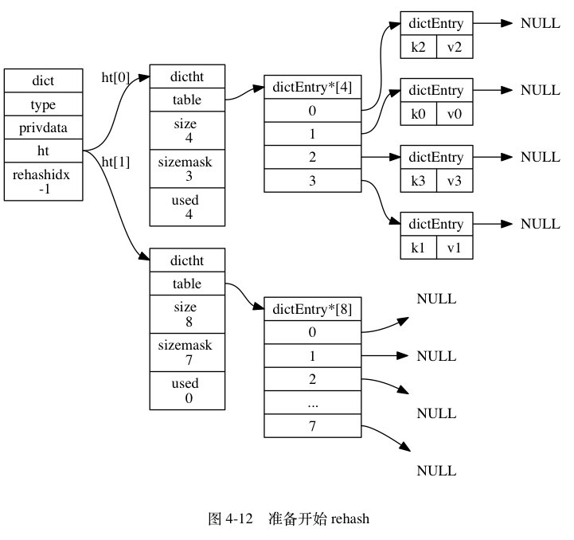

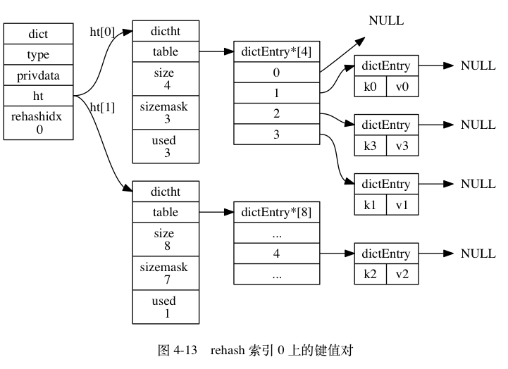

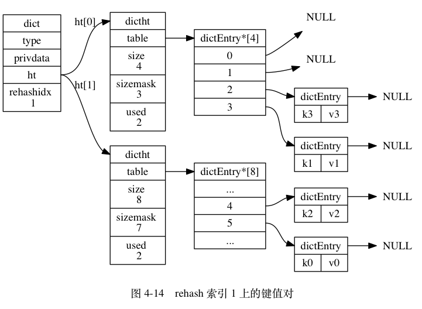

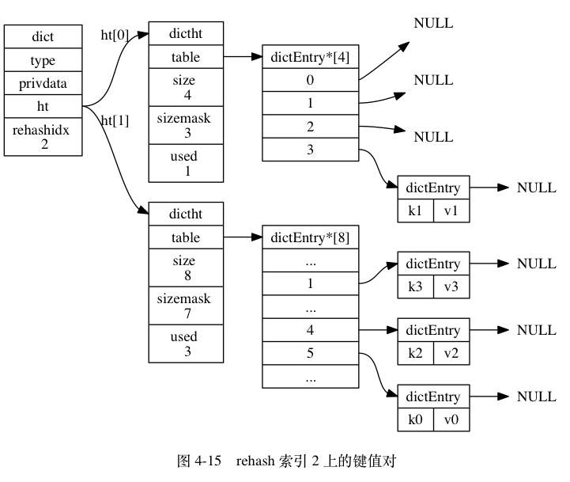

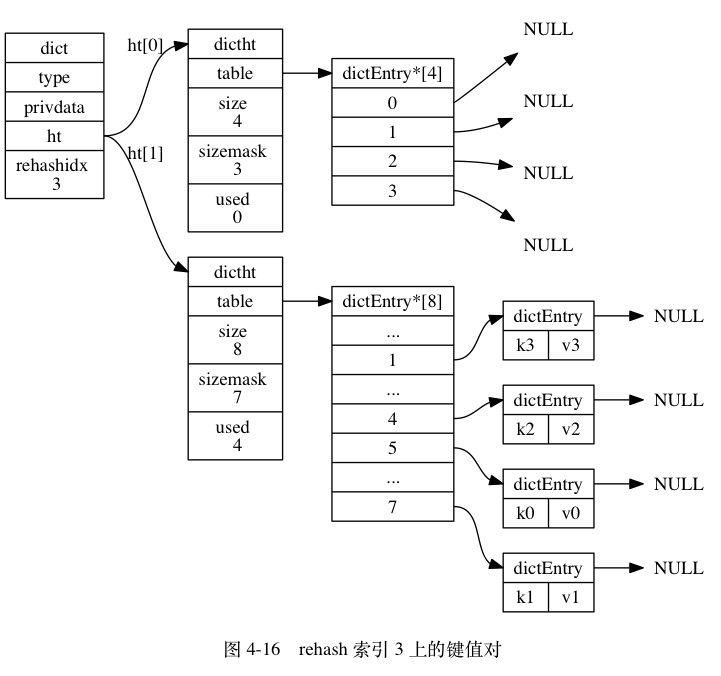

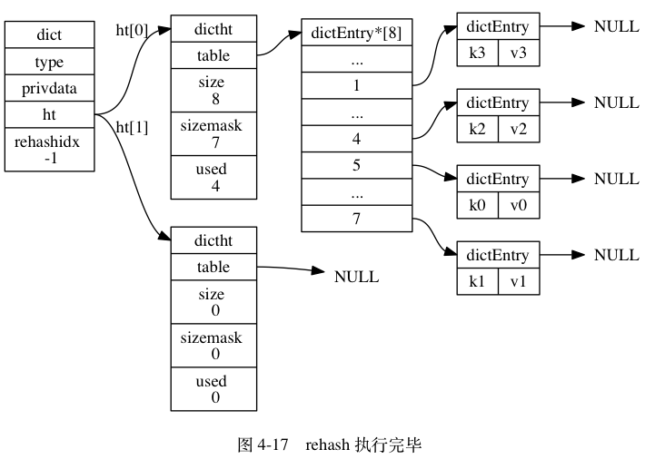

## 渐进式 rehash 执行期间的哈希表操作

因为在进行渐进式 rehash 的过程中， 字典会同时使用 `ht[0]` 和 `ht[1]` 两个哈希表， 所以在渐进式 rehash 进行期间， 字典的删除（delete）、查找（find）、更新（update）等操作会在两个哈希表上进行： 比如说， 要在字典里面查找一个键的话， 程序会先在 `ht[0]` 里面进行查找， 如果没找到的话， 就会继续到 `ht[1]` 里面进行查找， 诸如此类。

另外， 在渐进式 rehash 执行期间， 新添加到字典的键值对一律会被保存到 `ht[1]` 里面， 而 `ht[0]` 则不再进行任何添加操作： 这一措施保证了 `ht[0]` 包含的键值对数量会只减不增， 并随着 rehash 操作的执行而最终变成空表。

### 字典 API

表 4-1 列出了字典的主要操作 API 。

------

表 4-1 字典的主要操作 API

| 函数               | 作用                                                         | 时间复杂度                           |
| :----------------- | :----------------------------------------------------------- | :----------------------------------- |
| `dictCreate`       | 创建一个新的字典。                                           | O(1)                                 |
| `dictAdd`          | 将给定的键值对添加到字典里面。                               | O(1)                                 |
| `dictReplace`      | 将给定的键值对添加到字典里面， 如果键已经存在于字典，那么用新值取代原有的值。 | O(1)                                 |
| `dictFetchValue`   | 返回给定键的值。                                             | O(1)                                 |
| `dictGetRandomKey` | 从字典中随机返回一个键值对。                                 | O(1)                                 |
| `dictDelete`       | 从字典中删除给定键所对应的键值对。                           | O(1)                                 |
| `dictRelease`      | 释放给定字典，以及字典中包含的所有键值对。                   | O(N) ， `N` 为字典包含的键值对数量。 |

----

### 重点回顾

- 字典被广泛用于实现 Redis 的各种功能， 其中包括数据库和哈希键。
- Redis 中的字典使用哈希表作为底层实现， 每个字典带有两个哈希表， 一个用于平时使用， 另一个仅在进行 rehash 时使用。
- 当字典被用作数据库的底层实现， 或者哈希键的底层实现时， Redis 使用 MurmurHash2 算法来计算键的哈希值。
- 哈希表使用链地址法来解决键冲突， 被分配到同一个索引上的多个键值对会连接成一个单向链表。
- 在对哈希表进行扩展或者收缩操作时， 程序需要将现有哈希表包含的所有键值对 rehash 到新哈希表里面， 并且这个 rehash 过程并不是一次性地完成的， 而是渐进式地完成的。


