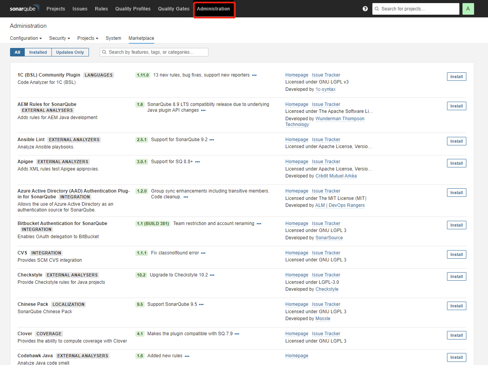

# 安装sonarqube

> 本文安装采用Docker的方式安装
>
> 在安装前，请确保您已经安装了postgresql

## 安装

> 在这里有一个值得注意的是，sonarqube 9.0 之后需要使用JDK11及其以上版本，如果您的项目采用的是JDK8编译，那您在安装时需要选择sonarqube 9.0之前的版本，小编这里采用了sonarqube 8.8的版本。

---

### docker 安装命令

```dockerfile
docker pull sonarqube:8.8-community
docker run -d --name sonarqube \
    -p 9000:9000 \
    -e SONAR_JDBC_URL=jdbc:postgresql://localhost:5432/sonarqube \
    -e SONAR_JDBC_USERNAME=postgres \
    -e SONAR_JDBC_PASSWORD=123456 \
    -v sonarqube/data:/opt/sonarqube/data \
    -v sonarqube/extensions:/opt/sonarqube/extensions \
    -v sonarqube/logs:/opt/sonarqube/logs \
    -v sonarqube/conf:/opt/sonarqube/conf \
    sonarqube:8.8-community
```

部署完成后可能会起不来，这是我们可以查看启动日志

> docker logs -f sonarqube

这是我在部署时遇到的问题解决方案

```
vim /etc/sysctl.conf

最后一行添加：
vm.max_map_count=262144
vm.max_map_count=524288

sysctl -p       加载生效

重新启动容器
docker start sonarqube

vi /etc/security/ limit.conf
sonarqube   -   nofile   131072
sonarqube   -   nproc    8192
-----------------------------------
一、Linux下Docker安装SonarQube（PostgreSQL）
https://blog.51cto.com/u_15072908/4322206
```

完成后根据主机的ip+port访问即可，如localhost:9000 ,登录的默认用户及密码都为admin

## 扩展

大家可以访问 http://localhost:9000/admin/marketplace 这个页面，下载一些自己喜欢的插件，和语言包之类的

