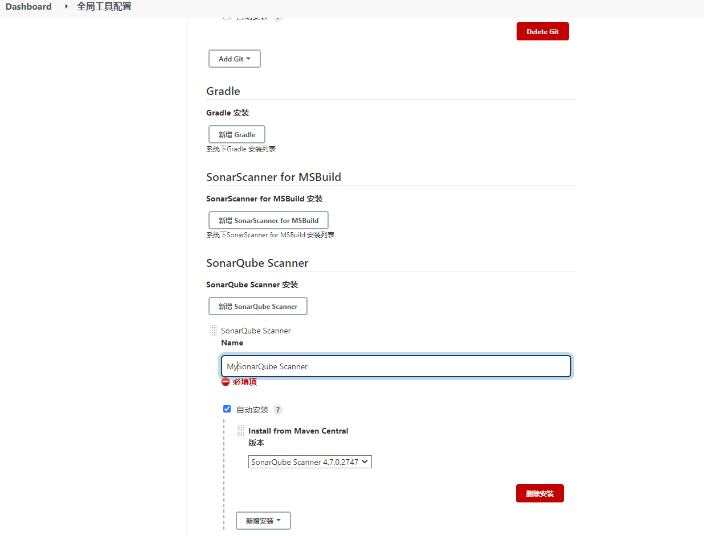
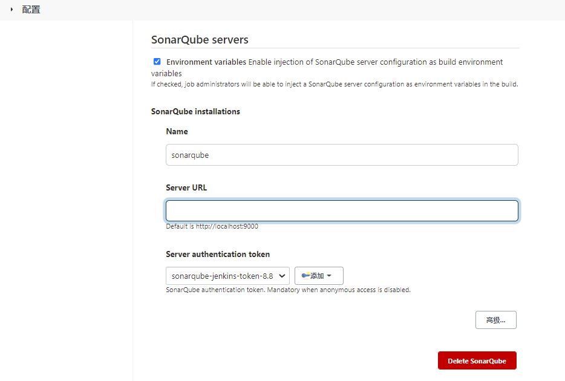
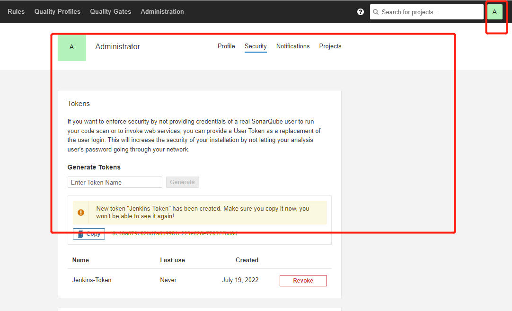

# Jenkins集成Sonarqube

> 本是以Maven项目为示例进行的集成演练

## Jenkins 安装插件

- [SonarQube Scanner](https://plugins.jenkins.io/sonar/)

- [Sonar Quality Gates](https://plugins.jenkins.io/sonar-quality-gates/)

## 配置 SonarQube Scanner




## 配置SonarQube servers



这里需要添加 token，我们可以去SonarQube 页面生成




## Maven 配置

### 修改 setting.xml

```
   <pluginGroups>
    <pluginGroup>org.sonarsource.scanner.maven</pluginGroup>
  </pluginGroups>

 
            <profile>
                <id>sonar</id>
                <activation>
                    <activeByDefault>true</activeByDefault>
                </activation>
                <properties>
                   
                    <sonar.host.url>
                     <!-- 配置 Sonar Host地址，默认：http://localhost:9000 -->
                    </sonar.host.url>
                    <sonar.login>
                         <!-- 配置 填写生成的tokne -->
                    </sonar.login>
                </properties>
            </profile>
```


### 添加maven 插件

```
            <plugin>
                <groupId>org.sonarsource.scanner.maven</groupId>
                <artifactId>sonar-maven-plugin</artifactId>
                <version>3.3.0.603</version>
            </plugin>
```


## 部署

部署 的方式大家可以选择自己喜欢的方式

主要是执行如下命令

```
mvn clean -DskipTests=true  install org.sonarsource.scanner.maven:sonar-maven-plugin:3.3.0.603:sonar
```

这样会将artifactId 标签作为项目名称，展现在 sonarqube上

