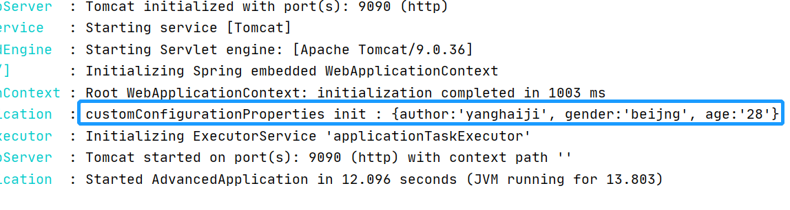

## @ConfigurationProperties 

在上篇文章[SpringBoot Tomcat 获取配置文件](ioc/TomcatConfigurationFile.md)我们了解 `@ConfigurationProperties` 这个注解，但并没我深入的了解，
本文将对`@ConfigurationProperties`的使用进行分析

### 源码
```java
@Target({ ElementType.TYPE, ElementType.METHOD })
@Retention(RetentionPolicy.RUNTIME)
@Documented
public @interface ConfigurationProperties {

	@AliasFor("prefix")
	String value() default "";

	@AliasFor("value")
	String prefix() default "";

    //指示绑定到此对象时应忽略无效字段的标志。
    //无效是指根据所使用的活页夹无效，通常这意味着
    //类型错误的字段（或无法强制转换为正确类型的字段）
	boolean ignoreInvalidFields() default false;

    //指示绑定到此对象时应忽略未知字段的标志。
    //未知字段可能表示属性中存在错误。
	boolean ignoreUnknownFields() default true;

}
```

### 自定义配置
在上面我们已经知道了，注解属性的含义，接下来我们就来自定义个配置类
```java
@Getter
@Setter
@Configuration
@ConfigurationProperties(prefix = "javayh",ignoreInvalidFields = true)
public class CustomConfigurationProperties {
    private String author;
    private String gender;
    private String age;

    @Override
    public String toString() {
        return "{" +
                "author:'" + author + '\'' +
                ", gender:'" + gender + '\'' +
                ", age:'" + age + '\'' +
                '}';
    }
}
```
注：这里您比如将此配置放入到Spring的扫描范文之内

### 添加配置

```properties
javayh.author=yanghaiji
javayh.gender=beijng
javayh.age=28

```
### 启动并验证
```java
@Slf4j
@SpringBootApplication
public class AdvancedApplication {

    private final CustomConfigurationProperties customConfigurationProperties;

    public AdvancedApplication(CustomConfigurationProperties customConfigurationProperties) {
        this.customConfigurationProperties = customConfigurationProperties;
        log.info("customConfigurationProperties init : {}",customConfigurationProperties.toString());
    }

    public static void main(String[] args) {
        SpringApplication.run(AdvancedApplication.class, args);
    }

}
```
当我启动容器时会发现效果如下:


但是我们会发现，我们自定义的配置时可以用了,但是好像不能想Spring自带的配置那样，可以自动提示以及点击，这是为什么呢？

### additional-spring-configuration-metadata.json

为了支持这种情况并让您提供定制的“提示”，注释处理器会自动合并来自`META-INF/additional-spring-configuration-metadata.json`到主元数据文件中。
如果引用已自动检测到的属性，则会覆盖说明、默认值和弃用信息（如果指定）。如果当前模块中未标识手动属性声明，则它将作为新属性添加。
附加`additional-spring-configuration-metadata.json`文件与常`spring-configuration-metadata.json`. 附加属性文件是可选的。如果没有任何其他属性，请不要添加该文件。

配置元数据文件位于 `META-INF/additional-spring-configuration-metadata.json`它们使用一种简单的JSON格式，将项目分类在“groups”或“properties”下，并将附加值提示分类到“hints”下，如下例所示：
```json
{"groups": [
    {
        "name": "server",
        "type": "org.springframework.boot.autoconfigure.web.ServerProperties",
        "sourceType": "org.springframework.boot.autoconfigure.web.ServerProperties"
    }
    ...
],"properties": [
    {
        "name": "server.port",
        "type": "java.lang.Integer",
        "sourceType": "org.springframework.boot.autoconfigure.web.ServerProperties"
    }
    ...
],"hints": [
    {
        "name": "spring.jpa.hibernate.ddl-auto",
        "values": [
            {
                "value": "none",
                "description": "Disable DDL handling."
            }
        ]
    }
]}
```

了解了 `additional-spring-configuration-metadata.json`,我们也来创建一个，

```json
{
  "properties": [
    {
      "name": "javayh.author",
      "type": "java.lang.String",
      "defaultValue": "YangHaiJi",
      "description": "Description for javayh.author."
    },
    {
      "name": "javayh.gender",
      "type": "java.lang.String",
      "defaultValue": "China",
      "description": "Description for javayh.gender."
    },
    {
      "name": "javayh.age",
      "type": "java.lang.Integer",
      "defaultValue": 18,
      "description": "Description for javayh.age."
    }
  ]
}
```
这样一个完成的`@ConfigurationProperties`的配置类就完成了

