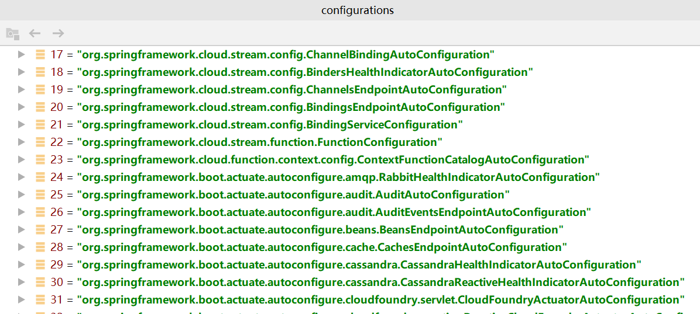

## EnableAutoConfiguration 源码分析

### 简介
启用S​​pring Application Context的自动配置，尝试猜测和配置您可能需要的bean。通常根据您的类路径和定义的bean来应用自动配置类。例如，如果您tomcat-embedded.jar在类路径上有，可能会想要一个 TomcatServletWebServerFactory（除非您定义了自己的 ServletWebServerFactorybean）。
使用时@SpringBootApplication，将自动启用上下文的自动配置，因此添加此注释不会产生任何其他影响。

自动配置会尝试尽可能智能化，并且在您定义更多自己的配置时会自动退出。您总是可以手动使用exclude()任何您不想应用的配置（excludeName()如果您无权访问它们，则可以使用）。您也可以通过spring.autoconfigure.exclude属性排除它们 。自动配置始终在注册用户定义的bean之后应用。

@EnableAutoConfiguration通常通过 注释的带有类注释的类的包@SpringBootApplication具有特定的意义，通常被用作“默认值”。例如，在扫描@Entity类时将使用它。通常建议您将@EnableAutoConfiguration（如果不使用@SpringBootApplication）放在根包中，以便可以搜索所有子包和类。

自动配置类是常规的Spring @Configuration Bean。它们使用SpringFactoriesLoader机制定位（针对此类）。通常，自动配置bean是 @Conditionalbean（最常使用 @ConditionalOnClass和 @ConditionalOnMissingBean注释）。

### 源代码

```java
@Target({ElementType.TYPE})
@Retention(RetentionPolicy.RUNTIME)
@Documented
@Inherited
@AutoConfigurationPackage
@Import({AutoConfigurationImportSelector.class})
public @interface EnableAutoConfiguration {
    String ENABLED_OVERRIDE_PROPERTY = "spring.boot.enableautoconfiguration";

    Class<?>[] exclude() default {};

    String[] excludeName() default {};
}
```
`EnableAutoConfiguration` 的属性起始没有可多说的,用一下自然就知道,这里的重点在`@Import({AutoConfigurationImportSelector.class})`,
如果您不了解`@Import`请点击这里 [Spring@Import详解与使用](https://blog.csdn.net/weixin_38937840/article/details/104617407)
### 分析
#### AutoConfigurationImportSelector 
```java
	@Override
	public String[] selectImports(AnnotationMetadata annotationMetadata) {
		if (!isEnabled(annotationMetadata)) {
			return NO_IMPORTS;
		}
        //(1)
		AutoConfigurationMetadata autoConfigurationMetadata = AutoConfigurationMetadataLoader
				.loadMetadata(this.beanClassLoader);
        //(2)
		AutoConfigurationEntry autoConfigurationEntry = getAutoConfigurationEntry(autoConfigurationMetadata,
				annotationMetadata);
		return StringUtils.toStringArray(autoConfigurationEntry.getConfigurations());
	}

	protected AutoConfigurationEntry getAutoConfigurationEntry(AutoConfigurationMetadata autoConfigurationMetadata,
			AnnotationMetadata annotationMetadata) {
		if (!isEnabled(annotationMetadata)) {
			return EMPTY_ENTRY;
		}
        //(3)
		AnnotationAttributes attributes = getAttributes(annotationMetadata);
        //(4)
		List<String> configurations = getCandidateConfigurations(annotationMetadata, attributes);
        //(5)
		configurations = removeDuplicates(configurations);
        //(6)
		Set<String> exclusions = getExclusions(annotationMetadata, attributes);
        //(7)
		checkExcludedClasses(configurations, exclusions);
        //(8)
		configurations.removeAll(exclusions);
        //(9)
		configurations = filter(configurations, autoConfigurationMetadata);
        //(10)
		fireAutoConfigurationImportEvents(configurations, exclusions);
		return new AutoConfigurationEntry(configurations, exclusions);
	}


```
- 当我们查看(1) 的代码时会发现，它会加载`PATH = "META-INF/" + "spring-autoconfigure-metadata.properties";`
这个文件存储的示例如下：
```properties
#Tue Jun 18 23:47:55 GMT 2019
org.springframework.boot.autoconfigure.security.servlet.SecurityFilterAutoConfiguration.AutoConfigureAfter=org.springframework.boot.autoconfigure.security.servlet.SecurityAutoConfiguration
org.springframework.boot.autoconfigure.data.cassandra.CassandraDataAutoConfiguration.Configuration=
org.springframework.boot.autoconfigure.data.neo4j.Neo4jBookmarkManagementConfiguration.Configuration=
org.springframework.boot.autoconfigure.kafka.KafkaAutoConfiguration=
org.springframework.boot.autoconfigure.kafka.KafkaAnnotationDrivenConfiguration.Configuration=
org.springframework.boot.autoconfigure.influx.InfluxDbAutoConfiguration.ConditionalOnClass=org.influxdb.InfluxDB
org.springframework.boot.autoconfigure.aop.AopAutoConfiguration=
```
- 当执行(2)这个内部方法时，首先会执行(3),来获取注解的属性:`exclude` 和 `excludeName`
- 当执行到(4)时，我们会发现,其实它是将`spring.factories`文件中的key存放在List中,并在(5)中进行去重

```java
    private static Map<String, List<String>> loadSpringFactories(@Nullable ClassLoader classLoader) {
        MultiValueMap<String, String> result = (MultiValueMap)cache.get(classLoader);
        if (result != null) {
            return result;
        } else {
            try {
                Enumeration<URL> urls = classLoader != null ? classLoader.getResources("META-INF/spring.factories") : ClassLoader.getSystemResources("META-INF/spring.factories");
                LinkedMultiValueMap result = new LinkedMultiValueMap();

                ......

                cache.put(classLoader, result);
                return result;
            } catch (IOException var13) {
                throw new IllegalArgumentException("Unable to load factories from location [META-INF/spring.factories]", var13);
            }
        }
    }
```


- 在执行(6)时获取`exclusions`相关信息，并在(7)时进行check,在(8)时删除exclusions相关配置
- 在执行 filter (9) ,首先会通过`invokeAwareMethods(filter);`来进行赋值主要会针对`beanClassLoader`,`beanFactory`,
`environment`,`resourceLoader`,这个`filter`函数接口的主要设计是为了:可在`spring.factories`限制考虑自动配置类。用于快速拆卸在读取其字节码之前自动配置类。
- 在通过(10)完成在启动时将bean注册 IOC容器中

##### spring.factories 
SpringBoot的默认配置如下:
`spring.factories` 实战应用请看这里 [javayh-platform](https://github.com/yanghaiji/javayh-platform/tree/master/javayh-dependencies/javayh-mybatis-starter/src/main/resources/META-INF)

```properties
# Initializers
org.springframework.context.ApplicationContextInitializer=\
org.springframework.boot.autoconfigure.SharedMetadataReaderFactoryContextInitializer

# Application Listeners
org.springframework.context.ApplicationListener=\
org.springframework.boot.autoconfigure.BackgroundPreinitializer

# Auto Configuration Import Listeners
org.springframework.boot.autoconfigure.AutoConfigurationImportListener=\
org.springframework.boot.autoconfigure.condition.ConditionEvaluationReportAutoConfigurationImportListener

# Auto Configuration Import Filters
org.springframework.boot.autoconfigure.AutoConfigurationImportFilter=\
org.springframework.boot.autoconfigure.condition.OnBeanCondition

# Auto Configure
org.springframework.boot.autoconfigure.EnableAutoConfiguration=\
org.springframework.boot.autoconfigure.admin.SpringApplicationAdminJmxAutoConfiguration,\
org.springframework.boot.autoconfigure.aop.AopAutoConfiguration,

# Failure analyzers
org.springframework.boot.diagnostics.FailureAnalyzer=\
org.springframework.boot.autoconfigure.diagnostics.analyzer.NoSuchBeanDefinitionFailureAnalyzer

# Template availability providers
org.springframework.boot.autoconfigure.template.TemplateAvailabilityProvider=\
org.springframework.boot.autoconfigure.freemarker.FreeMarkerTemplateAvailabilityProvider
```


