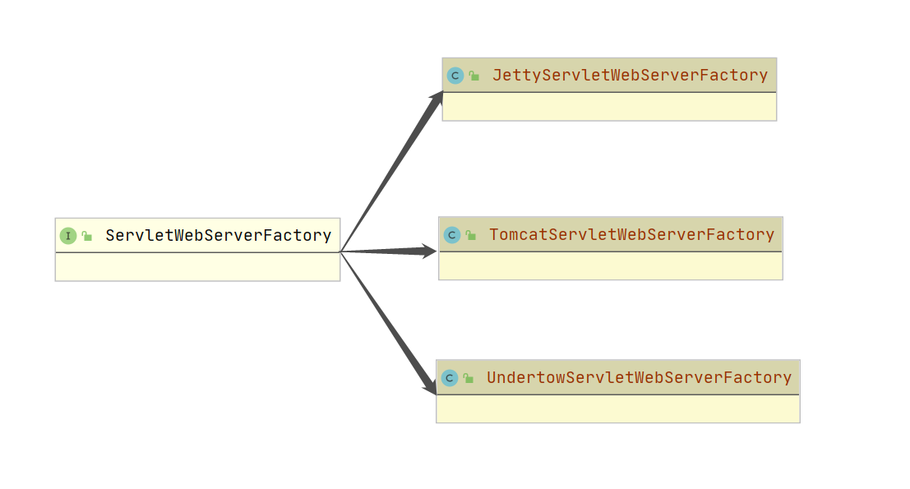
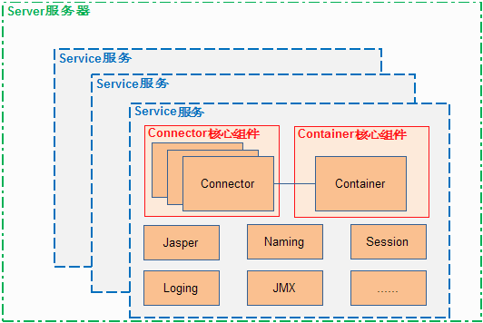

## SpringBoot Tomcat 启动原理

通过前几篇文章的阅读我们对SpringBoot的启动已经有所了解，但是Spring倒是是如何进行启动Tomcat的，我们酱紫啊本文解开它神奇的面纱；

### 起源 refresh()

```java
@Override
public void refresh() throws BeansException, IllegalStateException {
   synchronized (this.startupShutdownMonitor) {
      prepareRefresh();
      ConfigurableListableBeanFactory beanFactory = obtainFreshBeanFactory();
      prepareBeanFactory(beanFactory);
      try {
         postProcessBeanFactory(beanFactory);
         invokeBeanFactoryPostProcessors(beanFactory);
         registerBeanPostProcessors(beanFactory);
         initMessageSource();.
         initApplicationEventMulticaster();
         onRefresh();
         registerListeners();
         finishBeanFactoryInitialization(beanFactory);
         finishRefresh();
      }
      catch (BeansException ex) {
         if (logger.isWarnEnabled()) {
            logger.warn("Exception encountered during context initialization - " +
                  "cancelling refresh attempt: " + ex);
         }
         destroyBeans();
         cancelRefresh(ex);
         throw ex;
      }
      finally {
         resetCommonCaches();
      }
   }
}
```
上面的源码想必大家都很熟，如果您还不是很了解，请阅读 [SpringApplication源码解读](SpringApplication.md)以及 [refresh源码解读](refresh.md) 

本次我们将讲解其中一个方法，`onRefresh();`官方的说明是这样的：初始化特定上下文子类中的其他特殊bean。这也是我们本文的重点，它就是启动Tomcat的关键所在
那么让我们来看一下他的源码：
```java
	@Override
	protected void onRefresh() {
		super.onRefresh();
		try {
			createWebServer();
		}
		catch (Throwable ex) {
			throw new ApplicationContextException("Unable to start web server", ex);
		}
	}
```
追溯源码，我们发现，最终调用的是`ServletWebServerApplicationContext`中的`onRefresh()`,而其中的`createWebServer();`正式创建和启动Tomcat的所在方法
我们在来看一下`createWebServer();`的源码

```java
    private void createWebServer() {
        //1
    	WebServer webServer = this.webServer;
    	ServletContext servletContext = getServletContext();
    	if (webServer == null && servletContext == null) {
            //2
    		ServletWebServerFactory factory = getWebServerFactory();
    		this.webServer = factory.getWebServer(getSelfInitializer());
    		getBeanFactory().registerSingleton("webServerGracefulShutdown",
    				new WebServerGracefulShutdownLifecycle(this.webServer));
    		getBeanFactory().registerSingleton("webServerStartStop",
    				new WebServerStartStopLifecycle(this, this.webServer));
    	}
    	else if (servletContext != null) {
    		try {
    			getSelfInitializer().onStartup(servletContext);
    		}
    		catch (ServletException ex) {
    			throw new ApplicationContextException("Cannot initialize servlet context", ex);
    		}
    	}
    	initPropertySources();
    }
```
- 我们可以发现当执行完 (1)处的代码时，所有的值还都全是`null`
- 当执行`getWebServerFactory();`时，我们发现会创建一个`ServletWebServerFactory`
首先我们来看一下`ServletWebServerFactory`源码
```java
    public interface ServletWebServerFactory {
        WebServer getWebServer(ServletContextInitializer... initializers);
    }
```
我们发现，`ServletWebServerFactory`有三个实现，类图如下，默认为Tomcat



这时我们来看一下`getWebServer`这个方法

```java
	@Override
	public WebServer getWebServer(ServletContextInitializer... initializers) {
		if (this.disableMBeanRegistry) {
			Registry.disableRegistry();
		}
        //创建一个Tomcat容器          
		Tomcat tomcat = new Tomcat();
		File baseDir = (this.baseDirectory != null) ? this.baseDirectory : createTempDir("tomcat");
		//设置基本目录
		tomcat.setBaseDir(baseDir.getAbsolutePath());
        //创建一个 Http11NioProtocol 链接器
		Connector connector = new Connector(this.protocol);
        //失败时抛出异常
		connector.setThrowOnFailure(true);
		//添加链接器
		tomcat.getService().addConnector(connector);
		customizeConnector(connector);
		tomcat.setConnector(connector);
		tomcat.getHost().setAutoDeploy(false);
		configureEngine(tomcat.getEngine());
		for (Connector additionalConnector : this.additionalTomcatConnectors) {
			tomcat.getService().addConnector(additionalConnector);
		}
        //准备上下文，如：contextPath
		prepareContext(tomcat.getHost(), initializers);
        // 启动Tomcat
		return getTomcatWebServer(tomcat);
	}
```
通过上面的分析我们发现是`getTomcatWebServer(tomcat);`来启动Tomcat的，其实最终`getTomcatWebServer` 调用了`TomcatWebServer`
的`initialize`方法

```java
	private void initialize() throws WebServerException {
		logger.info("Tomcat initialized with port(s): " + getPortsDescription(false));
		synchronized (this.monitor) {
			try {
				addInstanceIdToEngineName();
				Context context = findContext();
				context.addLifecycleListener((event) -> {
					if (context.equals(event.getSource()) && Lifecycle.START_EVENT.equals(event.getType())) {
						removeServiceConnectors();
					}
				});
                // 启动方法
				this.tomcat.start();
				rethrowDeferredStartupExceptions();
				try {
					ContextBindings.bindClassLoader(context, context.getNamingToken(), getClass().getClassLoader());
				}
				catch (NamingException ex) {
				}
                //开启阻塞非守护进程                    
				startDaemonAwaitThread();
			}
			catch (Exception ex) {
                //关闭资源    
				stopSilently();
				destroySilently();
				throw new WebServerException("Unable to start embedded Tomcat", ex);
			}
		}
	}
```
这里我们会发现，开启后又会关闭资源，具体时为什么，我们来看看Tomcat的架构图


>一个服务器的基本功能：接收客户请求，解析请求，处理业务逻辑，结果返回给客户端。
 一般有两个方法，star打开服务，监听端口；stop关闭服务，释放资源。
 Tomcat也是一样的，只不过更复杂，功能更完善。
 为什么Tomcat要分为这么多的组件呢？原因很简单：为了扩展。好像所有的多组件架构都是为了好扩展。
 Connector负责请求监听，Container负责请求处理。server.xml配置了Connector与Container的对应关系，Service就包含了这种对应关系。
 在Tomcat架构中，一个Server包含多个Service,每个Service包含多个Connector与一个Container，Container又有4种实现：Engine、Host、ontext、Wrapper。

通过上面的执行，Tomcat已经正常的启动，再由`initPropertySources();`进行资源初始化

