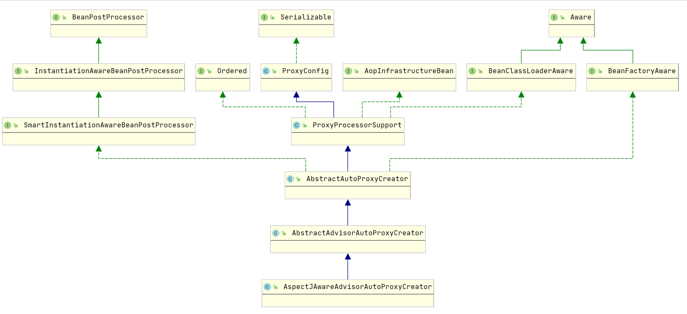
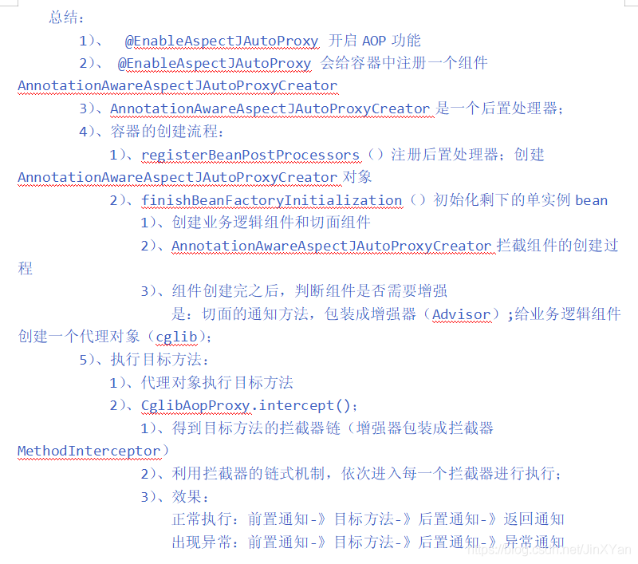

## Spring AOP 全面解析

在之前的几篇文章我们已经对 `Spring Ioc` 有了初步的认识，了解了 `Spring` 容器的启动，`bean`的注册，
接下来我们就来学习一下Spring的另一个重要知识点`AOP`，关于AOP的使用，
大家可以参考[Spring AOP 项目实战](https://blog.csdn.net/weixin_38937840/category_9647922.html)
如果您的项目使用的是SpringBoot，那么您也需要了解一下，[SpringBoot 为什么帮我们开启了自动配置类](SpringAutoProxy.md)

- [EnableAspectJAutoProxy](#EnableAspectJAutoProxy)

### EnableAspectJAutoProxy
在[SpringBoot 为什么帮我们开启了自动配置类](SpringAutoProxy.md)中，我们只是提到了`EnableAspectJAutoProxy`,今天就来看看它的源码
```java
@Target(ElementType.TYPE)
@Retention(RetentionPolicy.RUNTIME)
@Documented
@Import(AspectJAutoProxyRegistrar.class)
public @interface EnableAspectJAutoProxy {

	//开始 cglib动态代理还是开启 java 的动态代理，默认是false
	boolean proxyTargetClass() default false;

	//指示代理应该由AOP框架公开ThreadLocal 为通过AopContext类进行检索。默认情况下为关闭，即不保证AopContext访问将正常进行
	boolean exposeProxy() default false;

}
```

`EnableAspectJAutoProxy`的源码很简单，但是请不要忽略一个重点，那就是`@Import(AspectJAutoProxyRegistrar.class)`，如果您对`@Import`
不是很熟悉，可以参考[Spring@Import详解与使用](https://blog.csdn.net/weixin_38937840/article/details/104617407)

### AspectJAutoProxyRegistrar

```java
class AspectJAutoProxyRegistrar implements ImportBeanDefinitionRegistrar {
    
	@Override
	public void registerBeanDefinitions(
			AnnotationMetadata importingClassMetadata, BeanDefinitionRegistry registry) {

		AopConfigUtils.registerAspectJAnnotationAutoProxyCreatorIfNecessary(registry);

		AnnotationAttributes enableAspectJAutoProxy =
				AnnotationConfigUtils.attributesFor(importingClassMetadata, EnableAspectJAutoProxy.class);
		if (enableAspectJAutoProxy != null) {
			if (enableAspectJAutoProxy.getBoolean("proxyTargetClass")) {
				AopConfigUtils.forceAutoProxyCreatorToUseClassProxying(registry);
			}
			if (enableAspectJAutoProxy.getBoolean("exposeProxy")) {
				AopConfigUtils.forceAutoProxyCreatorToExposeProxy(registry);
			}
		}
	}

}
```
- registerAspectJAnnotationAutoProxyCreatorIfNecessary
 
 首先我们看一下`registerAspectJAnnotationAutoProxyCreatorIfNecessary`这个方法，他最终调用方法是如下
 如果您对 `BeanDefinition` 不了解，可以阅读[Spring BeanDefinition 详解](../bean/BeanDefinition.md)
```java
@Nullable
private static BeanDefinition registerOrEscalateApcAsRequired(Class<?> cls, BeanDefinitionRegistry registry, @Nullable Object source) {
    Assert.notNull(registry, "BeanDefinitionRegistry must not be null");
    //首先判断在注册列表中是否包含要注册的bean
    if (registry.containsBeanDefinition("org.springframework.aop.config.internalAutoProxyCreator")) {
        BeanDefinition apcDefinition = registry.getBeanDefinition("org.springframework.aop.config.internalAutoProxyCreator");
        if (!cls.getName().equals(apcDefinition.getBeanClassName())) {
            int currentPriority = findPriorityForClass(apcDefinition.getBeanClassName());
            int requiredPriority = findPriorityForClass(cls);
            // 当 currentPriority < requiredPriority 进行 bean class name 的覆盖
            if (currentPriority < requiredPriority) {
                apcDefinition.setBeanClassName(cls.getName());
            }
        }

        return null;
    } //创建一个新的 bean 并注册到  BeanDefinitionRegistry 中
    else {
        RootBeanDefinition beanDefinition = new RootBeanDefinition(cls);
        beanDefinition.setSource(source);
        beanDefinition.getPropertyValues().add("order", -2147483648);
        beanDefinition.setRole(2);
        registry.registerBeanDefinition("org.springframework.aop.config.internalAutoProxyCreator", beanDefinition);
        return beanDefinition;
    }
}
```
而注册的 `bean` 到底是什么呢？在 `registerOrEscalateApcAsRequired` 方法前，我们是不是丢了什么？
当我们在追溯的时候发现，其实是先执行了`registerAspectJAnnotationAutoProxyCreatorIfNecessary`,并在这里将`AnnotationAwareAspectJAutoProxyCreator`
进行了注册；
```java
@Nullable
public static BeanDefinition registerAspectJAnnotationAutoProxyCreatorIfNecessary(BeanDefinitionRegistry registry, @Nullable Object source) {
    return registerOrEscalateApcAsRequired(AnnotationAwareAspectJAutoProxyCreator.class, registry, source);
}
```
 
### AnnotationAwareAspectJAutoProxyCreator

 

从类图是可以大致了解AnnotationAwareAspectJAutoProxyCreator这个类的功能.它实现了一系列Aware的接口,
在Bean装载的时候获取BeanFactory(Bean容器),Bean的ClassLoader,还实现了order接口,继承了PorxyConfig,ProxyConfig中主要封装了代理的通用处理逻辑,
比如设置目标类,设置使用cglib还是java proxy等一些基础配置.

而能够让这个类参与到bean初始化功能,并为bean添加代理功能的还是因为它实现了BeanPostProcessor这个接口.
这个接口的postProcessAfterInitialization方法会在bean初始化结束后(赋值完成)被调用。

这里先看一下最顶部的抽象类:AbstractAutoProxyCreator,这个抽象类主要抽象了实现代理的逻辑:

```java
@Override
public Object postProcessBeforeInitialization(Object bean, String beanName) {
	return bean;
}
//如果子类将bean标识为一个要代理的bean，则使用配置的拦截器创建一个代理
@Override
public Object postProcessAfterInitialization(@Nullable Object bean, String beanName) {
	if (bean != null) {
        // 从缓存中获取bean 的class name
		Object cacheKey = getCacheKey(bean.getClass(), beanName);
		if (this.earlyProxyReferences.remove(cacheKey) != bean) {
			return wrapIfNecessary(bean, beanName, cacheKey);
		}
	}
	return bean;
}
//进行必要的包装
protected Object wrapIfNecessary(Object bean, String beanName, Object cacheKey) {
	if (StringUtils.hasLength(beanName) && this.targetSourcedBeans.contains(beanName)) {
		return bean;
	}
	if (Boolean.FALSE.equals(this.advisedBeans.get(cacheKey))) {
		return bean;
	}
	if (isInfrastructureClass(bean.getClass()) || shouldSkip(bean.getClass(), beanName)) {
		this.advisedBeans.put(cacheKey, Boolean.FALSE);
		return bean;
	}

	// 如果该类有advice则创建proxy
	Object[] specificInterceptors = getAdvicesAndAdvisorsForBean(bean.getClass(), beanName, null);
	if (specificInterceptors != DO_NOT_PROXY) {
		this.advisedBeans.put(cacheKey, Boolean.TRUE);
        //为给定的bean创建一个AOP代理。
		Object proxy = createProxy(
				bean.getClass(), beanName, specificInterceptors, new SingletonTargetSource(bean));
		this.proxyTypes.put(cacheKey, proxy.getClass());
		return proxy;
	}
	this.advisedBeans.put(cacheKey, Boolean.FALSE);
	return bean;
}
```
### 创建proxy过程分析 

```java
protected Object createProxy(Class<?> beanClass, @Nullable String beanName,
		@Nullable Object[] specificInterceptors, TargetSource targetSource) {
	if (this.beanFactory instanceof ConfigurableListableBeanFactory) {
		AutoProxyUtils.exposeTargetClass((ConfigurableListableBeanFactory) this.beanFactory, beanName, beanClass);
	}
    // 创建proxyFactory
	ProxyFactory proxyFactory = new ProxyFactory();
	proxyFactory.copyFrom(this);
	if (!proxyFactory.isProxyTargetClass()) {
		if (shouldProxyTargetClass(beanClass, beanName)) {
			proxyFactory.setProxyTargetClass(true);
		}
		else {
			evaluateProxyInterfaces(beanClass, proxyFactory);
		}
	}
    //将当前bean适合的advice，重新封装下，封装为Advisor类，然后添加到ProxyFactory中
	Advisor[] advisors = buildAdvisors(beanName, specificInterceptors);
	proxyFactory.addAdvisors(advisors);
	proxyFactory.setTargetSource(targetSource);
	customizeProxyFactory(proxyFactory);

	proxyFactory.setFrozen(this.freezeProxy);
	if (advisorsPreFiltered()) {
		proxyFactory.setPreFiltered(true);
	}
    // 调用getProxy获取bean对应的proxy
	return proxyFactory.getProxy(getProxyClassLoader());
}
``` 
#### getProxy

```java
public Object getProxy(@Nullable ClassLoader classLoader) {
	return createAopProxy().getProxy(classLoader);
}

protected final synchronized AopProxy createAopProxy() {
	if (!this.active) {
		activate();
	}
	return getAopProxyFactory().createAopProxy(this);
}

@Override
public AopProxy createAopProxy(AdvisedSupport config) throws AopConfigException {
	if (config.isOptimize() || config.isProxyTargetClass() || hasNoUserSuppliedProxyInterfaces(config)) {
		Class<?> targetClass = config.getTargetClass();
		if (targetClass == null) {
			throw new AopConfigException("TargetSource cannot determine target class: " +
					"Either an interface or a target is required for proxy creation.");
		}
        //如果目标类是接口或者是代理类，则直接使用JDK proxy
		if (targetClass.isInterface() || Proxy.isProxyClass(targetClass)) {
			return new JdkDynamicAopProxy(config);
		}//其他情况则使用CGLIB proxy
		return new ObjenesisCglibAopProxy(config);
	}
	else {
		return new JdkDynamicAopProxy(config);
	}
}

//Object getProxy(@Nullable ClassLoader classLoader);
```

- JdkDynamicAopProxy
```java
@Override
public Object getProxy(@Nullable ClassLoader classLoader) {
	if (logger.isTraceEnabled()) {
		logger.trace("Creating JDK dynamic proxy: " + this.advised.getTargetSource());
	}
	Class<?>[] proxiedInterfaces = AopProxyUtils.completeProxiedInterfaces(this.advised, true);
	findDefinedEqualsAndHashCodeMethods(proxiedInterfaces);
	return Proxy.newProxyInstance(classLoader, proxiedInterfaces, this);
}
```
由于其实现了 `InvocationHandler` 必然会走，invoke

```java
	public Object invoke(Object proxy, Method method, Object[] args) throws Throwable {
		Object oldProxy = null;
		boolean setProxyContext = false;

		TargetSource targetSource = this.advised.targetSource;
		Object target = null;

		try {
			if (!this.equalsDefined && AopUtils.isEqualsMethod(method)) {
				return equals(args[0]);
			}
			else if (!this.hashCodeDefined && AopUtils.isHashCodeMethod(method)) {
				return hashCode();
			}
			else if (method.getDeclaringClass() == DecoratingProxy.class) {
				return AopProxyUtils.ultimateTargetClass(this.advised);
			}
			else if (!this.advised.opaque && method.getDeclaringClass().isInterface() &&
					method.getDeclaringClass().isAssignableFrom(Advised.class)) {
				return AopUtils.invokeJoinpointUsingReflection(this.advised, method, args);
			}

			Object retVal;

			if (this.advised.exposeProxy) {
				oldProxy = AopContext.setCurrentProxy(proxy);
				setProxyContext = true;
			}
			target = targetSource.getTarget();
			Class<?> targetClass = (target != null ? target.getClass() : null);
			List<Object> chain = this.advised.getInterceptorsAndDynamicInterceptionAdvice(method, targetClass);
			if (chain.isEmpty()) {
                //我们可以跳过创建MethodInvocation：直接调用目标
                //请注意，最终的调用程序必须是InvokerInterceptor，因此我们知道它是这样的
                //只在目标上进行反射操作 
				Object[] argsToUse = AopProxyUtils.adaptArgumentsIfNecessary(method, args);
				retVal = AopUtils.invokeJoinpointUsingReflection(target, method, argsToUse);
			}
			else {
				MethodInvocation invocation =
						new ReflectiveMethodInvocation(proxy, target, method, args, targetClass, chain);
				// 通过拦截器链进入连接点。
				retVal = invocation.proceed();
			}
			Class<?> returnType = method.getReturnType();
			if (retVal != null && retVal == target &&
					returnType != Object.class && returnType.isInstance(proxy) &&
					!RawTargetAccess.class.isAssignableFrom(method.getDeclaringClass())) {
				retVal = proxy;
			}
			else if (retVal == null && returnType != Void.TYPE && returnType.isPrimitive()) {
				throw new AopInvocationException(
						"Null return value from advice does not match primitive return type for: " + method);
			}
			return retVal;
		}
		finally {
			if (target != null && !targetSource.isStatic()) {
				targetSource.releaseTarget(target);
			}
			if (setProxyContext) {
				AopContext.setCurrentProxy(oldProxy);
			}
		}
	}


public Object proceed() throws Throwable {
	if (this.currentInterceptorIndex == this.interceptorsAndDynamicMethodMatchers.size() - 1) {
		return invokeJoinpoint();
	}
	Object interceptorOrInterceptionAdvice =
			this.interceptorsAndDynamicMethodMatchers.get(++this.currentInterceptorIndex);
	if (interceptorOrInterceptionAdvice instanceof InterceptorAndDynamicMethodMatcher) {
        //在这里评估动态方法匹配器：静态部分已经已评估并发现匹配。
		InterceptorAndDynamicMethodMatcher dm =
				(InterceptorAndDynamicMethodMatcher) interceptorOrInterceptionAdvice;
		Class<?> targetClass = (this.targetClass != null ? this.targetClass : this.method.getDeclaringClass());
		if (dm.methodMatcher.matches(this.method, targetClass, this.arguments)) {
			return dm.interceptor.invoke(this);
		}
		else {
            //动态匹配失败。
            //跳过这个拦截器并调用链中的下一个。
			return proceed();
		}
	}
	else {
        //它是一个拦截器，所以我们调用它：切入点将具有 在构造此对象之前静态求值。
		return ((MethodInterceptor) interceptorOrInterceptionAdvice).invoke(this);
	}
}
```
依次遍历拦截器链的每个元素，然后调用其实现，将真正调用工作委托给各个增强器

总结：
    纵观以上过程可知：实际就是为bean创建一个proxy，JDKproxy或者CGLIBproxy，然后在调用bean的方法时，会通过proxy来调用bean方法

重点过程可分为：

1）将AnnotationAwareAspectJAutoProxyCreator注册到Spring容器中

2）AnnotationAwareAspectJAutoProxyCreator类的postProcessAfterInitialization()方法将所有有advice的bean重新包装成proxy

3）调用bean方法时通过proxy来调用，proxy依次调用增强器的相关方法，来实现方法切

        


 