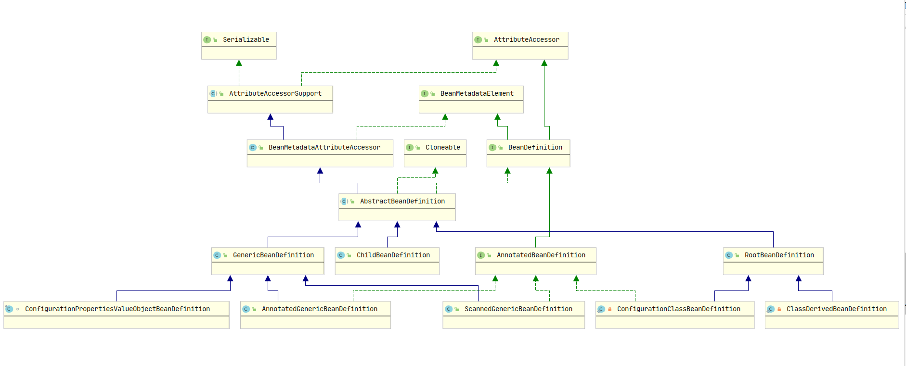

## Spring BeanDefinition 详解

-[BeanDefinition简介](#BeanDefinition简介)
-[BeanDefinition类图](#BeanDefinition类图)
-[BeanDefinition源码](#BeanDefinition源码)


### BeanDefinition简介
BeanDefinition描述了一个bean实例，它具有属性值，构造函数参数值以及具体实现所提供的更多信息。
这只是一个最小的接口：主要目的是允许BeanFactoryPostProcessor进行内部检查和修改属性值以及其他bean元数据。

### BeanDefinition类图




### BeanDefinition源码

```java
public interface BeanDefinition extends AttributeAccessor, BeanMetadataElement {

    //标准单例作用域的作用域标识符：“ singleton”。
    //  请注意，扩展的bean工厂可能支持更多范围。
	String SCOPE_SINGLETON = ConfigurableBeanFactory.SCOPE_SINGLETON;

    //标准原型范围的范围标识符：“原型”。
    //  请注意，扩展的bean工厂可能支持更多范围。
	String SCOPE_PROTOTYPE = ConfigurableBeanFactory.SCOPE_PROTOTYPE;

    //角色提示，指示 BeanDefinition是应用程序的主要部分。通常对应于用户定义的bean。
	int ROLE_APPLICATION = 0;
    
    //角色提示，指示a BeanDefinition是某些较大配置的支持部分，通常是外部 ComponentDefinition。 
    // SUPPORTBean被认为足够重要，可以在更仔细地查看特定对象时意识到 ComponentDefinition，但在查看应用程序的整体配置时却不知道。
	int ROLE_SUPPORT = 1;

    //角色提示，指示BeanDefinition提供了完全的后台角色，与最终用户无关。注册完全属于内部工作的bean时使用此提示ComponentDefinition。
	int ROLE_INFRASTRUCTURE = 2;

    //设置此bean定义的父定义的名称（如果有）。
	void setParentName(@Nullable String parentName);

    //返回此bean定义的父定义的名称（如果有）
	@Nullable
	String getParentName();

    //指定此bean定义的bean类名。
    //可以在bean工厂进行后期处理期间修改类名，通常用解析后的类名替换原始类名
	void setBeanClassName(@Nullable String beanClassName);

    //返回此Bean定义的当前Bean类名称。
    //请注意，在子定义从其父级继承/继承该子类名称的情况下，不必一定是在运行时使用的实际类名。
    // 同样，这可能只是调用工厂方法的类，或者在调用工厂方法的工厂bean引用的情况下甚至可能为空
    // 因此，在运行时不要将其视为确定的bean类型，而应将其仅用于单个bean定义级别的解析目的
	@Nullable
	String getBeanClassName();

    //覆盖此bean的目标作用域，并指定一个新的作用域名称
	void setScope(@Nullable String scope);

    //返回此bean当前目标作用域的名称，或者返回null未知的名称
	@Nullable
	String getScope();

    //设置是否应延迟初始化此bean。 如果为false，则将在执行启动单例初始化的bean工厂启动时实例化bean
	void setLazyInit(boolean lazyInit);

    //返回此bean是否应延迟初始化，即在启动时不急于实例化。仅适用于单例
	boolean isLazyInit();

    //设置该bean依赖于初始化的bean的名称。Bean工厂将确保首先初始化这些Bean
	void setDependsOn(@Nullable String... dependsOn);

    //返回此bean依赖的bean名称
	@Nullable
	String[] getDependsOn();

    //设置此bean是否适合自动连接到其他bean。
    //请注意，此标志旨在仅影响基于类型的自动装配。它不会影响名称的显式引用，即使指定的bean未标记为自动装配候选，
    //名称也将得到解析。因此，如果名称匹配，按名称自动装配仍将注入Bean。
	void setAutowireCandidate(boolean autowireCandidate);

    //返回此bean是否适合自动连接到其他bean
	boolean isAutowireCandidate();

    //设置此bean是否为自动装配的主要候选对象。 如果此值true恰好是多个匹配候选对象中的一个bean
	void setPrimary(boolean primary);

    //返回此bean是否为自动装配的主要候选对象
	boolean isPrimary();

    //指定要使用的工厂bean（如果有）。这是用于调用指定工厂方法的bean的名称
	void setFactoryBeanName(@Nullable String factoryBeanName);

    //返回工厂bean名称（如果有）
	@Nullable
	String getFactoryBeanName();

    //指定工厂方法（如果有）。将使用构造函数参数调用此方法，如果未指定，则不使用任何参数。
    // 该方法将在指定的工厂bean（如果有）上被调用，否则将作为本地bean类上的静态方法被调用。
	void setFactoryMethodName(@Nullable String factoryMethodName);

    //返回工厂方法（如果有）
	@Nullable
	String getFactoryMethodName();

    //返回此bean的构造函数参数值。  可以在bean工厂后处理期间修改返回的实例
	ConstructorArgumentValues getConstructorArgumentValues();

    //如果为此bean定义了构造函数参数值，则返回
	default boolean hasConstructorArgumentValues() {
		return !getConstructorArgumentValues().isEmpty();
	}

    //返回要应用于新的bean实例的属性值。 可以在bean工厂后处理期间修改返回的实例
	MutablePropertyValues getPropertyValues();

    //返回是否有为此bean定义的属性值
	default boolean hasPropertyValues() {
		return !getPropertyValues().isEmpty();
	}

    //设置初始化方法的名称
	void setInitMethodName(@Nullable String initMethodName);

    //返回初始化方法的名称
	@Nullable
	String getInitMethodName();

    //设置destroy方法的名称
	void setDestroyMethodName(@Nullable String destroyMethodName);

    //返回destroy方法的名称
	@Nullable
	String getDestroyMethodName();

    //为此设置角色提示BeanDefinition。角色提示提供框架和工具，以指示特定角色的作用和重要性BeanDefinition
	void setRole(int role);

    //获取此角色提示BeanDefinition。角色提示提供框架和工具，以指示特定角色的作用和重要性BeanDefinition
	int getRole();

    //设置此bean定义的可读描述
	void setDescription(@Nullable String description);

    //返回此bean定义的可读描述
	@Nullable
	String getDescription();

    //根据Bean类或其他特定的元数据返回此Bean定义的可解析类型。
    //通常可以在运行时合并的bean定义中完全解决此问题，而不必在配置时定义实例上完全解决。
	ResolvableType getResolvableType();

    //返回此Singleton是否具有在所有调用上返回的单个共享实例
	boolean isSingleton();

    //返回此是否为Prototype，并为每个调用返回一个独立的实例
	boolean isPrototype();

    //返回此bean是否为“抽象”，即不打算实例化
	boolean isAbstract();

    //返回此bean定义来自的资源的描述
	@Nullable
	String getResourceDescription();

    //返回原始的BeanDefinition，如果没有返回null。许获取修饰的bean定义（如果有）。
    //请注意，此方法返回直接发起者。遍历发起者链以找到用户定义的原始BeanDefinition。
	@Nullable
	BeanDefinition getOriginatingBeanDefinition();

}
```

可以看出`BeanDefinition` 包含了`bean的所有属性`，而`RootBeanDefinition`是它的渐接子类这也是我在阅读Spring源码时创建bean的过程中用到`RootBeanDefinition`的原因


