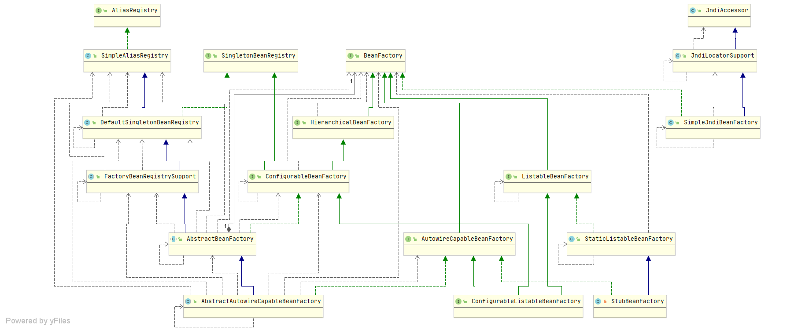

## Spring BeanFactory 

- [BeanFactory简介](#BeanFactory简介)
- [BeanFactory类图](#BeanFactory类图)
- [BeanFactory源码](#BeanFactory源码)

### BeanFactory简介

这是bean容器的基本客户视图。其他接口，例如ListableBeanFactory和 ConfigurableBeanFactory 可用于特定目的。

该接口由包含多个bean定义的对象实现，每个定义均由String名称唯一标识。根据bean的定义，工厂将返回所包含对象的独立实例（Prototype设计模式），
或者返回单个共享实例（Singleton设计模式的替代方案，其中实例是作用域中的单例）的工厂）。将返回哪种类型的实例取决于bean工厂的配置：API是相同的。
从Spring 2.0开始，根据具体的应用程序上下文，可以使用更多范围（例如，Web环境中的“请求”和“会话”范围）。

这种方法的重点是BeanFactory是应用程序组件的中央注册表，并集中了应用程序组件的配置（例如，不再需要单个对象读取属性文件）。

请注意，通常最好依赖于依赖注入（“ push”配置）通过设置器或构造函数配置应用程序对象，而不是使用任何形式的“ pull”配置（例如BeanFactory查找）。
Spring的Dependency Injection功能是使用此BeanFactory接口及其子接口实现的。

通常，BeanFactory会加载存储在配置源（例如XML文档）中的bean定义，并使用该org.springframework.beans 包来配置bean。
但是，实现可以根据需要直接在Java代码中直接返回它创建的Java对象。定义的存储方式没有任何限制：LDAP，RDBMS，XML，属性文件等。
鼓励实现以支持Bean之间的引用（Dependency Injection）。

与中的方法相比ListableBeanFactory，此接口中的所有操作还将检查父工厂是否为 HierarchicalBeanFactory。
如果在此工厂实例中未找到bean，则将询问直接的父工厂。该工厂实例中的Bean应该覆盖任何父工厂中的同名Bean。

Bean工厂实现应尽可能支持标准Bean生命周期接口。全套初始化方法及其标准顺序为：

>1. BeanNameAware的 `setBeanName`
>2. BeanClassLoaderAware的 `setBeanClassLoader`
>3. BeanFactoryAware的 `setBeanFactory`
>4. EnvironmentAware `setEnvironment`
>5. EmbeddedValueResolverAware的 `setEmbeddedValueResolver`
>6. ResourceLoaderAware `setResourceLoader` （仅在应用程序上下文中运行时适用）
>7. ApplicationEventPublisherAware的`setApplicationEventPublisher` （仅适用于在应用程序上下文中运行的情况）
>8. MessageSourceAware的`setMessageSource` （仅适用于在应用程序上下文中运行的情况）
>9. ApplicationContextAware的`setApplicationContext` （仅适用于在应用程序上下文中运行）
>10. ServletContextAware的`setServletContext` （仅适用于在Web应用程序上下文中运行的情况）
>11. `postProcessBeforeInitialization` BeanPostProcessors的方法
>12. InitializingBean的 `afterPropertiesSet`
>13. 自定义的初始化方法定义
>14. `postProcessAfterInitialization` BeanPostProcessors的方法

在关闭bean工厂时，以下生命周期方法适用：

>1. `postProcessBeforeDestruction` DestructionAwareBeanPostProcessors的方法
>2. 一次性豆的 `destroy`
>3. 自定义销毁方法定义

### BeanFactory类图




### BeanFactory源码

```java
public interface BeanFactory {

    //用于取消引用FactoryBean实例并将其与FactoryBean 创建的bean区别开来。
    // 例如，如果命名的bean myJndiObject是FactoryBean，则get &myJndiObject 将返回工厂，而不是工厂返回的实例
	String FACTORY_BEAN_PREFIX = "&";

    //返回一个实例，该实例可以是指定bean的共享或独立的。
    //  此方法允许使用Spring BeanFactory替代Singleton或Prototype设计模式。对于Singleton Bean，调用者可以保留对返回对象的引用。
    //  将别名转换回相应的规范bean名称。 将询问父工厂是否在该工厂实例中找不到该bean。
	Object getBean(String name) throws BeansException;

    //返回一个实例，该实例可以是指定bean的共享或独立的。
    //  行为与相同getBean(String)，但是如果bean不是必需的类型，则抛出BeanNotOfRequiredTypeException，
    //  从而提供了类型安全性的度量。这意味着不能正确投射结果，否则抛出ClassCastException getBean(String)
    //将别名转换回相应的规范bean名称。 将询问父工厂是否在该工厂实例中找不到该bean。
	<T> T getBean(String name, Class<T> requiredType) throws BeansException;
    
    //返回一个实例，该实例可以是指定bean的共享或独立的。
    //  允许指定显式构造函数自变量/工厂方法自变量，覆盖Bean定义中指定的默认自变量（如果有）。
	Object getBean(String name, Object... args) throws BeansException;

    //返回与给定对象类型唯一匹配的bean实例（如果有）。
    //  此方法进入ListableBeanFactory按类型查找范围，但也可以根据给定类型的名称转换为常规的按名称查找。
    //  要在各组Bean之间进行更广泛的检索操作，请使用ListableBeanFactory和/或BeanFactoryUtils。
	<T> T getBean(Class<T> requiredType) throws BeansException;

    //返回一个实例，该实例可以是指定bean的共享或独立的。
    //  允许指定显式构造函数自变量/工厂方法自变量，覆盖Bean定义中指定的默认自变量（如果有）。
    //  此方法进入ListableBeanFactory按类型查找范围，但也可以根据给定类型的名称转换为常规的按名称查找。
    //  要在各组Bean之间进行更广泛的检索操作，请使用ListableBeanFactory和/或BeanFactoryUtils。
	<T> T getBean(Class<T> requiredType, Object... args) throws BeansException;
    
    // 返回指定bean的提供程序，以允许按需的实例懒惰检索，包括可用性和唯一性选项。
	<T> ObjectProvider<T> getBeanProvider(Class<T> requiredType);

    //返回指定bean的提供程序，以允许按需的实例懒惰检索，包括可用性和唯一性选项。
	<T> ObjectProvider<T> getBeanProvider(ResolvableType requiredType);

    //这个bean工厂是否包含给定名称的bean定义或外部注册的单例实例？
      
    //  如果该工厂是分层工厂，则将询问任何父工厂，如果在该工厂实例中找不到该bean。
    //  如果找到与给定名称匹配的bean定义或单例实例，则该方法将返回true指定的bean定义在范围上是具体的还是抽象的，
    //  懒惰的或渴望的。因此，请注意，true 此方法的返回值不一定表示getBean(java.lang.String) 它将能够获取相同名称的实例。
	boolean containsBean(String name);

    //该bean是共享单身吗？也就是说，将getBean(java.lang.String)始终返回相同的实例吗？
    //  注意：此方法返回false不会明确指示独立实例。它指示非单实例，也可以对应于作用域Bean。使用该isPrototype(java.lang.String)操作显式检查独立实例。
    //  将别名转换回相应的规范bean名称。  将询问父工厂是否在该工厂实例中找不到该bean。
	boolean isSingleton(String name) throws NoSuchBeanDefinitionException;

    //将getBean(java.lang.String)始终返回独立的实例
    //  注意：此方法返回false不能清楚地表明一个单例对象。它指示非独立实例，该实例也可能对应于作用域Bean。使用该isSingleton(java.lang.String)操作可显式检查共享的单例实例。
    //  将别名转换回相应的规范bean名称。 将询问父工厂是否在该工厂实例中找不到该bean。
	boolean isPrototype(String name) throws NoSuchBeanDefinitionException;

    //检查具有给定名称的Bean是否与指定的类型匹配。更具体地说，检查getBean(java.lang.String)给定名称的调用是否会返回可分配给指定目标类型的对象。
    //  将别名转换回相应的规范bean名称。 将询问父工厂是否在该工厂实例中找不到该bean。
	boolean isTypeMatch(String name, ResolvableType typeToMatch) throws NoSuchBeanDefinitionException;

    //检查具有给定名称的Bean是否与指定的类型匹配。更具体地说，检查getBean(java.lang.String)给定名称的调用是否会返回可分配给指定目标类型的对象。
    //  将别名转换回相应的规范bean名称。 将询问父工厂是否在该工厂实例中找不到该bean。
	boolean isTypeMatch(String name, Class<?> typeToMatch) throws NoSuchBeanDefinitionException;

    //确定具有给定名称的bean的类型。更具体地说，确定getBean(java.lang.String)将为给定名称返回的对象的类型。
    //  对于a FactoryBean，返回FactoryBean创建的对象的类型（由公开）FactoryBean.getObjectType()。
    // 将别名转换回相应的规范bean名称。 将询问父工厂是否在该工厂实例中找不到该bean。
	@Nullable
	Class<?> getType(String name) throws NoSuchBeanDefinitionException;

    //确定具有给定名称的bean的类型。更具体地说，确定getBean(java.lang.String)将为给定名称返回的对象的类型。
    //  对于a FactoryBean，返回FactoryBean创建的对象的类型（由公开）FactoryBean.getObjectType()。如果没有早期类型信息可用allowFactoryBeanInit，则取决于 标志，这可能导致先前未初始化的初始化FactoryBean。
    //  将别名转换回相应的规范bean名称。  将询问父工厂是否在该工厂实例中找不到该bean。
	@Nullable
	Class<?> getType(String name, boolean allowFactoryBeanInit) throws NoSuchBeanDefinitionException;

    //返回给定bean名称的别名（如果有）。
    //  在getBean(java.lang.String)调用中使用时，所有这些别名都指向同一个bean 。
    //  如果给定名称是别名，则将返回相应的原始bean名称和其他别名（如果有），原始bean名称是数组中的第一个元素。
    // 将询问父工厂是否在该工厂实例中找不到该bean。
	String[] getAliases(String name);

}

```

